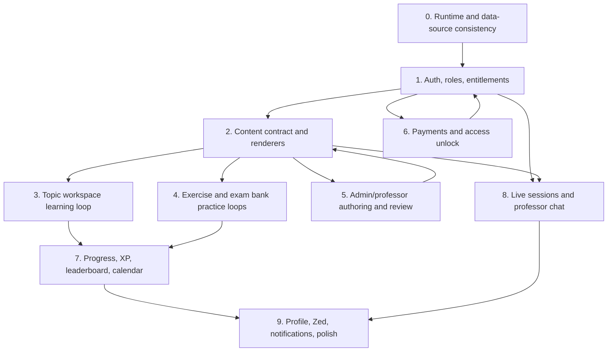
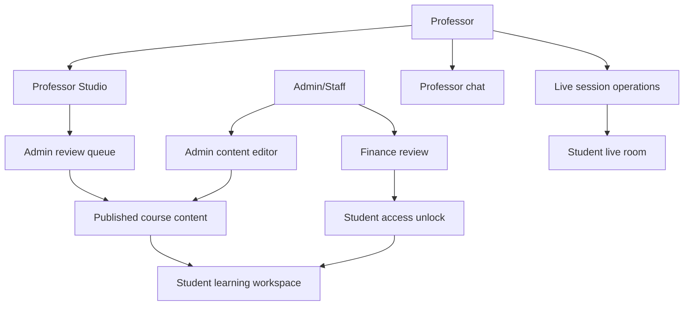
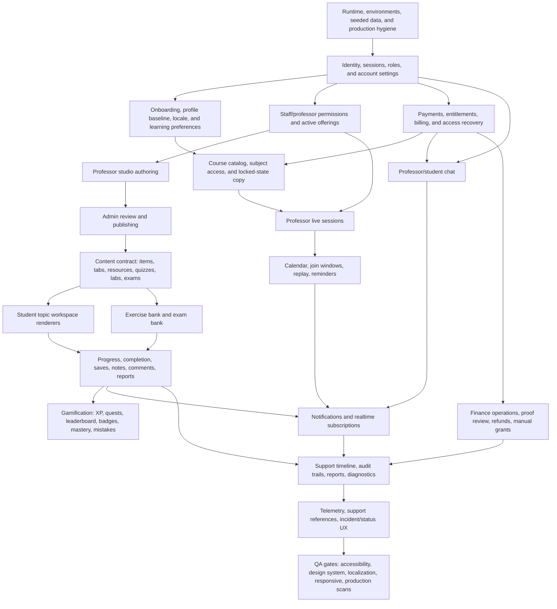

# Kresco Product UX Master Audit

Date: 2026-06-18
Scope: real-user walkthrough of the local app across student, basic student, professor, staff/admin, payment, and standalone utility routes.

This is a product implementation map, not a code-only review. The point is to keep every observed feature in one place so implementation can happen in the right order without losing currently implemented variation.

## Method

- Ran the app locally through the browser at `http://127.0.0.1:3000`.
- Started the backend locally at `http://127.0.0.1:8000` with the seeded e2e database.
- Used seeded database identities. Interactive login now requires matching Firebase Auth users or test-session helpers:
  - `student@example.com`
  - `basic@example.com`
  - `professor@example.com`
  - `admin@example.com`
- Clicked through the product as a user would: nav links, buttons, forms, modals, payment choices, locked previews, editor routes, live/session surfaces, chat, and role dashboards.
- Cross-checked key source files only where browser behavior needed explanation.
- Existing shared worktree changes were left untouched. This audit intentionally adds only this document.

Local audit side effects:

- Posted one topic comment as `Yasmine El Fassi`.
- Sent one student professor-chat message as `Yasmine El Fassi`.
- Created one manual payment request/reference as `Nora Basic`.
- Started an exam attempt in browser state.

## Severity

- `P0`: core journey blocked, misleading, or impossible to trust.
- `P1`: feature exists but misses flagship expectations or has a serious UX/data gap.
- `P2`: quality, accessibility, consistency, or operator-safety issue.
- `P3`: polish, copy, and presentation.

## Global Findings

1. `P0` The local frontend/backend data source was observed out of sync earlier in the run.
   - Direct backend topic workspace returned one e2e seed topic, while the frontend `/api` path returned the demo `Fonctions exponentielles` content.
   - The frontend server restarted during the audit, so reproduce this before fixing, but treat it as a release blocker until the dev/staging data path is deterministic.

2. `P0` Main lesson video playback is broken for YouTube content.
   - Browser showed `Video unavailable` and `Failed to load YouTube player API`.
   - Source confirms `YouTubeVideoPlayer.tsx` injects `https://www.youtube.com/iframe_api`.
   - CSP in `frontend/proxy.ts` allows VdoCipher scripts but not `https://www.youtube.com` in `script-src`.

3. `P0` The learning content model is ahead of the student renderer.
   - Topic quiz items open inside the Course tab as a `Video resource` missing-resource shell instead of a quiz.
   - Exercise Bank has filters and detail code, but the tested seeded subjects showed `0 exercise(s)`.
   - Exam Bank lists problems, but opened problems have no published parts or answer workspace.

4. `P0` Staff/admin and professor workflows contain meaningful shells, but seeded operational data is not useful enough to validate them.
   - Admin dashboard says `7 demande(s)` but summary metrics say zero users/content/resources/exams.
   - Admin review requests show `0 operation(s)`.
   - Professor change requests also show `0 operation(s)`.

5. `P1` Many controls are icon-only or unlabeled.
   - Auth social buttons, professor/admin logout, profile edit fields, finance forms, payment proof fields, activity builder controls, and some calendar/mobile-style buttons need explicit labels.

6. `P1` Product copy leaks implementation details.
   - Locked topic modal shows `Feature: demo locked topic`, `Subject access #1`, and raw slug/tag information.
   - Payment and professor/admin pages mix French and English.
   - Auth screens switch between `Log in`, `Bienvenue`, `Password`, `Mot de passe`, and `Connexion Professeur`.

7. `P1` Navigation/access logic varies by role but is not consistently explained.
   - Basic users lose `Professor Chat` from nav, which is correct gating.
   - Pro users see chat.
   - Staff login landed on `/onboarding` public welcome before `/admin` worked directly.
   - Professor/admin logout exists but appears as an unlabeled icon.

## Dependency Tree

Implementation order:

1. Make environment/data deterministic.
2. Normalize auth/session/role redirects.
3. Fix media/video policy.
4. Finish the content renderers: video, course document, quiz, exercise, exam part.
5. Connect authoring/review to the same content contract.
6. Complete payment/access unlock paths.
7. Finish student learning loops.
8. Finish professor live/chat loops.
9. Finish admin ops, finance, analytics, moderation.
10. Polish accessibility, copy, responsive behavior, and QA fixtures.

## Surface Audit

| Surface | Implemented | User Expectation | Gaps | Priority |
|---|---|---|---|---|
| Public auth home `/` | Welcome, login/signup entry, disabled social buttons | Clear sign in, signup, legal links, usable social alternatives | Social buttons disabled/empty labels, Terms/Privacy are `#`, mixed language | P1 |
| Signup | Full name/email/password, verify-email pending, resend | Validations before submit, consistent password rules, email verification | Password copy says 6 chars while backend/toast says 8; invalid values lack inline guidance | P1 |
| Login | Email/password, password reveal, forgot password | Clear error on wrong credentials, redirect by role | Wrong/failed login can feel like reset/no visible error; role redirect inconsistent for admin | P1 |
| Forgot/reset/verify | Forgot email success, reset invalid-link, verify invalid-link | Clear recovery path and resend/back actions | Reset/verify pages only show invalid states without token; copy is minimal | P2 |
| Onboarding | Route exists | Post-signup role/profile setup | Admin login landed on public welcome at `/onboarding`; needs role-aware behavior | P0 |
| Student home | Continue cards, subjects, sidebar widgets, quests, leaderboard | Personalized dashboard and next best action | Daily quests are buttons but not actionable; sidebar widgets repeat across pages | P2 |
| Courses | Search, subject filter, status filters, topic cards, locked preview | Discover, resume, understand locked/upcoming content | Locked modal leaks internal labels; some headings/card semantics rough; search/filter need full QA | P1 |
| Topic workspace | Rail, tabs, rich course content, graph controls, save details, comments, whiteboard | Video + lesson + quiz/lab/resources/notes/comments in one workspace | YouTube API blocked by CSP; quiz item renders as missing video shell; labs/resources often empty; Notes means whiteboard, not text notes | P0 |
| Topic comments | Read/post comments, field resets after post | Ask question, edit/delete own comments, report/moderation | Posting works; no visible edit/delete/report/moderation for students | P1 |
| Topic save | Save opens review/pin details | Save/unsave, notes/tags, visible saved state | Button label `Save` hides that a details modal opens; completion state did not visibly transform in observed run | P2 |
| Exercise Bank | Subject buttons, difficulty/self-grade/saved filters, detail code in source | Browse exercises, reveal corrections, self-grade, save notes | Tested subjects showed zero exercises despite `5 topics available`; user sees a bank shell | P0 |
| Exam Bank | Lists national-style problems, search/filter, save/complete problem | Search by topic/concept, solve problem parts, written/video correction | Search `diffraction` returned no result despite visible diffraction card; opened problem has no parts; no answer workspace | P0 |
| Dedicated exam mode `/exam/1` | Start gate, 45-minute timer, question UI, draft code in source | Locked exam experience, answer questions, navigate, submit, results | Observed answer/Next did not advance or count answers; dashboard nav remains visible behind exam overlay | P0 |
| Calendar | Week view, month grid, today/month navigation, scheduled event | Click event/day, see details, join live/session, reminders | Event click did not open details; no add/sync/reschedule flow | P1 |
| Leaderboard | Rank list, leagues, search | Search, clear, see own rank context, league rules | Search works but clear affordance appears as unlabeled `x`; own rank disappears with message | P2 |
| Live sessions | Session cards, date/status, realtime subscription code | Join live or replay, clear upcoming/past/replay state | Every tested session disabled as `Unavailable`, including replay; no join path available | P0 |
| Professor Chat student | Pro users can message, send enabled by text, message actions, teacher list | Reliable private tutoring thread, attachments, delete/report, paid gating clarity | Basic nav hides it; Pro send works; attach file disabled; image action not verified; message actions minimal | P1 |
| Profile | Stats, subject progress, recent notes, saved items, followers/following, edit dialog | Manage public profile, avatar/banner upload, privacy | Edit inputs mostly unlabeled; avatar/banner use raw URLs; upload unavailable per source | P2 |
| Pricing | Free/Pro cards, methods, manual payment request/proof form, CMI return pages | Upgrade, pay, see status, submit proof, manage billing | Basic flow creates reference; proof fields unlabeled; Pro state has no receipt/manage billing; generic `/payment/success` 404 but actual CMI routes work | P1 |
| Zed Mode | Focus timer, PDF import placeholder, formula references, calculator history, exit confirmation | Focus workspace with PDF, scratchpad, calculator, saved state | No H1; no loaded PDF in seed; scratch expression cleared when switching tabs in observed run; normal nav/account removed | P2 |
| Notifications | Dialog, unread count, mark read, delete all | Notification center with read/delete, grouping, confirmation | Delete all has no visible confirmation; read items still listed flat; global Notes button only shows toast | P1 |
| Professor login | Dedicated login screen | Clear professor login/logout | Isolated and functional; language differs from main auth; logout is icon-only | P2 |
| Professor dashboard | Offering summary, live summary, pending requests, chat card | Teaching control center | `Start live` disabled without explanation; request data has zero ops | P1 |
| Professor Studio | Content tree, draggable controls, item property editor, submit for review | Author, edit, reorder, submit meaningful changes | Pending-request gate blocks without resolution path; forms have weak labels; change summary separate | P1 |
| Professor changes | Filters, request list, studio links | Track submitted changes and status | Requests with zero operations make workflow hard to trust | P1 |
| Professor live | Schedule form, manual stream ID, advanced OBS fields, action menus | Schedule, notify, reveal credentials, control room, replay | VdoCipher generation disabled due missing env; action menu exists; student side cannot join/replay seeded sessions | P1 |
| Professor live control room | Notify/end/refresh, reveal, Questions/Chat tabs | Moderate Q&A/chat while live | Empty seeded room; credentials reveal intentionally not exercised; needs student loop validation | P1 |
| Professor messaging | Conversation filters, pinned/unread, reply input, image action | Manage VIP private messages | Reply flow exists; attachment/moderation/retention details incomplete | P1 |
| Admin dashboard | Staff nav, stats, direct links, reviews badge | Operational overview | Summary stats conflict with seeded content; SQLAdmin link points out of app; no staff logout label | P1 |
| Admin reviews | Filters, request list, detail panel | Approve/reject professor operations | Requests have zero operations and no actionable approval path | P0 |
| Admin courses | Subject list, new course wizard, subject detail, activity builder link | Create/edit/publish/archive course structure | Subject detail lacks direct edit/create/publish controls; course wizard basic but validation works | P1 |
| Admin activity builder | QCM and other activity type selectors, JSON generation | Build activities and insert into lesson | Manual JSON handoff only; label collision makes radio/text input targeting brittle | P1 |
| Admin course content editor | JSON editor/preview route | Edit a topic item course document | Without topic/item URL it shows invalid JSON and disables insert buttons; route is not discoverable from primary flow | P2 |
| Admin finance | Queue filters, ledger/provider/import panels, reconciliation/import forms | Safe finance operations, audit trail, export/import | Empty seed, disabled CSVs, unlabeled fields; needs confirmation/permissions/real records | P1 |
| Animated showcase | Component catalog route | Verify animated components | Many entries render `fallback shell`; useful as inventory, not production content | P2 |
| Figma audit | Design/component reference route | Design QA reference | Not a user product route; contains useful quiz primitive references absent in production topic rendering | P2 |

## Detailed Interaction Inventory

This section is intentionally more granular than the surface table. Treat it as the "do not miss this later" list.

### Auth And Public Entry

| Area | Visible controls and states | Observed behavior | Flagship expectation | Work required | Dependencies | Priority |
|---|---|---|---|---|---|---|
| Public welcome | Google, Facebook, Apple buttons; `Creer un compte`; `Deja un compte ? Se connecter`; Terms; Privacy | Social buttons are disabled and can render as empty icon buttons in inventory; Terms/Privacy link to `#` | If social auth is not ready, label unavailable clearly or hide; legal links must be real | Add real terms/privacy routes; label or remove disabled social buttons; normalize copy | Auth provider config, legal content | P1 |
| Signup form | Back, social buttons, full name, email, password, show/hide password, create account, login switch | Empty submit relies on native focus; invalid values lack inline explanation; 6-char vs 8-char policy mismatch | Inline validation before request, password rule meter, backend/client parity | Centralize password policy; add field-level errors; make social state explicit | Auth API schemas, localization | P1 |
| Verify pending | Send email again, back home | Firebase resend works; stale toast can remain after returning home | Clear pending state, resend cooldown, change email, support link | Add cooldown/status, clear stale toasts on route change | Firebase Auth email action links, toast lifecycle | P2 |
| Login form | Back, social buttons, email, password, forgot password, show/hide, submit, signup switch | Password reveal works; wrong login path was confusing; admin redirect lands on onboarding | Clear auth error, role-aware redirect, consistent language | Fix login error visibility; redirect admin to `/admin`; unify French/English | Auth store, auth policy | P0 |
| Forgot password | Email, send link, back login | Generic success works | Avoid user enumeration but show next steps and resend cooldown | Add cooldown, clearer copy, support fallback | Firebase Auth password reset | P2 |
| Reset/verify token pages | Back to login | Invalid-link states render | Good; should also support valid action-code QA fixtures | Seed/test valid Firebase action-code flows | Firebase Auth action-code handling | P2 |

### Global Student Shell

| Area | Visible controls and states | Observed behavior | Flagship expectation | Work required | Dependencies | Priority |
|---|---|---|---|---|---|---|
| Top nav | Logo/home, Courses, Exam Bank, Exercises, Calendar, Leaderboard, Live, Zed, Professor Chat gated by tier, Notes, Notifications, Account menu | Basic user loses Professor Chat; Pro sees it; Notes only shows toast; account menu works; notification dialog works | Every top-level nav item should open a real workflow or explain why it is unavailable | Replace global Notes toast with real notes hub or remove; make gated chat state explicit | Notes model, entitlement model | P1 |
| Notifications | Open, unread badge, mark read, delete all, per-item delete, close | Mark read works; delete all has no visible confirmation; read items remain flat | Group by date/type, confirm destructive actions, deep-link to item | Add confirmation modal; add notification categories/deep links | Notification event model | P1 |
| Account menu | Profile link, logout | Student account menu has labels; professor/admin use icon-only logout | Accessible user menu everywhere | Add aria-label/text to professor/admin logout and notification buttons | Shell components | P2 |
| Sidebar widgets | Calendar days, weekly strike, daily quests, leaderboard links | Mostly informational; daily quests are buttons but not task links | Widgets should link to the thing they ask the user to do | Wire quests to course/quiz/XP tasks; make calendar events actionable | XP/quest service, calendar events | P2 |

### Home

| Area | Visible controls and states | Observed behavior | Flagship expectation | Work required | Dependencies | Priority |
|---|---|---|---|---|---|---|
| Continue cards | `Fonctions exponentielles`, `Ondes et diffraction` | Links to topics work | Resume should land at exact unfinished item, show progress and reason | Verify resume item selection and progress sync | Progress service | P2 |
| Subject cards | Mathematiques, Physique-Chimie, Philosophie, SVT, Anglais | Link to filtered courses | Good baseline; should reflect locked/progress states | Show available/locked counts and next task | Course discovery API | P2 |

### Courses And Locked Content

| Area | Visible controls and states | Observed behavior | Flagship expectation | Work required | Dependencies | Priority |
|---|---|---|---|---|---|---|
| Search input | Type search, empty state, reset | Works for course title in tested case; empty state appears | Search visible title, description, tags, subject | Add tests for tags/descriptions and URL sync | Course search contract | P2 |
| Subject dropdown | All subjects | Filters and updates URL | Good; should preserve compatible status/search filters | Verify combinations and empty states | Course discovery state | P2 |
| Status filters | All, Unlocked, Locked, In Progress, Completed | Filter controls visible | Filters should have counts and deterministic URL state | Add counts; test combinations | Progress/access APIs | P2 |
| Topic cards | Continue, Start, Locked, Soon | Unlocked links work; locked opens modal; soon not deeply tested | Locked and soon should not feel broken | Add `Soon` explanation and notification/follow option | Roadmap/content state | P2 |
| Locked modal | Close, view unlock options, keep browsing | Opens, but leaks `Feature: demo locked topic`, `Subject access #1`, slug | Clear upgrade preview, benefits, what is included, no internal ids | Replace internal access reason copy; add preview CTA state | Entitlement/access reason mapping | P1 |

### Topic Workspace

| Area | Visible controls and states | Observed behavior | Flagship expectation | Work required | Dependencies | Priority |
|---|---|---|---|---|---|---|
| Media frame | YouTube/VdoCipher/missing resource | YouTube fails because CSP blocks API; quiz items show missing video shell | First viewport must play or show a purposeful fallback | Add YouTube CSP or remove YouTube; seed supported video; source-specific fallback | CSP, video provider, seed data | P0 |
| Tabs | Course, Lab, Resources, Notes, Comments | Course renders; Lab/Resources often empty; Notes is whiteboard; Comments appears for quiz item | Tabs should match actual item capabilities and user mental model | Hide empty tabs or explain authoring dependency; rename Notes/Whiteboard or support both | Topic item capability model | P1 |
| Course document | Text, math, definition, graph buttons, method sections | Rich lesson content renders; function buttons update metrics | Strong baseline; should be paired with working video and quiz | Add accessibility labels for graph controls; persist graph state if useful | Course document renderer | P2 |
| Rail | Section headers and nested item buttons | Headers toggle sections; nested items navigate | Good; needs clear active state and item type icons | Add active/type/status affordances and keyboard navigation | Topic item metadata | P2 |
| Quiz item | Rail item opens `Quiz express - exponentielle` | Renders as `Video resource` missing video plus short description | Quiz should render question flow under topic workspace | Implement quiz renderer for item type | Quiz schema, activity renderer | P0 |
| Save | Save opens review pin/details modal; close; save details | Functional but label misleading | `Save` should toggle or `Save with note` should open details | Clarify CTA, show saved state, allow unsave | Saved item API | P2 |
| Mark complete | Button present | Click did not visibly change button state in observed run | Completion must update progress, rail, XP/toast, and dashboard | Verify mutation and optimistic UI | Progress/XP APIs | P1 |
| Comments | Textarea, Post, comment list | Post enables after typing and adds comment | Add edit/delete/report/reply and moderation | Implement student comment actions and professor/admin moderation | Comments API, moderation | P1 |
| Whiteboard | Shape tools, expand, save, undo/redo, zoom | Feature present; save disabled until changes | Good advanced surface; needs persistence and text-notes distinction | Add test coverage for save/expand/persistence; separate text notes | Whiteboard storage | P2 |

### Practice, Exams, And Assessment

| Area | Visible controls and states | Observed behavior | Flagship expectation | Work required | Dependencies | Priority |
|---|---|---|---|---|---|---|
| Exercise Bank subject buttons | Five subjects, topic counts | Subject switching updates URL but lists zero exercises | If a bank is visible, it must contain practice | Seed/publish at least one exercise per core subject or hide counts | Exercise API seed/content | P0 |
| Exercise filters | Difficulty, self-grade, Saved, Reset | Controls work structurally | Filters should operate on real list and show counts | Add data and tests for each state | Exercise bank API | P0 |
| Exercise detail | Source has reveal, save, self-grade, notes | Not reachable in tested seed because list empty | Hidden correction/self-grade loop must be a core flagship feature | Seed detail and verify reveal/save/grade/notes | Exercise detail API | P0 |
| Exam Bank search | Search exam bank | `diffraction` returned no result despite visible diffraction card | Search must include title, stem, description, tags, subject | Fix search indexing/filter logic | Exam bank query contract | P0 |
| Exam Bank filters | Progress, saved | Present | Should filter opened/completed/saved reliably | Add tests and counts | Exam progress API | P2 |
| Exam problem list | Open problem, Open topic, Written, Video status | Cards render; open problem works | Status chips should reflect available corrections | Tie chips to actual part/correction availability | Exam problem schema | P1 |
| Exam problem detail | Back, Save/Saved, Mark completed, written correction | Save/completion state works; no parts attached | Need problem parts, answer workspace, written/video correction, rubric | Implement parts and answer workspace | Exam part renderer | P0 |
| Dedicated exam start | Annuler, Commencer | Gate works | Good baseline | Add exact subject/title/context and readiness checklist | Exam data | P2 |
| Dedicated exam active | Question nav, answer buttons, Previous, Next, Submit | Observed answer/Next did not advance/count; nav remains visible behind overlay | Exam mode must be reliable and distraction-free | Fix/verify answer state; hide app shell or intercept leaving; add submit confirmation | Exam draft, quiz submit API | P0 |
| Results | Source has score, pass/fail, XP, retry | Not fully reached due active issue | Show corrections after submit or explain locked review | Verify result flow | Quiz submit API | P1 |

### Calendar, Live, And Realtime

| Area | Visible controls and states | Observed behavior | Flagship expectation | Work required | Dependencies | Priority |
|---|---|---|---|---|---|---|
| Calendar week | Prev/next, Today, event button | Week renders; event click did nothing visible | Event click opens detail with join/open/remind | Add event detail modal/drawer | Calendar/live/session model | P1 |
| Calendar month | Previous month, next month, day buttons | Month navigation works | Day click filters/opens day agenda | Add selected-day agenda | Calendar model | P2 |
| Student live list | Session cards, Unavailable/Join | All tested sessions unavailable, including replay | Past sessions should say replay; future should say scheduled; current should join | Fix state labels and seed joinable/replayable sessions | Live schedule API | P0 |
| Professor live list | Refresh, create, advanced details, action menu | Scheduling form exists; stream generation disabled with missing env warning; action menu has edit/notify/reveal/end/cancel | Good ops shell; needs complete provider/manual paths | Configure VdoCipher env or improve manual mode; validate create/edit/end/cancel | VdoCipher/live API | P1 |
| Professor control room | Notify, End, Refresh, Reveal, Questions, Chat | Empty room renders; reveal not exercised | Must moderate live Q&A/chat and stream state | Seed student live interaction; verify notify/end/moderation | Live realtime channels | P1 |

### Chat And Messaging

| Area | Visible controls and states | Observed behavior | Flagship expectation | Work required | Dependencies | Priority |
|---|---|---|---|---|---|---|
| Student professor chat gating | Nav present for Pro/VIP, absent for Basic | Basic user nav hides chat; Pro user can open | Gating should explain upgrade path when accessed directly | Add direct-route locked state for Basic | Entitlements | P1 |
| Student chat composer | Textarea, add image, attach file disabled, send disabled until text | Send works and updates conversation/list preview | Attachments, delete/edit, read receipts, professor availability | Implement file attachment or hide; add status/read indicators | Messaging API/storage | P1 |
| Student message actions | Message actions, Delete | Action menu appears; delete not deeply verified | Own messages can delete/edit; professor messages can report/copy | Define action matrix by author/status | Messaging policy | P1 |
| Professor messaging | Search, all/unread/pinned filters, conversation cards, unpin, reply, add image, send | Real inbox surface; reply input visible | Needs assignment filters, SLA, moderation, attachment completion | Add robust filters and file/image flow | Professor offering/chat APIs | P1 |

### Profile, Gamification, And Zed

| Area | Visible controls and states | Observed behavior | Flagship expectation | Work required | Dependencies | Priority |
|---|---|---|---|---|---|---|
| Profile stats | Streak, XP, league, watch time, lessons, quizzes | Renders | Metrics should be explainable and clickable | Link metrics to source detail/history | Progress/XP service | P2 |
| Profile progress | Subject bars | Renders same-looking values | Show real subject progress and next action | Verify per-subject calculations | Progress service | P2 |
| Profile notes/saved | Links to topic items | Links visible | Good baseline; add manage/delete | Saved/notes model | P2 |
| Profile edit | Display name, level, track, avatar URL, banner URL, choose, save/cancel | Dialog opens; inputs mostly unlabeled; URL-based media | Upload/crop/remove media, validation, privacy | Label fields; implement upload or explain URL mode | Profile media service | P2 |
| Followers/following | Toggle buttons/list | Buttons visible | Social graph expectations: follow/unfollow/privacy | Clarify whether social graph is real | Social/follow model | P3 |
| Leaderboard | Search input, league tabs/labels, clear x | Search works; clear is unlabeled; own rank hidden while filtered | Clear label, league rules, promotion line, time period | Add accessibility/copy and period filters | XP/league service | P2 |
| Zed timer | Sprint, timer controls, exit/home | Timer renders; exit confirmation works | Timer start/pause/reset and persistence should be explicit | Label icon buttons; verify timer controls | Zed local state | P2 |
| Zed PDF | Import PDF, fullscreen, empty state | Empty placeholder only in seed | Import, view, annotate, persist PDF | Verify PDF upload/storage and annotation | PDF local storage | P1 |
| Zed scratch/calculator | Expression textarea, equals, history, clear history | Calculator works; switching tabs cleared draft in observed run | Scratch should persist during session and across mode changes if promised | Persist draft and tab state; label controls | Zed scratchpad storage | P2 |
| Zed formulas | Rappels tab, category list | Rich formula reference renders | Good; add search/favorites | Optional polish | Formula content | P3 |

### Payments And Finance

| Area | Visible controls and states | Observed behavior | Flagship expectation | Work required | Dependencies | Priority |
|---|---|---|---|---|---|---|
| Pricing Free/Pro | Current plan, previous plan, Pro active, payment method buttons | Basic sees payment methods; Pro sees active state | Current plan, upgrade, receipt, manage billing | Add receipt/status/manage state | Payment/access API | P1 |
| Payment methods | CMI, bank transfer, CashPlus, AshPlus | Manual transfer creates reference and proof form; CMI return routes exist | Each method should clearly explain time, reference, proof, failure | Add method-specific instructions and status page | Payment provider config | P1 |
| Proof form | Reference, payer name, proof URL, note, submit | Empty submit shows toast; fields lack labels | Label fields, allow upload, show pending status after submit | Add labels/upload/status | Manual payment proof API/storage | P1 |
| CMI return | `/payment/cmi/ok`, `/payment/cmi/fail` | OK/fail pages render | Good; must be tied to signed server confirmation | Verify provider redirect config | CMI backend | P1 |
| Admin finance queue | Refresh, filters, CSV, reconcile, import | Empty data; CSV disabled; forms unlabeled | Safe operator queue with records, confirmations, exports | Seed records; label fields; add confirmations and permissions | Finance APIs | P1 |

### Professor And Admin Operations

| Area | Visible controls and states | Observed behavior | Flagship expectation | Work required | Dependencies | Priority |
|---|---|---|---|---|---|---|
| Professor dashboard | Notify students, Start live, Live sessions link, View requests, Open chat | Start live disabled; notify available | Disabled actions explain why; cards deep-link to exact object | Add disabled reasons and object-specific links | Live/change APIs | P1 |
| Professor Studio tree | Add chapter/lesson/tab controls, reorder handles, item buttons | Tree/editor shell works; many icon buttons empty in inventory | Full keyboard/mouse authoring with clear labels | Label icon buttons; verify create/reorder/delete | Studio operation model | P1 |
| Studio item editor | Title, type, duration, VdoCipher ID, description, preview, tier, move chapter | Editable fields appear | Strong baseline; needs validation and preview | Add validation, dirty-state clarity, before/after diff | Studio review API | P1 |
| Submit for review | Change summary, submit | Pending request blocks workflow; requests have zero ops | Review submissions should contain meaningful operations | Fix operation generation and pending request resolution | Studio op diff model | P0 |
| Professor changes | Filters, cancel, modify in studio | Requests list, but zero ops | Diffs, status history, cancel reason | Add operations/diff view | Change request model | P1 |
| Admin nav | Dashboard, Reviews badge, Courses, Finance, SQLAdmin, logout | Works; logout icon-only; SQLAdmin external | Clear app vs external admin | Add labels; target external route clearly | Admin shell | P2 |
| Admin reviews | Status filters, request buttons, detail | Detail opens; no actionable ops | Approve/reject individual/all ops with audit trail | Seed real ops; implement approval controls | Change request apply service | P0 |
| Admin courses | New course, subject list, builder | Basic listing and wizard | Full CRUD/publish/archive/sort | Add edit/archive/publish and bulk QA | Course admin APIs | P1 |
| Activity builder | Activity type buttons, option radios/text, generate, copy | Generates JSON; label collision between radio and text input | Integrated authoring, accessible controls, insert into item | Fix labels; connect to content editor/studio | Activity schema/renderers | P1 |
| Course content editor | Reset, save local draft, block insert buttons, template/copy/download | Without topic/item URL, invalid state; insert disabled | Open from an item with valid context; edit/preview/save server-side | Add route entry points and backend save | Course document model | P1 |

### Standalone/Internal Routes

| Route | Visible controls and states | Observed behavior | Expected role | Work required | Priority |
|---|---|---|---|---|---|
| `/animated-showcase` | Component catalog | Many components show `fallback shell` | Internal QA only | Do not expose as product; use to drive content renderer completion | P2 |
| `/figma-audit` | Component/quiz primitive showcase | Contains richer quiz primitives than production workspace | Internal design QA | Promote useful primitives into actual topic quiz renderer | P1 |
| `/studio-review` | Redirected/guarded to admin review | Staff access required when not authorized | Internal/admin | Clarify whether route should exist or redirect explicitly | P3 |

## Coverage Matrix

| Requirement from request | Evidence in this document | Status |
|---|---|---|
| Every implemented feature surface checked one by one | Surface Audit plus Detailed Interaction Inventory covers auth, dashboard, courses, topics, practice, calendar, live, chat, profile, pricing, Zed, professor, admin, payments, internal showcases | Covered for reachable seeded/local surfaces |
| Real-user behavior, not only code | Method and inventory are based on browser walkthrough with seeded users and clicked controls | Covered |
| Visible variations, states, edge cases | Basic vs Pro, professor vs admin, locked vs unlocked, empty lists, invalid auth/payment states, disabled live/session states, missing-video states, zero-op review states | Covered, with remaining seed limitations called out |
| Flagship-app expectations | Each inventory row includes flagship expectation or user expectation | Covered |
| Incomplete/confusing/missing/inconsistent | Global Findings, Surface Audit, and row-level gaps call out shells, broken flows, copy leaks, and unlabeled controls | Covered |
| What to implement or improve | Row-level `Work required`, domain build lists, and backlog | Covered |
| Dependencies | Dependency Tree and row-level dependencies | Covered |
| Blockers vs nice-to-have | P0/P1/P2/P3 severity and prioritized backlog | Covered |
| Non-implemented expected features | Flagship expectations and domain backlog include missing notes hub, real quiz/exercise/exam renderers, event details, replay, receipts, moderation, uploads, admin CRUD | Covered |
| One organized master plan | Dependency Tree, Feature Dependencies, Prioritized Backlog, Recommended First Sprint | Covered |

## Feature Dependencies By Domain

### 0. Runtime and Data

Must be solved first:

- One canonical backend for local dev, e2e, and browser testing.
- Clear seed profile per role: Basic, Pro, VIP, Professor, Staff.
- Seed data must include at least one complete happy path for each flagship feature:
  - playable lesson video,
  - rendered quiz item,
  - exercise with hidden correction,
  - exam problem with parts,
  - live session that can be joined,
  - replay that can be watched,
  - professor change request with operations,
  - finance payment requiring review.

Without this, the team cannot distinguish incomplete product from bad seed data.

### 1. Auth, Roles, Access

Dependencies:

- Shared auth copy and validation policy.
- Role-aware post-login redirect.
- Accessible account/logout controls in student, professor, and admin shells.
- Clear entitlement model:
  - Basic free preview.
  - Pro all core content.
  - VIP/private professor chat.
  - Staff/admin.
  - Professor offering assignment.

Build next:

- Fix admin login redirect away from `/onboarding`.
- Normalize password minimum copy and backend rules.
- Replace disabled social buttons or label them as unavailable with clear copy.
- Replace `Terms` and `Privacy` `#` links with real pages or hide them until ready.

### 2. Content Model and Renderers

Dependencies:

- One `TopicItem` renderer registry by item type.
- Video source policy:
  - If YouTube is supported, CSP must allow the API script and frame domains.
  - If VdoCipher is the flagship source, YouTube demo content should not be the primary seed.
- A real quiz renderer in the topic workspace.
- Exercise detail renderer.
- Exam problem/part renderer.
- Shared JSON validation between admin builder, professor studio, backend, and student renderer.

Build next:

- Fix video playback first because it is the first viewport in lessons.
- Route quiz item types to quiz UI, not video fallback.
- Make `Lab`, `Resources`, and `Notes` tabs content-aware:
  - hide if empty,
  - or show clear empty state with authoring dependency.
- Link admin activity builder output directly into topic item creation/editing.

### 3. Student Learning Loop

Dependencies:

- Working content renderers.
- Progress API consistency.
- Completion/XP model.
- Saved/pinned item model.
- Notes/comment model.

Build next:

- Topic workspace:
  - playable video,
  - course document,
  - quiz under the player,
  - whiteboard/text note distinction,
  - comments moderation basics,
  - completion state that visibly updates.
- Exercise Bank:
  - seed and render exercises,
  - reveal correction,
  - self-grade,
  - save notes,
  - retry filter.
- Exam Bank:
  - search by visible title/body/tags,
  - problem parts,
  - answer workspace,
  - written and video correction states.
- Exam Mode:
  - verify answer selection and Next behavior,
  - hide/disable app nav during active exam or explicitly track leaving,
  - result screen and retry path.

### 4. Payments and Entitlements

Dependencies:

- Entitlement model from auth.
- Payment request states.
- Finance review console.
- Locked content preview UX.

Build next:

- Remove internal labels from locked preview.
- Add status page for pending manual payment.
- Label proof fields.
- Add receipt/manage billing state for Pro.
- Ensure CMI ok/fail pages are linked from provider return config and pricing copy.
- Add finance queue seed data and approval path that actually unlocks Pro.

### 5. Professor Platform

Dependencies:

- Offering assignment.
- Content model/renderers.
- Review-operation data model.
- Live provider env and fallback/manual stream config.

Build next:

- Studio:
  - show why editing is blocked,
  - allow resolving pending request or draft new request clearly,
  - improve field labels,
  - validate generated operations before submit.
- Changes:
  - show actual operations and diffs.
- Live:
  - schedule future session that students can join,
  - enable replay access after ended session,
  - clarify disabled `Start live`.
- Messaging:
  - reply, delete, image/file, moderation, pinned/unread semantics.

### 6. Admin and Operations

Dependencies:

- Staff route guard.
- Meaningful seeded data.
- Change-request operations.
- Finance/payment states.

Build next:

- Admin overview metrics from real backend counts.
- Review queue with actionable ops and approve/reject.
- Course CRUD beyond subject list.
- Content editor route with topic/item context.
- Finance queue with manual payment records and safe reconciliation confirmation.
- Accessible admin nav/logout labels.

### 7. Live, Calendar, Notifications, Gamification

Dependencies:

- Live sessions with join/replay state.
- Calendar events tied to live/session/topic.
- Notification event model.
- XP/quest completion model.

Build next:

- Calendar event details modal with join/open actions.
- Live replay button for ended sessions.
- Notification grouping, read/unread, confirmation on destructive delete.
- Daily quest actions should link to the relevant task or show progress.
- Leaderboard clear control should be labeled.

### 8. Profile and Zed

Dependencies:

- Stable user/profile model.
- Notes/saved items model.
- File/PDF local persistence model.

Build next:

- Profile:
  - labeled edit fields,
  - upload or clear URL-based media copy,
  - privacy controls for followers/following.
- Zed:
  - H1/landmark,
  - persistent scratch state across tabs,
  - real PDF loaded state,
  - saved annotations,
  - clear distinction between local-only and synced work.

## Prioritized Backlog

### P0

1. Reproduce and fix frontend/backend data-source mismatch.
2. Fix video playback CSP or switch demo seed to supported VdoCipher playback.
3. Implement topic quiz renderer and stop routing quiz items to missing video fallback.
4. Seed and expose real Exercise Bank exercises or hide the bank until content exists.
5. Implement Exam Bank problem parts and solving workspace.
6. Verify/fix active Exam Mode answer selection, Next navigation, answered count, and submit.
7. Fix admin/staff post-login redirect.
8. Make admin review queue contain real operations, not zero-op requests.

### P1

1. Replace locked preview internal tags with user-facing upgrade copy.
2. Fix Exam Bank search to include visible problem body/tags.
3. Make live sessions joinable/replayable with accurate state labels.
4. Add calendar event detail/join modal.
5. Add labels to payment proof, finance, profile, activity-builder, professor/admin icon controls.
6. Add manual payment status page and finance approval seed path.
7. Make Professor Studio pending-request state actionable.
8. Add edit/delete/report affordances for topic comments and chat messages.
9. Add notification delete confirmation and grouping.
10. Normalize app language per surface.

### P2

1. Improve profile editor media handling.
2. Clarify Notes vs Whiteboard in topic workspace.
3. Improve Save button copy when it opens pin details.
4. Label leaderboard clear control.
5. Add empty-state guidance for Lab/Resources.
6. Make Zed scratch state persist across tab switches.
7. Fix LCP image loading warnings for above-the-fold assets.
8. Improve mobile/responsive nav QA once server stability is fixed.

### P3

1. Polish copy and accents: `acces`, `a`, `matiere`, mixed English/French.
2. Use consistent plan/payment labels.
3. Replace raw ids/references in user-facing cards unless useful.
4. Tighten visual hierarchy of admin/professor shells.

## Flagship Definition Of Done

A feature should not count as flagship-ready until it satisfies all of this:

- User can discover it from the right role.
- Empty/locked/unavailable states explain what to do next.
- Primary action succeeds in seeded local data.
- Error path is visible and recoverable.
- Accessibility labels exist for all icon-only controls and inputs.
- State changes are visible without needing refresh.
- Backend seed includes a complete happy path and one failure path.
- Admin/professor authoring or operation path can create/update the same thing students consume.

## Recommended First Sprint

Do this first because it unlocks the rest:

1. Freeze one local demo seed and make Next `/api` hit that backend deterministically.
2. Fix CSP/media playback and seed one working lesson video.
3. Implement topic quiz rendering for the current `Quiz express - exponentielle` item.
4. Seed one real exercise and one real exam problem with parts.
5. Fix admin login redirect and accessible logout labels.
6. Replace locked modal internal fields with clean upgrade copy.
7. Add one actionable admin review request with operations.
8. Add one joinable live session and one playable replay.

After that sprint, the app will stop feeling like many disconnected shells and start behaving like one product loop.

## Shatter Pass 7 - Professor/Admin Operator UX That Can Break The Product

This pass audits the operational side of the app: professor studio, live operations, admin reviews, finance, and content tooling. These are not secondary surfaces. If they let staff approve the wrong thing, leak credentials, lose drafts, or publish malformed content, the student experience breaks downstream.

### Operator Dependency Map

Implementation order:

1. Destructive-action safety and credentials handling.
2. Review queue correctness.
3. Draft/publish model for content tools.
4. Finance reconciliation safety.
5. Operator copy, encoding, and accessibility.

### Professor Live Actions Are Too Easy To Fire

Current behavior:

- Professor live list exposes notify, start, end, cancel, delete, reveal credentials, edit, control room, and student view.
- Live control room exposes notify, start, end, reveal credentials, and interaction actions.
- Actions run immediately and show toast success/error.

Current issues:

- `Notify students`, `Start session`, `End session`, `Cancel session`, and `Delete session` appear to execute without a confirmation step.
- The same professor can accidentally notify students from a row menu while just exploring actions.
- Starting or ending a live class is operationally high impact; a flagship app would ask for confirmation, show affected students, and show current scheduled time/status.
- Delete is especially risky because it can erase a scheduled event that students may already have in calendar/notifications.
- Control room has no preflight checklist: stream ID present, embed reachable, credentials present, students notified, session time valid.

Implementation requirement:

- P0: Add confirmation dialogs for notify, start, end, cancel, and delete.
- P0: Deleting/cancelling a live session must explain student impact and notification behavior.
- P1: Add a preflight checklist before start: stream configured, player opens, student room reachable, notification status, schedule window.
- P1: Add action history on the session row/control room so professors know who started/notified/ended and when.

### Stream Credentials Are Revealed As Plain Text In The Main UI

Current behavior:

- Professor list and control room can reveal OBS URL and stream key.
- Revealed credentials render as plain truncated text inside the page.

Current issues:

- Stream keys are sensitive operational secrets. Displaying them as plain text in normal page layout is unsafe for screen sharing and classroom settings.
- There is no "copy" action with masked display, no re-hide, no timeout, and no warning.
- Truncation can make the displayed value useless while still leaking enough of the secret to be dangerous.
- Revealed credentials remain in component state until page navigation or refresh.

Implementation requirement:

- P0: Mask stream keys by default and reveal only inside a deliberate secure reveal component.
- P1: Add copy buttons, re-hide, and short timeout.
- P1: Add warning copy before reveal: "Do not show this while screen sharing."
- P2: Audit whether reveal events are logged and exposed to staff.

### Professor Studio Allows Data Loss Without Guard Rails

Current behavior:

- Professor Studio edits a working tree client-side.
- Remove selected chapter/lesson/tab is a single trash button.
- Drag/drop reorders chapters, lessons, and tabs.
- Submit sends operations for admin review.
- Summary is optional.

Current issues:

- Removing a chapter/lesson/tab has no confirmation, even when the node has children.
- There is no undo stack for drag/drop, delete, move, or field edits.
- Unsaved local changes have no browser-leave/navigation guard.
- The inspector is hidden on smaller breakpoints (`lg:block`), so editing properties can become impossible on tablet/mobile while the rest of the studio is still visible.
- Summary is optional even though it is the reviewer's fastest way to understand intent.
- Pending-request warning says a request already exists, but does not link to edit/review status or block duplicative work clearly.

Implementation requirement:

- P0: Add confirmation for deleting any existing or non-empty chapter/lesson/tab.
- P1: Add undo/redo for structural edits and a dirty-state navigation guard.
- P1: Require or strongly prompt for a meaningful summary before submit.
- P1: Make pending request state actionable: edit request, view review, cancel draft, or wait.
- P2: Make studio usable on tablet widths or explicitly block with a clear "desktop required" state.

### Admin Review Defaults Every Pending Operation To Approve

Current behavior:

- Admin review board loads a request and initializes every pending operation decision to `approve`.
- The apply button submits all pending operations with defaults unless the reviewer manually changes them.
- Operation cards truncate before/after values to 80 characters.
- Admin note is optional.

Current issues:

- Default-approve is dangerous. A reviewer can click "Apply" and approve every operation without actively reviewing each one.
- Long content diffs are truncated, so a dangerous content change can be hidden behind ellipsis.
- Delete operations show a short label but not full downstream impact: child lessons/tabs, student progress, notes, comments, saves, analytics.
- There is no side-by-side preview of the resulting student course.
- There is no "approve all" separate explicit control; default approve blurs selection with review.
- Admin note is optional even for rejection or partial approval, making professor feedback weak.

Implementation requirement:

- P0: Change default operation decision to undecided; block apply until every pending operation is explicitly approved or rejected.
- P0: Show full expandable diffs for long content and JSON/config changes.
- P1: Add destructive impact preview for deletes.
- P1: Add rendered student preview for the resulting course tree/content.
- P1: Require admin note when rejecting any operation or applying partial decisions.

### Admin Finance Can Approve Money With Weak Evidence

Current behavior:

- Finance page lists manual payments and supports approve/reject.
- Review reason defaults to `Finance confirmation`.
- Payment card shows user id, amount, provider reference, and proof count.
- Reconciliation form accepts manual reference, amount, provider reference, and reason.
- Bulk import accepts raw JSON rows.

Current issues:

- A default approval reason makes it too easy to approve a payment without writing the actual evidence checked.
- Proof count is shown, but proof details are not visible in the card snippet; staff cannot inspect receipt URL/reference/payer/paid_at inline before approving.
- Approve/reject has no confirmation or dual-control guard despite changing access entitlement.
- Reconciliation amount is raw centimes, increasing the chance of 99 vs 9900 mistakes.
- Bulk import requires raw JSON instead of CSV upload with preview, validation table, and row-level confirmation.
- Audit export only exports currently loaded rows, not necessarily the full filtered audit trail.

Implementation requirement:

- P0: Require explicit evidence notes for approval and rejection; remove default approval reason.
- P0: Show submitted proof details and link/open receipt before approve is enabled.
- P1: Add confirmation for approval/rejection and reconciliation, including user, amount, reference, and resulting entitlement impact.
- P1: Replace raw JSON import with CSV/upload parser, preview table, validation, and final confirm.
- P2: Export should clarify "loaded rows" vs "all matching rows" or support server-side export.

### Admin Course Content Editor Is Local-Only In A Production-Looking Admin Route

Current behavior:

- `/admin/courses/content` loads a topic item workspace.
- It edits a JSON course document in a textarea.
- It can save a local draft to `localStorage`, copy JSON, download JSON, reset, use templates, and render a live preview.

Current issues:

- There is no server save/publish action, even though the page lives in admin and looks like a real content editor.
- "Save local draft" can be mistaken for saving to the backend.
- Draft storage is tied to browser/localStorage, not user/account/review workflow.
- There is no diff against current published content before overwrite/export.
- There is no schema field helper beyond block insertion; most edits still require raw JSON.
- The editor can create content the renderer previews, but the path to publishing that JSON back into the course model is unclear.

Implementation requirement:

- P0: Rename this as a local JSON builder or connect it to real save/review/publish workflow.
- P1: Add explicit state banner: local draft only, not visible to students.
- P1: Add server-backed draft, review submission, and publish status if this is intended as admin tooling.
- P2: Add structured forms for common block edits instead of raw JSON-only workflow.

### Text Encoding/Copy Corruption Is Visible In Operator Source

Current behavior:

- Multiple professor/admin source reads show corrupted strings such as mojibake in review, operation, lesson, applied, failure, dash, and ellipsis copy.
- Admin dashboard, review board, professor studio, and finance/content copy mix English and French.

Current issues:

- If these strings render in-browser as shown in source, the operator UI looks broken and untrustworthy.
- Even if some of it is terminal encoding, there are enough corrupted literals in source output to warrant a UI screenshot pass.
- Broken accents in admin/professor tools create a quality problem for the very users responsible for creating student content.
- Mixed English/French makes high-stakes workflows harder: finance, live operations, review decisions, and course publishing should use one language per role/surface.

Implementation requirement:

- P1: Run a browser screenshot/copy audit of all admin/professor pages and fix any mojibake literals.
- P1: Normalize operational copy language per role.
- P2: Add a lint/test guard for common mojibake sequences in UI source strings.

### Standalone Audit/Showcase Routes Are Exposed Like Product Routes

Current behavior:

- Routes such as `/figma-audit`, `/animated-showcase`, `/studio-review`, and `/zed` exist alongside product routes.
- `/studio-review` redirects to `/admin/reviews`.
- `/figma-audit` renders component catalog/demo content.

Current issues:

- Demo/showcase routes can leak into production navigation, analytics, search, or support screenshots if not gated.
- `/figma-audit` uses demo YouTube embed assumptions that may conflict with product CSP/media issues.
- Standalone component catalogs should be clearly staff-only, dev-only, or excluded from production builds.

Implementation requirement:

- P1: Gate internal audit/showcase routes behind staff/dev access or remove them from production routing.
- P2: Add route inventory documentation classifying public, student, professor, admin, dev-only, and deprecated routes.

## More P0/P1 Backlog Items From Pass 7

### P0 Additions

1. Confirm high-impact professor live actions: notify, start, end, cancel, delete.
2. Mask/re-hide stream credentials and treat stream keys as secrets.
3. Require explicit admin review decisions instead of default-approving pending operations.
4. Require manual-payment evidence before approval and show proof details inline.
5. Clarify or connect admin course content editor save/publish behavior.

### P1 Additions

1. Add Studio undo/redo and dirty-navigation guard.
2. Add rendered preview and destructive impact preview to admin reviews.
3. Replace finance raw JSON import with upload + validation preview.
4. Audit and fix mojibake/copy language across admin/professor surfaces.
5. Gate dev/showcase routes or document them as non-product.

# Shatter Pass 8 - Recovery, Return, And Fallback UX

This pass focuses on the boring paths that flagship apps usually handle extremely well: expired links, failed payments, broken routes, and loading screens. These are not edge polish items. They are where a user decides whether the product is trustworthy when something goes wrong.

## Pass 8 Findings

### Email Verification Can Show Success With No Verification Code

Evidence:

- `frontend/app/auth/verify-email/page.tsx` reads `oobCode` or `code` from the URL.
- When no code exists, it runs `Promise.resolve()` instead of treating the link as invalid.
- The success state then says verification succeeded and redirects to `/`.

Why this matters:

- A naked visit to `/auth/verify-email` now shows an invalid-link state.
- A student can believe their email is verified even when the backend never received a valid Firebase action code.
- Support will see a confusing mismatch: the UI said success, but the account may still be unverified.

Flagship expectation:

- Missing code must be a clear invalid-link state.
- Already-used, expired, malformed, wrong-project, and already-verified states should be separated when Firebase exposes enough signal.
- The page should offer "resend verification email", "try another account", and "contact support" actions.
- The success state should show the verified email when available and provide an immediate button instead of only a timed redirect.

Implementation checklist:

- Keep the explicit missing-code error state covered by regression tests.
- Add a resend path backed by the existing Firebase verification email helper where the user is authenticated, or a backend request where they are not.
- Add support copy that includes a copyable error/reference code.
- Add tests for no code, invalid code, expired code, already verified, and successful verification.

### Password Reset Recovery Is Still A Dead End When The Link Fails

Evidence:

- `frontend/app/auth/reset-password/page.tsx` returns an invalid-link screen when the code is missing.
- Submit failures are collapsed into the same invalid-link toast.
- The only recovery action on invalid link is "Retour a la connexion".
- Success redirects after 2500 ms without a countdown, cancel, or obvious next action.

Why this matters:

- Real users usually arrive here from an old email, a different browser, or a phone handoff.
- "Back to login" does not solve an expired reset link.
- Collapsing every Firebase failure into the same copy prevents the user from knowing whether to request a new email, check another account, or contact support.

Flagship expectation:

- Invalid reset links should offer "send me a new reset link" directly on the page.
- The user should be able to enter or confirm the email associated with the reset request.
- Password rules should be visible before submit, not only enforced after submit.
- Success should offer an immediate "continue to login" action and a visible redirect countdown if auto-redirect remains.

Implementation checklist:

- Add an expired/invalid reset recovery form to the invalid-link state.
- Map Firebase reset errors into user-actionable buckets.
- Show password requirements and validation while typing.
- Add tests for missing code, mismatched passwords, short password, expired link, weak password, and success redirect.

### CMI Return Pages Do Not Show Enough Payment Context

Evidence:

- `frontend/components/payments/CmiReturnStatus.tsx` determines success by refreshing `getMyProfile()` and checking `profile.is_pro`.
- The failed return page does not refresh profile at all.
- The UI has no CMI reference, transaction id, request id, amount, plan name, timestamp, provider reason, receipt, or support path.
- The pending state relies on a manual "Actualiser" action instead of polling a payment request status.
- `frontend/tests/cmiReturnPages.test.tsx` verifies active, pending, manual refresh, and failed render states, but not transaction context or support recovery.

Why this matters:

- Payment return pages are trust-critical. The user has just spent money.
- If CMI says ok but the backend projection is delayed, the product gives a vague pending state instead of a clear reconciliation path.
- If CMI says fail, the user does not know whether they were charged, whether they can retry safely, or what to send to support.

Flagship expectation:

- Show a stable payment reference on every return page.
- Show the plan, amount, status, time, and next billing/access result.
- Poll a backend payment status endpoint for a short window after `ok`.
- Offer receipt/download when confirmed.
- Offer "retry payment", "choose another method", and "contact support with reference" on failed/pending states.

Implementation checklist:

- Parse and preserve CMI/order identifiers from the return URL where available.
- Fetch the current payment request or transaction status instead of only refreshing the profile.
- Add bounded polling for pending confirmation.
- Add a copyable support reference.
- Add tests for delayed confirmation, failed with reference, charged-but-not-active support path, and already-active return.

### Route Error Screens Report Telemetry But Do Not Help The User Act

Evidence:

- `frontend/components/RouteErrorState.tsx` shows `Error reference: {digest}` when a digest exists.
- It has retry and home actions only.
- There is no copy button for the digest, no support link, no report action, no role-aware home destination, and no recovery-specific guidance.
- `frontend/app/error.tsx` sends root users to `/`; dashboard error sends users to `/home`.
- `frontend/tests/errorBoundary.test.ts` checks that the fallback is nonblank, retryable, and contains the digest, but does not check support or digest-copy behavior.

Why this matters:

- A visible digest without copy/report support turns the user into the logging pipeline.
- Sending a logged-in student to `/` can throw them back into auth/startup routing instead of the safest known workspace.
- Operators and students need different fallback actions: reload, go to dashboard, contact support, and preserve the failed route context.

Flagship expectation:

- Error references should be copyable with one click.
- A support/report action should include route, digest, release, and role context.
- Home actions should be role-aware: student dashboard, professor dashboard, admin dashboard.
- The page should distinguish "try again", "go back", and "report this issue".

Implementation checklist:

- Add copy-reference and report-support actions to `RouteErrorState`.
- Pass role-aware home destinations from route segments or auth state.
- Include the current route in visible support metadata.
- Add tests for digest copy, support/report action payload, role-aware home links, and accessible alert focus.

### Shared Dashboard Loading Can Show The Wrong Product Surface

Evidence:

- `frontend/app/(dashboard)/loading.tsx` always renders `FigmaCoursesSkeleton`.
- Some routes have their own specific `loading.tsx`, but any uncovered dashboard route inherits a course-shaped skeleton.
- The route inventory includes live, profile, professor chat, calendar, exam, banks, courses, topics, and subject pages with very different information architecture.

Why this matters:

- Loading screens teach the user what is coming next.
- A courses skeleton on a chat, live session, profile, or exercise context feels like a route bug, not a loading state.
- It also hides real performance expectations because the placeholder shape does not reserve the right space.

Flagship expectation:

- Each major route type should have a loader that matches the final layout.
- The shared dashboard fallback should be neutral and shell-level, not course-specific.
- Skeletons should reserve stable space for navigation, primary content, and route-specific rails.

Implementation checklist:

- Replace the shared dashboard loader with a neutral app-shell skeleton.
- Keep `FigmaCoursesSkeleton` only for the courses route.
- Add route-specific loaders for professor chat and student live room if they are currently falling through.
- Add visual/smoke tests that assert the right skeleton appears for representative dashboard routes.

### Recovery Testing Proves Hydration, Not Recovery Completeness

Evidence:

- The Playwright smoke test only checks `/auth/reset-password?oobCode=smoke-code` hydrates and shows password inputs.
- Component coverage asserts `/auth/verify-email` missing-code behavior stays an invalid-link state.
- Error telemetry tests assert reporting and digest display, but not the user-facing recovery workflow.
- Payment return tests assert the current status labels, but not payment references, receipts, support, or retry safety.

Why this matters:

- The test suite can stay green while the most stressful user moments remain incomplete.
- Recovery journeys are usually where apps lose trust: account access, money, and broken screens.

Flagship expectation:

- Every recovery surface should have scenario tests, not only hydration tests.
- Missing-code, expired-code, provider-failure, delayed-confirmation, and broken-route states should be first-class cases.

Implementation checklist:

- Add auth recovery tests for verify and reset link variants.
- Add CMI return tests around transaction context and support references.
- Add RouteErrorState tests for copy/report actions.
- Add e2e smoke coverage for invalid auth links and payment pending with delayed activation.

## Pass 8 Implementation Order

1. Add deployed smoke evidence for `/auth/verify-email` action-code success and invalid-code behavior.
2. Add direct resend/recovery actions to reset-password and verify-email failure states.
3. Add transaction references and backend payment-status polling to CMI return pages.
4. Upgrade `RouteErrorState` with copy/report/support actions and role-aware destinations.
5. Replace the shared dashboard courses skeleton with a neutral shell skeleton.
6. Expand tests from hydration/status labels into real recovery scenarios.

# Shatter Pass 9 - Cross-Role Shell Integrity

This pass focuses on the role shells: student top nav, professor top nav, admin top nav, and the shared chat/notification affordances around them. These surfaces are easy to treat as chrome, but real users experience them as the app's control layer. If the shell lies, drops state, or shows dead controls, the whole product feels unfinished.

## Pass 9 Findings

### Professor Notification Bell Is A Dead Control

Evidence:

- `frontend/components/professor/ProfessorTopNav.tsx` renders a bell button with an orange unread dot.
- The button has no `onClick`, no popover, no link, no `aria-label`, and no notification data.
- It is always visible in the professor shell next to the professor badge and logout.

Why this matters:

- A professor sees a notification indicator and naturally clicks it.
- Nothing happens, so the unread dot becomes a false signal.
- This is worse than hiding notifications because it trains the professor not to trust operational indicators.

Flagship expectation:

- A notification bell must open a notification center, deep-link to pending tasks, or be removed until implemented.
- If professor notifications are not ready, the UI should not show a permanent unread dot.
- If notifications are ready, they should include live session alerts, student messages, change review status, finance/admin notes, and system notices.

Implementation requirement:

- P1: Remove the professor bell or wire it to a real professor notification center.
- P1: Do not render a static unread dot without a real unread count.
- P2: Add tests that clicking the professor bell opens a panel or routes to notifications.

### Operator Mobile Menus Lack State Semantics And Dismissal Behavior

Evidence:

- `ProfessorTopNav` and `AdminTopNav` each use `menuOpen` and render a mobile menu.
- The mobile menu buttons use `title="Navigation"` but do not expose `aria-label` or `aria-expanded`.
- The menus are not wired through the shared `useDismissable` hook.
- No Escape, outside-click dismissal, focus return, or focus management is visible in these components.

Why this matters:

- Mobile/tablet operators can open the menu but do not get the same accessible state quality as the student shell.
- Keyboard users have no reliable close path beyond activating a link or toggling the same button.
- Screen reader users may not know whether the menu is open.

Flagship expectation:

- Every menu trigger should expose `aria-label`, `aria-expanded`, and `aria-controls`.
- Menus should close on Escape and outside click.
- Focus should return to the trigger after dismissal.
- Mobile nav behavior should be consistent across student, professor, and admin shells.

Implementation requirement:

- P1: Add explicit accessible labels and expanded/controls state to professor/admin mobile menu buttons.
- P1: Use `useDismissable` or equivalent for Escape/outside-click dismissal.
- P1: Add focus return after close.
- P2: Add shared shell menu tests for student, professor, and admin.

### Operator Logout And Icon Buttons Depend On Title Instead Of Accessible Names

Evidence:

- Professor logout uses a corrupted French `title` equivalent to "Se deconnecter" and icon-only content.
- Admin logout uses a corrupted French `title` equivalent to "Se deconnecter" and icon-only content.
- Professor navigation button uses `title="Navigation"`.
- Admin navigation button uses `title="Navigation"`.
- Several visible strings in these shells show mojibake in source, including the labels intended to mean "Revisions" and "Se deconnecter".

Why this matters:

- `title` is not a complete replacement for an accessible name or visible text.
- Icon-only operational controls need clear labels because logout and navigation are high-frequency actions.
- Mojibake in shell labels is especially visible because these controls appear on every operator page.

Flagship expectation:

- Icon-only shell controls should have explicit `aria-label`.
- Logout should be understandable without hover.
- Source strings should be UTF-8 clean and render correctly in French.

Implementation requirement:

- P1: Add `aria-label` to professor/admin navigation, notification, profile, SQLAdmin, and logout icon controls.
- P1: Fix shell mojibake strings and add a UI/source guard for common corrupted sequences.
- P2: Consider text+icon logout in operator account menus instead of standalone icon-only logout.

### Admin Pending Review Badge Fails Silently

Evidence:

- `frontend/components/admin/AdminTopNav.tsx` calls `listAdminChangeRequests('pending')`.
- On failure, it catches and leaves the badge hidden with the comment `badge stays hidden if the call fails`.
- There is no retry, stale state, warning, or link-level error indicator.

Why this matters:

- Pending review count is operationally important.
- If the badge fetch fails, admin users may believe there are no pending requests.
- Silent badge failure hides work instead of creating a recoverable degraded state.

Flagship expectation:

- Operational badges should distinguish zero from unknown.
- If the count cannot load, show a subtle warning state or keep the last known count with stale styling.
- The reviews page link should remain useful even when count fetch fails.

Implementation requirement:

- P1: Add `pendingReviewsError` and render an unknown/stale badge state on `/admin/reviews`.
- P1: Keep the last successful count during navigation instead of dropping to hidden on failure.
- P2: Add tests for pending count success, zero, and fetch failure.

### Admin SQLAdmin Link Is Powerful But Thinly Explained

Evidence:

- `AdminTopNav` exposes `SQLAdmin` as an external link through `getAdminRootUrl()`.
- The desktop link has `target="_blank"` and `rel="noreferrer"`.
- On mobile, the SQLAdmin link appears inside the menu.
- The link text says only `SQLAdmin`; there is no environment, destination host, or permission warning.

Why this matters:

- SQLAdmin is likely a high-power operational tool.
- Staff should know whether they are opening production, staging, or local admin.
- Accidental external admin navigation from a mobile menu is risky without clearer labeling.

Flagship expectation:

- External admin tools should show environment and open-external affordance.
- Production admin links should carry clear role/permission context.
- Dangerous tools should not be mixed into normal navigation without hierarchy.

Implementation requirement:

- P1: Label SQLAdmin with environment and external-link icon/copy.
- P1: Consider moving SQLAdmin under a tools/account menu instead of top-level mobile nav.
- P2: Add analytics/audit logging for opening external admin tools if not already present.

### Student Notification Dialog Still Lacks Dialog-Grade Focus Management

Evidence:

- `frontend/components/TopNav.tsx` renders notifications as `role="dialog"`.
- `useDismissable` provides outside-click and Escape dismissal.
- The dialog has no `aria-modal`, no labelled-by title ID, no initial focus placement, and no focus trap.
- The bell container is `hidden sm:block`, so mobile access is still absent.
- `frontend/tests/topNavAccessibility.test.ts` checks `aria-expanded` and decorative SVGs only.

Why this matters:

- The component calls itself a dialog but behaves more like a popover.
- Keyboard users can tab out of it while it remains open.
- Mobile users still cannot reach the notification center.
- Tests can pass while the actual notification center remains inaccessible in common conditions.

Flagship expectation:

- Either implement it as a true dialog/popover with focus management, or use a semantic menu/listbox pattern.
- Notifications must be available on mobile.
- Notification tests should cover open, Escape close, outside click, focus return, mobile access, delete-all confirmation, and deep-link activation.

Implementation requirement:

- P0: Expose notifications on mobile.
- P1: Add focus management and a labelled title for the notification panel.
- P1: Add confirmation/undo before optimistic delete-all.
- P1: Add notification row destinations.
- P2: Expand TopNav tests beyond static `aria-expanded` checks.

### Chat Message Destruction Is Immediate Across Student And Professor Surfaces

Evidence:

- Student professor chat calls `deleteProfessorChatMessage(message.id)` after immediately removing the message from local state.
- Professor chat uses the same delete endpoint after hiding the message locally.
- Both message action menus expose `Delete`.
- There is no confirmation, undo snackbar, deleted-message tombstone, or reason capture.
- Tests cover message data, attachment images, and upload flows, but not delete confirmation or undo.

Why this matters:

- Private tutoring chat is a high-trust record.
- Accidental deletion can remove context for both student and professor.
- Immediate optimistic removal makes the loss feel final even before the backend responds.

Flagship expectation:

- Message deletion should require confirmation or provide undo.
- Deleted messages should either leave a tombstone or clearly explain whether deletion is local-only or for both participants.
- Professor-side delete should be especially explicit because it affects teaching/accountability records.

Implementation requirement:

- P1: Add delete confirmation or undo for student and professor chat messages.
- P1: Define deletion semantics: delete for me, delete for everyone, or moderation delete.
- P1: Render tombstones when appropriate.
- P2: Add tests for delete confirmation, cancel, undo/failure rollback, and deleted-message display.

## Pass 9 Implementation Order

1. Remove or wire the professor notification bell so there are no dead shell controls.
2. Make mobile/operator menus accessible: labels, expanded state, Escape/outside dismiss, focus return.
3. Fix professor/admin shell mojibake and add icon-button accessible names.
4. Make admin pending-review badge failure visible as unknown/stale, not zero.
5. Add mobile notification access and dialog-grade focus behavior to student notifications.
6. Add confirmation/undo semantics to chat message deletion across student and professor chat.
7. Reclassify SQLAdmin as an explicit external/admin tool with environment context.

# Shatter Pass 10 - Backend-Ready Operator Workflows Missing From Product UI

This pass checks backend routes and schemas against the Next admin/operator UI. The backend already models several mature operational workflows, but the app surface does not expose them as product-grade tools. That means the platform technically "has" capability while staff still have to operate through raw SQLAdmin, missing screens, or partial finance panels.

## Pass 10 Findings

### Reports And Moderation Have APIs But No Admin Console Surface

Evidence:

- `backend/app/routers/reports.py` exposes `POST /api/reports` for authenticated users.
- `backend/app/routers/admin.py` exposes:
  - `GET /api/admin/reports`
  - `PATCH /api/admin/reports/{report_id}`
  - `POST /api/admin/reports/{report_id}/comment-moderation`
  - `POST /api/admin/reports/{report_id}/live-message-moderation`
- `backend/app/models/reports.py` supports target types across app, content, payments, comments, exams, exercises, live sessions, and quiz attempts.
- Report statuses include `open`, `in_review`, `resolved`, and `dismissed`.
- Priorities include `low`, `normal`, `high`, and `urgent`.
- Frontend search did not find a first-class admin reports route or client for these endpoints.

Why this matters:

- A reporting system without an operator queue is not a trust workflow.
- Staff need triage, assignment, target preview, moderation action, resolution notes, and audit history in one place.
- If reports only exist in backend/SQLAdmin, urgent safety/payment/content issues can be missed.

Flagship expectation:

- Admin should have a `Reports` or `Trust & Safety` console.
- Reports should be filterable by status, priority, reason, target type, assignee, and age.
- Each report should show target context and allow supported moderation actions inline.
- Resolutions should be auditable and visible enough for support follow-up.

Implementation requirement:

- P0: Add an admin reports queue route backed by `/api/admin/reports`.
- P0: Add moderation action panels for comments and live messages.
- P1: Add assignment, priority, status, and resolution-note editing.
- P1: Add target preview/deep-link cards for each report target type.
- P2: Add staff SLA indicators and unread/urgent badges in admin shell.

### XP Adjustment And Audit APIs Are Not Productized

Evidence:

- `backend/app/routers/admin.py` exposes `POST /api/admin/xp-adjustments`.
- It also exposes `GET /api/admin/xp-audit`.
- `backend/app/schemas/gamification.py` models XP adjustment idempotency, actor user, requested amount, capped amount, total mismatch audit, reason breakdown, cap-applied markers, and transaction-level context.
- Frontend search did not find a first-class XP adjustment or XP audit admin UI.

Why this matters:

- XP is user-visible, motivating, and potentially support-sensitive.
- Staff may need to correct bad awards, compensate issues, or investigate mismatch bugs.
- Without a UI, XP correction becomes raw admin work with higher risk and weaker operator guidance.

Flagship expectation:

- Admin should have an XP audit screen for a user.
- Staff should see stored total vs transaction sum, cap-applied transactions, adjustments, and reason breakdown.
- XP adjustment should require reason, idempotency key, preview of resulting total, and confirmation.

Implementation requirement:

- P1: Add an XP audit/admin route that searches by user and renders `/api/admin/xp-audit`.
- P1: Add guarded XP adjustment form with preview and confirmation.
- P1: Show cap-applied and requested-vs-awarded amounts clearly.
- P2: Link XP audit from user profile/admin user detail and support tickets.

### Staff Permissions Are API-Ready But Not Manageable In The App

Evidence:

- `backend/app/routers/admin.py` exposes:
  - `GET /api/admin/permissions`
  - `POST /api/admin/permissions`
  - `POST /api/admin/permissions/{permission_id}/revoke`
- Permission grants/revocations require reasons and write audit context.
- The admin dashboard links to SQLAdmin and direct model lists, but frontend search did not find a dedicated permissions management UI.

Why this matters:

- Permission changes are high-impact security operations.
- Managing permissions through raw admin tables is more error-prone than a guided grant/revoke flow.
- Staff need to understand active, revoked, expiring, and reason/audit state before changing access.

Flagship expectation:

- Admin should have a role/permissions management screen.
- Grant and revoke flows should show affected user, permission, reason, actor, and audit trail.
- Dangerous permissions should require confirmation and possibly dual control.

Implementation requirement:

- P1: Add a permissions admin route with user search, grant list, and revoke action.
- P1: Add confirmation for granting finance/admin/report permissions.
- P1: Surface grant/revoke reasons and actor history.
- P2: Add permission templates for common staff roles instead of one-off string entry.

### Finance Backend Has Refunds, Manual Grants, Monitoring, And Exports Beyond The UI

Evidence:

- `backend/app/routers/payments.py` exposes finance routes for:
  - payment monitoring summary
  - finance exports
  - manual access grants
  - refund requests create/list/approve/reject
  - ledger
  - provider events
  - reconciliation rows/imports
- `backend/app/schemas/payments.py` models refund request status, review reason, metadata, open refund count, problem indicators, export checksums, and manual access grant status.
- `frontend/app/admin/finance/page.tsx` focuses on manual payment review, single reconciliation, normalized import, loaded audit rows, and CSV download from loaded data.
- Frontend search did not find UI clients for refund requests, manual access grants, finance monitoring summary, persisted export records, or reconciliation rows.

Why this matters:

- Money operations need complete lifecycle tooling.
- Staff can approve/reject manual payments, but cannot operate refunds, manual access, monitoring alerts, or persisted finance exports from the visible admin UI.
- Downloading CSV from currently loaded rows is not the same as an audited export record with checksum.

Flagship expectation:

- Finance should have tabs or routes for Queue, Monitoring, Ledger, Provider Events, Reconciliation, Refunds, Manual Grants, and Exports.
- Refunds should have request, approve, reject, status, amount, reason, and audit trail.
- Manual access grants should show user, subject, start/end dates, reason, actor, and revoke path.
- Monitoring should surface problem indicators before staff manually hunt through ledgers.
- Exports should be generated as records with checksum and metadata.

Implementation requirement:

- P0: Add finance monitoring summary and problem indicator panel.
- P1: Add refund request queue and approve/reject screens.
- P1: Add manual access grant/revoke UI with date and reason preview.
- P1: Replace loaded-row-only CSV with `/finance/exports` creation and export history.
- P2: Add reconciliation row browser with status/provider/import filters.

### Admin Dashboard Still Treats SQLAdmin As The Escape Hatch

Evidence:

- `frontend/app/admin/page.tsx` renders "Gestion directe" shortcuts to SQLAdmin model list URLs.
- The shortcuts include content, resources, quiz, exam bank, users, and access/subscriptions.
- The app dashboard itself only has first-class links for dashboard, reviews, courses, finance, and SQLAdmin shell navigation.
- Several backend operator domains are first-class APIs but not first-class Next routes.

Why this matters:

- SQLAdmin is useful for power users, but it is not a product workflow.
- Raw table editing cannot provide domain-specific previews, confirmations, policy copy, impact summaries, or recovery guidance.
- The more staff rely on SQLAdmin, the less the product can enforce safe operations.

Flagship expectation:

- SQLAdmin should be a fallback/toolbox, not the main path for daily operations.
- High-risk domains should move into guided screens: reports, permissions, finance, user support, XP, access grants, content moderation.
- Each guided screen should include impact previews and audit context.

Implementation requirement:

- P1: Reclassify SQLAdmin shortcuts as "Advanced tools" with environment labels.
- P1: Add first-class routes for reports, permissions, XP audit, refunds, and manual grants.
- P2: Build an admin task inbox aggregating pending reports, refunds, finance mismatches, change requests, and permission review.

### Backend Tests Prove APIs, Not Operator Completion

Evidence:

- Backend tests cover payments, payment entitlements, content reports, gamification routes, XP service, and admin overview.
- Frontend finance tests cover manual queue approval, audit rows, reconciliation, import row parsing, and CSV download.
- There is no visible frontend coverage for reports console, XP adjustment/audit UI, permissions management UI, refund queue, manual grants, or finance monitoring UI because those screens are not present.

Why this matters:

- API correctness does not prove staff can safely run the product.
- The test suite can be green while operators still depend on raw admin tables for critical workflows.

Flagship expectation:

- Every backend operator workflow should have either a first-class UI or an explicit "not yet productized" marker.
- Tests should cover the actual staff decision workflow, not only API helpers.

Implementation requirement:

- P1: Add route inventory that maps every admin backend route to a product UI, SQLAdmin fallback, or intentionally internal-only classification.
- P1: Add frontend tests for newly productized reports, permissions, XP, refunds, grants, and monitoring.
- P2: Add an operator launch checklist that blocks release if critical staff workflows are API-only.

## Pass 10 Implementation Order

1. Build the admin reports/moderation console because it closes the content trust loop.
2. Add finance monitoring and refund/manual-grant screens because they close the money trust loop.
3. Add permissions management because it is a security-critical operator workflow.
4. Add XP audit/adjustment UI because XP is user-visible and support-sensitive.
5. Reclassify SQLAdmin as advanced fallback tooling, not the default product path.
6. Create a backend-route-to-UI matrix for all admin/operator endpoints.

## Shatter Pass 11 - Public Trust, Legal, Account Lifecycle, And Indexing

This pass treats Kresco like a public flagship app, not only a logged-in course dashboard. A real user, parent, professor, search crawler, and support operator all need clear trust surfaces before and after account creation.

### Public Trust Pages Are Promised But Not Real

Evidence:

- `frontend/components/auth/AuthPageView.tsx` renders signup footer links for `Terms` and `Privacy`.
- Both links use `href="#"`.
- Route inventory does not show `terms`, `privacy`, `legal`, `refund`, `contact`, `support`, or `help` route folders under `frontend/app`.
- `frontend/app/pricing/page.tsx` only exposes `support@kresco.ma` after a payment launch failure via a `mailto:` link.
- `frontend/app/not-found.tsx` only offers "Retour a l'accueil" and has no support, search, or route recovery option.

Why this matters:

- The signup page asks for legal agreement without giving the user legal documents.
- A parent or student cannot inspect privacy, refund, support, or payment terms before entering account/payment flow.
- A payment issue user only discovers support after a specific failure state, not as a durable product surface.
- Dead legal links are a trust smell and can become a compliance problem.

Flagship expectation:

- Legal and trust pages should be routable, stable, and linked from auth, pricing, payment returns, footer/shell, errors, and support flows.
- Public pages should include Terms, Privacy, Refund/Cancellation, Contact/Support, and Payment/Access policy.
- Legal links should never be hash anchors in production UI.

Implementation requirement:

- P0: Replace auth `Terms` and `Privacy` hash links with real routes.
- P0: Add `/terms`, `/privacy`, and `/refund-policy` or equivalent policy routes before launch.
- P1: Add `/support` or `/contact` with issue categories for payment, login, course access, live class, professor contact, and account data.
- P1: Link support from auth recovery, payment pending/fail/ok, pricing, global error state, not found, profile, and admin support views.
- P2: Add policy/version metadata so future legal copy updates can be audited.

### Pricing And Payment Trust Copy Stops Short Of Purchase Reality

Evidence:

- `frontend/app/pricing/page.tsx` allows card, bank transfer, and Cash Plus style manual payment flows.
- The visible pricing flow includes support only after `paymentSupport` is set.
- Manual payment asks for receipt/reference fields, but there is no nearby refund/cancellation policy, activation SLA, support SLA, or receipt/invoice route.
- Product audit Pass 8 already found CMI return pages lack transaction context and support references; this pass adds the missing public policy layer.

Why this matters:

- Payment is the highest-trust moment in the student app.
- Users need to know when access starts, what happens if manual proof is rejected, whether they can get a refund, and what reference support needs.
- Without policy links, support has to explain basic purchase rules one ticket at a time.

Flagship expectation:

- Pricing should expose payment method limitations, activation timing, refund/cancellation policy, support contact, and receipt/invoice expectations before checkout.
- Payment return states should deep-link to the same policy and support surfaces.

Implementation requirement:

- P1: Add a compact "Payment terms" row near checkout with refund, activation, and support links.
- P1: Add copyable payment reference guidance before and after checkout.
- P1: Add a receipt/invoice destination or clearly state how receipts are delivered.
- P2: Add tests asserting pricing links to legal/support pages and payment return pages include support policy links.

### Account Lifecycle Is Treated As Profile Editing Only

Evidence:

- `frontend/app/(dashboard)/profile/page.tsx` supports editing profile identity, level, track, avatar, and banner.
- Search did not find account settings routes for delete account, data export, privacy settings, session/device management, notification preferences, email change, password/security, receipts, invoices, or billing.
- `backend/app/services/user_profile.py` can reject track changes with a staff-support style rule, but there is no product support request path attached to profile.
- `frontend/components/figma/profile.tsx` centers stats, notes, saves, followers/following, and profile editing, not account lifecycle.

Why this matters:

- A real user eventually needs to change email/password, manage notifications, request data export/deletion, inspect billing, and contact support about academic track changes.
- Calling the page "Profile" is fine, but the app still needs an "Account" or "Settings" destination.
- Missing account lifecycle controls force students into chat/email support for routine self-service.

Flagship expectation:

- Profile should be public/learning identity.
- Account settings should be private operational control: security, email, password, sessions, notifications, privacy, billing, receipts, data export, deletion, and support requests.
- Sensitive account actions need confirmation, status tracking, and audit trail.

Implementation requirement:

- P0: Create an account/settings information architecture before adding more profile-only controls.
- P1: Add `/settings` or `/account` with sections for security, notifications, billing/receipts, privacy/data, and support requests.
- P1: Add a track-change support request from profile when the backend blocks direct changes.
- P1: Add data export and account deletion request flows, even if staff-reviewed at first.
- P2: Add session/device management and notification preference controls.

### Internal And Protected Routes Inherit Public Indexing Defaults

Evidence:

- `frontend/app/layout.tsx` sets root `robots: { index: true, follow: true }`.
- Sampled protected/internal layouts such as profile, home, professor, admin reviews, studio review, and animated showcase set titles/descriptions but do not override robots.
- `frontend/app/animated-showcase/page.tsx` exposes a preview route with metadata.
- `frontend/proxy.ts` excludes `robots.txt` and `sitemap.xml` from the middleware matcher, but no route-level `noindex` evidence was found for protected/internal pages.

Why this matters:

- Protected pages may not leak content if auth works, but search metadata and route existence can still become public-facing product surface.
- Demo/showcase/admin/professor routes should not compete with public marketing/legal pages in search results.
- A flagship app controls what search engines see: public pages indexed, auth and private workspaces noindexed.

Flagship expectation:

- Only intentional public pages should be indexable.
- Auth, dashboard, professor, admin, payment return, dev/showcase, and internal review routes should be `noindex`.
- Metadata should be page-specific for public pages and minimal/private for protected pages.

Implementation requirement:

- P0: Add `robots: { index: false, follow: false }` or equivalent to auth, dashboard, admin, professor, payment return, internal review, and showcase route groups.
- P1: Generate a sitemap that includes only public pages: landing, pricing, legal, support/contact, and maybe public course catalog if introduced.
- P1: Add an automated route metadata test that fails if protected route groups are indexable.
- P2: Add Open Graph images and canonical metadata only for intentional public pages.

### Global Recovery Pages Do Not Connect To Support

Evidence:

- `frontend/app/not-found.tsx` returns a dark 404 with one link to `/home`.
- Pass 8 already found `RouteErrorState` lacks copy/report/support actions.
- There is no durable support route to point recovery UI toward.

Why this matters:

- A logged-out user who hits a bad link is sent to a protected or ambiguous home route instead of a public recovery path.
- A logged-in user who hits a stale course/live/payment link needs a support/report action, not only a generic home button.
- Support cannot receive route context if recovery pages never collect it.

Flagship expectation:

- 404 should be role-aware when possible and public-safe when not.
- Recovery pages should offer search/browse, back, public home, support/contact, and a copyable route/error reference.

Implementation requirement:

- P1: Upgrade 404 with public home, dashboard when authenticated, support/contact, and route context.
- P1: Wire global error recovery to `/support` with digest, route, release, and role context.
- P2: Add tests for logged-out 404, logged-in dashboard 404, support link payload, and accessible focus handling.

## Pass 11 Implementation Order

1. Replace dead legal links and add real Terms/Privacy/Refund routes.
2. Add a durable Support/Contact route and link it from auth, pricing, payment returns, 404, and global errors.
3. Define account/settings IA separately from profile and add security, data, billing, notification, and support-request sections.
4. Add noindex metadata to protected/internal route groups and test it.
5. Add purchase policy copy and receipt/invoice expectations to pricing/payment surfaces.
6. Upgrade 404 and global error recovery to preserve route context and support handoff.

## Shatter Pass 12 - Cross-Role Navigation And Mobile Parity

This pass simulates the app as a real mobile user and as each role switching between daily destinations. The core question is not "does a route exist?" but "can the user reliably reach, understand, and recover the feature from the shell they are currently in?"

### Student Mobile Notifications Disappear From The Shell

Evidence:

- `frontend/components/TopNav.tsx` renders the notifications trigger inside `
`.
- The mobile navigation menu is rendered inside the account dropdown when `menuOpen` is true.
- The mobile menu lists `navLinks` and then profile/logout, but does not include notifications.
- Notification fetch, realtime subscription, read, mark-all-read, delete-one, and delete-all logic exists in the component, but the entry point is unavailable below the `sm` breakpoint.

Why this matters:

- Mobile is likely the primary student device.
- Live class changes, professor replies, payment/access updates, and study reminders are precisely the things notifications are for.
- If the bell is hidden on mobile, the system can be technically sending notifications while the user has no visible inbox.

Flagship expectation:

- Notification access must be consistent across desktop and mobile.
- The unread count should be visible from the mobile shell.
- Read/delete actions can be simplified on mobile, but the inbox itself cannot disappear.

Implementation requirement:

- P0: Add a mobile notification entry in the menu or keep the bell visible at all breakpoints.
- P1: Show unread count in the mobile menu row.
- P1: Reuse the same notification panel state/actions so desktop and mobile behavior does not diverge.
- P2: Add a mobile top-nav test that opens the menu and asserts notifications are reachable.

### Student Hamburger And Account Menu Share One State But Open From Different Controls

Evidence:

- `frontend/components/TopNav.tsx` has a `Navigation menu` button visible on mobile.
- The account avatar button also toggles the same `menuOpen` state.
- The actual dropdown is positioned inside the account avatar wrapper: `absolute right-0 top-[calc(100%+10px)]`.
- Pressing the hamburger can therefore open a menu visually anchored to the account avatar area, not to the hamburger.

Why this matters:

- On mobile, spatial expectation matters: a hamburger should open navigation from the control the user tapped.
- Reusing the account dropdown for primary navigation blurs account actions and app navigation.
- It also makes it harder to add mobile-only notification/support/settings rows cleanly.

Flagship expectation:

- Mobile shell should have one deliberate pattern: either a full-width drawer/sheet or a clearly anchored account menu.
- Primary navigation and account actions can live in the same sheet, but the trigger, label, focus behavior, and placement should match.

Implementation requirement:

- P1: Replace the shared account dropdown with a mobile sheet opened by the hamburger.
- P1: Keep account/profile/logout grouped at the bottom of that sheet.
- P1: Add focus trap/escape/backdrop behavior for the mobile sheet.
- P2: Keep avatar/account as a separate account menu on larger breakpoints only.

### Professor Notifications Are A Static Promise

Evidence:

- `frontend/components/professor/ProfessorTopNav.tsx` renders a bell button.
- The bell button has no `onClick`, no `aria-label`, no unread count source, and an always-visible orange dot.
- The professor shell has no notification panel equivalent to the student shell.

Why this matters:

- Professors have time-sensitive workflows: live sessions, change requests, student messages, moderation/review outcomes, and studio updates.
- A static notification dot trains professors to ignore the bell.
- If notifications are not implemented for professors, the shell should not imply an inbox.

Flagship expectation:

- A bell means "open notifications" and the badge means real unread state.
- If professor notifications are not ready, the nav should expose the real urgent queues directly: messages, live sessions, pending change requests.

Implementation requirement:

- P0: Remove the fake professor notification dot or wire it to real unread state.
- P1: Add a professor notification panel or route with messages, live-session events, and change-request updates.
- P1: Add `aria-label`, `aria-expanded`, and keyboard behavior to the professor bell.
- P2: Add tests that fail if the professor bell has no action while displaying a badge.

### Admin Mobile Hides Operator Urgency

Evidence:

- `frontend/components/admin/AdminTopNav.tsx` fetches pending review count with `listAdminChangeRequests('pending')`.
- The desktop admin reviews link shows the badge when `pendingReviews > 0`.
- The mobile admin menu maps `adminLinks` but does not render the pending badge.
- Pass 9 already identified the silent badge-failure issue; this pass adds the mobile parity issue.

Why this matters:

- Staff on mobile or tablet can miss urgent review volume even when the data loaded successfully.
- Operator nav should preserve the same urgency signals across breakpoints.

Flagship expectation:

- Badges, counts, and urgent task indicators should not disappear when the layout compresses.
- Mobile can change placement, but not information priority.

Implementation requirement:

- P1: Render the pending reviews badge in the mobile admin menu.
- P1: Add loading/error affordance for the badge so failure is distinguishable from zero.
- P2: Add responsive tests for desktop and mobile admin nav badge behavior.

### Figma Navbar Is A Non-Interactive Duplicate Shell

Evidence:

- `frontend/components/figma/data.ts` defines `href` only for Home, Courses, and Leaderboard.
- Calendar and Live in that data set have no `href`.
- `frontend/components/figma/navbar.tsx` renders nav items as `span` elements, not `Link` or `button`.
- `frontend/app/figma-audit/page.tsx` showcases this navbar in multiple active states.

Why this matters:

- A design-system shell that looks like navigation but is not interactive can drift away from the production shell.
- Future screens may import the wrong navbar and ship dead navigation.
- Audit/demo routes should clearly separate visual specimens from production primitives.

Flagship expectation:

- Shared nav primitives should either be interactive by contract or explicitly named as static specimens.
- The production shell should be the single source for route labels, hrefs, badge behavior, and active matching.

Implementation requirement:

- P2: Rename static Figma navbar/specimen components or make them interactive.
- P2: Move nav item definitions into one shared route model used by production shell and specimens.
- P2: Add a test that fails if visual nav specimens are imported by real app routes.

### Navigation Tests Cover Accessibility Basics, Not Feature Reachability

Evidence:

- `frontend/tests/topNavAccessibility.test.ts` asserts toggle state and decorative SVG `aria-hidden` behavior.
- It does not assert mobile notification reachability, pending badge parity, professor bell behavior, focus return, route coverage, or account/settings/support availability.

Why this matters:

- The current tests can pass while major shell features are unreachable on mobile.
- Navigation bugs have high blast radius because every workflow depends on the shell.

Flagship expectation:

- Shell tests should cover desktop and mobile variants for each role.
- Tests should assert that visible feature promises have real destinations or actions.

Implementation requirement:

- P1: Add responsive shell tests for student, professor, and admin nav.
- P1: Add assertions for notification reachability, badge parity, profile/account access, logout, active state, and keyboard behavior.
- P2: Add route inventory tests that compare nav hrefs with actual app routes.

## Pass 12 Implementation Order

1. Restore student mobile notification access and unread count.
2. Split mobile navigation from the account dropdown or convert it into a deliberate sheet.
3. Remove or implement the professor notification bell and badge.
4. Preserve admin pending review badges on mobile.
5. De-duplicate static Figma nav specimens from production route models.
6. Expand shell tests from accessibility basics to cross-role feature reachability.

## Shatter Pass 13 - Copy, Localization, And Product Voice Integrity

This pass treats copy as product behavior. A flagship learning app cannot feel coherent if the same student sees English navigation, French auth copy, French payment copy without accents, English error states, and professor/admin labels in a different voice.

### Localization Exists Only For Auth And Pricing

Evidence:

- `frontend/lib/localization.ts` defines `DEFAULT_LOCALE = 'fr-MA'`.
- `localizedCopy` only has `auth` and `pricing` groups.
- Search results show `localizedCopy` imports in auth pages, professor login, and pricing only.
- Student dashboard, course workspace, exam bank, exercise bank, live pages, chat, profile, notifications, professor workspace, and admin workspace mostly hardcode visible strings.

Why this matters:

- Copy changes become scattered code edits instead of product-level content work.
- The app cannot support Moroccan French/Arabic/English rollout cleanly.
- Tests cannot assert that a page is localized because most strings are not routed through a dictionary.

Flagship expectation:

- Every user-visible string should belong to a route/feature copy namespace or a shared component namespace.
- Locale should be an app-level concern, not only auth/pricing.
- New features should fail review if they hardcode visible copy outside an approved exception.

Implementation requirement:

- P0: Decide the launch language policy: French-only, French plus English, or bilingual.
- P1: Expand localization namespaces for shell, dashboard, courses, topics, exam bank, exercise bank, live, chat, profile, notifications, professor, admin, errors, and support.
- P1: Add a lint/test rule for new hardcoded visible strings in app components.
- P2: Add locale switching only after the base copy system is complete.

### Student Shell And Student Pages Mix English With French Context

Evidence:

- `frontend/components/TopNav.tsx` labels the student shell as `Home`, `Courses`, `Exam Bank`, `Exercises`, `Calendar`, `Leaderboard`, `Live`, and `Zed Mode`.
- `frontend/lib/localization.ts` uses French copy for auth and pricing.
- `frontend/app/(dashboard)/exam-bank/page.tsx` uses `Exam Bank`, `National exam problems with written and video correction status`, `Back to exam list`, and `Search year, topic, concept...`.
- `frontend/app/(dashboard)/exercise-bank/page.tsx` uses `Saved`, `Reset`, `Exercises`, `exercise(s) in the current filtered list`, and `No exercises match these filters`.
- `frontend/app/(dashboard)/profile/page.tsx` uses `Profile saved`, `Could not save profile`, `Retry profile data`, and similar English feedback.

Why this matters:

- A student preparing for Moroccan exams sees the product switch voice during core study flows.
- Mixed language increases cognitive load and makes the product feel unfinished.
- Error and recovery states are especially sensitive: users need clarity when something fails.

Flagship expectation:

- The core student shell should use one deliberate language.
- Academic terms should be standardized: course, chapter, topic, exercise, exam, correction, live session, professor chat, saved item.
- Error/retry/success copy should share tone and grammar across routes.

Implementation requirement:

- P0: Normalize student navigation labels to the launch language.
- P1: Localize exam bank, exercise bank, profile, notifications, live, and professor chat copy.
- P1: Create a glossary for academic product terms and use it across UI, tests, and docs.
- P2: Add snapshot or text-contract tests for key student flows.

### Auth Copy Itself Is Not Internally Consistent

Evidence:

- `frontend/lib/localization.ts` has French auth copy but still uses `signUpTitle: 'Sign up'` and `logInTitle: 'Log in'`.
- The auth footer hardcodes `Terms` and `Privacy` in `frontend/components/auth/AuthPageView.tsx`.
- Some auth/pricing strings use accentless French while other strings rely on accented French.

Why this matters:

- The first impression already mixes language before the user reaches the product.
- Legal links in English next to French copy make the trust gap from Pass 11 more visible.
- Accentless French may be acceptable as a technical constraint, but it has to be a deliberate style guide decision, not random drift.

Flagship expectation:

- Auth should be the most polished copy surface in the app.
- It should use consistent language, casing, punctuation, and terminology.

Implementation requirement:

- P0: Replace `Sign up`, `Log in`, `Terms`, and `Privacy` with launch-language equivalents.
- P1: Standardize accents/transliteration policy.
- P1: Add auth copy tests that assert no English placeholder remains in French mode.

### Professor And Admin Workspaces Use Different Product Voices

Evidence:

- Professor nav uses French labels such as `Tableau de bord`, `Studio`, `Sessions live`, `Demandes`, and `Messagerie`.
- Professor pages still hardcode many English errors and labels such as `Could not load sessions`, `Could not save live session`, and `Stream generation is not configured yet`.
- Admin nav and pages use French labels for the shell while admin finance/utilities include English technical labels such as `Bank/Cash receipt ref`, `Could not load manual payments`, and import/export language.

Why this matters:

- Operators need precision, but precision does not require language drift.
- Mixed operator copy makes training and support documentation harder.
- Professor-facing error copy should be written for teachers, not developers.

Flagship expectation:

- Professor copy should be teacher-centered and action-oriented.
- Admin copy can be technical, but terminology must be consistent and documented.

Implementation requirement:

- P1: Add professor and admin copy namespaces.
- P1: Create separate glossary sections for student, professor, finance, moderation, and admin technical terms.
- P2: Review every `Could not...` fallback and replace with action-specific recovery copy.

### Tests Do Not Protect Product Voice

Evidence:

- `frontend/tests/authPageViewLocalization.test.ts` checks a narrow localization regression in the auth view.
- No visible tests assert app-wide copy namespace coverage, hardcoded string rules, glossary usage, or locale consistency across dashboard/professor/admin routes.

Why this matters:

- Copy regressions will keep entering the app with every new feature.
- The app can pass functional tests while becoming less coherent for real users.

Flagship expectation:

- Localization and product voice should have automated guardrails.
- Critical flows should have text contracts for visible actions and recovery states.

Implementation requirement:

- P1: Add a hardcoded-string audit for user-facing TSX under `frontend/app` and `frontend/components`.
- P1: Add allowlists for intentionally branded/technical terms.
- P2: Add route-level copy snapshots for auth, pricing, home, courses, exam bank, exercise bank, profile, live, chat, professor, and admin.

## Pass 13 Implementation Order

1. Decide the launch language policy and write the glossary.
2. Fix first-impression auth/legal strings.
3. Localize the student shell and core student study routes.
4. Localize professor and admin workspaces with role-specific terminology.
5. Replace generic `Could not...` fallbacks with action-specific recovery copy.
6. Add automated hardcoded-string and route copy checks.

## Shatter Pass 14 - Dialogs, Overlays, Confirmations, And Focus Integrity

This pass looks at every place the app interrupts the user: locked previews, edit dialogs, notification panels, Zed overlays, finance approvals, and admin review actions. In a flagship app, overlays are not just visual layers. They own focus, escape behavior, destructive-action clarity, and recovery.

### Locked Topic Preview Looks Like A Dialog But Has Incomplete Dialog Contract

Evidence:

- `frontend/app/(dashboard)/courses/page.tsx` implements `LockedTopicPreview`.
- It renders a full-screen backdrop and a `role="dialog"` section with `aria-modal="true"`.
- The dialog has no `aria-labelledby` or `aria-describedby`.
- The backdrop is a full-screen button and there is a close button, but no visible Escape handling, focus trap, initial focus, or focus return to the locked card.
- The primary CTA is a link to `/pricing`; closing via backdrop can happen from an accidental click outside the dialog.

Why this matters:

- Locked content is a conversion and trust moment.
- Keyboard and screen-reader users need to know what dialog opened, where focus went, and how to leave.
- Users who dismiss the modal should return to the exact topic card that opened it.

Flagship expectation:

- Dialogs should be labelled, described, focus-trapped, Escape-closeable, and return focus to the trigger.
- Dismissal should be intentional and not compete with the conversion CTA.

Implementation requirement:

- P1: Add labelled/described IDs to locked preview dialogs.
- P1: Add initial focus to the primary action or close button and return focus to the originating topic card.
- P1: Add Escape handling and test it.
- P2: Consider requiring explicit close button/back action instead of a full-screen button for accidental dismissals.

### Profile Editor Is A Modal Form Without Unsaved-Changes Protection

Evidence:

- `frontend/components/figma/profile.tsx` renders `figma-profile-edit-layer` with `role="presentation"`.
- The form inside has `role="dialog"`, `aria-modal="true"`, and `aria-labelledby`.
- Clicking the backdrop closes the editor when media is not selecting.
- There is no visible dirty-state confirmation before closing.
- There is no visible Escape handling, focus trap, initial focus, or focus return to the edit trigger.

Why this matters:

- Profile editing includes name, level, track, avatar URL, and banner URL.
- A stray backdrop click can discard changes without explaining what happened.
- Media selection and save states disable controls, but do not solve accidental dismissal.

Flagship expectation:

- Edit dialogs should preserve unsaved work or explicitly confirm discard.
- Focus should stay inside the modal until the user saves, cancels, or confirms discard.

Implementation requirement:

- P1: Track dirty form state and confirm discard before backdrop/close/cancel.
- P1: Add Escape close only when safe, or route Escape through discard confirmation.
- P1: Add focus trap, initial focus, and return focus to the edit trigger.
- P2: Add tests for save, cancel clean, cancel dirty, backdrop dirty, and keyboard close.

### Zed Mode Has Multiple Overlay Patterns Competing

Evidence:

- `frontend/components/zed/ZedModeOverlay.tsx` handles Escape globally for calculator, home confirm, and closing Zed Mode.
- The exit confirmation overlay is a fixed layer with a `motion.div`, but no `role="dialog"`, no `aria-modal`, no label, no initial focus, and no focus trap.
- `frontend/components/zed/ScientificCalculator.tsx` renders inside an SVG `foreignObject`, registers global keyboard shortcuts, and uses Escape to close.
- `frontend/components/zed/RappelsCours.tsx` can render as a fixed side panel outside inline mode, but does not expose dialog/complementary semantics or focus management.

Why this matters:

- Zed Mode is a focus workspace, so keyboard behavior and focus ownership are part of the product promise.
- Global keyboard handlers can interfere with typing or assistive tech if focus scope is unclear.
- Exit confirmation explicitly warns that local unsaved annotations may be lost, so it must be the most robust dialog in the feature.

Flagship expectation:

- Zed should have a small overlay system: focus workspace, draggable utility, side panel, confirmation dialog.
- Each overlay type should define keyboard scope, focus rules, and dismissal rules.

Implementation requirement:

- P0: Add proper dialog semantics and focus handling to the Zed exit confirmation.
- P1: Scope calculator keyboard shortcuts to the calculator when focus is inside it or when it is explicitly active.
- P1: Define Rappels as either a complementary panel or a dialog/sheet depending on mode.
- P2: Add tests for Escape priority: calculator closes first, dirty exit confirms, confirm buttons are reachable, focus returns.

### Finance And Admin Review Actions Can Mutate High-Risk State Without Product-Grade Confirmation

Evidence:

- `frontend/app/admin/finance/page.tsx` lets staff approve, reject, reconcile, and import payment rows from inline buttons/forms.
- The finance approve/reject buttons call `onApprove` and `onReject` directly from `PaymentCard`.
- `Reconcile payment` and `Import rows` submit forms directly.
- `frontend/components/admin/ChangeReviewBoard.tsx` defaults pending operations to approve, then applies decisions with one `Appliquer` button.
- Delete operations show a short delete label, but there is no full impact preview or confirmation modal before applying.

Why this matters:

- Finance actions can grant or deny paid access.
- Admin review actions can publish, update, reorder, or delete educational content.
- Inline buttons are too light for irreversible or support-sensitive operations.

Flagship expectation:

- High-risk operations should show impact summary, affected user/content, confirmation phrase or second step, and audit note.
- Bulk import should preview parsed rows before mutation.
- Admin review should require explicit review of destructive operations, not default them into approval.

Implementation requirement:

- P0: Add confirmation modals for finance approve/reject/reconcile/import.
- P0: Do not default delete operations to approve in admin review.
- P1: Add impact previews for content delete/reorder/update and payment approval/rejection.
- P1: Require or strongly prompt for an audit note on high-risk staff actions.
- P2: Add tests for accidental double-click, busy state, confirm cancel, and confirm submit.

### Notification Delete Uses Server Confirmation But Not Human Confirmation

Evidence:

- `frontend/lib/notifications.ts` fetches a server confirmation token before bulk delete.
- `frontend/components/TopNav.tsx` immediately calls `deleteAllNotifications()` from the trash icon.
- Deleted notifications are optimistically removed with no visible undo.
- Earlier passes already covered mobile absence and focus issues; this pass isolates destructive-action UX.

Why this matters:

- A backend confirmation token prevents accidental or forged API calls, but it does not prevent accidental human clicks.
- Notifications may contain payment, live, professor, or support context the user expects to retrieve.

Flagship expectation:

- Bulk delete should require human confirmation or offer undo.
- Single delete should be undoable or at least visibly reversible for a short window.

Implementation requirement:

- P1: Add a human confirmation step for delete all.
- P1: Add undo toast or deleted state recovery for single notification delete.
- P2: Add retention copy if deleted notifications are not recoverable.

### There Is No Shared Overlay Primitive Or Policy

Evidence:

- Locked topic preview, profile editor, notification panel, Zed exit confirm, calculator, Rappels panel, finance actions, and admin review actions each implement their own behavior.
- Existing tests check selected surfaces, but there is no central overlay contract for focus trap, Escape, outside click, dirty state, destructive confirmation, or focus return.

Why this matters:

- Every new modal repeats decisions and misses a different part of the contract.
- Accessibility and safety become route-specific luck instead of a platform behavior.

Flagship expectation:

- The app should have shared primitives for dialog, sheet, popover, alert dialog, confirm action, and dirty form guard.
- Product code should choose a primitive based on risk and interaction type.

Implementation requirement:

- P1: Create a shared overlay policy and primitive inventory.
- P1: Standardize `Dialog`, `AlertDialog`, `Sheet`, `Popover`, and `ConfirmAction` behavior.
- P1: Add automated tests for focus trap, Escape, outside click, initial focus, return focus, and aria labelling.
- P2: Migrate locked preview, profile editor, notifications, Zed confirm, finance confirmations, and admin review confirmations to the shared primitives.

## Pass 14 Implementation Order

1. Fix Zed exit confirmation because it warns about data loss.
2. Add finance/admin high-risk confirmation and impact previews.
3. Add dirty-state protection and focus handling to profile edit.
4. Add dialog-grade focus/label behavior to locked topic preview and notifications.
5. Add human confirmation or undo for notification deletes.
6. Build shared overlay primitives so future features stop reimplementing partial modals.

## Shatter Pass 15 - URL State, Back Button, Deep Links, And Place Memory

This pass audits whether users can share, bookmark, refresh, and backtrack through the app the way they expect. A flagship app does not only render the current screen. It preserves place, exposes meaningful deep links, and makes browser Back feel like undoing navigation rather than a random jump.

### Course Filters Are URL-Synced But Not History-Navigable

Evidence:

- `frontend/app/(dashboard)/courses/page.tsx` parses course filters from `useSearchParams`.
- Filter changes call `router.replace(..., { scroll: false })` through `replaceFiltersInUrl`.
- `frontend/lib/courseFilters.ts` supports query, subject, and status params.
- Locked preview state is local `previewTopic` state and is not represented in the URL.

Why this matters:

- A user can share a filtered course URL, but the browser Back button will not step through their filter changes.
- A locked preview cannot be refreshed or shared as the exact course decision point.
- Replace-only behavior may be right for every keystroke, but not for committed filter changes or opened details.

Flagship expectation:

- Text search can use replace while typing.
- Committed filter changes, opening detail/preview surfaces, and selecting result cards should use a deliberate history policy.
- Shareable states should be represented in the URL when they are meaningful product states.

Implementation requirement:

- P1: Define a route-state policy for search typing, committed filters, modal/detail opening, and selection.
- P1: Use `push` for committed filter selections where Back should restore the previous result set.
- P2: Add optional locked preview URL state, such as `?preview=topicId`, if support or sharing needs it.
- P2: Add tests for browser-history semantics, not only URL serialization.

### Exam Bank Detail Uses Replace, So Back Does Not Return To The List State

Evidence:

- `frontend/app/(dashboard)/exam-bank/page.tsx` reads `q`, `progress_status`, `saved`, and `problem` from the URL.
- Opening a problem sets `problem` in the query string with `router.replace`.
- Closing a problem deletes `problem` with `router.replace`.
- `frontend/tests/examBankPage.test.ts` asserts the replace call for `/exam-bank?q=waves&problem=11`.

Why this matters:

- Opening a problem feels like navigation into a detail view, especially because the page swaps the list for detail content.
- Browser Back should usually return to the filtered list, not skip to the previous app route.
- Current tests prove URL sync, but not the expected Back behavior.

Flagship expectation:

- Opening a problem should either be a push-navigation detail state or an explicit inline panel that does not pretend to be route navigation.
- Closing should match the same mental model.

Implementation requirement:

- P1: Decide if exam problem detail is route navigation or inline state.
- P1: If route navigation, use `router.push` for opening detail and Back should close detail.
- P1: If inline state, avoid relying on the query param as the primary detail contract.
- P2: Add tests that model open detail, Back, close, refresh, and copied URL.

### Exercise Bank Has Deep Links But Weak Default Place Memory

Evidence:

- `frontend/app/(dashboard)/exercise-bank/page.tsx` reads `subject`, `exercise`, `difficulty`, `self_grade`, and `saved` from the URL.
- If no subject is selected and subjects exist, the page selects the first subject in local state.
- That default subject selection is not immediately synced into the URL.
- Opening/closing exercises and changing filters call `router.replace`.
- The page tracks `notesDirty`, but route changes and close/back behavior are not guarded by dirty-state confirmation.

Why this matters:

- A copied `/exercise-bank` URL can represent a different first subject depending on data ordering.
- Users editing private notes can lose place or context when changing filters or exercise detail.
- Back should be predictable when moving list -> detail -> list, especially in practice workflows.

Flagship expectation:

- Default selections that materially change content should either be explicit in the URL or clearly treated as a default landing state.
- Dirty note state should protect against navigation that discards work.
- Detail open/close should have a history policy.

Implementation requirement:

- P1: Sync default subject into URL once selected, or add a clear "All subjects" state.
- P1: Guard dirty notes before changing subject, filter, or selected exercise.
- P1: Decide push vs replace for exercise detail open/close.
- P2: Add tests for direct URL, no-subject default, dirty notes plus filter change, and browser Back.

### Topic Workspace Updates Item URL But Not The Whole Workspace State

Evidence:

- `frontend/app/(dashboard)/topics/[topicId]/page.tsx` parses workspace query targets.
- Selecting a rail item calls `router.replace('/topics/${topicId}?item=${item.id}', { scroll: false })`.
- Selecting a workspace tab updates local tab slot state through `setWorkspaceTabSlot`, but no URL update is visible in this page.
- Save details, open sections, selected tab, and some panel state remain local.

Why this matters:

- A student can link to an item, but not necessarily to the exact tab/panel/workspace state they were using.
- Back through lesson items may not behave like stepping through lessons if every item selection replaces the current URL.
- If a student asks support about "the resources tab for this item", the URL may not capture that context.

Flagship expectation:

- Topic workspace URLs should capture the meaningful learning context: item and tab at minimum.
- Item navigation should have an intentional Back behavior: lesson-by-lesson history or replace-with-current-location.
- Support links should include enough state to reopen the same view.

Implementation requirement:

- P1: Add URL state for active tab when selecting tabs.
- P1: Decide push vs replace for rail item navigation.
- P2: Include open section and save-detail state only if those are support-relevant.
- P2: Add tests for direct item+tab URL, item navigation Back behavior, and tab refresh persistence.

### Calendar Reads Event IDs But Does Not Write User Selection Back To URL

Evidence:

- `frontend/app/(dashboard)/calendar/page.tsx` parses `requestedEventId` from search params.
- If `requestedEventId` exists, the page fetches that event and sets `selectedEvent` and `selectedDate`.
- Clicking a calendar event calls `setSelectedEvent(event)` directly.
- Selecting dates and moving weeks update local `selectedDate`; no router update is visible.

Why this matters:

- A user can open an event from a URL, but clicking an event in the calendar does not create a shareable/supportable URL.
- Back cannot close the event detail or return to the previous week/date state.
- Calendar is often used from notifications, so route state should be reliable.

Flagship expectation:

- Event detail selection should have a URL state if event links exist.
- Date/week navigation should be shareable if users rely on calendar planning.

Implementation requirement:

- P1: Write selected event ID to URL on event click.
- P1: Clear event ID from URL when closing detail.
- P2: Consider `week` or `date` query state for planner views.
- P2: Add tests for notification event deep link, click event, close event, and Back behavior.

### Chat Auto-Selection Mutates URL Instead Of Letting The User Arrive Somewhere Stable

Evidence:

- `frontend/app/(dashboard)/professor-chat/page.tsx` parses `conversation` and `offering` URL state.
- If no active conversation is available, the page computes a first conversation or offering and calls `applyChatUrlState`.
- `applyChatUrlState` calls `router.replace`.
- `frontend/lib/studentProfessorChatData.ts` tests parsing and serialization, but not browser-history expectations.

Why this matters:

- Arriving at `/professor-chat` can silently become a specific conversation URL.
- That may be useful, but it needs a deliberate rule because chat is a high-context support surface.
- Users expect Back to leave chat or return to the previous thread depending on how they navigated.

Flagship expectation:

- Chat should define separate behavior for default landing, explicit thread selection, notification deep link, and new conversation.
- Thread switches should preserve draft and attachment rules.

Implementation requirement:

- P1: Define chat URL/history rules for default selection, manual selection, notification links, and new conversations.
- P1: Use push for explicit user thread changes if Back should restore the previous thread.
- P1: Preserve or confirm discard of drafts and selected attachments on thread change.
- P2: Add tests for direct thread URL, default landing, Back across thread changes, and draft preservation.

### Tests Assert Serialization, Not Navigation Semantics

Evidence:

- Exam and exercise tests assert `router.replace` URL strings.
- Student professor chat data tests assert parse/serialize helpers.
- Topic workspace tests mock `router.replace`.
- There is no visible test that simulates browser Back/Forward behavior across filters, details, tabs, calendar event selection, or chat threads.

Why this matters:

- URL correctness is not the same as navigation correctness.
- A suite can pass while real browser Back behaves unlike a flagship app.

Flagship expectation:

- Route-state tests should cover reload, share/copy URL, Back, Forward, close detail, dirty state, and direct entry.

Implementation requirement:

- P1: Add route-state behavior tests for courses, exam bank, exercise bank, topic workspace, calendar, and chat.
- P1: Document when to use `push` vs `replace`.
- P2: Add Playwright flows for real browser Back/Forward where unit mocks are too weak.

## Pass 15 Implementation Order

1. Write a route-state policy for push vs replace vs local state.
2. Fix exam/exercise detail open-close history behavior.
3. Add tab URL state to topic workspace.
4. Add event URL write/clear behavior to calendar.
5. Protect exercise notes and chat drafts during route/thread changes.
6. Add Back/Forward route-state tests across core study surfaces.

## Shatter Pass 16 - Performance, Media Weight, And Perceived Speed Budgets

This pass treats performance like a user trust feature, not just an engineering metric. A flagship learning app should feel calm under weak Wi-Fi, older phones, crowded classrooms, and long study sessions. The current app has some good technical foundations, especially dynamic loading for simulations and tests around production image allowlists, but several user-facing surfaces still have no clear weight budget.

### Profile And Chat Images Bypass Optimization In High-Visibility Places

Evidence:

- `frontend/next.config.mjs` has a production image allowlist for Google, Unsplash, and YouTube hosts.
- `frontend/tests/nextConfig.test.ts` asserts that localhost image optimization targets are not whitelisted in production.
- `frontend/components/figma/profile.tsx` renders the profile banner with `priority unoptimized`.
- The same profile file renders the avatar, edit preview media, and follower avatars with `unoptimized`.
- `frontend/components/figma/permanent-sidebar.tsx` renders leaderboard avatars with `unoptimized`.
- `frontend/components/leaderboard/LeaderboardParts.tsx` renders leaderboard avatars with `unoptimized`.
- `frontend/app/(dashboard)/professor-chat/page.tsx` and `frontend/app/professor/chat/page.tsx` render chat attachment previews with `unoptimized`.
- `frontend/tests/professorChatAttachmentImages.test.ts` explicitly expects professor chat attachment previews to be unoptimized.

Why this matters:

- The profile banner is a first-impression surface, but `priority unoptimized` means it can compete for critical bandwidth without Next image optimization.
- Repeated avatars in sidebars, leaderboards, followers, and chat can multiply network cost on mobile.
- Attachment previews may need special handling, but the current expectation is broad: the test asserts the implementation detail instead of asserting the product reason.

Flagship expectation:

- Profile banners and avatars should come from controlled image variants or a proxy that can resize, cache, and serve modern formats.
- Chat attachments should have a separate media policy for private, signed, or object URL previews.
- `unoptimized` should be an explicit exception, not the default escape hatch for important images.

Implementation requirement:

- P1: Create an image policy table: profile banner, avatar, leaderboard avatar, follower avatar, chat attachment, lesson content, quiz option, and PDF snip preview.
- P1: Remove `priority` from unoptimized remote profile media unless it has a measured LCP reason.
- P1: Introduce a shared media component or helper that documents when `unoptimized` is allowed.
- P1: Replace tests that assert `unoptimized` with tests that assert the actual requirement: private preview URLs render safely without being sent through an incompatible optimizer.
- P2: Add responsive size variants for profile and avatar uploads.

### Raw Content Images Can Cause Layout Shift And Policy Drift

Evidence:

- `frontend/components/topic-workspace/CourseContentRenderer.tsx` uses a raw `` for lesson image blocks.
- `frontend/components/quiz/QuizPrimitiveRenderers.tsx` uses a raw `` for quiz option images.
- `frontend/app/(dashboard)/exercise-bank/page.tsx` uses a raw `` for exercise assets.
- `frontend/components/topic-workspace/TopicWorkspacePanels.tsx` renders some media through Next `Image` with `unoptimized`.

Why this matters:

- Lesson, quiz, and exercise media are core learning content, not decoration.
- Without a central media renderer, each surface can drift on loading behavior, dimensions, alt text, object fit, privacy rules, and fallback states.
- Raw images with unknown dimensions can shift the page while a student is reading or answering.

Flagship expectation:

- Learning content images should reserve stable space before loading.
- Broken images should degrade into a useful content placeholder, not an empty visual gap.
- The same media asset should behave consistently across lessons, quizzes, topic workspace, and exercise bank.

Implementation requirement:

- P1: Build a `LearningMedia` component for course, quiz, and exercise content.
- P1: Require either known dimensions, aspect ratio, or a stable placeholder box for every learning image.
- P1: Centralize allowed hosts, object-fit defaults, lazy/eager rules, captions, and alt text fallbacks.
- P2: Add tests for missing image, invalid host, absent alt text, and long caption behavior.

### Animated Showcase Loads A Whole Lab Wall Instead Of A User-Sized Experience

Evidence:

- `frontend/components/animated/AnimatedShowcaseSimpleClient.tsx` renders large sections for RC, nuclear/radioactivity, waves, optics, chemistry, math, and nucleus composition.
- Each section maps every item directly to `AnimatedContentRenderer`.
- The page includes dozens of animated or simulation-backed renderer keys in one route.
- The route inventory includes an `animated-showcase` surface.

Why this matters:

- A showcase page is useful for QA, but it is not a normal user task.
- If this route is reachable in production, one accidental visit can trigger many dynamic imports, simulations, canvases, timers, and React trees.
- It also makes QA harder because a slow page can hide which renderer is actually heavy.

Flagship expectation:

- Internal component galleries should be gated, noindexed, and loaded one specimen at a time.
- Production learning routes should show only the animation needed for the current lesson context.
- QA surfaces should help isolate performance failures instead of amplifying them.

Implementation requirement:

- P1: Decide whether `/animated-showcase` is internal-only, dev-only, admin-only, or removed from production routing.
- P1: Render one showcase specimen at a time through tabs, accordions, virtualization, or URL-selected item state.
- P1: Add noindex metadata if the route can exist outside development.
- P2: Add a renderer smoke test that loads one heavy renderer at a time and records console errors.

### Dynamic Loading Exists, But Runtime Failure And Low-Power UX Are Thin

Evidence:

- `frontend/components/animated/registry.tsx` uses `dynamic(..., { ssr: false })` for source renderers and shows `FallbackAnimatedRenderer` as the loading state.
- `FallbackAnimatedRenderer` can summarize title, description, blocks, cards, formulas, steps, and simulator presence.
- `frontend/components/activities/InteractiveActivityRenderer.tsx` lazy-loads activity components and wraps them in an error boundary.
- The activity renderer has a loading state and an error state.

Why this matters:

- Animated lesson loading is treated as a generic fallback, while activity loading gets a clearer error boundary.
- On low-end devices, repeated animated renderers can still produce jank after the chunk loads.
- Students need to know whether a simulation is loading, failed, unavailable, or intentionally replaced by a static lesson.

Flagship expectation:

- Heavy renderers should have a consistent loading, error, retry, and reduced-motion fallback contract.
- Low-power or reduced-motion users should get a static explanation or lighter interactive mode.
- Renderer failures should be diagnosable without breaking the whole lesson.

Implementation requirement:

- P1: Add an error boundary around `AnimatedContentRenderer` similar to activity rendering.
- P1: Add renderer-level loading copy that names the lesson component being loaded.
- P2: Add reduced-motion and low-power fallbacks for simulation-heavy renderers.
- P2: Add telemetry for renderer load failure, load time, and completion interaction.

### Hard Render Caps Hide Content Instead Of Creating Scalable Browsing

Evidence:

- `frontend/app/(dashboard)/courses/page.tsx` caps topics per section at `MAX_TOPICS_PER_SECTION = 72` and tells users to narrow search.
- `frontend/app/(dashboard)/exam-bank/page.tsx` caps rendered exam groups at `MAX_EXAMS_RENDERED = 30` and problems per exam at `MAX_PROBLEMS_PER_EXAM = 12`.
- `frontend/components/figma/home.tsx` shows only the first 2 continue topics.
- `frontend/components/figma/permanent-sidebar.tsx` slices leaderboard, events, quests, and other lists.
- `frontend/app/admin/finance/page.tsx` slices ledger, provider events, and reconciliation imports to the first 5 rows.
- `frontend/app/professor/page.tsx` slices pending requests to the first 3.

Why this matters:

- Caps protect performance, but they can make real content feel missing.
- "Use search to narrow" is not the same as "show me the rest".
- Finance, admin, and course browsing surfaces need explicit pagination, load more, or route-backed filters so users trust the count.

Flagship expectation:

- Any capped list should show loaded count, total count, and a clear path to more results.
- Operational surfaces should support pagination or filtering that does not silently discard rows.
- Home and sidebar slices are acceptable summaries only when a full destination is obvious and one click away.

Implementation requirement:

- P1: Audit every `.slice(0, ...)` used for user-visible data and classify it as summary, cap, pagination placeholder, or bug.
- P1: Add "View all", "Load more", or pagination to capped operational surfaces.
- P1: Ensure capped course/exam lists disclose total matching counts and keep URLs/filter state shareable.
- P2: Add tests for capped states so hidden content is not mistaken for missing content.

### There Are Technical Performance Tests But No Product Performance Budget

Evidence:

- `frontend/tests/nextConfig.test.ts` checks image allowlists, rewrites, CSP header boundaries, modular D3 imports, and `optimizePackageImports`.
- The search found no app-level Web Vitals reporting, no route budget assertions, no Lighthouse budget, and no bundle budget tied to user routes.
- `frontend/eslint.config.mjs` uses `eslint-config-next/core-web-vitals`, which is useful linting but not a runtime performance budget.
- `frontend/scripts/audit-csp-styles.mjs` has a debt budget, but that is CSP style debt, not route performance.

Why this matters:

- The app can avoid obvious import mistakes while still shipping a slow calendar, chat, profile, or topic workspace.
- A flagship app needs performance budgets by route and device class, especially for mobile students.
- Without a budget, future features can keep adding animations, skeletons, images, and panels until the app feels heavy.

Flagship expectation:

- Core routes should have explicit budgets for JavaScript weight, LCP, CLS, INP, image weight, and initial API calls.
- CI should fail or warn when a route crosses a meaningful threshold.
- Real-user monitoring should track whether students on common devices are actually getting fast pages.

Implementation requirement:

- P1: Define route budgets for dashboard home, courses, topic workspace, exam bank, exercise bank, calendar, professor chat, profile, admin finance, and professor live.
- P1: Add bundle analysis or build artifact checks for route-level JavaScript weight.
- P1: Add Web Vitals reporting or a lightweight internal performance event stream.
- P2: Add Playwright performance smoke checks for the heaviest user routes on mobile viewport.

## Pass 16 Implementation Order

1. Write the app-wide media policy and classify every `unoptimized` and raw `` usage.
2. Build a shared learning/media component for lesson, quiz, exercise, profile, avatar, and attachment contexts where practical.
3. Gate or redesign `/animated-showcase` so it cannot behave like a production user route.
4. Add animated renderer error/retry/reduced-motion handling.
5. Replace silent list caps with pagination, load more, or explicit summary navigation.
6. Add route-level performance budgets and measurement to CI or telemetry.

## Shatter Pass 17 - Empty States, Error Recovery, Offline Behavior, And Dead Ends

This pass looks at what happens when the app is not in the happy path: no data, filtered data, failed network, expired access, broken widget, failed send, failed save, and missing content. A flagship app should never make the user guess whether the screen is empty, still loading, blocked by access, broken, offline, or waiting for retry.

### There Is A Strong Error Boundary Foundation, But It Is Not The Recovery System Yet

Evidence:

- `frontend/components/RouteErrorState.tsx` provides a reusable alert card with title, message, digest, retry, and home action.
- `frontend/components/ErrorBoundary.tsx` reports React errors through `reportClientError` and renders `RouteErrorState`.
- `frontend/app/error.tsx` and `frontend/app/global-error.tsx` report Next segment/global errors and render `RouteErrorState`.
- `frontend/app/(dashboard)/layout.tsx` wraps `TopNav` and dashboard children in separate `ErrorBoundary` instances.
- There are route error files for dashboard, topic, exam, home subject, admin, professor, and professor live session routes.

Why this matters:

- The app has the bones of resilient recovery.
- The risk is inconsistency: route crashes get a polished recovery state, while many client data failures still show only a toast or a generic empty state.
- Users do not care whether a failure came from React render, SWR, fetch, auth verification, image loading, or realtime. They need the next action.

Flagship expectation:

- Every recoverable failure should map to a consistent recovery pattern: retry, go back, clear filters, contact support, keep working, or open an alternate route.
- Error boundaries, data errors, empty states, and action failures should share visual language and copy rules.

Implementation requirement:

- P1: Define a recovery-state matrix covering route crash, widget crash, initial data failure, background refresh failure, empty data, filtered empty, access denied, offline, action failed, and missing content.
- P1: Reuse `RouteErrorState` or a sibling `InlineRecoveryState` for client data failures.
- P2: Add a design-system entry for recovery states so future pages do not invent one-off boxes.

### Initial Data Failures Can Become Toast-Only Dead Ends

Evidence:

- `frontend/app/(dashboard)/courses/page.tsx` shows a toast for `useCourseTopicsData` errors, but the main inline UI falls through to skeletons, topic sections, or "No courses found".
- The Courses empty state says "No courses found" and offers reset filters, but it does not distinguish API failure from valid zero results.
- `frontend/app/(dashboard)/exam-bank/page.tsx` toasts list/detail errors and exposes `retryExamList`, but the list surface can still show "No exam problems match this search" when the user needs retry/recovery.
- `frontend/app/(dashboard)/exercise-bank/page.tsx` toasts subject/list/detail errors and can show "No published subjects are available yet" or "No exercises match these filters" without an inline network recovery state.
- `frontend/app/(dashboard)/calendar/page.tsx` toasts "Could not load calendar events", then can render the same calendar shell or empty week state without a persistent retry affordance.

Why this matters:

- Toasts disappear.
- A student who comes back to the tab later may see a normal-looking empty page and assume there is no content.
- Error and empty are different product states. Treating them the same destroys user trust in content availability.

Flagship expectation:

- Initial data failure should leave a persistent inline state with retry.
- Empty results should say what was searched/filtered and offer a reset or next route.
- Background refresh failure should keep stale data visible and show a subtle recoverable warning.

Implementation requirement:

- P1: Add explicit initial-error UI to Courses, Exam Bank, Exercise Bank, and Calendar.
- P1: Keep stale data visible on background refresh errors and show "Using last loaded data" instead of replacing content with empty.
- P1: Ensure every initial-error state has a retry button wired to the data source.
- P2: Add tests that simulate failed first load vs empty successful response for each core study route.

### Some Good Retry Patterns Already Exist And Should Become The Standard

Evidence:

- `frontend/app/admin/courses/page.tsx` renders the error message inline and offers `Reessayer`.
- `frontend/tests/adminCoursesPage.test.tsx` asserts API errors show once and retry through SWR mutate.
- `frontend/app/admin/courses/[subjectId]/page.tsx` distinguishes failed topic-section loading from an empty topic and offers `Reessayer`.
- `frontend/tests/adminCoursesSubjectPage.test.tsx` asserts failed topic fetches stay retryable instead of becoming an empty section list.
- `frontend/app/(dashboard)/professor-chat/page.tsx` shows persistent retry states for chat status and messages.
- `frontend/components/AuthGuard.tsx` keeps the session intact when backend verification fails and offers "Retry verification".

Why this matters:

- The codebase already contains the desired pattern; it is just not applied everywhere.
- This is cheaper than inventing a new recovery framework from scratch.

Flagship expectation:

- Admin courses, chat, and auth verification should be treated as pattern sources.
- New study pages should not regress to toast-only recovery.

Implementation requirement:

- P1: Extract common retryable initial-error and section-error components from the strongest existing implementations.
- P1: Port the admin course subject distinction to study routes: failed load is not empty content.
- P2: Create shared tests or test helpers for "error is retryable and not rendered as empty".

### Offline And Reconnect Behavior Is Technical, Not Yet User-Facing

Evidence:

- `frontend/lib/apiData.ts` sets `revalidateOnReconnect: true`.
- The same file retries transient API failures twice and does not retry auth, forbidden, validation, conflict, or not-found statuses.
- `frontend/tests/apiData.test.ts` covers retry policy, reconnect behavior, and error message formatting.
- `frontend/app/(dashboard)/professor-chat/page.tsx` subscribes to realtime notifications and falls back to polling every 5000 ms.
- There is no visible global offline banner, reconnect banner, stale-data marker, or offline action policy in the searched surfaces.

Why this matters:

- The app can technically retry after reconnect, but the user does not know what is happening.
- Students may study on unstable classroom or mobile networks.
- Without a visible offline mode, users keep pressing buttons and only see repeated toasts.

Flagship expectation:

- The app should tell users when it is offline, reconnecting, synced, or showing stale data.
- Actions that cannot complete offline should either queue, remain retryable, or clearly preserve the draft.

Implementation requirement:

- P1: Add a global connection status indicator for offline/reconnecting states.
- P1: Define offline behavior for chat messages, exercise notes, progress saves, exam completion, calendar loading, and profile edits.
- P2: Add stale-data labels for background refresh failures.
- P2: Add tests for offline event, reconnect event, and action failure while offline.

### Optimistic Recovery Is Strong In Chat But Weak In Study Actions

Evidence:

- `frontend/app/(dashboard)/professor-chat/page.tsx` creates optimistic messages, marks failed messages with `status: 'failed'`, supports retrying failed messages, and supports removing failed messages.
- The same chat page restores optimistic message state when send retry fails.
- Exam Bank progress updates toast on failure but do not leave a retryable inline failed state next to the affected problem.
- Exercise Bank reveal, self-grade, save, and notes save failures toast on failure but do not leave per-action recovery controls.
- Topic progress and save actions toast "Could not save progress" or "Could not save item" without an inline unsynced state visible in the searched topic page.

Why this matters:

- Chat feels recoverable because the failed object stays on screen.
- Study work is often more important than a chat message: notes, progress, saves, and grades should not disappear into a toast failure.
- Users need to know whether their work is saved, pending, failed, or local only.

Flagship expectation:

- Any user-created study state should have a visible sync state.
- Failed study actions should offer retry where possible and preserve local intent.

Implementation requirement:

- P1: Add pending/failed/synced states to exercise notes and self-grade actions.
- P1: Add per-problem retry or failed marker for exam progress saves.
- P1: Add topic item save/progress sync indicators near the item controls.
- P2: Generalize chat's failed-item pattern into a reusable "optimistic action recovery" pattern.

### Empty State Copy Does Not Always Tell The User What To Do Next

Evidence:

- Courses empty state offers reset filters, which is good, but does not show which filters caused the empty state.
- Calendar empty week state offers Today and Next week, which is a stronger next-action pattern.
- Exercise Bank empty list says "No exercises match these filters" but does not offer reset in the same empty panel.
- Exam Bank empty list says "No exam problems match this search" but does not offer reset, browse all, or related topics.
- Admin finance audit empty rows say "No records loaded", which could mean no audit history, still loading, permission issue, failed load, or filter empty.

Why this matters:

- Empty states should reduce confusion and move the user forward.
- Ambiguous empty states create support tickets because users cannot tell whether content exists.

Flagship expectation:

- Empty states should name the cause: no content exists, no results match filters, locked by plan, still loading, failed load, or not available for this account.
- Every empty state should include a next action unless the state is purely informational.

Implementation requirement:

- P1: Inventory empty states and classify them by cause.
- P1: Add reset/filter-clear actions directly inside filtered-empty panels.
- P1: Replace ambiguous "No records loaded" language with specific empty/error/loading states.
- P2: Add empty-state tests for valid empty responses vs failed responses.

### Auth Recovery Uses A Separate Visual And Copy System

Evidence:

- `frontend/components/AuthGuard.tsx` has `LoadingScreen`, `AccessDeniedScreen`, and `VerificationErrorScreen`.
- These screens use dark slate styling and direct English copy.
- App-level route errors use `RouteErrorState`, a lighter visual style, and different recovery labels.
- Auth verification failure has retry, while unauthorized errors clear session and redirect.

Why this matters:

- Auth and recovery screens are some of the highest-anxiety moments in the product.
- Inconsistent styling and language makes the app feel stitched together.
- Users need clear distinction between "not allowed", "session expired", "backend verification failed", and "setup incomplete".

Flagship expectation:

- Auth recovery should share the same recovery-state design system while retaining security-specific behavior.
- Copy should be localized and specific to the failure.

Implementation requirement:

- P1: Align AuthGuard recovery screens with the shared recovery component system.
- P1: Localize auth recovery copy consistently with the rest of auth.
- P2: Add tests for forbidden, verification failure, unauthorized redirect, and onboarding redirect copy/action behavior.

## Pass 17 Implementation Order

1. Write the recovery-state matrix and choose shared components for route, inline, section, and action failures.
2. Fix toast-only initial data failures in Courses, Exam Bank, Exercise Bank, and Calendar.
3. Standardize empty-state cause labels and next actions.
4. Add visible offline/reconnect/stale-data indicators.
5. Port chat-style failed-object recovery to study saves, notes, progress, and grading.
6. Align AuthGuard recovery screens with the shared recovery and localization system.

## Shatter Pass 18 - Forms, Validation, Drafts, And Data Entry Ergonomics

This pass audits forms as real user workflows. A flagship app does not merely prevent bad submissions; it helps users understand what is required, preserves work, ties errors to fields, supports keyboard and assistive tech, and makes high-risk submissions feel deliberate.

### Field Errors Are Mostly Toasts Or Native Browser Validation, Not Form Contracts

Evidence:

- `frontend/lib/authPageController.ts` validates signup full name, password length, login errors, forgot password, resend verification, and onboarding through `toast.error`.
- `frontend/app/auth/reset-password/page.tsx` uses `toast.error` for short password, missing code, and failed reset.
- The reset password page has an inline mismatch message, but no `aria-invalid`, `aria-errormessage`, or field-level described-by relationship.
- A search for `aria-invalid`, `aria-errormessage`, and `aria-describedby` found only `frontend/components/RouteErrorState.tsx`, not the core form fields.
- `frontend/components/auth/AuthPageView.tsx` relies on `required`, `minLength`, and disabled submit buttons, but not field-scoped errors.

Why this matters:

- Toasts disappear and are not anchored to the invalid field.
- Native browser validation is inconsistent across browsers and languages.
- Screen reader users and keyboard users need the error to be associated with the specific control.

Flagship expectation:

- Every form field should have a label, help text if needed, validation state, and an associated error region.
- Submission errors should persist in the form until fixed or retried.
- Toasts can supplement errors, but should not be the only validation surface.

Implementation requirement:

- P1: Create shared form field primitives with `label`, `hint`, `error`, `aria-invalid`, and `aria-describedby`.
- P1: Convert auth, reset password, profile edit, pricing proof, professor live, finance, and exercise notes to persistent field errors.
- P1: Keep global toasts for cross-form status only, not field validation.
- P2: Add tests asserting field-level error text and `aria-invalid` for invalid submissions.

### Auth Forms Lose Context And Treat Validation Like A Momentary Event

Evidence:

- `AuthPageView` resets email, password, and full name when switching between signup, login, forgot, and options.
- Signup trims only through the controller path, while the visible fields do not show normalization or validation feedback.
- Login failed state is a toast, except unverified email moves the user to `verify-pending`.
- Resending verification requires the original password and shows a toast if the password is missing.
- The bottom Terms and Privacy links in `AuthPageView` use `href="#"`.

Why this matters:

- Users switching between login and forgot password may lose the email they just typed.
- Validation messages disappear before users can correct them.
- Requiring a password to resend verification is a sensitive requirement that needs inline explanation before failure.
- Terms and Privacy links that go nowhere undermine trust at account creation.

Flagship expectation:

- Auth forms should preserve reusable fields across mode switches when it helps the user.
- Validation should stay visible beside the relevant input.
- Legal links must resolve to real pages or be absent until ready.

Implementation requirement:

- P1: Preserve email when moving login -> forgot -> login and signup -> verify pending where appropriate.
- P1: Add inline auth validation errors and field associations.
- P1: Explain resend verification prerequisites before the user clicks.
- P1: Replace Terms and Privacy placeholder links with real routes.
- P2: Add tests for field preservation across auth mode changes.

### Profile Editing Is Better Than Most Forms But Still Accepts Risky Values

Evidence:

- `frontend/components/figma/profile.tsx` has a profile edit dialog with `role="dialog"` and an inline `role="alert"` error area.
- Display name is validated locally and trimmed before save.
- Avatar and banner URL fields accept arbitrary text.
- Level and track are free text, even though onboarding uses bounded level/specialty choices.
- Save remains enabled even when no fields changed.
- The dialog can be closed without dirty-state confirmation, covered in Pass 14 but still relevant to form ergonomics.

Why this matters:

- Bad media URLs can create broken profile visuals.
- Free-text academic level and track can drift from the data model used elsewhere.
- A Save button that submits unchanged data teaches users that the app is not state-aware.

Flagship expectation:

- Profile editing should validate URLs, constrain known profile taxonomy, and disable Save unless there are valid changes.
- Media selection should prefer an upload/picker flow over raw URL entry for normal users.

Implementation requirement:

- P1: Validate avatar/banner URLs or replace raw URL fields with controlled media upload/picker inputs.
- P1: Use level/track select controls that match onboarding and backend allowed values.
- P1: Disable Save when the form is unchanged or invalid.
- P2: Add inline preview failure state for invalid profile media.

### Pricing Proof Submission Has Ambiguous Requirements

Evidence:

- `frontend/app/pricing/page.tsx` requires either `proofReference` or `proofUrl`, but the form does not show that dependency inline.
- The proof URL field is a plain text input, not `type="url"`.
- Proof reference, payer name, URL, and notes have labels, but no field-specific error state.
- A successful proof submission disables the submit button and shows a small status line.
- Switching payment method clears proof state and pending support state.

Why this matters:

- Payment proof is a trust-critical workflow.
- Users need to know exactly what evidence is enough before they submit.
- Plain URL text fields allow malformed input with delayed server failure.

Flagship expectation:

- Payment proof should state accepted proof types, required combinations, file/link limits, review timing, and what happens next.
- Errors should tell the user which proof field is missing or malformed.

Implementation requirement:

- P1: Add inline validation for proof reference vs proof URL dependency.
- P1: Use `type="url"` and URL validation for proof links.
- P1: Add a file upload option if manual payment proof is expected to be a receipt image/PDF.
- P1: Keep proof submission status visible with review ETA and next action.
- P2: Add tests for proof reference-only, URL-only, missing proof, malformed URL, and submitted state.

### Professor Live Session Form Does Not Prevent Time And Stream Mistakes Early Enough

Evidence:

- `frontend/app/professor/live/page.tsx` uses required fields for title, starts, and ends.
- The submit handler converts `starts_at` and `ends_at` with `new Date(...).toISOString()`.
- The form does not visibly validate that end time is after start time before submission.
- The form does not show timezone context around `datetime-local` inputs.
- VdoCipher live ID vs "Generate stream" validation is handled by toast.
- Editing an existing session populates the same form, and reset is available through an icon button.

Why this matters:

- Live scheduling mistakes are expensive: students receive notifications, streams start at wrong times, and join buttons misbehave.
- `datetime-local` without timezone context is easy to misread.
- Stream setup should fail before submission when possible.

Flagship expectation:

- Live scheduling should validate dates, durations, timezone, provider readiness, and stream ID requirements inline.
- Editing an existing session should make unsaved changes obvious and reversible.

Implementation requirement:

- P1: Add inline validation for end-after-start, minimum duration, and missing stream source.
- P1: Show timezone next to the datetime controls.
- P1: Disable submit when the live form is invalid.
- P1: Add dirty-state handling for editing an existing session.
- P2: Add tests for invalid date order, missing stream ID, auto-generate unavailable, and edit reset.

### Admin Finance Forms Rely On Native Required Fields For Money Workflows

Evidence:

- `frontend/app/admin/finance/page.tsx` uses required inputs for single reconciliation reference, amount, provider reference, and reason.
- Manual review reason defaults to "Finance confirmation".
- If review reason is empty, the page shows `toast.error('Review reason is required.')`.
- Normalized import validates JSON through `parseManualPaymentImportRows`, but errors are surfaced through a toast.
- `frontend/tests/adminFinancePage.test.tsx` covers happy-path reconciliation, import, scoped audit rows, and per-card review reasons.

Why this matters:

- Money workflows need more than native required fields.
- A default review reason can let operators approve without documenting real evidence.
- Import failures should show row-level diagnostics so staff can fix the data without trial and error.

Flagship expectation:

- Finance forms should show field-specific validation, evidence requirements, amount/currency preview, and row-level import errors.
- High-risk approvals should require meaningful, transaction-specific reason text.

Implementation requirement:

- P1: Replace default review reason with an explicit required reason per transaction.
- P1: Add inline validation for amount, reference format, provider reference, and reason.
- P1: Show parsed import row diagnostics inline, not only as a toast.
- P2: Add tests for invalid amount, missing reason, bad JSON import, and row-level import errors.

### The Course JSON Editor Shows The Standard Other Forms Should Match

Evidence:

- `frontend/app/admin/courses/content/page.tsx` has a persistent validation panel.
- The same editor has a live preview that becomes "Preview unavailable" when JSON is invalid.
- It saves local drafts to `localStorage`.
- It shows warnings and valid states, not only errors.
- `frontend/tests/adminCourseContentEditorPage.test.tsx` checks valid preview and invalid preview behavior.

Why this matters:

- The codebase already proves a stronger form pattern: persistent validation, preview, draft preservation, and visible status.
- This pattern should influence profile, pricing, professor live, finance, and content forms.

Flagship expectation:

- Complex forms should show live validation, preserve drafts, and preview consequential output before submission.

Implementation requirement:

- P1: Extract lessons from the course editor into form guidelines.
- P2: Apply live validation/draft preservation to professor live, pricing proof, profile edit, and finance import.

## Pass 18 Implementation Order

1. Create shared form field primitives with accessible labels, hints, errors, and described-by wiring.
2. Convert auth and reset password to persistent field errors and real legal links.
3. Harden profile edit validation and media entry.
4. Clarify pricing proof requirements and validate proof fields inline.
5. Add professor live schedule and stream-source validation before submit.
6. Add finance-specific validation, evidence requirements, and row-level import diagnostics.
7. Add tests for invalid forms, field associations, dirty drafts, and successful recovery.

## Shatter Pass 19 - Accessibility Semantics, Keyboard Reachability, And Motion Safety

This pass audits whether the app can be operated and understood without relying on perfect vision, mouse input, animation tolerance, or visual guessing. The app has meaningful accessibility foundations, but the rules are applied unevenly across flagship learning surfaces.

### Accessibility Foundations Exist But Are Not Systemic

Evidence:

- `frontend/tests/topNavAccessibility.test.ts` asserts TopNav toggle state and decorative icon hiding.
- `frontend/tests/dragAndDropActivity.test.tsx` asserts a button-based assignment path for keyboard users.
- Several E2E tests use `getByRole`, which indirectly protects accessible names on important flows.
- `frontend/components/DashboardLayoutShell.tsx`, `frontend/components/TopNav.tsx`, `frontend/components/figma/permanent-sidebar.tsx`, `frontend/app/(dashboard)/courses/page.tsx`, and `frontend/app/(dashboard)/live/page.tsx` use `useReducedMotion`.
- Many individual controls include `aria-label`, especially in TopNav, mini calendar, course cards, and admin course links.

Why this matters:

- The codebase already has good accessibility examples.
- The gap is consistency. Users do not experience "some pages are accessible"; they experience the whole product.

Flagship expectation:

- Accessibility should be a product system: names, states, focus, keyboard paths, reduced motion, and tests apply to every reusable primitive and every primary route.

Implementation requirement:

- P1: Promote TopNav and DragAndDrop tests into patterns for all navigation, activity, and composite controls.
- P1: Add an accessibility acceptance checklist to each shared UI primitive.
- P2: Add automated smoke coverage for keyboard navigation and accessible names on core student, professor, and admin routes.

### Icon Buttons Still Depend On Visual Context Or `title`

Evidence:

- `frontend/app/(dashboard)/calendar/page.tsx` has top-level previous-week and next-week icon buttons with only chevron icons and no `aria-label`.
- The mini calendar month buttons on the same page do have `aria-label="Previous month"` and `aria-label="Next month"`, showing the intended pattern exists.
- `frontend/components/simulators/WaveSimulator.tsx` has play/pause and reset icon buttons without accessible labels.
- `frontend/components/admin/AdminTopNav.tsx` uses `title` for mobile navigation, SQLAdmin, and logout controls rather than explicit `aria-label`.
- `frontend/components/professor/ProfessorTopNav.tsx` follows a similar title-based pattern for navigation and logout.

Why this matters:

- Icon-only controls without explicit names are ambiguous to screen reader users and brittle in tests.
- `title` is not a dependable replacement for a real accessible name and is weak for touch users.

Flagship expectation:

- Every icon-only button should have an explicit accessible name.
- If the icon changes state, the name should change or state should be exposed separately.

Implementation requirement:

- P1: Add explicit `aria-label`s to calendar week navigation, simulator controls, admin nav, and professor nav icon controls.
- P1: Add tests for accessible names on repeated icon-button primitives.
- P2: Create an `IconButton` primitive that requires a label prop.

### Sliders And Simulators Use Generic Or Missing Names

Evidence:

- `frontend/components/simulators/Slider.tsx` always renders `aria-label="Slider value"`.
- `frontend/components/simulators/WaveSimulator.tsx` renders three sliders for amplitude, frequency, and wavelength through that same generic Slider component.
- The Wave simulator canvas has no accessible label, description, static summary, or text alternative for the visualized wave state.
- Multiple animated source-port simulations use range inputs and canvas/SVG-heavy visuals, often outside a shared accessibility wrapper.

Why this matters:

- A page with three sliders all named "Slider value" is not navigable by assistive tech.
- Canvas-only learning content can exclude users who need text summaries.
- Scientific simulations need accessible values, not just visual movement.

Flagship expectation:

- Every simulator control should expose the controlled parameter, current value, and unit.
- Every visual simulation should have a static explanation or live textual summary that communicates the learning point.

Implementation requirement:

- P1: Change `Slider` to require an accessible label and optional value text.
- P1: Label Wave simulator sliders as amplitude, frequency, and wavelength.
- P1: Add accessible labels/descriptions to canvases and visual simulation regions.
- P2: Build a simulator accessibility wrapper for shared summary, controls, and reduced-motion behavior.

### Composite Controls Do Not Always Expose State

Evidence:

- `frontend/components/figma/rail.tsx` uses a button to expand/collapse rail sections, but the toggle does not expose `aria-expanded` or `aria-controls`.
- Rail item rows use buttons for lesson selection and locked previews, but locked rows are still clickable and only get an adjusted `aria-label`; they do not expose a clear disabled/preview state.
- `frontend/components/figma/tabs.tsx` labels workspace tab buttons, but there is no visible evidence of full tablist semantics such as selected state and controlled panel IDs in the searched output.
- Calendar week layout uses visual grid structure but not a semantic grid/table model for time slots.

Why this matters:

- Expanders, tabs, rails, and calendar grids are not plain buttons. Users need to know current state, selected item, and what control changes.
- Screen reader users should not have to infer "locked preview" only from appended label text.

Flagship expectation:

- Accordions expose expanded state.
- Tabs expose tablist/tab/panel semantics or a documented simpler button pattern with selected state.
- Locked interactive rows expose whether they open a preview, navigate, or are unavailable.

Implementation requirement:

- P1: Add `aria-expanded` and `aria-controls` to rail section toggles.
- P1: Add selected/current semantics to rail item rows and workspace tabs.
- P1: Clarify locked row semantics: preview button, disabled link, or upgrade action.
- P2: Add keyboard tests for rail expand/collapse, tab selection, and locked preview activation.

### Reduced Motion Is Implemented In Some Shells But Not In The Motion-Heavy Surfaces

Evidence:

- `DashboardLayoutShell`, `TopNav`, `PermanentSidebar`, Courses, and dashboard Live use `useReducedMotion`.
- `frontend/app/(dashboard)/topics/[topicId]/page.tsx` uses `AnimatePresence` and `motion` without a visible `useReducedMotion` import.
- `frontend/app/(dashboard)/calendar/page.tsx` uses many motion transitions, hover/tap animations, and month transitions without a visible reduced-motion branch.
- `frontend/app/(dashboard)/professor-chat/page.tsx` uses many animated message, menu, syncing, and composer transitions without a visible reduced-motion branch.
- `frontend/components/zed/ZedModeOverlay.tsx`, `PomodoroTimer`, `TopicWorkspaceWhiteboard`, and many animated source-port renderers also use motion heavily.

Why this matters:

- Motion sensitivity is not limited to route transitions.
- Learning surfaces with animated simulations, chat lists, calendar transitions, and overlays need a consistent motion policy.

Flagship expectation:

- Reduced motion should apply globally to route transitions, overlays, chat messages, calendar transitions, rail accordions, animated renderers, and simulations.
- Essential learning animation should have pause, step, or static modes.

Implementation requirement:

- P1: Define a global motion policy: allowed, reduced, disabled, and essential instructional motion.
- P1: Add reduced-motion branches to topic workspace, calendar, professor chat, Zed overlay, and whiteboard overlays.
- P2: Add reduced-motion tests or source checks for motion-heavy routes.

### Focus Styling Exists But Is Easy To Lose

Evidence:

- Some controls use `focus-visible:ring`, such as mini calendar buttons and subject course cards.
- Many inputs use `outline-none` with only border-color focus changes.
- Several dark admin/professor controls rely on subtle border changes rather than a strong focus indicator.
- The form audit found no field-level `aria-invalid` usage in core forms.

Why this matters:

- Keyboard users need a visible, high-contrast focus location.
- Border-only focus changes can be hard to see against dense cards and dark admin surfaces.

Flagship expectation:

- Every focusable control should have a visible, contrast-safe focus indicator.
- Focus style should be centralized so new components cannot silently drop it.

Implementation requirement:

- P1: Add shared focus-visible classes for buttons, links, fields, cards, tabs, rails, and icon buttons.
- P1: Audit `outline-none` usage and replace weak focus-only borders where needed.
- P2: Add visual regression or component tests for focus-visible states on key primitives.

### Accessibility Tests Cover Islands, Not Full User Journeys

Evidence:

- `topNavAccessibility.test.ts` covers TopNav only.
- `dragAndDropActivity.test.tsx` covers one keyboard-friendly activity path.
- E2E tests use `getByRole` on many flows, which is useful but does not verify tab order, focus trapping, reduced motion, or semantic state on composite controls.
- The searched tests did not show axe-style route audits.

Why this matters:

- Individual accessible controls do not guarantee an accessible journey.
- A flagship app needs confidence that a keyboard-only student can sign in, find a lesson, open a locked preview, use a simulator, save notes, ask a professor, and pay.

Flagship expectation:

- Accessibility tests should include named controls, keyboard paths, focus order, state semantics, reduced motion, and representative route audits.

Implementation requirement:

- P1: Add keyboard-only Playwright flows for student learning, professor live setup, and admin finance review.
- P1: Add accessible-name tests for icon-button primitives and simulator controls.
- P2: Add route-level accessibility audits with an allowlist for known debt.

## Pass 19 Implementation Order

1. Create required-label icon button and slider primitives.
2. Fix calendar week controls, Wave simulator controls, admin/professor nav controls, and generic slider names.
3. Add accordion/tab/current-state semantics to rails and workspace tabs.
4. Add a global reduced-motion policy and patch motion-heavy routes.
5. Centralize focus-visible styling and audit `outline-none`.
6. Add keyboard and accessibility tests for core student, professor, and admin journeys.

## Shatter Pass 20 - Telemetry, Supportability, Diagnostics, And User-Visible References

This pass asks a different flagship question:

When a real user says "this failed", can the product answer what failed, where it failed, who it affected, what object it touched, what reference the user can share, and what staff should do next?

The answer is mixed. The backend has credible telemetry, diagnostics, payment references, and audit logs. The product surface does not consistently turn those into user-visible recovery, support handoff, or staff workflows.

### Client Error Telemetry Exists But Is Not A Support Contract

Evidence:

- `frontend/lib/clientTelemetry.ts` posts frontend errors to `/api/client-errors`.
- It captures `source`, `message`, `route`, `digest`, `stack`, `component_stack`, `release_sha`, and `user_agent`.
- `frontend/components/ClientErrorReporter.tsx` captures `window.error` and `unhandledrejection`.
- `frontend/components/ErrorBoundary.tsx`, `frontend/app/error.tsx`, `frontend/app/(dashboard)/error.tsx`, `frontend/app/(dashboard)/topics/[topicId]/error.tsx`, and `frontend/app/global-error.tsx` report segment or boundary errors.
- `backend/app/routers/telemetry.py` accepts `/api/client-errors`, logs bounded metadata, and emits `ClientError` metrics through `backend/app/services/telemetry.py`.
- `frontend/tests/clientTelemetry.test.ts`, `frontend/tests/clientErrorReporter.test.ts`, `frontend/tests/errorBoundary.test.ts`, `frontend/tests/nextErrorTelemetry.test.ts`, and `backend/tests_fastapi/test_telemetry.py` cover the path.

What is good:

- Browser crashes are not silent.
- The payload is bounded and avoids dumping full raw user content into metrics.
- The backend can count frontend errors by release and source.

What is missing:

- There is no explicit support reference generated by the telemetry call itself.
- The user is not consistently shown a copyable reference when a crash, save failure, video failure, payment issue, or realtime issue happens.
- The payload does not include a stable client session id, visible support id, route template, current feature, action name, object type, object id, or request correlation id.
- Many non-crash failures remain toast-only and do not call telemetry.
- The admin/support side has no visible "look up reference" workflow for a reported frontend error.

Why this matters:

- A user saying "the lesson crashed" is not enough for support.
- A metric saying "ClientError: 1" is not enough for support.
- A flagship app turns every serious failure into a supportable incident: user-visible reference, internal event, affected object, release, route, and next action.

Flagship expectation:

- Every recoverable error state should show a short support reference such as `KX-20260618-AB12`.
- The same reference should be sent in client telemetry, server logs, and support emails.
- A staff support view should resolve that reference into user, route, release, object ids, recent API failures, and nearby audit events.

Implementation requirement:

- P0: Add a `support_reference` or `correlation_id` to client telemetry payloads and all route error fallbacks.
- P0: Show a copyable error reference in `RouteErrorState`, global errors, video failures, payment failures, save failures, and realtime degradation.
- P1: Add feature/action context to telemetry, for example `feature: topic_workspace`, `action: save_notes`, `object_type: topic_item`, `object_id`.
- P1: Add a support lookup endpoint and staff UI that can search by support reference, payment reference, user, route, or object id.
- P2: Add tests that prove user-visible references match submitted telemetry payloads.

### Realtime Failure Is A Console Event, Not A Product State

Evidence:

- `frontend/lib/realtime.ts` reports async realtime failures through `console.warn`.
- It dispatches a browser event named `kresco:realtime-error` with `channelName`, `operation`, and `message`.
- It can fall back to polling when Firestore listen or subscribe fails.
- No user-facing listener or global degraded-state UI was found in the searched frontend paths.

Why this matters:

- Realtime is used for notifications, professor inbox, offering notifications, user presence, and live sessions.
- If realtime silently falls back or fails, the user may think the professor ignored them, the live session froze, or notifications are missing.
- Support cannot diagnose "chat/live updates stopped" if the failure only reached the browser console.

Flagship expectation:

- Realtime degradation should be visible where it matters.
- Polling fallback should be treated as a degraded mode, not invisible success.
- Staff should be able to see realtime provider health and per-channel failure counts during incidents.

Implementation requirement:

- P0: Add a global realtime health store that listens for `kresco:realtime-error`.
- P0: Show contextual degraded-state UI in live sessions, professor chat, notifications, and calendar/live panels.
- P1: Send realtime failures to the client telemetry endpoint with channel, operation, provider, and fallback mode.
- P1: Add diagnostics counters for Firestore listen failures, fallback polling starts, and empty channel fallbacks.
- P2: Add tests for realtime degraded banners and fallback recovery copy.

### Finance Audit Is Strong But Too Isolated

Evidence:

- `frontend/app/admin/finance/page.tsx` has a finance audit trail UI.
- It can filter by transaction and shows transaction, reconciliation, and import activity.
- `frontend/tests/adminFinancePage.test.tsx` covers finance audit trail behavior.
- Backend payment models include `reference_code` and `provider_reference`.
- `backend/app/services/payment_gateway.py` writes payment events and monitoring labels using payment rail and reference code.
- `backend/app/models/admin_audit.py`, admin overview services, professor audit, XP audit, reports moderation, SQLAdmin auth, and payment services all write or expose audit data in different areas.

What is good:

- Finance operations are not blind.
- Manual payment reconciliation has real references.
- Admin audit rows exist for sensitive staff actions.

What is missing:

- There is no unified support timeline by user, payment reference, lesson, live session, report, or support reference.
- Finance audit is useful for finance staff but does not solve broader support questions like "payment succeeded but access is still locked" or "user reported a blocked lesson after paying".
- SQLAdmin remains an escape hatch for some cross-domain investigation.

Flagship expectation:

- Staff should have one support timeline that joins user events, payment references, audit rows, reports, crash references, realtime degradation, and object ids.
- Finance should be one tab in a support story, not a separate island.

Implementation requirement:

- P0: Build a staff support timeline endpoint keyed by user id, payment `reference_code`, `provider_reference`, support reference, topic item id, or live session id.
- P1: Link from finance transaction cards to the user support timeline.
- P1: Link from user profile/admin overview to payment, report, XP, live, and content audit events.
- P2: Keep SQLAdmin for emergency inspection, but make day-to-day support possible without raw table browsing.

### Payment Support Has References, But The Handoff Is Incomplete

Evidence:

- `frontend/app/pricing/page.tsx` displays `pendingRequest.reference_code` for manual payment instructions.
- The same page opens a `mailto:support@kresco.ma` link after payment launch or status failure.
- `frontend/lib/localization.ts` tells users to contact support with their reference for pending provider or failed payment states.
- `frontend/tests/pricingPagePayments.test.tsx` verifies support email behavior and manual payment references.
- Backend payment schemas and services use `reference_code`, `provider_reference`, CMI return references, and reconciliation references.

What is good:

- Manual payment users can see a reference code.
- Failed payment states have a support email path.
- Backend payment references are modeled seriously.

What is missing:

- The support email subject only includes the payment method, not the user id, payment reference, provider reference, or current status.
- Proof submission success says the proof was submitted, but the user has no durable status tracker or support reference in the same workflow.
- Rejected, mismatched, expired, pending provider, and manual review states are not all equally actionable.
- There is no "copy payment details" action for users who need WhatsApp/email support.

Flagship expectation:

- Every payment state should show status, amount, method, payment reference, provider reference when present, last update time, and next action.
- Support contact links should prefill the relevant references.
- Failed/rejected/mismatched states should say exactly whether to retry, upload proof, contact support, or wait.

Implementation requirement:

- P0: Add a reusable PaymentStatusCard with copyable `reference_code`, optional `provider_reference`, status, amount, method, and last update.
- P0: Include payment references in `mailto:` subject/body.
- P1: Add a proof status timeline: created, proof submitted, under review, approved, rejected, mismatch, expired.
- P1: Add resubmission affordances for rejected or mismatched proof states.
- P2: Add support timeline links from admin finance to the exact user-facing payment state.

### Content Report APIs Exist But The User Entry Points Are Missing

Evidence:

- `backend/app/routers/reports.py` exposes `POST /api/reports`.
- `backend/app/services/reports.py` allows public intake only for `comment`, `exercise`, and `live_message`.
- It validates target access and stores bounded metadata.
- `backend/app/routers/admin.py` exposes `/api/admin/reports`, report updates, comment moderation, and live message moderation behind `support:reports`.
- `backend/tests_fastapi/test_content_reports.py` covers report creation, permissions, idempotency, admin filtering, and moderation actions.
- The frontend search did not find matching report creation UI.
- `frontend/components/topic-workspace/CourseContentRenderer.tsx` renders `Unsupported Course block type`.
- `frontend/components/activities/InteractiveActivityRenderer.tsx` renders `Type d'activite non supporte` and activity error boundaries.
- `frontend/components/VideoPlayer.tsx` and `frontend/components/YouTubeVideoPlayer.tsx` show video errors but no report-issue handoff.

Why this matters:

- A backend report system without user entry points will be underused.
- The highest-value reports happen in context: the exact lesson block, exercise, comment, live question, or video that failed.
- Unsupported content and video failures are exactly when a student wants to tell someone "this item is broken".

Flagship expectation:

- Every learning object should have a contextual report action.
- The report should carry object identifiers automatically, not ask the student to describe where they are.
- Staff should receive reports already grouped by content object, severity, and affected users.

Implementation requirement:

- P0: Add report actions to exercise comments and live messages if not already present in local UI.
- P0: Add report actions to lesson video errors, unsupported activity states, unsupported course blocks, and resource load failures.
- P1: Extend public report intake to `topic_item`, `video`, `resource`, `quiz`, and `exam_question` with access validation.
- P1: Add a frontend `createContentReport` client helper with idempotency keys and toast/error handling.
- P2: Add admin report UI filters by subject, topic, topic item, target type, reason, status, and affected user count.

### Product Analytics Are Not Yet Enough To Prioritize UX Debt

Evidence:

- Source searches found crash/client telemetry and video progress/completion reporting.
- No broad product analytics helper such as `logEvent`, `trackEvent`, or journey event schema was found.
- Learning flow state is rich: auth, onboarding, locked course previews, topic tabs, notes, whiteboard, chat, calendar, live sessions, pricing, and practice all have meaningful user actions.

Why this matters:

- UX debt should not be prioritized only by gut feel.
- Without privacy-safe journey events, the team cannot tell where users drop, retry, abandon, or repeatedly fail.
- A feature can be technically implemented and still fail because users cannot find or complete it.

Flagship expectation:

- The product should track a small, intentional set of privacy-safe events tied to core outcomes.
- Events should measure funnels and friction, not private learning content.

Implementation requirement:

- P1: Define a privacy-safe event schema with `event_name`, `feature`, `route_template`, `object_type`, `object_id_hash`, `status`, and `duration_ms`.
- P1: Track core funnels: sign in, choose subject, open course, start lesson, complete lesson, save notes, ask professor, join live, submit exercise, start checkout, submit proof, payment unlocked.
- P1: Track friction: empty search, locked preview blocked, save failed, video failed, realtime degraded, validation failed, report submitted.
- P2: Build a staff dashboard for funnel dropoff and top support-producing objects.

### Diagnostics Are Operational, Not User Connected

Evidence:

- `backend/app/routers/internal.py` exposes protected `/api/internal/diagnostics`.
- `backend/app/services/diagnostics.py` builds readiness diagnostics across dependencies.
- `docs/manual-operations.md`, `docs/production-runbook.md`, and `docs/production-remediation-traceability.md` document readiness, runtime diagnostics, staging evidence, provider diagnostics, and incident recovery.
- Tests cover diagnostics gates and staging runtime verifier behavior.

What is good:

- Operations can inspect backend readiness and provider configuration.
- Release gates and runbooks exist.

What is missing:

- User-facing incidents are not connected to diagnostics state.
- A payment provider, realtime, storage, video, or email outage does not appear to drive contextual in-app banners.
- Support references do not currently link user failures to runtime diagnostics snapshots.

Flagship expectation:

- If a provider is degraded, affected product areas should show clear status and next action.
- Support should be able to attach a diagnostics snapshot or incident id to affected user reports.

Implementation requirement:

- P1: Add an internal incident/status model that can mark payment, video, realtime, storage, email, or chat as degraded.
- P1: Surface product-area banners only where the degraded provider affects the user's current task.
- P1: Link client support references to active incidents and diagnostics snapshots.
- P2: Add admin controls to open, update, and resolve incidents with audit logs.

## Pass 20 Implementation Order

1. Add support references to client telemetry, route errors, video failures, save failures, payment failures, and realtime degraded states.
2. Build a support lookup/timeline keyed by support reference, user, payment reference, provider reference, topic item, and live session.
3. Productize realtime degradation through a global health store, contextual banners, and telemetry.
4. Complete payment handoff: copyable references, prefilled support email, proof status timeline, and resubmission states.
5. Add contextual report actions to comments, live messages, videos, unsupported content, resources, activities, quizzes, and exam questions.
6. Define privacy-safe product analytics for core funnels and friction events.
7. Connect operational diagnostics to user-visible incidents and staff support workflows.

## Shatter Pass 21 - Navigation, Deep Links, Back Button, And Route State

This pass asks whether the app behaves like a normal flagship product when users share a link, refresh the page, open a saved item, use browser back, or ask support to inspect the exact screen they are seeing.

The app has several strong route-state foundations. The problem is inconsistent follow-through: some screens parse deep links but do not keep the URL updated while the user interacts with them.

### Existing Deep-Link Foundations Are Real

Evidence:

- `frontend/lib/authSession.ts` allows safe post-login destinations like `/topics/42?tab=notes`.
- `frontend/tests/authGuardComponent.test.ts` verifies `/topics/42?tab=quiz` is preserved through onboarding redirect.
- `frontend/app/(dashboard)/courses/page.tsx` parses and writes course filters through `useSearchParams`, `courseFiltersToSearchParams`, and `router.replace`.
- `frontend/tests/courseFilters.test.ts` covers query parsing and serialization for course search, subject, and status filters.
- `frontend/app/(dashboard)/exam-bank/page.tsx` persists `q`, `progress_status`, `saved`, and `problem` in the URL.
- `frontend/app/(dashboard)/exercise-bank/page.tsx` persists `subject`, `exercise`, `difficulty`, `self_grade`, and `saved` in the URL.
- `frontend/lib/studentProfessorChatData.ts` parses and serializes chat `conversation` and `offering` params.
- `frontend/app/(dashboard)/professor-chat/page.tsx` keeps student-professor chat conversation and offering state in the URL.
- `frontend/lib/profileViewModel.ts` builds saved item and note links such as `/topics/12?item=34&tab=8`, plus `resource`, `quiz`, and `question` targets.
- `frontend/tests/profileViewModel.test.ts`, `frontend/tests/studentProfessorChatData.test.ts`, `frontend/tests/topicWorkspaceViewModel.test.ts`, `frontend/tests/examBankPage.test.ts`, and `frontend/tests/exerciseBankPage.test.tsx` cover important URL-state helpers.

What is good:

- The app is not starting from zero.
- Several product areas already understand that user state belongs in the URL.
- Profile saved items and notes already assume topic deep links should land on exact content.

Flagship expectation:

- Every durable navigation state should be linkable, refreshable, and supportable.
- Filter changes can use `replace`, but object selections usually need `push` so browser back works naturally.
- A copied link should restore the same object and relevant tab, not merely the same high-level page.

### Topic Workspace Parses Rich Links But Does Not Keep Them Current

Evidence:

- `frontend/lib/topicWorkspaceSelection.ts` parses `item`, `item_id`, `tab`, `resource`, `quiz`, and `question`.
- It can select an active item from `item`, from a tab id, or from a resource id.
- `selectTopicWorkspaceQueryState` resolves the active item and tab slot from query targets.
- `frontend/lib/topicWorkspaceTabs.ts` maps tab content into workspace slots such as course, lab, resources, notes, and comments.
- `frontend/app/(dashboard)/topics/[topicId]/page.tsx` uses `parseTopicWorkspaceQuery` and `useWorkspaceTree`.
- Selecting a rail item calls `router.replace(`/topics/${topicId}?item=${item.id}`, { scroll: false })`.
- Selecting a workspace tab only calls `setWorkspaceTabSlot(slotId)` and does not update the URL.
- The existing rail selection URL update drops active `tab`, `resource`, `quiz`, and `question` params.

Why this matters:

- A profile note can link to `/topics/12?item=34&tab=8`, but after the user clicks another tab in the workspace, the URL no longer represents what is on screen.
- A support person cannot ask the user to copy the URL and reliably get the exact tab, lab, resource, quiz, or question state.
- Browser back will not step through selected lessons and tabs because state changes use `replace` or local state only.
- A refresh after tab selection can land back on the default tab instead of the tab the user was actually using.

Flagship expectation:

- Topic workspace should be a first-class deep-link surface.
- Selecting an item, tab, resource, quiz, or question should update the URL with canonical params.
- Browser back should move through meaningful learning navigation, not unexpectedly leave the topic or reset the workspace.

Implementation requirement:

- P0: Add a canonical `topicWorkspaceQueryFromSelection` helper that serializes active item, active tab, resource, quiz, and question targets.
- P0: Update tab selection to write `tab=<tabContentId>` or the relevant target param into the URL.
- P0: Preserve relevant params when changing rail items instead of replacing the URL with only `item`.
- P1: Use `router.push` for intentional item/tab selection and reserve `router.replace` for passive refresh, debounced filters, or corrective canonicalization.
- P1: Add a visible "copy lesson link" action that copies the current canonical URL.
- P2: Add tests for inbound and outbound topic links: item, tab, resource, quiz, question, refresh, and browser back.

### Calendar Event Deep Links Are Inbound Only

Evidence:

- `frontend/app/(dashboard)/calendar/page.tsx` reads `event` from `useSearchParams`.
- It loads `/calendar/events/{requestedEventId}`, opens the event detail, and moves the selected date to the event date.
- `frontend/lib/calendarViewModel.ts` has `parseCalendarEventId`, `findCalendarEventById`, `dateForCalendarEvent`, and week helpers.
- `frontend/tests/calendarViewModel.test.ts` covers invalid event ids and cross-week event lookup behavior.
- Clicking an event calls `setSelectedEvent(event)` but does not write `?event=<id>` to the URL.
- Closing an event calls `setSelectedEvent(null)` but does not clear the URL.
- Moving weeks updates only `selectedDate`; no `week`, `date`, or `start` param is written.

Why this matters:

- A deep link can open an event, but a user who manually clicks an event cannot share that selected event by copying the current URL.
- Closing an event that was opened from a URL can leave the URL claiming an event is selected when the UI is closed.
- Week navigation is not shareable or refresh-safe.

Flagship expectation:

- Calendar should support links to a week, a date, and an event.
- Event selection should be reflected in the URL.
- Browser back should close an event detail before leaving the calendar.

Implementation requirement:

- P0: Serialize selected event as `event=<id>` on click and clear it on close.
- P1: Add a canonical week or date param, such as `week=YYYY-MM-DD` or `date=YYYY-MM-DD`.
- P1: Use `push` for event open/close and week changes that users intentionally navigate.
- P2: Add tests for event click URL updates, close behavior, reload, and back-button close.

### Admin And Staff Work Queues Lose Their Place

Evidence:

- `frontend/app/admin/finance/page.tsx` keeps `status`, `auditTransactionId`, reconciliation form fields, import fields, and review reasons in local component state.
- Finance status changes do not update query params.
- Selecting a transaction audit trail calls `setAuditTransactionId(transaction.id)` without URL state.
- Refreshing `/admin/finance` resets the queue to `pending_manual_review` and clears the transaction-specific audit view.
- `frontend/components/admin/ChangeReviewBoard.tsx` keeps review status and selected request in local state.
- `frontend/app/admin/courses/content/page.tsx` is a stronger example because its tests initialize `subjectId`, `topicId`, and `itemId` through search params.

Why this matters:

- Staff queues are workflow surfaces, not disposable screens.
- Admins need to share "review this transaction" or "look at this audit trail" links.
- Refresh should not destroy the current filter during operational work.
- Support cannot reliably hand off a finance/admin investigation without exact route state.

Flagship expectation:

- Staff queue filters, selected records, and detail panels should be URL-addressable.
- Forms can remain local drafts, but the object being reviewed should be in the route.

Implementation requirement:

- P0: Add query state to finance: `status`, `transaction`, `audit`, `provider_reference`, and optional `user`.
- P1: Add query state to admin review queues: `status`, `request`, `assignee`, and selected entity.
- P1: Add "copy admin link" actions for finance transaction, audit trail, report, change request, and user support timeline.
- P2: Add refresh and direct-link tests for staff queues.

### Browser Back Coverage Is Too Thin

Evidence:

- E2E tests frequently use `page.goto(...)` and `toHaveURL(...)`.
- Unit tests cover many route parser functions.
- The searched tests did not show representative `goBack` or `goForward` coverage for topic tabs, calendar event panels, exam problem detail, exercise detail, chat thread switching, or admin queues.
- Several screens use `router.replace` for meaningful object selection, which makes back-button semantics hard to validate.

Why this matters:

- Users trust the browser back button more than custom "Back to list" buttons.
- If the app uses local state or `replace` for meaningful navigation, browser back can skip expected intermediate states.
- Back/forward bugs are expensive because they feel like lost context.

Flagship expectation:

- Browser back should close detail panels, return to previous selected object, step through intentional tabs/items, and preserve filters.
- Debounced search can replace; explicit selections should usually push.

Implementation requirement:

- P0: Create a route-state policy that classifies state as durable, shareable, recoverable draft, or ephemeral.
- P0: Replace object-selection `router.replace` calls with `router.push` where back-button history should exist.
- P1: Add Playwright back/forward tests for topic workspace, calendar event details, exam bank problem details, exercise bank details, student-professor chat threads, and admin finance audit.
- P2: Add lint or source checks for accidental `router.replace` in object-selection handlers.

### Cross-Device Resume And Share Are Inconsistent

Evidence:

- Topic notes use backend context plus local draft keys in `frontend/hooks/useTopicNotes.ts`.
- Topic whiteboard uses local storage as a best-effort safety buffer in `frontend/hooks/useTopicWhiteboard.ts`.
- Exam drafts use local storage in `frontend/lib/examDraft.ts`.
- Zed and focus engine state use local storage.
- Profile notes and saved items can link back to topic workspace objects.

Why this matters:

- Local storage is useful for drafts but invisible across devices.
- A student moving from phone to laptop expects saved lessons, notes, problem detail, and chat context to resume through account state or shareable URLs.
- Drafts that cannot be resumed should clearly behave like device-local drafts, not product memory.

Flagship expectation:

- Durable study state should be backend-backed and linkable.
- Device-local drafts should be labeled by behavior through autosave, recovery, and conflict handling.

Implementation requirement:

- P1: Define which state is account-backed: active lesson, selected tab, notes, saves, exercise notes, exam problem progress, chat thread, payment state.
- P1: Define which state remains device-local: unsent chat draft, unsaved whiteboard strokes, Zed scratchpad history, focus timer session.
- P1: Add "resume last lesson" and "copy current study link" from dashboard/profile.
- P2: Add cross-device tests at the data layer for account-backed resume state.

## Pass 21 Implementation Order

1. Write a route-state policy: durable/shareable state goes in URL or backend; ephemeral UI stays local.
2. Canonicalize topic workspace URL state for item, tab, resource, quiz, and question, and update it on every meaningful selection.
3. Change intentional object selection from `replace` to `push` where browser back should work.
4. Add calendar URL state for selected event and selected week/date.
5. Add URL state to finance and admin review queues for filters and selected records.
6. Add copy-link actions for lesson, calendar event, payment transaction, audit trail, report, and support timeline.
7. Add browser back/forward Playwright tests for core student, professor, and admin flows.

## Shatter Pass 22 - Account Control, Privacy, Notifications, And Trust UX

This pass asks whether a real user can control their account without support: profile data, notifications, sessions, privacy, security, data export, deletion, and billing/support contact. Earlier passes identified missing account settings broadly. This pass ties that gap to the actual profile, auth, notification, and backend surfaces.

### The Security Foundation Is Stronger Than The Account UX

Evidence:

- `backend/app/routers/users.py` issues HttpOnly auth cookies and a CSRF token for Firebase sessions.
- `backend/app/security/csrf.py` validates CSRF for cookie writes and has explicit exemptions for pre-auth/provider callback paths.
- `backend/app/services/auth_sessions.py` increments `auth_token_version` to revoke sessions.
- `backend/tests_fastapi/test_auth.py` verifies Firebase session cookies, logout revocation, stale-cookie clearing, Secure cookie defaults, and SameSite behavior.
- `backend/tests_fastapi/test_csrf.py` verifies cookie write CSRF enforcement and CSRF refresh.
- `frontend/lib/authSession.ts` removes legacy local tokens, stores only a minimal auth snapshot, clears CSRF state, and syncs logout across tabs.
- `frontend/tests/authSession.test.ts` verifies minimal local storage, CSRF clearing, cross-tab logout sync, backend logout revocation, and failure behavior.

What is good:

- The app has moved away from treating local storage as the real auth source.
- Logout revokes the old cookie token server-side when possible.
- Tests cover important auth and CSRF behavior.

What is missing:

- Users cannot see active sessions or devices.
- Users cannot revoke all sessions from the UI.
- There is no security settings page that explains current email, verification status, recent login, session status, or recovery options.
- Logout failure keeps the local session, but the product does not give users a larger security recovery path beyond trying again.

Flagship expectation:

- Account security should be visible and understandable.
- Users should be able to review sessions, sign out other devices, refresh recovery state, and understand whether their email is verified.
- Sensitive account changes should use clear confirmation and explain consequences.

Implementation requirement:

- P1: Add an account security page with current email, verification status, current session, and logout-all-devices.
- P1: Expose a self-service "revoke all sessions" endpoint using the existing `auth_token_version` mechanism.
- P1: Add recent session metadata if possible: created time, last seen time, device/browser, and IP region.
- P2: Add recovery copy for logout revocation failure that explains what remains active and what to do next.

### Profile Editing Exposes Fields The Backend Will Reject

Evidence:

- `frontend/app/(dashboard)/profile/page.tsx` passes profile edits to `updateMyProfile`.
- `frontend/components/figma/profile.tsx` shows editable `Display name`, `Level`, `Track`, `Avatar image URL`, and `Banner image URL`.
- `backend/app/services/user_profile.py` rejects self-service track changes when an existing `niveau` or `filiere` would change.
- The backend returns `Track changes require staff support` for those edits.
- `UserUpdateIn` only accepts profile media references that start with `/media/profile/` or `gs://`.
- `update_profile_state` rejects new `avatar_url` or `banner_url` values unless they match the current stored reference or were uploaded through the media endpoint.
- `upload_profile_media_state` validates MIME type, extension, real file bytes, max 5 MB, and total profile media quota.
- The frontend still labels the fields as raw image URL inputs.

Why this matters:

- Users are invited to edit level/track even though the backend may reject it.
- Users are invited to paste media URLs even though arbitrary URLs are not allowed.
- A flagship app should not make users discover policy through failed saves.

Flagship expectation:

- The profile editor should show allowed changes as controls, not policy traps.
- Track or filiere changes should be a guided support request when self-service is blocked.
- Media should be selected, previewed, removed, cropped, and validated through the upload workflow.

Implementation requirement:

- P0: Replace raw avatar/banner URL fields with upload, remove, and current-media controls.
- P0: If track/level are locked by existing account state, render them as read-only with a "Request change" action.
- P1: Add client-side file validation copy for type, size, and profile media quota before upload.
- P1: Add image remove actions that send empty `avatar_url` or `banner_url` intentionally.
- P2: Add optional crop/reposition controls for avatar and banner.

### Notifications Exist, But Preferences And Mobile Reachability Do Not

Evidence:

- `backend/app/routers/notifications.py` supports listing, marking one read, marking all read, deleting one, and deleting all with a signed confirmation token.
- `backend/tests_fastapi/test_notifications.py` covers bounded listing, ownership, mark-read no-op behavior, delete-all confirmation tokens, and malformed token rejection.
- `frontend/lib/notifications.ts` wraps notification list/read/delete APIs.
- `frontend/components/TopNav.tsx` loads notifications, subscribes to realtime notification channels, supports optimistic read/delete, mark-all-read, and delete-all.
- `frontend/components/TopNav.tsx` renders the notification trigger inside `className="relative hidden sm:block"`, so the notification dropdown is hidden on small screens.
- `frontend/hooks/useNotificationChannelsSubscription.ts` subscribes to allowed notification channels and falls back to the user notification channel.
- No notification preferences, quiet hours, channel controls, push/email toggles, or per-type opt-outs were found in the searched account/profile surfaces.

What is good:

- Notifications are not just decorative; there are real APIs.
- Bulk delete has a confirmation-token safety path.
- Realtime refresh and fallback polling exist.

What is missing:

- Mobile users may have no visible notification entry point in the top nav.
- Users cannot choose which notification categories they receive.
- Users cannot mute live-session reminders, chat notifications, marketing, gamification, or system alerts separately.
- There is no notification archive/history page beyond the dropdown.
- There is no user-facing explanation of delete-all confirmation or undo/recovery.

Flagship expectation:

- Notifications should be reachable on mobile and desktop.
- Users should have preferences by channel and category.
- Destructive notification actions should be explicit, reversible where possible, or clearly confirmed.

Implementation requirement:

- P0: Add mobile notification access in the nav drawer or a dedicated notifications route.
- P1: Add `/notifications` as a full-page notification inbox with pagination, filters, read/delete, and empty states.
- P1: Add notification preferences by type: live sessions, professor chat, course updates, payments, reports/support, gamification, and product/system.
- P1: Add quiet hours and delivery channel settings if email/push are introduced.
- P2: Add undo for single delete and stronger confirmation copy for delete all.

### Account Settings Are Not Separated From Public Profile

Evidence:

- The route list includes `/profile`, but no dedicated `/settings`, `/account`, `/privacy`, or `/security` route.
- `frontend/components/TopNav.tsx` account menu links to `/profile` and has `Log out`.
- `frontend/components/figma/profile.tsx` focuses on profile hero, badges, stats, subjects, notes, saved items, and a visual edit dialog.
- Earlier searches did not find user-facing routes for delete account, data export, privacy settings, session/device management, notification preferences, email change, password/security, receipts, invoices, or billing settings.

Why this matters:

- Profile is a social/learning identity page.
- Settings is an operational control surface.
- Mixing the two makes it hard to add security, billing, privacy, notifications, and support actions without cluttering the profile.

Flagship expectation:

- Account settings should have clear sections: Profile, Security, Notifications, Billing, Privacy/Data, Support, and Connected accounts.
- Profile should remain focused on identity and learning progress.

Implementation requirement:

- P0: Create `/settings` or `/account` with a real information architecture.
- P0: Move security, notification, billing, privacy, data, and support controls out of the profile hero.
- P1: Add settings entry points from TopNav account menu, mobile nav, pricing/payment states, and support flows.
- P2: Keep profile edit focused on display identity and public learning profile.

### Email, Password, And Firebase Account Actions Are Fragmented

Evidence:

- `frontend/app/auth/reset-password/page.tsx` and `frontend/app/auth/verify-email/page.tsx` exist as public action-code routes.
- Auth tests verify reset-password and verify-email behavior.
- Backend auth routes intentionally do not own password reset or email verification internals; Firebase does.
- The user-facing account menu does not expose change password, resend verification, change email, connected Google account, or recovery email controls.

Why this matters:

- Users know "change password" and "change email" as account settings actions.
- Even when Firebase owns the action, the app should give users a coherent place to start.
- Support load increases when account recovery exists only through hidden action links.

Flagship expectation:

- Users should start account recovery and account changes inside Kresco, even if Firebase sends the email.
- Settings should show which provider controls each action and what happens next.

Implementation requirement:

- P1: Add change-password and resend-verification actions from account security settings.
- P1: Add change-email request flow with reauth and verification requirements, or a support-request fallback if not supported yet.
- P1: Show connected auth provider and explain Firebase-managed actions.
- P2: Add tests for settings entry points to reset/verify flows.

### Privacy And Data Rights Are Absent As Product UX

Evidence:

- Searches did not find user-facing privacy center, data export, data deletion, consent preferences, terms acceptance, or account deletion routes.
- The app stores or processes profile media, notes, saves, chat messages, live interactions, comments, reports, payment references, XP, and learning progress.
- Backend has many delete operations for notes, saves, notifications, comments/moderation, and media cleanup, but no unified user data controls were found.

Why this matters:

- A serious education app handles personal data, payment data, student learning history, and communication with professors.
- Users need a trustworthy place to understand and control that data.
- Staff should not become the only path for basic data rights.

Flagship expectation:

- Privacy/data settings should explain what data exists, where it is used, and how to export or request deletion.
- Deletion flows should separate reversible cleanup, account deactivation, and permanent deletion.
- Payment/legal retention should be explained where data cannot be immediately removed.

Implementation requirement:

- P1: Add privacy/data settings with downloadable account data request or export job.
- P1: Add account deactivation and deletion request flows with staged confirmation.
- P1: Explain retention exceptions for payments, audit logs, moderation reports, and legal/finance records.
- P2: Add staff review queue for deletion/export requests with audit logs and status updates.

### Billing And Entitlement Controls Are Split Across Pricing And Finance

Evidence:

- Pricing and payment flows expose payment method, support email, pending request, and manual proof submission.
- Admin finance exposes payment references and audit trail.
- Profile shows `is_pro` only indirectly through stats and account state; it is not a billing control center.
- No user-facing receipts, invoices, entitlement history, cancellation, plan management, or billing support route was found in account/profile settings.

Why this matters:

- Users who paid need a place to understand plan, access, receipts, failed payments, and support references.
- Pricing is for buying; settings is for managing.

Flagship expectation:

- Account settings should include billing status, current tier, active entitlements, payment history, receipts, and support references.
- Payment support should connect to account settings after purchase.

Implementation requirement:

- P1: Add Billing settings with current tier, subject access, active features, payment references, and recent transactions.
- P1: Add receipt/invoice download if finance records support it, or a request receipt action if not yet available.
- P1: Link payment failure and pending proof states to Billing settings.
- P2: Add entitlement history so users can see why a subject or feature is locked/unlocked.

## Pass 22 Implementation Order

1. Create `/settings` or `/account` with sections for Security, Notifications, Billing, Privacy/Data, Support, and Profile.
2. Fix profile edit mismatches: remove raw media URL inputs, lock track fields when self-service is blocked, and add request-change flows.
3. Add mobile notification access and a full notification inbox route.
4. Add notification preferences by category and future delivery channel.
5. Add security settings: email verification, change password, connected provider, current session, and revoke all sessions.
6. Add privacy/data controls: export request, deletion/deactivation request, retention explanations, and request status.
7. Add billing settings: current tier, entitlements, payment references, receipts, and support links.

## Shatter Pass 23 - Design System Governance, Localization, Copy, And Visual Consistency

This pass looks at the app as a flagship product surface, not as separate route implementations. A real user does not care that one page came from a Figma port, another from an admin MVP, another from a professor workflow, and another from a source-port simulator. They experience all of it as Kresco. Right now the product identity is fragmented across globals, one-off Tailwind strings, Figma-named components, source-port themes, partial localization, and demo asset vocabulary.

The implementation target is not "make everything look identical." Learning simulations, admin operations, billing, professor studio, and student study surfaces can have different densities and interaction needs. The target is that every surface is governed by the same primitives, tokens, accessibility rules, copy rules, localization pipeline, and production hygiene checks.

### Global CSS Overrides Are Masking Design Debt

Evidence:

- `frontend/app/globals.css` defines design tokens, but also contains broad global Tailwind class overrides for many dark slate utilities.
- Examples include global overrides for dark background and text utilities such as `bg-slate-950`, `bg-slate-900`, `text-slate-50`, and related classes.
- The same file contains many `!important` declarations and route/domain-specific classes such as finance inputs, professor live layout classes, profile classes, audit catalog hiding, whiteboard hiding, skeletons, mascot animations, and Figma profile styling.
- Staff/admin pages still use dark slate class names, for example `frontend/app/admin/finance/page.tsx`, while globals remap those class names into a lighter product look.
- `frontend/components/AuthGuard.tsx` uses dark slate screen states, which are also affected by these broad global overrides.

Why this matters:

- Class names stop meaning what they say. A developer reading `bg-slate-950` expects a dark background, but production CSS may render it light.
- Source-port experiences and staff tools cannot safely opt into their own visual tone because global overrides rewrite their primitives underneath them.
- Contrast, focus states, hover states, and skeleton states become harder to reason about because the final visual output is decided globally, not locally.
- Future contributors will keep adding route-level exceptions because the design system is not a stable contract.

Flagship expectation:

- Design tokens should describe product decisions, not patch old class names.
- Global CSS should provide reset, tokens, font setup, accessibility defaults, and a small set of shared utilities.
- Route-specific styling should live in components or scoped modules, not in a single global file that silently changes unrelated pages.

Implementation requirement:

- P0: Inventory every global override that changes standard Tailwind utility semantics.
- P0: Replace broad slate remaps with explicit product token classes or component variants.
- P1: Move route/domain-specific classes out of globals into owned components or scoped modules.
- P1: Add a visual regression checklist before removing overrides: auth guard states, admin finance, professor shell, student dashboard, topic workspace, profile, pricing, and source-port labs.
- P2: Add a rule that blocks new global overrides of framework utility classes unless explicitly approved as a platform-level migration.

### There Is No Single Component Primitive Layer

Evidence:

- `frontend/components/ui` is absent.
- `frontend/components/figma` contains a large component set: home, navbar, sidebar, profile, progress, rail, skeletons, subject course cards, tabs, and workspace components.
- Many production routes bypass those components and define their own controls directly with Tailwind strings.
- Searches show widespread direct use of hard-coded colors, arbitrary radii, arbitrary shadows, arbitrary spacing, and route-level UI atoms across admin, calendar, courses, live sessions, topics, exercise bank, profile, and auth.
- `frontend/components/auth/AuthPageView.tsx` defines local class constants for inputs, buttons, and segmented controls rather than using shared primitives.
- Source-port simulator folders contain local UI helpers and local sliders, which may be appropriate inside labs but are not governed by the product shell.

Why this matters:

- Every route becomes its own design system.
- Buttons, fields, tabs, modals, empty states, error states, disabled states, loading states, and focus rings drift apart.
- UX bugs become multiplied: fixing one modal pattern or field validation state does not fix the others.
- Contributors cannot tell which component is canonical: Figma components, local route markup, global classes, or source-port UI.

Flagship expectation:

- A flagship app has a small primitive layer that every product surface uses by default.
- Domain components can exist, but they should compose the same primitives for controls, fields, dialogs, badges, tables, toasts, empty states, and error states.
- Exceptions should be named and scoped: simulator canvas controls are different from account settings fields, but both still follow focus, density, copy, and motion rules.

Implementation requirement:

- P0: Create a canonical primitive inventory before building more features: Button, IconButton, LinkButton, Field, Textarea, Select, Checkbox, Switch, Tabs, Dialog, Drawer, Sheet, Menu, Tooltip, Badge, Toast, Card, Table, EmptyState, ErrorState, Skeleton, Progress, Avatar, and MediaFrame.
- P0: Decide whether the current Figma components become product components or are renamed/migrated into product primitives. Do not leave `figma` as the mental model for live product UI.
- P1: Migrate auth, settings, profile, pricing, notification, and billing controls first because they are trust surfaces.
- P1: Migrate staff/admin data tools second because they need dense, predictable operational controls.
- P1: Keep simulator-specific controls scoped inside lab components, but require shared focus, disabled, label, tooltip, and reduced-motion behavior.
- P2: Add lint/search checks that report direct hard-coded hex colors and arbitrary component geometry in product routes outside approved component files.

### Localization Is Broken, Partial, And Not Ready For Scale

Evidence:

- `frontend/lib/localization.ts` only defines a default locale and localized copy for auth and pricing.
- The auth and pricing copy source is partial: some auth titles are English while nearby copy is French.
- The auth copy includes broken encoded French accent sequences in source, which means users can see corrupted text instead of polished localized copy.
- `frontend/components/auth/AuthPageView.tsx` also contains hard-coded strings outside the localization object, including the divider label, email label, and terms/privacy links.
- Terms and privacy links in the auth flow use placeholder anchors instead of real legal routes.
- Other routes contain a mix of English and French visible copy, including dashboard, calendar, live sessions, course empty states, topic errors, profile errors, notifications, and auth/session errors.

Why this matters:

- A user judges product quality through copy immediately. Broken accents, mixed language, and placeholder legal links look unfinished even if the backend is strong.
- Localization cannot be added late by wrapping strings after the app is large; route-level hard-coded copy becomes expensive to untangle.
- Morocco-focused education users need consistent language, date, currency, subject, and school-track terminology.

Flagship expectation:

- The app should have a clear language policy: primary locale, fallback locale, and whether user switching is supported.
- All user-visible strings should come from a localization source or explicitly be marked as system/debug/staff-only copy.
- Dates, times, currency, plan names, subject labels, grade/track labels, and legal text should be locale-aware.

Implementation requirement:

- P0: Fix source encoding and remove all broken encoded French accent sequences from user-visible copy.
- P0: Replace placeholder terms/privacy anchors with real legal routes or hide the links until routes exist.
- P1: Expand localization beyond auth/pricing to shared shell, settings, profile, payments, notifications, courses, topics, live sessions, reports, and common error states.
- P1: Create a glossary for repeated product terms: course, topic, item, subject, track, branch, professor, live session, exam, exercise, saved item, XP, Pro, VIP, payment proof, receipt, and entitlement.
- P1: Add locale-aware date/time/currency formatting helpers and require their use in student, payment, and admin surfaces.
- P2: Add tests or static checks for broken encoded copy markers, placeholder legal anchors, and hard-coded user-facing strings in high-priority routes.

### Figma, Audit, And Demo Vocabulary Leaks Into Product Identity

Evidence:

- Production-facing component folders and classes use `figma` naming.
- `/figma-audit` exists as a route alongside product routes and is documented elsewhere as a component/quiz primitive showcase.
- Tests assert `/figma-assets` avatar and profile media paths.
- `frontend/public/figma-assets` is used for course placeholders, sidebar avatars, profile avatar, and follower avatars.
- CSS contains audit catalog and Figma profile classes in the global stylesheet.
- The existing production demo surface scanner catches certain demo, mock, local, and tunnel strings, but it does not cover Figma/audit vocabulary, broken encoded copy, placeholder legal anchors, or arbitrary design drift.

Why this matters:

- Internal implementation vocabulary should not leak into live product identity.
- Default follower names and Figma asset paths can make a real user wonder whether their account or social graph is fake.
- Audit/demo routes are useful for development, but they need gating, naming, and production policy.

Flagship expectation:

- Product assets should be named by product purpose, not by their design origin.
- Internal audit/catalog routes should be unavailable in production unless intentionally gated to staff.
- Placeholder content should be neutral, explainable, and replaceable by real data.

Implementation requirement:

- P0: Decide which Figma-derived components are real product components, then rename their public folders/classes/exports away from `figma`.
- P0: Gate `/figma-audit`, `/animated-showcase`, `/studio-review`, `/zed`, and similar internal surfaces behind environment or staff-only access if they must remain.
- P1: Move `/figma-assets` placeholders into product asset namespaces such as `/product-assets` or `/placeholders`, and audit each default identity image.
- P1: Remove fake social/follower defaults from live profile unless clearly marked as empty-state sample data and never mixed with real users.
- P2: Extend production surface scanning to catch internal route names, Figma/audit asset paths, placeholder legal links, broken encoded copy markers, and known fake identity assets.

### Visual Language Fragments By Role And Domain

Evidence:

- Student dashboard surfaces use light Figma-derived cards, direct hex colors, large rounded containers, and custom skeletons.
- Auth uses a separate local CSS variable system inside `AuthPageView`.
- Admin finance uses dark slate utility classes while global CSS remaps many dark slate colors.
- Professor/live/studio areas define separate global classes and route-level controls.
- Animated source ports bring independent palettes, theme contexts, sliders, lab layouts, and simulator controls.
- Route-level arbitrary radii and hard-coded color choices appear across calendar, courses, live sessions, topics, exercise bank, profile, and admin.

Why this matters:

- Different roles should feel purpose-built, but not like separate apps stitched together.
- Staff tools need calm, dense, reliable controls. Student learning spaces need clarity, progress, and guided recovery. Simulators need exploratory controls. These are different densities, not different design systems.
- A user moving from pricing to profile to course to live session should not feel that each page was designed by a different product.

Flagship expectation:

- Define role-based density and layout rules: student learning, professor authoring, admin operations, account/settings, payment/trust, and simulator/lab.
- Define where expressive visuals are allowed and where operational restraint is required.
- Keep color, type, spacing, motion, and focus behavior governed by shared tokens.

Implementation requirement:

- P0: Write a product UI taxonomy: student shell, learning workspace, simulator lab, account/trust, professor studio, admin ops, auth, and payment.
- P1: For each taxonomy area, define density, max width, navigation pattern, primary actions, table/list pattern, modal pattern, empty/error state pattern, and motion budget.
- P1: Convert high-traffic routes to use shared primitives with role-specific variants rather than route-specific styling.
- P2: Add screenshot review fixtures for one route per taxonomy area at mobile, tablet, desktop, and wide desktop sizes.

### Copy Tone And Error Language Are Ungoverned

Evidence:

- Visible copy mixes English and French across shell, courses, calendar, live, profile, auth, and notifications.
- Errors use different formulas: some say cached data stays visible, some say could not load, some expose raw fallback messages, and some only show retry.
- Empty states vary from concise utility copy to explanatory paragraphs.
- Account and payment copy is not aligned with support references, trust language, or legal/privacy routes.
- Several prior audit passes found broken encoded text in staff/professor/admin surfaces.

Why this matters:

- Copy is part of UX architecture. If every route writes errors differently, users cannot learn how the app behaves.
- Trust surfaces need careful language: payment pending, failed payment, account recovery, verification, profile changes, reports, and data deletion cannot sound casual or inconsistent.
- Mixed language makes the product feel unfinished even when functionality exists.

Flagship expectation:

- Every common state should have a copy pattern: loading, empty, error, offline, permission denied, locked, pending, success, destructive confirmation, and support escalation.
- Errors should tell users what happened, what stayed safe, what they can do now, and how to get help if retry fails.

Implementation requirement:

- P0: Create a copy-state matrix for loading, empty, error, offline, permission, locked, pending, success, destructive, and support states.
- P1: Apply it first to auth, pricing/payment, account/settings, profile edit, notifications, and topic workspace.
- P1: Define support-reference copy so failures can include actionable IDs once Pass 20 telemetry/support references are implemented.
- P2: Add review checks for raw exception rendering, mixed-language strings in one component, and placeholder support/legal copy.

### Design And Copy Hygiene Are Not Enforced By Tests

Evidence:

- `frontend/scripts/check-production-demo-surface.mjs` scans production HTML and same-origin referenced text assets for demo, mock, local, and tunnel strings.
- That scanner does not currently cover visual design drift, Figma/audit product leakage, broken encoded copy markers, placeholder legal anchors, or route-level hard-coded product colors.
- `frontend/scripts/audit-csp-styles.mjs` exists, but prior evidence shows it is a CSP style debt budget, not a design-system governance check.
- Tests assert some Figma asset paths directly, which means the current test suite reinforces internal naming rather than blocking it.
- Existing tests focus on behavior and URL state more than visual/copy consistency.

Why this matters:

- Without automated guardrails, design debt will return as soon as the next feature is built under deadline.
- The app already has enough routes that manual review alone will miss regressions.
- Governance should fail loudly for product hygiene problems before they hit production.

Flagship expectation:

- Product hygiene checks should run locally and in CI for user-visible text and public surfaces.
- Design exceptions should be explicit and reviewed, not accidental drift.
- Tests should protect product vocabulary, not internal artifact names.

Implementation requirement:

- P0: Add a source scan for broken encoded copy markers in frontend user-visible source files.
- P0: Add a scan for `href="#"` in legal, support, settings, payment, and auth surfaces.
- P1: Add a scan for public `figma`, `audit`, `demo`, and fake identity asset references outside explicitly allowed internal files.
- P1: Add a design-token hygiene report for direct hex colors, arbitrary radii, arbitrary shadows, and route-level control styling outside approved primitive/component files.
- P1: Add a small screenshot smoke suite for canonical pages: auth, home, courses, topic workspace, profile, pricing, notifications, admin finance, professor studio, and one simulator.
- P2: Convert current tests that assert Figma asset paths to product asset path expectations after asset migration.

## Pass 23 Implementation Order

1. Stop the bleeding: add CI/source checks for broken encoded copy, placeholder legal anchors, public Figma/audit/demo vocabulary, and fake identity assets.
2. Create the canonical primitive inventory and decide the migration path for `frontend/components/figma`.
3. Replace global Tailwind utility remaps with explicit product token classes and scoped component variants.
4. Migrate trust surfaces first: auth, profile, settings/account, pricing/payment, notifications, and support states.
5. Build the localization foundation: encoding fix, glossary, common state copy, legal links, date/time/currency helpers, and route-level copy extraction.
6. Rename product assets/components away from design-origin vocabulary and gate internal audit/demo routes.
7. Define role/domain UI taxonomy and migrate high-traffic student, professor, admin, and simulator pages to shared primitives with role-specific variants.
8. Add visual smoke tests and design-token hygiene reporting so future feature work cannot quietly reintroduce the same drift.

## Shatter Pass 24 - Feature Dependency Ledger And Launch Sequencing

This pass targets the original "do not miss anything" problem directly. The audit already has a high-level dependency tree, and the student audit has a student-only feature map. That is not enough for implementation. The app now spans student learning, paid access, professor operations, admin review, finance, reports, notifications, realtime, diagnostics, gamification, source-port labs, profile/account, and internal catalog routes. Each of those areas has routes, APIs, roles, data dependencies, and missing UX states.

The missing artifact is a product feature ledger: one row per feature area that says what route owns it, what backend/API owns it, who can use it, what data has to exist, what states must render, what depends on it, what breaks if it is partial, and what tests prove it.

### The Current Dependency Tree Is Too Coarse For Implementation

Evidence:

- The top-level product dependency tree has broad nodes such as auth, content contract, topic workspace, practice loops, authoring, payments, progress, live/chat, profile, and polish.
- The student audit has a more detailed student dependency map, but it does not include professor, admin, finance, reports, diagnostics, production hygiene, or design-system dependencies.
- Current route inventory includes many separate product surfaces: student dashboard, courses, topics, exam mode, exam bank, exercise bank, live, calendar, professor chat, profile, pricing, CMI returns, onboarding, professor dashboard, professor studio, professor live, professor chat, professor changes, admin overview, admin content, admin activities, admin reviews, admin finance, internal/demo routes, animated showcase, Figma audit, studio review, and Zed.
- Backend routers include courses, exercises, exam bank, gamification, interactions, calendar, professor, payments, admin, reports, notifications, realtime, telemetry, internal diagnostics, quizzes, and users.

Why this matters:

- A broad tree tells the team what areas exist, but not what to build tomorrow.
- Implementation can accidentally polish a downstream route before the upstream data, entitlement, renderer, or recovery state exists.
- Cross-role features can be missed because they look complete from one actor's route. For example, professor studio depends on admin review, content publishing, student rendering, reports, and telemetry.

Flagship expectation:

- Every feature should have a dependency chain that maps actor -> route -> API -> data -> state -> recovery -> test.
- Implementation order should be based on prerequisites and user trust, not on whichever route is visually closest.

Implementation requirement:

- P0: Create a product feature ledger with columns: feature, actor, route, backend/API, data prerequisite, auth/role prerequisite, paid-access prerequisite, user states, recovery states, upstream dependencies, downstream dependencies, current gap, priority, and test proof.
- P0: Use the ledger as the release checklist, not scattered pass notes.
- P1: Keep the existing audit passes as evidence, but summarize them into the ledger so implementation can happen without rereading thousands of lines.
- P1: Add a "do not build yet" flag for features whose prerequisites are missing.

### The Real Product Dependency Graph Needs More Nodes

The current graph should be expanded into this implementation graph:

Implementation requirement:

- P0: Treat `Runtime/environments`, `Identity/account`, `Payments/entitlements`, `Content contract`, and `Support references` as platform prerequisites.
- P0: Do not mark a feature "done" unless all upstream nodes required by that feature have their user-visible states.
- P1: Attach each audit finding to at least one graph node so work can be batched by dependency area.
- P1: Use the graph to prevent downstream polish before upstream trust gaps are resolved.

### Frontend Routes And Backend APIs Are Not Reconciled Into Feature Ownership

Evidence:

- Backend APIs exist for reports, notifications, realtime subscriptions, diagnostics, gamification details, notes, saves, comments, canvas, finance operations, refunds, manual grants, professor live, professor chat, and studio change requests.
- Frontend route inventory does not show a full user-facing route for reports, settings/account, notification inbox, notes hub, saved-items manager, billing center, support timeline, privacy/data center, or user diagnostics.
- Some backend capabilities appear only as widgets or partial UI: notifications in TopNav, daily quest claim in sidebar, current payment request in pricing, notes through profile/topic context, reports through admin but not broad student report entry points.
- Some frontend routes exist without complete production ownership: Figma audit, animated showcase, studio review, Zed, and source-port labs.

Why this matters:

- APIs without product entry points create hidden functionality.
- Routes without clear owning backend/data contract create demo surfaces.
- Teams can independently say "the API exists" and "the UI exists" while the user still has no complete workflow.

Flagship expectation:

- Every feature area should name one owning route or owning component surface and one owning API/data contract.
- If a feature is widget-only, the ledger should say whether that is intentional or whether it needs a full route.

Implementation requirement:

- P0: Reconcile every backend router endpoint family to at least one product surface or mark it internal-only.
- P0: Reconcile every route to a feature owner, data owner, and launch status: production, staff-only, internal-only, demo-only, or blocked.
- P1: Add full product routes for currently widget-only trust features: notifications, billing, support, notes, saves, privacy/data, and account settings.
- P1: Gate or remove demo/internal routes from production navigation and indexing.

### Role And Permission Dependencies Are Product States, Not Only Guards

Evidence:

- Backend guards distinguish general users, staff users, professor users, active professor offerings, and specific staff permissions such as finance read, payment review, finance export, manual grant, refund, roles manage, XP adjust, audit read, and support reports.
- Frontend route inventory includes separate student, professor, and admin shells.
- Student paid access uses `is_pro`, subject access, `subject_access_required`, and feature-required lock reasons.
- Professor chat and live routes depend on active offerings and student eligibility.
- Admin finance and report routes depend on staff permissions.

Why this matters:

- Permission failures are user experiences. A student, professor, or staff member needs to know whether they are blocked because of payment, role, offering status, missing permission, expired session, unpublished content, or system degradation.
- Without productized permission states, guards turn into blank redirects, generic forbidden errors, or hidden nav.

Flagship expectation:

- Every restricted feature has an explained state: locked, unavailable, permission denied, pending approval, requires account setup, requires active offering, requires payment, requires staff permission, or temporarily degraded.
- The app should preserve the user's task context when access changes.

Implementation requirement:

- P0: Add a role/access-state matrix to the feature ledger.
- P0: Normalize lock and permission copy across courses, topics, exercises, exams, live, chat, admin, professor studio, and finance.
- P1: Add access recovery actions by state: upgrade, already paid, request access, contact support, switch account, complete onboarding, ask admin, or retry.
- P1: Add tests for each major guard state instead of only testing happy-route access.

### Trust Features Need To Precede Engagement Features

Evidence:

- Gamification APIs include XP, XP history, leaderboard, seasons, daily quests, badges, concept mastery, sidebar summary, mistakes, quest claim, and stats.
- Student widgets expose quests, leaderboard, stats, and profile progress.
- Prior audit passes found missing account settings, notification preferences, billing center, privacy/data controls, support references, payment receipts, and entitlement history.

Why this matters:

- Engagement features amplify trust problems if account, billing, access, and support are weak.
- A student who cannot understand why paid content is locked will not care that a daily quest exists.
- A professor or admin cannot trust activity metrics if content publish state, reports, and support timelines are incomplete.

Flagship expectation:

- Trust and recovery primitives ship before gamification expansion.
- Engagement data should be explainable and reversible where needed.

Implementation requirement:

- P0: Prioritize account/security, billing/entitlements, support references, notifications inbox, and content reports before adding new XP/quest/social polish.
- P1: Add source-of-truth explanations for XP awards, quest completion, leaderboard seasons, badges, mastery, and mistakes.
- P1: Add user-visible correction paths for wrong XP, wrong entitlement, bad leaderboard rank, or missing progress.
- P2: Add staff audit views that connect engagement events to support timelines.

### Content Authoring, Review, Publishing, Rendering, And Reporting Must Be One Chain

Evidence:

- Professor studio can create change requests.
- Admin review routes can review change requests.
- Course APIs expose subjects, topics, topic workspace, topic item progress, streams, and resource opens.
- Student workspace can render rich course content, media, resources, quiz-ish items, comments, saves, and whiteboard/notes-like panels.
- Reports APIs and admin report moderation exist, but broad student entry points for reporting content/video/resource issues are missing.

Why this matters:

- Content quality is not a professor-only or admin-only problem. It is a chain from authoring to review to publish to student rendering to issue reporting to correction.
- If any link is partial, users experience it as broken content.
- The current audit has many examples where the content model is richer than the renderer.

Flagship expectation:

- A content change should have a visible path: professor drafts -> review diff -> publish -> student render -> analytics/report -> correction request.
- Unsupported content should never fall into a misleading generic missing-video state.

Implementation requirement:

- P0: Define a content-type support matrix for every item/tab/resource/quiz/lab/exam type.
- P0: Block or clearly mark unsupported content types in authoring before they reach students.
- P1: Add report actions to every student content failure: video, resource, quiz, lab, exam part, unsupported block, broken media, and confusing explanation.
- P1: Connect report outcomes back to professor/admin correction workflows.
- P2: Add tests using seeded content for every supported content type.

### Realtime, Notifications, Calendar, Live, And Chat Are One Event System

Evidence:

- Backend exposes realtime subscriptions.
- Frontend realtime utilities produce user notification, offering notification, live session, chat, and professor inbox channels.
- Notifications have API support and TopNav UI.
- Calendar and live sessions are separate student routes.
- Professor chat and student professor chat have URL state and realtime expectations.
- Prior pass found realtime failure is currently a console/custom-event problem rather than a product state.

Why this matters:

- Users experience these as one promise: "the app will tell me when something happens."
- If live starts, chat receives a message, proof gets reviewed, professor answers, or report status changes, notifications and route state need to agree.
- Without an event-system map, every feature invents its own polling, badge, toast, and empty state.

Flagship expectation:

- All user-visible events should share delivery states: unread, read, dismissed, failed, stale, realtime degraded, and fallback polling.
- Calendar/live/chat/notifications should cross-link to the exact object.

Implementation requirement:

- P0: Add an event ledger for notifications and realtime channels: event type, producer, recipient, channel, notification text, destination URL, read behavior, and fallback.
- P1: Implement full notification inbox before expanding event types.
- P1: Add realtime degraded state to live, chat, notifications, and calendar surfaces.
- P1: Add tests proving notification destination links open the relevant object.

### The Feature Ledger Should Drive The Backlog

Minimum ledger schema:

| Column | Required question |
|---|---|
| Feature | What user-visible capability is this? |
| Actor | Student, basic student, pro student, professor, staff, finance staff, admin, support, anonymous |
| Route/surface | Where does the user access it? |
| Backend/API | What API/data contract backs it? |
| Data prerequisite | What seed/production data must exist? |
| Access prerequisite | What role, entitlement, permission, offering, or account state is required? |
| Main states | Loading, empty, ready, locked, partial, success |
| Failure states | Error, offline, permission denied, degraded, stale, unsupported, conflict |
| Recovery actions | Retry, report, upgrade, already paid, contact support, change filters, continue elsewhere |
| Upstream dependencies | What must ship first? |
| Downstream dependencies | What depends on this working? |
| Current evidence | Source path, route, browser observation, test, or audit pass |
| Priority | P0, P1, P2, P3 |
| Test proof | Unit, API, integration, Playwright, screenshot, accessibility, production scan |

Implementation requirement:

- P0: Create the ledger as a new document or table and seed it from route inventory plus backend routers.
- P0: Add at least these feature families first: auth/account, onboarding, payments/entitlements, courses/topics, media/resources, notes/saves/comments, exercise bank, exam bank, live/calendar, professor chat, professor studio, admin review, finance, reports, notifications/realtime, gamification, profile, Zed, internal/demo routes, design system/localization/QA.
- P1: For each feature family, mark one of: ready, partial, blocked, hidden, internal-only, missing route, missing API, missing data, missing tests.
- P1: Sort implementation by dependency graph and P0/P1 trust impact, not route order.

## Pass 24 Implementation Order

1. Build the feature ledger from the frontend route list and backend router families.
2. Expand the dependency graph into the platform -> trust -> content -> learning -> engagement -> support -> QA chain shown above.
3. Mark every route and API family with production, staff-only, internal-only, demo-only, partial, or blocked status.
4. Add the role/access-state matrix for anonymous, basic student, pro student, professor, staff, finance staff, admin, and support.
5. Reconcile widget-only features into full routes where needed: notifications, billing, support, notes, saves, privacy/data, and account settings.
6. Create content, event, and payment sub-ledgers because those workflows cross roles and routes.
7. Use the ledger to choose implementation batches: trust first, content contract second, learning loops third, role ops fourth, engagement fifth, polish last.
8. Require every future feature PR to update the ledger or explicitly state that no product surface changed.

## Shatter Pass 25 - QA Fixtures, Persona Coverage, And Browser Journey Proof

This pass checks the proof system itself. The codebase has serious testing infrastructure: FastAPI tests, Vitest tests, Playwright e2e, integration Playwright, production scanners, staging evidence workflows, seed scripts, and runbooks. The weakness is that the tests are not yet organized around the full product state matrix a real flagship app needs. Some tests prove real backend-backed flows. Some smoke tests mock APIs heavily. Some tests assert current broken copy. Some routes have no end-to-end proof for the real user state that matters.

The goal is not "write more tests" generically. The goal is to make every important audit finding either proven fixed by a persona journey or explicitly tracked as unproven.

### Test Infrastructure Exists, But It Is Not A Product Journey Matrix

Evidence:

- `frontend/package.json` has scripts for lint, CSP style audit, production env validation, typecheck, Vitest coverage, Playwright e2e, and Playwright integration.
- `.github/workflows/ci-frontend.yml` runs browser smoke tests and a real browser integration test.
- Backend has many FastAPI tests for auth, CSRF, course access, interactions, exercise bank, exam bank, gamification, notifications, payments, professor platform, professor chat access, realtime, telemetry, diagnostics, reports, and security.
- Frontend has many Vitest tests for routes, view models, auth, pricing, notifications, profile, live, professor chat, topic workspace, Zed, video players, production scanners, and route metadata.
- Playwright integration covers some real backend-backed flows: student topic progress, VIP professor chat, profile/chat media uploads through GCS mock, negative auth/forbidden/backend/empty states, route fallbacks, professor live session creation, student live visibility, Q&A, and manual payment proof.

Why this matters:

- The foundation is good, but a flagship app needs a matrix that maps persona x feature x state x device x backend mode.
- Current tests are numerous but scattered. A developer cannot look at one place and know whether "basic student locked live replay on mobile with realtime degraded" is covered.
- Without a product journey matrix, the app can have many passing tests while still failing core real-user expectations.

Flagship expectation:

- QA coverage should be driven by product journeys, not file structure.
- Every P0/P1 audit item should have one of: failing test exists, passing test exists, manual evidence exists, or untested.

Implementation requirement:

- P0: Add a QA coverage matrix alongside the feature ledger.
- P0: Columns should include persona, feature, route, state, device, backend mode, test file, proof type, status, and linked audit finding.
- P1: Tag existing tests into the matrix instead of treating them as miscellaneous coverage.
- P1: Add a rule that a P0/P1 finding cannot be closed without a test or explicit manual evidence note.

### Seeded Personas Are Too Few For The Actual Product States

Evidence:

- The top-level audit used seeded identities for student, basic, professor, and admin.
- Playwright integration also uses VIP identities created by professor demo seeding.
- `backend/scripts/e2e_seed.py` explicitly creates or updates a pro student and admin, then requires VIP users from the professor demo seed.
- The e2e seed ensures one accessible math topic flow and XP totals.
- The product needs many more states than those identities represent: anonymous, new unverified user, onboarding incomplete user, basic locked user, paid pending user, proof submitted user, rejected proof user, Pro active user, expired entitlement user, VIP chat eligible user, professor with no active offering, professor with pending changes, staff with partial permissions, finance-only staff, support/moderator staff, and admin/superuser.

Why this matters:

- Real UX defects hide in state transitions, not only in happy personas.
- Payment, account recovery, permissions, reports, notifications, and live session availability all need dedicated user records.
- If seeded data only proves one happy topic, banks and operational queues can stay empty while tests pass.

Flagship expectation:

- Seed data should be a product scenario catalog.
- Every seeded persona should explain what state it proves and which routes it should be used on.

Implementation requirement:

- P0: Create a persona catalog document and seed contract.
- P0: Add explicit personas for auth/account, payment/entitlement, learning progress, live/chat, professor, finance, support, and admin permission states.
- P1: Add at least one complete data fixture for each flagship path: topic with video/course/quiz/resource/lab, exercise with correction/self-grade/notes, exam problem with parts, live session in scheduled/live/completed states, pending/rejected/approved payment proof, notification with destination URL, report with moderation status, and professor change request with diff.
- P1: Make tests fail if a required scenario fixture is missing or empty.

### Mocked Browser Smoke Tests Can Hide Integration Breakage

Evidence:

- `frontend/tests/e2e/next16-smoke.spec.ts` mocks many API routes directly inside Playwright.
- It defines smoke users, admin overview data, topic workspace data, professor offerings, live sessions, student live sessions, interactions, checkpoints, change requests, professor conversations, notifications, and topic stream responses.
- It verifies hydration and screenshots for several routes, which is useful for frontend breakage.
- Because the data is mocked, it cannot prove backend serializer compatibility, permission behavior, actual seed completeness, payment state transitions, or provider integration.
- Some mocked smoke expectations assert broken encoded copy strings, which risks preserving copy defects as expected output.

Why this matters:

- Mocked smoke tests are good for hydration and route rendering, but they must not be confused with product readiness.
- If smoke mocks are richer than real seeded backend data, the UI can look healthy in tests while the local/staging app feels empty or broken.
- Tests that expect mojibake or placeholder/demo identifiers can freeze defects.

Flagship expectation:

- Mocked smoke tests should be labeled as frontend contract smoke only.
- Backend-backed integration tests should own product journey proof.
- No test should assert broken encoded copy as the desired user-visible state.

Implementation requirement:

- P0: Split QA reports into mocked smoke coverage and backend-backed journey coverage.
- P0: Remove or rewrite expectations that assert broken encoded copy.
- P1: Add contract tests that compare mocked smoke payload shapes to backend schema fixtures.
- P1: Add a rule that any mocked route used in Playwright has a matching backend-backed test or a documented reason it is frontend-only.

### Device And Browser Coverage Is Too Narrow For The UI Risk

Evidence:

- Playwright config uses only Desktop Chrome projects.
- Prior audit passes found responsive risks across navigation, notifications, topic workspace, admin finance, simulator labs, calendar, profile, and Figma-derived components.
- The notification trigger is hidden on small screens.
- Pass 23 found widespread arbitrary geometry and route-level styling.
- Existing screenshot smoke artifacts are generated for some routes, but coverage is not a systematic viewport matrix.

Why this matters:

- Mobile and tablet are not polish for a student app. Students will use phones.
- Desktop-only proof misses touch targets, drawer behavior, hidden controls, text overflow, keyboard viewport issues, and modal fit.
- A route can pass hydration and still be unusable on mobile.

Flagship expectation:

- At minimum, each canonical route should be smoke-tested at mobile, tablet, desktop, and wide desktop.
- Touch-only interactions and small-screen navigation should be part of the journey matrix.

Implementation requirement:

- P0: Add Playwright projects or targeted screenshot jobs for mobile and tablet.
- P1: Cover canonical routes: auth, onboarding, home, courses, topic workspace, exercise bank, exam bank, calendar, live list, live room, professor chat, profile, pricing, notifications, admin finance, professor studio, Zed, and one simulator.
- P1: Add assertions for control reachability, not just screenshots.
- P2: Add browser diversity later if platform support requires it, but start with viewport diversity immediately.

### Critical Negative States Are Covered In Islands, Not Every Feature

Evidence:

- Integration tests include useful controlled negative states for expired auth, forbidden admin access, admin overview failure, empty home data, subject failure, topic failure, and exam discovery failure.
- Payment flow tests cover pending manual proof submission.
- Prior audit passes identified missing or weak negative states across reset/verify links, payment failure, rejected proof, already-paid recovery, video provider failure, realtime degraded, locked content, report issue, unsupported content, stale saved items, deep-link not-found, and destructive delete confirmations.

Why this matters:

- Negative-state quality is where user trust is won or lost.
- Current negative tests prove some shells are nonblank, but not the full recovery behavior expected by the audit.
- A generic Retry button is not enough for money, access, exams, live classes, or account recovery.

Flagship expectation:

- Every flagship feature should have negative-state tests for at least: loading, empty, locked, forbidden, backend failure, stale/deleted object, and recovery action.
- Trust workflows need domain-specific failure tests, not generic route failures.

Implementation requirement:

- P0: Add scenario tests for payment pending, payment failed, rejected proof, expired proof, already-paid locked content, and support-reference copy.
- P0: Add scenario tests for invalid reset link, expired verify link, resend cooldown, and login session expiry with preserved next route.
- P1: Add scenario tests for video failure, resource missing, unsupported quiz/lab, stale saved item, deleted comment/message, and realtime degraded.
- P1: Add destructive-action tests for notification delete-all, note delete, saved item delete, comment/message delete, payment proof resubmit, finance approval/rejection, refund approval/rejection, and professor change delete/review.

### Tests Need To Protect UX Quality, Not Only Code Behavior

Evidence:

- Current frontend tests include some accessibility-specific coverage such as TopNav accessibility, and browser smoke collects critical hydration/CSP errors.
- Pass 19 found accessibility journey coverage is thin.
- Pass 23 found no broad guard for design-system drift, localization corruption, placeholder legal links, leaked Figma/audit vocabulary, or arbitrary route-level styling.
- Production demo surface scanning checks certain demo/mock/local strings, but not the wider product hygiene set.

Why this matters:

- A build can be functionally correct while looking broken, reading broken, or being inaccessible.
- The audit repeatedly found product quality defects that traditional unit/API tests will not catch.

Flagship expectation:

- Product QA should include behavior, accessibility, visual layout, copy hygiene, localization hygiene, design-token hygiene, and production-surface hygiene.
- Tests should fail when the app leaks internal/demo vocabulary or broken user-visible text.

Implementation requirement:

- P0: Add copy hygiene checks for mojibake, mixed placeholder legal links, and internal/demo vocabulary.
- P1: Add axe or equivalent accessibility smoke for canonical journeys.
- P1: Add screenshot comparison or visual review artifacts for canonical routes and viewport sizes.
- P1: Add keyboard-only Playwright journeys for topic workspace, professor chat, notifications, pricing/payment, and admin finance.
- P2: Add performance budgets to the same canonical journeys after the UI state matrix is stable.

### QA Artifacts Should Feed The Feature Ledger

Evidence:

- There are docs for production remediation traceability, production runbooks, staging evidence workflows, staging realtime evidence, topic latency evidence, launch evidence, provider diagnostics, and runbook drills.
- Those are operationally useful, but the UX audit findings need the same traceability discipline.
- The current audit is rich in findings but not automatically connected to CI evidence.

Why this matters:

- A large audit becomes stale unless findings can be tied to tests and release evidence.
- The team needs a single answer to "what is proven fixed?"

Flagship expectation:

- Every ledger row should name its proof artifact: test name, screenshot artifact, staging evidence, manual QA note, or blocked reason.
- CI should produce a concise product-readiness summary, not only raw test pass/fail.

Implementation requirement:

- P0: Add `proof_status` to the feature ledger: untested, failing, passing mocked, passing backend-backed, passing staging, manual verified, blocked.
- P1: Add audit finding IDs so tests can reference them in names or metadata.
- P1: Generate a product-readiness report that groups failures by persona and feature, not by test file.
- P2: Keep screenshots/videos/traces for failed canonical journeys as release artifacts.

## Pass 25 Implementation Order

1. Create the QA coverage matrix from existing Vitest, FastAPI, Playwright, CI, and staging evidence.
2. Build the persona catalog and seed contract for every trust, learning, professor, admin, finance, support, and engagement state.
3. Split mocked smoke proof from backend-backed journey proof in reporting.
4. Remove tests that assert broken encoded copy or demo/internal vocabulary as desired output.
5. Add mobile/tablet viewport projects for canonical route journeys.
6. Add negative-state tests for account recovery, payment/entitlement recovery, content failures, realtime degraded, stale deep links, and destructive actions.
7. Add UX quality guards: copy hygiene, accessibility journeys, keyboard-only flows, design-token hygiene, production-surface hygiene, and screenshot artifacts.
8. Connect every P0/P1 audit finding to proof status in the feature ledger before calling it fixed.

## Shatter Pass 26 - Search, Filters, Sorting, And Information Architecture

This pass audits whether users can find what they came for. The app has multiple local search/filter surfaces, but they are not a coherent information architecture. A flagship learning app needs search and filtering to work across learning content, saved material, notes, exercises, exams, live sessions, professor chat, notifications, support, admin queues, finance records, and reports. Right now those systems are scattered, inconsistent, and sometimes missing entirely.

### There Is No Global Findability Model

Evidence:

- Search and filter logic exists in separate places: courses, exam bank, exercise bank, leaderboard, professor chat, admin overview CRUD catalog, admin finance, reports, and change requests.
- No global search route or command palette was found for courses, topics, lessons, resources, notes, saved items, exercises, exams, live sessions, professor messages, notifications, or support references.
- The student audit already identifies missing notes hub, saved-items manager, mistake notebook page, and review queues even though backend endpoints exist for notes, saves, mistakes, concept mastery, and progress.
- Pass 24 found that several widget-only features have no full route: notifications, billing, support, notes, saves, privacy/data, and account settings.

Why this matters:

- As content grows, navigation by fixed sidebar and route tabs is not enough.
- Students need to search by concept, saved note, old mistake, professor answer, exercise statement, exam year, or resource.
- Staff need to search by user, payment reference, provider reference, report, content item, change request, and support reference.

Flagship expectation:

- Kresco should define what can be found, by whom, from where, and with what privacy boundaries.
- Search should be scoped but connected: global search can route to specialized search surfaces.

Implementation requirement:

- P0: Create a search/findability inventory in the feature ledger.
- P0: Define searchable object types: subject, topic, topic item, course block, resource, quiz, exercise, exam problem, note, saved item, comment, live session, live message, professor chat message, notification, payment, report, support reference, admin change request, and finance audit event.
- P1: Add a student search hub or command search that can at least find courses/topics, notes, saves, exercises, exams, live sessions, and professor chat threads.
- P1: Add a staff search hub for user, payment reference, support reference, report, change request, and content item.
- P2: Add search analytics for empty searches and repeated failed searches.

### Course Search Has URL State, But Context And Results Are Weak

Evidence:

- `frontend/lib/courseFilters.ts` parses and serializes `q`, `subject`, and `status`.
- `frontend/app/(dashboard)/courses/page.tsx` reads filters from `useSearchParams` and writes them with `router.replace`.
- Course search filters local topic card data by query, subject, and status.
- The page still renders a hard-coded breadcrumb/context label `Sciences Math A`.
- Filter controls are Figma-derived and separate from the rest of the product primitive system.
- Course sections cap rendered topics at `MAX_TOPICS_PER_SECTION = 72` and tell users to narrow search.
- Empty state has a reset button, but active filter chips are not always visible outside the empty state.

Why this matters:

- A student filtering course results needs to know what context they are in and what filters are active.
- Hard-coded context labels break trust for students in another track or subject.
- Telling users to narrow search is not a substitute for pagination or "view all."

Flagship expectation:

- Course discovery should show active filter chips, counts, matching reasons, and track/subject context.
- Search should include title, description, tags, subject, concepts, and relevant course block metadata.

Implementation requirement:

- P0: Remove the hard-coded track/context label and replace it with actual user track plus active filter summary.
- P1: Add active filter chips with one-click removal for query, subject, and status.
- P1: Add counts per status/subject where data supports it.
- P1: Replace the 72-item cap with pagination, load more, or an explicit total count and "view all" path.
- P2: Add result highlighting or matching reason for query matches.

### Exam Bank Search And Filter State Is Better Than Most, But Still Incomplete

Evidence:

- `frontend/app/(dashboard)/exam-bank/page.tsx` supports `q`, `progress_status`, `saved`, and `problem` query params.
- The page debounces search and writes route state with `router.replace`.
- It caps rendered exams at `MAX_EXAMS_RENDERED = 30` and problems per exam at `MAX_PROBLEMS_PER_EXAM = 12`.
- Prior browser audit found a visible diffraction-related card but search for the visible term returned no result.
- Empty state can say no problems match search, but reset/browse/recovery actions are not consistently surfaced as a full empty-state workflow.
- Opened problem details use URL state, but Back behavior is thin because selections are written with replace.

Why this matters:

- Exam bank is a high-intent feature. A student often knows a topic, year, session, or visible phrase.
- If visible content is not indexed, search feels broken.
- Hidden caps in exam groups can make students think content does not exist.

Flagship expectation:

- Exam search should cover year, session, subject, topic, concept, statement, correction text where allowed, tags, and source.
- Filtered result sets should be shareable and reversible with browser Back.
- Caps should be replaced by pagination, group expansion, or virtualized browsing.

Implementation requirement:

- P0: Fix the search index contract so visible card text is searchable.
- P1: Add "clear filters" and "browse all" inside exam bank empty states.
- P1: Add explicit total counts and group expansion for capped exam/problem lists.
- P1: Use route history policy from Pass 21: push for committed problem open/close and filter selections, replace for debounced typing only.
- P2: Add sort/group controls by year, source, subject, topic, difficulty, progress, saved, and recently opened.

### Exercise Bank Has Filters But No Text Search Or Pagination

Evidence:

- `frontend/app/(dashboard)/exercise-bank/page.tsx` supports URL params for `subject`, `exercise`, `difficulty`, `self_grade`, and `saved`.
- It fetches subject-specific exercise bank data with optional difficulty, self-grade, and saved filters.
- It does not expose a text search input in the inspected source.
- It does not expose topic/concept filters in the inspected source.
- The student audit notes that it fetches a limited exercise list and lacks pagination, load more, sort, or "showing X of Y" state.
- It has private notes draft state, and prior passes flagged dirty-note loss risk when changing exercise, subject, filter, or route.

Why this matters:

- Practice banks become unusable when students cannot search by statement, topic, concept, or correction type.
- Filtering without search forces users to browse manually.
- Changing filters while notes are dirty is a high-risk interaction.

Flagship expectation:

- Exercise Bank should support search, topic/concept filters, difficulty, self-grade, saved, correction availability, and review due state.
- Filter changes should protect unsaved notes.
- Large result sets should paginate or load more with total counts.

Implementation requirement:

- P0: Add dirty-note guards before subject/filter/exercise changes and route exit.
- P1: Add exercise text search across title, summary, statement, topic, concept, and tags.
- P1: Add topic and concept filters when metadata is available.
- P1: Add pagination or load more with "showing X of Y" copy.
- P1: Add clear-filter actions inside empty states.
- P2: Add sort by recommended, newest, difficulty, due for review, saved, and recently attempted.

### Notes, Saves, Mistakes, And Mastery Are Not Searchable Student Memory

Evidence:

- Backend interactions routes expose notes and saves.
- Backend gamification routes expose concept mastery and mistakes.
- Profile surfaces recent notes and saved items, but not a full manager.
- TopNav Notes currently does not open a full notes workflow according to earlier audit evidence.
- No full notes hub, saved-items manager, mistake notebook page, or mastery review queue was found in the route inventory.

Why this matters:

- A learning app's memory layer is where retention happens.
- Notes and saves are only valuable if students can find them later by subject, topic, tag, date, or context.
- Mistakes and weak concepts should turn into a review queue, not remain hidden API capabilities.

Flagship expectation:

- Students should have a memory hub: saved items, notes, mistakes, weak concepts, due reviews, and professor answers.
- Each item should link back to exact learning context.

Implementation requirement:

- P0: Build `/notes` or a notes drawer backed by note CRUD with search, filters, edit, delete, and backlink to context.
- P0: Build `/saved` or a saved-items manager with search, type filters, remove, edit tags/notes, and stale-item recovery.
- P1: Add a mistakes notebook surface using existing backend status/subject/topic filters.
- P1: Add a concept mastery review queue for weak/due concepts.
- P1: Add cross-links from profile widgets to full manager routes.

### Notifications Need Inbox Search, Filters, And Destination Integrity

Evidence:

- Notifications API supports list, read, read all, delete, delete all confirmation, and individual read/delete.
- TopNav renders a notification popover, but it is hidden on small screens.
- No full `/notifications` route was found.
- Earlier passes found no notification preferences or category controls.

Why this matters:

- Notifications are a navigation system, not just a badge.
- Users need to find old payment, live, professor, support, report, and course update notices.
- Mobile users need reachable notification history.

Flagship expectation:

- Notifications should have a full inbox with unread/read filters, type filters, search, delete/read controls, and reliable destination links.
- Every notification type should define destination URL and object fallback if the target was deleted.

Implementation requirement:

- P0: Add a full notification inbox route reachable on mobile and desktop.
- P1: Add filters for unread/read, type/category, date, and destination object.
- P1: Add search by title/body/reference where safe.
- P1: Add stale destination handling: if a target no longer exists, explain and offer a safe parent route.
- P2: Add bulk actions with confirmation and undo where possible.

### Professor, Admin, Finance, And Support Search Are Operational Requirements

Evidence:

- Professor chat has search plus all/unread/pinned filters.
- Admin change requests support status, limit, and offset in backend services and router.
- Admin reports support status/reason/target/user-oriented filtering in backend tests and services, but broad UI coverage is incomplete.
- Admin finance has filters and audit trail UI, but prior pass found important queue state is local and not URL-addressable.
- Finance exports and audit slices can expose only loaded rows if not designed carefully.
- Pass 20 called for a support lookup endpoint and staff UI keyed by support reference, payment reference, user, route, or object id.

Why this matters:

- Operational users do not browse; they investigate.
- Finance and support workflows need exact lookup by reference codes, provider references, user email, transaction id, report id, content id, and support reference.
- Local-only filters make handoff and support collaboration fragile.

Flagship expectation:

- Staff tools should be search-first and URL-addressable.
- Every investigation surface should have copy-link, filtered export, and audit-safe pagination.

Implementation requirement:

- P0: Add URL state to admin finance, reports, change requests, user permissions, and support timeline searches.
- P0: Add exact lookup fields for payment reference, provider reference, user email/id, support reference, report id, content id, and change request id.
- P1: Add saved views or quick filters for finance/support queues: pending, rejected, mismatch, refund requested, needs evidence, stale, escalated.
- P1: Make exports respect the full filtered query or clearly label "current page only."
- P2: Add staff search keyboard shortcuts and recent investigations.

### Filter Empty States Do Not Explain Cause Consistently

Evidence:

- Courses says no courses found and offers reset.
- Exam Bank can say no problems match search.
- Exercise Bank can say no exercises match filters.
- Admin finance can say no records loaded.
- Prior empty-state pass found these often do not distinguish no content, filter empty, access locked, failed load, stale object, or permission denied.

Why this matters:

- Search/filter UX fails when users cannot tell whether their query is wrong, content is missing, access is locked, or the app failed.
- The next action is different in each case.

Flagship expectation:

- Every empty result should name the cause and provide the next best action.
- Empty states should include active filter summary and one-click recovery.

Implementation requirement:

- P0: Define filtered-empty copy and actions in the recovery-state matrix.
- P1: Add active filter summary to every filtered-empty panel.
- P1: Add recovery actions: clear filters, broaden search, switch subject, show locked items, report missing content, retry load, or contact support.
- P2: Track empty-search analytics for product/content planning.

## Pass 26 Implementation Order

1. Build the search/findability inventory and attach it to the feature ledger.
2. Fix high-risk student discovery first: course context, exam visible-text search, Exercise Bank text search, and active filter chips.
3. Build the student memory hubs: notes, saved items, mistakes, and mastery review queue.
4. Add the notification inbox with filters, search, mobile access, and destination integrity.
5. Make staff/admin/finance/support searches URL-addressable with exact lookup fields and copy-link actions.
6. Replace silent caps with pagination, load more, group expansion, or explicit total-count browsing.
7. Standardize filtered-empty states with cause, active filters, and next actions.
8. Add tests for visible-text search, clear filters, stale result recovery, URL state, and browser Back/Forward across all major findability surfaces.

## Shatter Pass 27 - Learning Personalization, Recommendations, Mastery, And Review Loops

This pass checks whether Kresco behaves like a real learning product after it has data about the student. Right now the backend contains meaningful learning-intelligence primitives: XP, XP history, leaderboard seasons, daily quests, badges, stats, concept mastery, review due dates, mistake notebook entries, saved items, notes, topic progress, exam progress, and exercise self-grades. The product surfaces mostly display fragments of that data. They do not yet turn it into a guided learning loop.

The expected flagship behavior is not only "show progress." It is "tell the student what to do next, why, and how it connects to their goals."

### Dashboard Recommendations Are Thin Compared To Available Data

Evidence:

- `frontend/app/(dashboard)/home/page.tsx` fetches `/courses/topics` and `/courses/subjects` through `useHomeDashboardData`.
- `frontend/lib/homeDashboardViewModel.ts` builds `continueTopics` by choosing up to two accessible in-progress topics, then any accessible topic, then locked in-progress topics, then any locked topic.
- Subject shortcuts are built from subject list data and link to filtered courses.
- The dashboard does not fetch concept mastery, mistake notebook, due reviews, XP history, badges, live events, professor answers, saved items, or notes directly for recommendation ranking.
- The error state says cached or partial data stays visible, but the recommendation model itself is still a simple topic picker.

Why this matters:

- A student opening the app expects "what should I study now?"
- In-progress topic alone is not enough. The right next action could be review a weak concept, correct a mistake, finish a half-watched video, join a live session, respond to a professor, submit a saved exercise, or resolve a payment/access issue.
- Without a recommendation contract, the home page is a dashboard, not a learning coach.

Flagship expectation:

- Home should rank next actions by urgency, learning value, and trust blockers.
- Every recommendation should have a reason: due review, unfinished lesson, weak concept, live starting soon, professor replied, payment pending, new assignment, or saved item waiting.

Implementation requirement:

- P0: Define a `next_actions` backend or frontend view-model contract with action type, priority, reason, target URL, due time, subject/topic context, and dismiss/completed behavior.
- P1: Feed next actions from topic progress, concept mastery due reviews, mistake notebook, exercise/exam progress, live schedule, professor chat, payment/entitlement state, notes/saves, and notifications.
- P1: Add explainable copy to each recommendation: "Review because this concept is due", "Continue because you stopped at item 3", "Join because live starts in 10 minutes".
- P2: Add controls to dismiss or snooze recommendations where appropriate.

### Concept Mastery Has Review Logic But No Student Review Surface

Evidence:

- `backend/app/routers/gamification.py` exposes `GET /progress/concept-mastery`.
- The endpoint supports `subject_id`, `topic_id`, `weak_only`, `due_only`, `limit`, and `offset`.
- `backend/app/services/concept_mastery.py` computes mastery status, weak threshold, confidence, review intervals, next review time, due state, overdue days, and effective mastery decay.
- Frontend searches did not show a student page or panel using `/progress/concept-mastery`.
- The student audit already notes that concept mastery endpoints can filter weak/due concepts, but dashboard/profile do not turn those into a review queue.

Why this matters:

- The backend can identify weak and due concepts, but the student has no direct way to act on that intelligence.
- A mastery model without a review surface becomes invisible analytics.
- Students need a concrete path from weak concept -> recommended lesson/exercise/exam problem -> practice -> mastery update.

Flagship expectation:

- A student should see a "Review due" queue with weak concepts, overdue concepts, recent misses, and suggested practice.
- Each concept should link to exact lessons, exercises, exam problems, notes, and mistakes.

Implementation requirement:

- P0: Build a review queue surface from `/progress/concept-mastery?due_only=true` and `/progress/concept-mastery?weak_only=true`.
- P1: Add concept cards with mastery score, confidence, last result, overdue days, and recommended next action.
- P1: Link concepts to relevant topics, exercises, exam problems, and saved notes where available.
- P1: Add empty states for no mastery data, nothing due, all strong, and data still warming up.
- P2: Add subject/topic filters and "practice now" flows.

### Mistake Notebook Exists As API, But Not As A Learning Workflow

Evidence:

- `backend/app/routers/gamification.py` exposes `GET /progress/mistakes`.
- The endpoint supports `status`, `subject_id`, `topic_id`, `limit`, and `offset`.
- `backend/app/services/mistake_notebook.py` tracks open and corrected mistakes, mistake counts, corrected counts, last answer JSON, correct answer JSON, grading JSON, question metadata, and exact topic item/tab context.
- Frontend searches did not find a student-facing mistake notebook page or a route that uses `/progress/mistakes`.
- Existing topic tabs include a `mistakes` tab type, but that is not the same as a cross-topic student mistake notebook.

Why this matters:

- Mistakes are one of the strongest signals for what to study next.
- If mistakes are hidden, students cannot correct them, revisit explanations, or see improvement.
- A mistake notebook should be a trust feature: it proves the app is paying attention to learning, not just gamifying points.

Flagship expectation:

- Students should have a mistake notebook with open/corrected filters, subject/topic filters, attempt history, correct explanation, and a path to retry.
- Correcting a mistake should update the notebook and concept mastery visibly.

Implementation requirement:

- P0: Add a student mistake notebook route or panel using `/progress/mistakes`.
- P1: Show open mistakes first, with question prompt, student's last answer, correct answer/explanation, mistake count, last missed date, and retry action.
- P1: Add corrected history so students see progress.
- P1: Link mistake entries back to the exact topic item, quiz, exercise, or exam problem.
- P2: Add "review later", "mark understood", and spaced review scheduling after the core loop works.

### XP, Quests, Badges, And Leaderboards Are Not Explained Enough

Evidence:

- `backend/app/routers/gamification.py` exposes XP summary, XP history, leaderboard, seasons, daily quests, badges, sidebar summary, and stats.
- `frontend/components/figma/permanent-sidebar.tsx` loads sidebar summary and falls back to daily quests, leaderboard, and XP.
- The sidebar can claim completed daily quests and shows a toast for XP reward.
- Profile fetches `/progress/xp`, `/progress/stats`, `/progress/sidebar-summary`, notes, saves, subjects, and topics.
- Frontend searches did not show a full XP history page, badge inventory page, quest explanation page, or user-facing XP audit.
- Prior passes found leaderboard search and rank-hidden behavior need clearer explanation.

Why this matters:

- Gamification without rules feels arbitrary.
- Students need to know how XP was earned, why a quest is incomplete, what counts toward a badge, and why leaderboard rank changed.
- If XP or rank is wrong, users need a support path.

Flagship expectation:

- Every gamification element should be explainable: source, date, cap, progress, reward, and next step.
- Leaderboards should explain season, league rules, promotion/demotion, hidden rank under search, and tie behavior.

Implementation requirement:

- P0: Add a "Why this XP?" path from XP widgets to XP history.
- P1: Add quest details: objective, progress source, reward, reset time, claim state, and why not claimable.
- P1: Add badge inventory with earned/locked badges, requirements, and progress.
- P1: Add leaderboard rules and current user's unfiltered rank when filtered/search results hide them.
- P2: Add support/report path for incorrect XP, missing quest credit, or wrong rank.

### Profile Displays Learning Data But Does Not Guide Action

Evidence:

- `frontend/lib/profileData.ts` fetches profile, XP, stats, subjects, topics, notes, saves, and sidebar summary.
- Profile subject progress is computed by averaging topic progress per subject.
- Profile passes notes and saves into `FigmaProfile`, but prior audit found profile only shows recent fragments rather than full managers.
- Profile stats include watch minutes, quizzes passed, completed items, and Pro state.
- Profile does not fetch concept mastery, mistakes, XP history, badges, or due reviews in the inspected source.

Why this matters:

- Profile is a natural place for "my learning record", but it currently behaves more like a public profile plus summary widgets.
- Students need to understand their strengths, weak areas, review backlog, saved material, and activity history.
- Parents/support/staff may also need a trustworthy view of progress if the product expands.

Flagship expectation:

- Profile should separate public identity from private learning record.
- Private learning record should summarize progress, weak concepts, due reviews, mistakes, saved items, notes, XP history, badges, and billing/access state.

Implementation requirement:

- P0: Move private learning analytics into an account/learning dashboard section, not the public profile hero.
- P1: Add "View all" links for notes, saves, XP history, badges, mistakes, and mastery.
- P1: Replace simple averaged subject progress with explainable progress: lessons complete, practice complete, weak concepts, due reviews, and recent activity.
- P2: Add share/export controls only after privacy and account settings are implemented.

### Review Loops Are Not Connected Across Features

Evidence:

- Topic progress, quiz attempts, exercise self-grade, exam progress, concept mastery, mistake notebook, saves, notes, and XP all exist in some form.
- These signals are handled by separate routes and widgets.
- There is no visible product-level workflow that says: learn -> practice -> miss -> review -> correct -> mastery improves -> recommendation changes.
- Existing recommendations do not appear to update based on mistakes or weak concepts.

Why this matters:

- A learning app should form a feedback loop.
- Without a connected loop, every feature is a separate island: videos, quizzes, notes, exercises, exams, XP, and live classes do not reinforce each other.

Flagship expectation:

- Each learning action should feed the next best action.
- The student should understand how progress changes after practice and why the app recommends the next step.

Implementation requirement:

- P0: Define the learning event model used for recommendations: viewed, completed, attempted, missed, corrected, saved, noted, asked, answered, reviewed, mastered.
- P1: Create a recommendation engine or deterministic view model that consumes those signals.
- P1: Add feedback after practice: "This updated 2 concepts", "One mistake added to review", "Next review tomorrow", "Try these 3 exercises".
- P1: Add tests that an incorrect quiz attempt creates mistake/mastery changes and updates the review queue.
- P2: Add teacher/admin visibility only after student-facing explanations are correct.

### Personalization Needs Trust Boundaries

Evidence:

- The app stores profile, progress, notes, saves, chat, XP, mastery, mistakes, payment, reports, and notifications.
- Pass 22 found privacy/data controls are absent as product UX.
- Pass 20 found telemetry/support references need user-visible contracts.
- Personalization recommendations would combine sensitive learning, payment, and communication data.

Why this matters:

- Personalization can feel invasive if the app does not explain what data drives it.
- Recommendations should not leak private notes, chat, payment, or report details into public/profile contexts.
- Students should be able to distinguish private learning guidance from public profile stats.

Flagship expectation:

- Personalized recommendations should disclose why they appear and what data type they use.
- Private learning data should stay in private surfaces.

Implementation requirement:

- P0: Add privacy classification to each recommendation source: public, account-private, learning-private, payment-private, support-private.
- P1: Keep recommendations out of public profile surfaces unless they are safe summaries.
- P1: Add "why am I seeing this?" explanations for recommendation cards.
- P2: Add preference controls after account/privacy settings exist.

## Pass 27 Implementation Order

1. Define a `next_actions` contract that ranks topic progress, due reviews, mistakes, live sessions, professor replies, payment/access blockers, notes, saves, and notifications.
2. Build the concept mastery review queue from weak/due mastery endpoints.
3. Build the mistake notebook route with open/corrected filters and exact context links.
4. Add XP history, quest details, badge inventory, and leaderboard rule explanations.
5. Split public profile from private learning dashboard data.
6. Connect learning loops: quiz/exam/exercise attempts should update mistakes, mastery, XP, and next recommendations with visible explanations.
7. Add privacy boundaries and "why this recommendation" copy before expanding personalization.
8. Add tests for incorrect attempt -> mistake -> mastery due -> review recommendation -> corrected state.

## Shatter Pass 28 - Communication Safety, Reporting, Moderation, And Classroom Boundaries

This pass audits every place where students, professors, staff, and content can collide: public class chat, live Q&A, topic comments, exercise/content reports, professor chat, and the admin moderation queue. The backend already contains a serious report and moderation foundation, but the visible product does not yet let a normal user find and use those protections where harm or broken content would actually happen.

### The Backend Report System Is Stronger Than The Product Surface

Evidence:

- `backend/app/routers/reports.py` exposes authenticated `POST /api/reports`.
- `backend/app/routers/admin.py` exposes admin report queue filters, report updates, comment moderation, and live-message moderation behind `support:reports`.
- `backend/app/services/reports.py` validates target access, idempotency keys, report reasons, comment moderation actions, live-message moderation actions, assignments, priority, resolution notes, and audit logs.
- `backend/tests_fastapi/test_content_reports.py` covers report creation, idempotency, permissions, admin queue filters, comment moderation, live-message moderation, and realtime outbox behavior.
- Frontend search did not reveal a public report creation helper or report action in live rooms, professor chat, comments, exercises, or content surfaces.

Why this matters:

- A report system that is only accessible through backend APIs is not a product feature for students.
- Users will meet the problem inside a comment, a live chat message, a question, an exercise, a video, a payment blocker, or a professor conversation.
- If the action is not directly attached to the thing that feels unsafe or broken, users will either abandon, spam support, or screenshot issues into unrelated channels.

Flagship expectation:

- Every user-generated or user-facing item that can be abusive, broken, misleading, or inaccessible should have an obvious contextual report path.
- Report creation should be fast, specific, reversible before submit, and give a reference after submit.

Implementation requirement:

- P0: Add a frontend report API helper for `POST /api/reports` with idempotency support.
- P0: Add a reusable report modal/sheet that accepts `target_type`, `target_id`, optional context, reason, details, and source route.
- P0: Add report actions to topic comments, exercise comments, live messages, answered live questions, own pending live questions, and content/player error states.
- P1: Add report actions to professor chat messages if policy allows private-conversation escalation through support.
- P1: Show a submitted state with report reference, next-step copy, and "go to support history" once report history exists.
- P2: Add duplicate-report handling copy so repeat taps do not feel like the product ignored the user.

### Reportable Target Types Are Not A Product Matrix Yet

Evidence:

- Public report creation currently allows `comment`, `exercise`, and `live_message`.
- Report models list broader target categories such as live session, payment, question, resource/topic-like content, and exam/problem-like content.
- The UI does not expose a target-type matrix explaining what users can report, where the report appears, who reviews it, and what action can be taken.

Why this matters:

- The database vocabulary is wider than public intake.
- That mismatch becomes expensive later because staff, users, and engineers will not know whether a "report this" action is missing by accident or intentionally blocked.
- Payment/access reports, broken lesson resources, broken video embeds, wrong exercise answers, and live-session safety problems are different workflows even if they share a report table.

Flagship expectation:

- Each report target type should have a clear owner, allowed reporter roles, allowed reasons, required context, review team, resolution actions, and user-visible status.

Implementation requirement:

- P0: Create a report target matrix covering comments, exercises, live messages, live questions, live sessions, lesson resources, topic items, exam problems, payment/access, and professor chat.
- P0: Decide which target types are public reportable now and which are staff-only.
- P1: Align `REPORT_CREATE_TARGET_TYPES`, frontend actions, admin filters, and copy with that matrix.
- P1: Add per-target reasons instead of one generic reason set if the backend supports it.
- P2: Hide or remove model-level target types that are not part of any committed product workflow.

### Users Have No Report Status Or Feedback Loop

Evidence:

- Admin report updates include status, assignee, priority, `resolution_action`, and `resolution_note`.
- There is no discovered student-facing report history, report status page, or notification path for report resolution.
- Existing notifications and support concepts are not connected to moderation outcomes.

Why this matters:

- A student who reports abuse or broken course material needs to know that the report was received.
- A student who reports a live-room issue may need immediate safety guidance, not only a background admin queue.
- Without feedback, users repeat reports, escalate in chat, or assume the platform did nothing.

Flagship expectation:

- After reporting, users should see a private support history with status, reference id, safe target summary, submitted time, and resolution category.
- Sensitive moderation details should be redacted, but the user should not be left in silence.

Implementation requirement:

- P0: Add a student support/report history route with `submitted`, `in_review`, `resolved`, and `dismissed` states.
- P0: Send a notification when a report status changes if the resolution is user-visible.
- P1: Add privacy-safe target previews so users can identify what they reported without preserving harmful content in full.
- P1: Add escalation copy for urgent safety cases.
- P2: Add support comments only after permissions, privacy, and staff workload rules are clear.

### Live Room Safety Is Staff-Centered, Not Student-Centered

Evidence:

- `backend/app/services/professor_live_interactions.py` supports statuses including `pending`, `answered`, `hidden`, and `deleted`.
- The live backend enforces a burst limit of 8 messages per 10 seconds.
- Student live room UI can send messages/questions and sees answered/pending status.
- Professor live control room can mark questions answered, but the inspected UI does not expose hide, delete, restore, report, or reasoned moderation actions.
- Student live UI does not expose report actions on chat messages or Q&A items.

Why this matters:

- Live rooms are high-pressure surfaces. Abuse, spam, wrong answers, and unsafe messages happen while everyone is watching.
- Backend moderation states exist, but the professor-facing control room does not yet make them operational.
- Students need a low-friction way to report a message or question without derailing the session.

Flagship expectation:

- Students should be able to report live messages/questions from the item menu.
- Professors should be able to hide/delete/restore messages and questions with clear confirmation and realtime UI feedback.
- Rate limits should explain what happened and when the user can send again.

Implementation requirement:

- P0: Add item menus in student live chat/Q&A with report actions for visible reportable items.
- P0: Add professor moderation controls for hide, delete, restore, and answered/pending transitions where allowed by backend policy.
- P0: Add confirmation for destructive moderation actions and show optimistic rollback on failure.
- P1: Show rate-limit errors with a cooldown message instead of a generic "could not send".
- P1: Decide whether hidden/deleted live items disappear, show "removed by moderator", or remain visible only to staff.
- P2: Add keyboard/focus support for live-room item menus because this is a real-time accessibility surface.

### Professor Chat Has Edit And Delete, But No Boundary Model

Evidence:

- `backend/app/services/professor_chat_mutations.py` enforces a 15-minute edit/delete window and image quota rules.
- `frontend/lib/chatTime.ts` mirrors the 15-minute edit window.
- Student and professor chat pages include edit/delete flows.
- Search did not reveal report, mute, block, escalation, conduct, office-hour, or support-review controls for professor chat.

Why this matters:

- Private student-professor chat is not just messaging. It needs boundaries, attachment safety, escalation paths, and audit expectations.
- A student should not have to keep replying inside an uncomfortable thread to get support.
- A professor should understand what can be edited, deleted, retained, or reviewed.

Flagship expectation:

- Message actions should include edit/delete for owned messages and report/escalate for unsafe messages when policy allows it.
- Conversation state should make boundaries visible: edited, deleted, image failed, upload quota, unavailable professor, closed conversation, and support review.

Implementation requirement:

- P0: Define the professor-chat safety policy: report message, report conversation, request support review, mute notifications, and close/reopen rules.
- P0: Add confirmation and recovery copy for delete actions.
- P1: Add visible edited/deleted states and expiration copy for the 15-minute edit window.
- P1: Add attachment safety copy for size, type, quota, failed upload, and privacy.
- P1: Add a support escalation action if private chat can become unsafe or inappropriate.
- P2: Add conversation-level notification mute only after notification settings exist.

### Topic And Exercise Comments Need Ownership And Moderation UX

Evidence:

- The report backend supports comment targets.
- Prior passes found topic/comment surfaces without clear student-visible edit, delete, report, moderation, sorting, and ownership flows.
- No frontend report action was found for comments.

Why this matters:

- Comments are long-lived classroom content. Unlike live chat, they remain attached to learning material and can mislead future students.
- Users need to know what they can change, what they can report, and what staff did to moderated content.

Flagship expectation:

- Own comments should have edit/delete where policy permits.
- Other users' comments should have report.
- Moderated comments should have a consistent hidden/deleted presentation across student and staff views.

Implementation requirement:

- P0: Add comment item menus with edit/delete for owner and report for non-owner.
- P0: Add backend-aligned hidden/deleted states to the comment UI.
- P1: Add comment sorting and deep links so staff can inspect reported comments in context.
- P1: Add tests for comment report -> admin queue -> hide/delete/restore -> student view update.
- P2: Add author reputation or professor-pinned answers only after moderation basics are correct.

### Admin Moderation Queue Needs A Real Operator Workspace

Evidence:

- Admin report APIs support status, target type, reason, assignee, priority, resolution action, resolution note, and moderation endpoints.
- Route inspection did not reveal a dedicated frontend admin report queue matching those backend capabilities.
- Backend tests verify the mechanics, not the moderator workflow.

Why this matters:

- Staff need to triage quickly and safely: what happened, where, who can see it, what action is allowed, and what has already been done.
- A raw report list is not enough if every case requires opening unrelated pages or guessing context.

Flagship expectation:

- Admin moderation should be an operator workspace with filters, assignment, target preview, user context, action buttons, audit timeline, and SLA/status tracking.

Implementation requirement:

- P0: Build `/admin/reports` with URL-addressable filters for status, target type, reason, assignee, priority, and search/id.
- P0: Add target preview cards for comment, exercise, live message, live question, live session, payment/access, and content targets.
- P0: Add safe action panels for hide, delete, restore, no action, assign, priority, and resolution note.
- P1: Add audit timeline and actor display for every report state/action.
- P1: Add optimistic lock or stale-update handling so two moderators cannot unknowingly overwrite each other.
- P2: Add batch actions only after single-report moderation is reliable.

### Safety Copy And Policy Are Missing From The Product

Evidence:

- Live room and chat surfaces contain functional copy for sending, loading, and errors.
- No visible classroom conduct, report policy, retention policy, urgent safety copy, or moderation consequence copy was found in the inspected communication surfaces.
- Pass 22 already identified missing privacy/data controls.

Why this matters:

- Reporting and moderation are trust features. Users need to know what happens when they use them.
- Staff need consistent policy language so they do not invent moderation decisions per case.
- Students need safety guidance before the first serious incident, not only after a report is submitted.

Flagship expectation:

- Communication features should expose short, contextual policy copy without turning the UI into legal text.
- Full policy details can live in account/support/legal surfaces, but the action surface should tell users what to expect.

Implementation requirement:

- P0: Write a short classroom conduct and reporting policy for comments, live rooms, and professor chat.
- P0: Add contextual copy in report modal, live room, and professor chat escalation flows.
- P1: Add privacy/retention copy for reports and moderated content.
- P1: Add staff-only policy notes inside admin moderation actions.
- P2: Add localized policy copy only after the English/French/Arabic localization architecture exists.

## Pass 28 Implementation Order

1. Define the communication safety policy and report target matrix before adding more UI buttons.
2. Add the frontend report helper and reusable report modal/sheet.
3. Attach report actions to comments, exercises, live messages/questions, professor chat escalation points, and content/player error states.
4. Build student report history with status, reference ids, safe previews, and notifications.
5. Build `/admin/reports` as an operator workspace with filters, assignment, target previews, moderation actions, resolution notes, and audit timeline.
6. Add live-room moderation controls for professors and live-room report controls for students.
7. Add professor-chat boundary controls: delete confirmation, edit-window copy, attachment safety, report/escalation, and eventual notification mute.
8. Add end-to-end tests for report creation, duplicate submit, admin moderation, user-visible status, live hide/delete/restore, and comment moderation state changes.

## Shatter Pass 29 - Accessibility, Keyboard Navigation, Inclusive Learning, And Responsive Stress

This pass treats accessibility as part of the core product contract. Kresco is a learning app with timed exams, video lessons, live rooms, chat, drag activities, canvas simulations, PDF tools, whiteboards, payments, and admin workflows. If any of those only work for pointer users, sighted users, motion-tolerant users, or large-screen users, the feature is not complete.

### Accessibility Is Present In Spots, But Not Governed As A System

Evidence:

- `frontend/app/globals.css` includes a global `prefers-reduced-motion: reduce` block.
- Some surfaces use `role="alert"`, `aria-live`, `aria-label`, `aria-expanded`, and `aria-modal`.
- Other surfaces use custom dialogs, custom menus, custom drag/drop, canvas renderers, hover-revealed controls, and toast-only outcomes without a shared accessibility primitive.
- There is no discovered accessibility checklist, automated axe test, keyboard journey test, or component-level contract for focus-visible, Escape handling, modal focus trap, live regions, or non-pointer alternatives.

Why this matters:

- Accessibility cannot be fixed screen by screen after the app grows.
- The same missing behavior will repeat across student, professor, admin, live, chat, course, payment, and Zed surfaces.
- A flagship learning app must support students using keyboard navigation, screen readers, reduced motion, zoom, small screens, and assistive technology.

Flagship expectation:

- Every interactive primitive should have an accessibility contract before features compose it.
- Buttons, links, menus, dialogs, forms, tabs, toasts, banners, drag interactions, simulations, and media players should be standardized.

Implementation requirement:

- P0: Create shared primitives for button, icon button, menu, dialog, tabs, segmented control, field, error banner, status banner, and toast/live announcement.
- P0: Add an accessibility checklist to the implementation definition of done.
- P0: Add automated accessibility tests for top student/professor/admin routes.
- P1: Add keyboard-only Playwright journeys for dashboard, course topic, exercise bank, exam bank, live room, professor chat, pricing/payment, and admin finance.
- P2: Add manual screen-reader test scripts for the highest-risk surfaces.

### Keyboard Navigation Is Not A Complete Product Journey

Evidence:

- `frontend/components/activities/Ordering.tsx` uses `draggable` on non-button item containers with `onDragStart` and `onDragOver`.
- `frontend/components/activities/DragAndDrop.tsx` improves slightly with buttons and `aria-pressed`, but still centers the task around drag/drop placement.
- Chat message actions are hidden until hover or focus-within and depend on small contextual buttons.
- Several custom menus expose `aria-expanded`, but the codebase does not show a shared roving focus or Escape/arrow-key menu behavior.

Why this matters:

- A student must be able to complete every graded or learning-critical activity without a mouse or touch drag.
- A professor must be able to moderate and run a live class with keyboard navigation.
- Hidden controls must be discoverable without hover.

Flagship expectation:

- Drag/drop and ordering activities need explicit keyboard modes: select item, move up/down, place in zone, remove from zone, submit, reset.
- Menus should support Enter, Space, Escape, ArrowUp, ArrowDown, Home, End, outside click, and return focus to trigger.

Implementation requirement:

- P0: Replace custom drag-only ordering with keyboard-operable reorder controls.
- P0: Add non-drag placement controls to drag/drop activities.
- P0: Standardize menu behavior with a shared menu primitive.
- P1: Add visible "move up", "move down", "place here", and "remove" controls for learning activities when keyboard focus enters the task.
- P1: Add tests that all interactive activities can be completed with keyboard only.
- P2: Add optional shortcuts only after basic keyboard operation is complete.

### Focus Management For Dialogs And Overlays Is Incomplete

Evidence:

- `frontend/components/topic-workspace/TopicWorkspaceWhiteboard.tsx` opens an expanded whiteboard with `role="dialog"` and `aria-modal="true"`, but the inspected code only closes through a visible Close button.
- `frontend/app/(dashboard)/courses/page.tsx` uses a locked-topic preview dialog with `aria-modal="true"`.
- Navigation and notification menus use custom state and `aria-expanded`.
- There is no obvious shared focus trap, Escape-to-close behavior, inert background handling, or focus return policy for these overlays.

Why this matters:

- A modal that does not trap and restore focus can strand keyboard and screen-reader users.
- A notification menu or account menu that cannot be predictably closed becomes a navigation blocker.
- Whiteboard and PDF overlays are complex enough that focus bugs will feel like data loss.

Flagship expectation:

- Dialogs should trap focus, close on Escape when safe, restore focus to the trigger, label themselves, prevent background interaction, and protect unsaved work.
- Menus/popovers should have predictable keyboard behavior and focus return.

Implementation requirement:

- P0: Move custom dialogs to a shared dialog primitive with focus trap, Escape handling, focus restore, labelled title, and unsaved-change guard.
- P0: Move custom dropdowns/menus to a shared menu primitive with roving focus and outside-click handling.
- P1: Add tests for Escape, Tab loop, Shift+Tab loop, focus return, and screen-reader labels.
- P1: For destructive or unsaved overlays, require explicit confirmation before Escape/outside click closes.
- P2: Add nested overlay rules before combining notifications, chat menus, whiteboard, PDF tools, and modals.

### Toasts Are Carrying Too Much Critical Feedback

Evidence:

- `frontend/components/AppToaster.tsx` lazy-loads Sonner after 500ms and shows up to 3 visible toasts for 3000ms.
- Many important actions only call `toast.success`, `toast.error`, or `toast.info`: auth, profile save, payment proof, course progress, exercise self-grade, comments, live actions, professor chat, admin finance, and professor changes.
- Some pages also have inline `role="alert"` or `aria-live`, but this is inconsistent.

Why this matters:

- A toast that disappears after 3 seconds is not enough for payment, progress, upload, moderation, or exam outcomes.
- Screen-reader users may miss transient status if it is not tied to the action region.
- Users with cognitive load in a learning task need persistent feedback they can re-read.

Flagship expectation:

- Toasts should be secondary notifications.
- Critical action results should appear inline near the action, persist long enough to act on, and expose accessible live-region announcements.

Implementation requirement:

- P0: Classify feedback by severity: inline required, banner required, toast optional.
- P0: Add persistent inline status for payment proof, progress save, self-grade, comment post, live message send failure, professor chat send/edit/delete, report submit, and admin moderation actions.
- P1: Add a shared `ActionStatus` component with `role="status"`/`role="alert"` as appropriate.
- P1: Do not rely on toast alone for anything that changes money, access, grades, progress, or safety.
- P2: Add notification center entries for critical async results.

### Canvas And Simulation Content Needs Text Alternatives

Evidence:

- `frontend/components/simulators/WaveSimulator.tsx` renders a canvas and animation loop, with play/pause icon buttons but no visible text alternative in the canvas area.
- Animated/rendered science components use many canvas/SVG/requestAnimationFrame flows.
- Some newer renderers include `aria-label` and labelled controls, but source-port simulations are inconsistent.
- PDF tools render pages through canvas/image extraction and expose many controls, but need a full non-visual reading path.

Why this matters:

- Visual simulations are valuable, but they cannot be the only explanation of a concept.
- Canvas content is invisible to many assistive technologies unless it has structured text, data tables, or narrated state.
- Motion-heavy learning can harm comprehension for motion-sensitive students.

Flagship expectation:

- Every simulation should have a text summary, labelled controls, pause/reset, reduced-motion behavior, and a non-visual data/state representation when the visualization carries instructional meaning.

Implementation requirement:

- P0: Inventory all canvas/SVG/requestAnimationFrame simulations and classify them as decorative, explanatory, or required for answering.
- P0: For required simulations, add text explanation, current-state readout, labelled controls, and keyboard operation.
- P1: Respect reduced motion at component level, not only through global CSS duration changes.
- P1: Add pause controls to auto-playing animations and make autoplay opt-in where possible.
- P2: Add data-table or step-by-step alternatives for graph-heavy simulations.

### Responsive Layouts Need Stress Contracts, Not Hope

Evidence:

- Live room uses viewport-height layouts such as `h-[calc(100vh-205px)]` with `min-h-[620px]`.
- Professor live control uses `h-[calc(100vh-165px)]` with `min-h-[720px]`.
- Whiteboard compact mode uses a fixed `h-[860px]`.
- Chat and tool surfaces contain narrow side panels, hover menus, image previews, composers, and fixed-size controls that can collide under zoom, mobile browsers, and virtual keyboards.

Why this matters:

- Learning happens on small laptops, tablets, phones, and zoomed browser windows.
- Fixed viewport math fails when mobile browser chrome, keyboard, in-app browser frames, or accessibility zoom changes the usable height.
- A live class or exam cannot become unusable because the composer or submit button falls below the viewport.

Flagship expectation:

- Every flagship workflow should be verified at 375, 768, 1024, 1440, 200 percent zoom, mobile keyboard open, and reduced motion.

Implementation requirement:

- P0: Add responsive acceptance criteria for live room, professor live control, professor chat, topic workspace, exercise bank, exam bank, pricing, payment return, admin finance, and whiteboard.
- P0: Replace brittle fixed-height layouts with resilient grid/flex contracts where primary action and status remain reachable.
- P1: Add Playwright screenshot checks for mobile and desktop breakpoints.
- P1: Add tests for textarea composer with mobile keyboard assumptions by ensuring submit/action controls stay reachable.
- P2: Add orientation-specific designs for tablet live class and whiteboard use.

### Color, Icon, And Error Meaning Are Not Always Redundant

Evidence:

- Many states rely on color classes for correct/wrong, pending/answered, active/inactive, locked/unlocked, paid/pending, and success/error.
- Some states also include text, but this is not governed across activities, simulations, admin queues, live room, and payment flows.
- Icon-only buttons appear throughout the app; some have `aria-label`, others rely on visible neighboring text or title.

Why this matters:

- Color cannot be the only way to understand correctness, access, payment state, moderation state, or urgency.
- Icon-only controls become guessing games without labels, tooltips, and accessible names.

Flagship expectation:

- Every state should be communicated by at least two channels: text plus color, icon plus label, or shape plus text.
- Icon-only controls need accessible names and tooltips.

Implementation requirement:

- P0: Audit all correct/wrong, payment, access, moderation, live, and exam states for non-color meaning.
- P0: Add accessible names to every icon-only button.
- P1: Add tooltips for unfamiliar icon-only controls.
- P1: Standardize status badge text so color is never the only signal.
- P2: Add contrast tests once design tokens are centralized.

### Accessibility QA Must Be Feature-Gated

Evidence:

- The app has many user roles and high-risk workflows, but no discovered a11y gate that blocks release of inaccessible workflows.
- Existing tests are mostly backend or feature-specific; browser journeys are not yet proving keyboard, screen-reader semantics, focus order, reduced motion, or responsive behavior.

Why this matters:

- Once the app has many custom surfaces, accessibility regressions become invisible unless they are tested like core behavior.
- A feature is not flagship-ready if it cannot be operated with keyboard and understood with assistive technology.

Flagship expectation:

- Accessibility should be part of CI and release criteria, not a final checklist.

Implementation requirement:

- P0: Add axe checks for the top routes.
- P0: Add keyboard-only journeys for the top workflows.
- P1: Add focus-order snapshots for dialogs, menus, chat composer, live room, exam, and payment.
- P1: Add reduced-motion screenshots for animation-heavy pages.
- P2: Add manual screen-reader QA before public launch of exams, live rooms, professor chat, payment, and admin moderation.

## Pass 29 Implementation Order

1. Define shared accessibility primitives and a feature definition of done.
2. Replace custom dialog/menu behavior with accessible shared primitives.
3. Add keyboard alternatives for ordering, drag/drop, matching, simulations, chat menus, live moderation, and whiteboard/PDF tools.
4. Convert toast-only critical feedback into persistent inline status and live-region announcements.
5. Inventory canvas/SVG/requestAnimationFrame learning content and add text/state alternatives.
6. Add responsive stress criteria and screenshots for live, chat, topic workspace, exam, exercise, pricing/payment, admin finance, and whiteboard.
7. Standardize color/icon/status meaning so no critical state depends on color alone.
8. Add axe, keyboard, focus, reduced-motion, and responsive CI checks before treating any feature as flagship-ready.

## Shatter Pass 30 - Data Loss Prevention, Offline Resilience, Sync, And Recovery

This pass audits what happens when the network fails, the tab reloads, the user switches devices, two tabs edit the same thing, the browser blocks storage, a payment returns late, a live message fails, or a student closes the page mid-exam. The app already has several strong local solutions, but they are not yet a product-wide recovery system.

### Resilience Exists, But It Is Fragmented

Evidence:

- `frontend/lib/examDraft.ts` persists timed exam answers, current index, start time, submitted state, and result in local storage.
- `frontend/hooks/useTopicWhiteboard.ts` saves local whiteboard drafts, autosaves after edits, tracks `dirty`, `saving`, `offline`, `error`, and `conflict`, and uses base versions.
- `frontend/hooks/useVideoProgress.ts` saves video progress every 30 seconds and flushes progress on `pagehide`.
- Student professor chat has optimistic messages, failed states, retry, and removal for failed local messages.
- Admin course content editor has a local draft button for generated course JSON.
- Dashboard, topic, exam, profile, and professor pages include retry banners that keep cached or partial data visible.

Why this matters:

- These are good islands, but users experience the app as one product.
- A student does not know why exam answers are recoverable but professor-chat drafts are not.
- A staff member does not know why one editor has local draft protection while another destructive admin action has only a toast.

Flagship expectation:

- Every high-risk workflow should declare its persistence model: server-authoritative, local draft, optimistic retry, offline cache, idempotent action, conflict-resolved action, or non-recoverable action.

Implementation requirement:

- P0: Build a resilience matrix for exams, quizzes, exercise self-grades, notes, saves, whiteboards, video progress, comments, reports, professor chat, live room messages, payments, profile edits, professor studio, admin finance, and admin content edits.
- P0: For each workflow, define recovery behavior after refresh, route change, offline, duplicate submit, stale tab, and conflict.
- P1: Add a shared "save state" pattern for dirty/saving/saved/error/conflict/offline across editors and forms.
- P1: Add tests for refresh recovery and failed network retry on every high-risk workflow.
- P2: Add a user-facing support/debug reference only after privacy rules are clear.

### Exam Draft Recovery Is Strong, But Submission Recovery Is Not Fully Productized

Evidence:

- `useExamDraft` restores answers and start time if the quiz fingerprint still matches.
- Exam page prevents duplicate local submit with `submitCalledRef`.
- If submit fails, the page shows a toast and resets `submitCalledRef`.
- The exam explains auto-submit at timeout, but the submission itself is still a single network event from the user's perspective.

Why this matters:

- A timed exam is one of the most dangerous places to lose state.
- Drafted answers protect the local experience, but a failed final submit creates anxiety and support load.
- Duplicate or late submissions need server and UX semantics, not just a client ref.

Flagship expectation:

- Exam submission should be idempotent, recoverable, visibly pending, and able to resume after refresh.

Implementation requirement:

- P0: Add server-side idempotency for exam submit with a client attempt id.
- P0: Persist "submission pending" locally until the server confirms a result.
- P0: On refresh, show "finalizing submission" and retry or fetch existing result.
- P1: Add clear copy for network failure at timeout: answers are saved locally, submission is retrying, do not close if avoidable.
- P1: Add tests for timeout submit failure, manual submit failure, refresh during pending submit, and duplicate submit.
- P2: Add staff support lookup for disputed timed exam submissions.

### Whiteboard Conflict UX Needs Real Merge Decisions

Evidence:

- Whiteboard sync tracks server scene version and sends `base_version`.
- A 409 response becomes `conflict` with copy "This whiteboard changed elsewhere."
- The only discovered conflict action is reload from server through `reloadFromServer`, which calls `window.location.reload()`.
- Local draft remains a safety buffer, but the UI does not show compare, keep mine, accept server, duplicate, or merge options.

Why this matters:

- A whiteboard is creative work; reload is a scary conflict resolution tool.
- If two tabs or devices edit a scene, a student needs to understand what is local, what is server, and what will be lost.

Flagship expectation:

- Conflict UX should preserve both versions and offer explicit choices.

Implementation requirement:

- P0: Replace reload-only conflict handling with a conflict panel: keep local copy, load server copy, duplicate local board, or export local JSON.
- P0: Show last saved time, local draft time, and server update time.
- P1: Add conflict tests for two tabs editing the same board.
- P1: Add local draft cleanup only after confirmed server save or explicit discard.
- P2: Add visual diff only if Excalidraw scene comparison is practical.

### Notes, Comments, And Chat Drafts Need A Common Draft Policy

Evidence:

- Topic notes use local storage for the current note draft through `useTopicNotes`.
- Professor chat stores an in-memory draft only; a refresh or route change loses unsent text.
- Student professor chat has robust optimistic send/retry after submit, but not persistent draft recovery before submit.
- Topic comments can be posted, but there is no discovered local draft or failed-post recovery equivalent to professor chat.

Why this matters:

- Students write valuable explanations and questions in notes, comments, and chat.
- Losing a half-written question or professor message feels worse than losing a filter setting.
- Recovery behavior should match user effort, not implementation history.

Flagship expectation:

- Any text field where users can write more than a sentence should have draft preservation or a deliberate "not saved" contract.

Implementation requirement:

- P0: Add draft persistence for professor chat composer, professor reply composer, topic comments, report details, support messages, and long-form notes.
- P0: Add draft restored/discard copy where appropriate.
- P1: Use scoped storage keys that include user id, conversation id, topic id, item id, and target type.
- P1: Clear drafts only after confirmed submit or explicit discard.
- P2: Add encrypted/server drafts only if privacy policy and device-sharing expectations require it.

### Optimistic Updates Need Idempotency And Duplicate Protection

Evidence:

- Student professor chat creates local optimistic messages with negative ids and failed/retry states.
- Report creation supports idempotency on the backend.
- Exam submit has a local duplicate guard but not an obvious idempotency contract in the inspected frontend.
- Payment/provider flows and manual proof submissions are high-risk duplicate-submit surfaces.
- Admin moderation and finance actions are state-changing but mostly toast-confirmed.

Why this matters:

- Optimistic UI without idempotency can create duplicates, contradictory state, or user mistrust.
- Payments, reports, moderation, exam submissions, and chat should all be safe under double-click, retry, and reconnect.

Flagship expectation:

- Every state-changing action that can be retried should have a client request id or idempotency key when duplicate execution would be harmful.

Implementation requirement:

- P0: Add idempotency/client request ids to exam submit, payment proof submit, report submit, professor chat send, live message send, admin moderation, and finance review actions where the backend can support it.
- P0: Disable and label in-flight actions, but do not rely on disabled buttons as the only duplicate protection.
- P1: Add duplicate response copy: already submitted, already resolved, already paid, already reported, already sent.
- P1: Add tests for double-click and retry-after-timeout.
- P2: Add background retry queues only after idempotency is complete.

### Video Progress And Learning Progress Need User-Visible Sync State

Evidence:

- Video progress saves every 30 seconds and on pagehide.
- Completion can optionally await server save and show an error toast.
- Topic progress, exam-bank progress, exercise self-grade, notes, saves, and XP updates each have their own success/error patterns.

Why this matters:

- Students care whether a lesson counted, an exercise grade saved, or XP was awarded.
- Silent background saves are fine until they fail.
- If progress is a core product signal, the UI needs explainable sync state.

Flagship expectation:

- Learning progress should show a small, consistent saved/saving/error state when it matters.
- Failed progress saves should be recoverable or clearly retryable.

Implementation requirement:

- P0: Add visible sync status for lesson progress, topic completion, exercise self-grade, exam-bank progress, notes, saves, and whiteboard.
- P1: Add retry controls for failed progress saves where the action is not trivially repeatable.
- P1: Add pending progress reconciliation when coming back online.
- P2: Add a learning activity log so students can see what was counted.

### Admin And Professor Editing Need Unsaved-Work Protection

Evidence:

- Admin course content editor has "Save local draft", "Copy", and "Download", but no discovered automatic draft save or route-leave warning.
- Professor studio uses pending requests and projected state, but pass coverage did not find a universal unsaved-change guard.
- Admin finance, moderation, content, and professor live management include state-changing actions with mixed confirmation patterns.

Why this matters:

- Staff workflows can destroy or mispublish course content, payment state, live sessions, or reviews.
- Local draft buttons help only if users remember to click them.

Flagship expectation:

- Editors should autosave drafts, warn before losing unsaved changes, and make destructive actions recoverable or confirmed.

Implementation requirement:

- P0: Add dirty-state tracking and route-leave warnings to admin content editor, professor studio, profile editor, live-session editor, and finance review forms.
- P0: Autosave admin course content drafts rather than relying on a manual local draft button.
- P1: Add draft age, source, and restore/discard options.
- P1: Add undo windows for reversible admin/professor actions where possible.
- P2: Add change review previews for high-risk staff edits before submit.

### Offline Mode Needs Clear Boundaries

Evidence:

- Some local features persist data through local storage: exam drafts, focus engine, whiteboard drafts, Zed split/pins/scratchpad/PDF state, topic notes, auth hints.
- SWR retries and cached-data banners keep some stale data visible.
- There is no discovered app-wide offline banner, reconnect queue, or "available offline" contract.

Why this matters:

- Partial offline support can mislead users into thinking everything is saved.
- Local storage can fail because of quota, private mode, device policies, or shared devices.
- Users need to know what is local-only, what is synced, and what will disappear if storage is unavailable.

Flagship expectation:

- The app should explicitly label offline/local-only modes and reconnect behavior.

Implementation requirement:

- P0: Add an app-wide online/offline indicator and recovery banner.
- P0: Add local-storage failure handling to user-visible high-risk drafts, not only silent catches.
- P1: Queue safe idempotent actions while offline only after backend idempotency is ready.
- P1: Show "local only" vs "synced" labels for whiteboard, notes, Zed PDF/scratchpad, and exam drafts.
- P2: Add true offline lesson access only if content licensing and storage budgets support it.

### Recovery QA Needs Failure Injection

Evidence:

- Unit tests cover parts of exam drafts, whiteboard, SWR retry, auth local storage, scratchpad, and PDF storage.
- Product-level journeys do not yet appear to inject network failures, stale tabs, storage quota failures, duplicate clicks, or conflict responses across the whole app.

Why this matters:

- Recovery features only matter in failure conditions.
- Without failure injection, the app can look polished while still losing data under common real-world conditions.

Flagship expectation:

- CI should prove that critical workflows survive reload, offline, slow network, duplicate submit, stale data, and storage failure.

Implementation requirement:

- P0: Add Playwright failure journeys for exam draft/submit, whiteboard autosave/conflict, professor chat failed send/retry, topic notes draft, payment proof duplicate submit, and admin content draft.
- P1: Add storage-quota/private-mode simulations for local draft features.
- P1: Add stale-tab tests for admin finance/moderation and whiteboard.
- P2: Add chaos-style network throttling only after deterministic failure tests are stable.

## Pass 30 Implementation Order

1. Create the resilience matrix for every state-changing and user-authored workflow.
2. Add idempotency/client request ids to high-risk duplicate-submit actions.
3. Productize exam submission recovery with pending-submit resume and server idempotency.
4. Replace whiteboard reload-only conflicts with explicit local/server conflict choices.
5. Add persistent drafts for long-form comments, professor chat, reports, support, notes, and staff editors.
6. Standardize dirty/saving/saved/error/conflict/offline UI across progress, notes, whiteboard, chats, reports, payments, and editors.
7. Add offline/local-only boundaries and storage failure copy.
8. Add failure-injection tests for reload, offline, duplicate submit, stale tab, conflict, storage failure, and retry.

## Shatter Pass 31 - Account Lifecycle, Role Boundaries, Onboarding, And Access Recovery

This pass audits how users enter the product, complete setup, understand their role, get blocked from the wrong areas, unlock paid access, recover from verification issues, and move between student, professor, staff, and support contexts. The code has a real access policy layer, but the product still needs a much stronger user-facing access model.

### Auth Policy Exists, But Access UX Is Too Generic

Evidence:

- `frontend/lib/authPolicy.ts` defines student onboarding, professor routes, professor login, staff/admin checks, safe next destinations, and student/professor chat tier rules.
- `frontend/components/AuthGuard.tsx` verifies profile data against the backend and redirects unauthenticated, forbidden, onboarding, and professor-login states.
- Access-denied UI currently says the account is signed in but lacks permission, then sends users "Back to app".
- `getAccessDeniedDestination` always returns student home.

Why this matters:

- "You do not have permission" is not enough for a student, professor, finance user, support user, or admin.
- Access denial can mean wrong account, unverified email, missing staff permission, wrong role, missing subscription, missing subject grant, locked track, or pending payment.
- Sending every denied state back to student home creates confusion for staff/professor users.

Flagship expectation:

- Every blocked access state should explain why, what role is active, what permission is missing, and the next best action.

Implementation requirement:

- P0: Replace generic access denied with role-aware denied states: professor required, staff required, finance permission missing, support permission missing, admin unavailable, subscription required, subject grant required, onboarding incomplete.
- P0: Add correct destinations per denied state: professor login, student home, pricing, support, admin home, or request-access flow.
- P1: Show current signed-in account identity and role on denied screens.
- P1: Add "switch account" and "contact support" actions.
- P2: Add permission request workflow for staff only after operational ownership is defined.

### Onboarding Is Required, But Not Yet A Guided Product Contract

Evidence:

- Student onboarding requires `niveau` and `filiere`.
- Auth success can resolve to onboarding when those fields are missing.
- `frontend/lib/authPageController.ts` saves onboarding via `/profile/me`.
- The onboarding route is referenced in policy, but the product contract for changing level/track later is not visible in the access model.

Why this matters:

- Level and track drive course access, live-session assignment, professor chat, subject discovery, recommendations, and payment value.
- If a student chooses the wrong filiere, the rest of the app can look broken.
- Onboarding cannot be a thin form if it becomes the routing key for the whole learning experience.

Flagship expectation:

- Onboarding should explain why level/track matters, preview what will unlock, and give a safe way to change it later.

Implementation requirement:

- P0: Add onboarding copy that explains level/track impact on courses, live sessions, professor chat, and recommendations.
- P0: Add a post-onboarding confirmation screen or state that shows selected level/track and next destination.
- P1: Add profile/account flow for changing level/track with warnings about course/live/professor changes.
- P1: Add validation against available tracks from backend data instead of only client-held options.
- P2: Add parent/guardian or school-code onboarding only after core student onboarding is reliable.

### Role Switching And Multi-Role Identity Are Not Productized

Evidence:

- Auth policy treats professor routes separately and sends professor users to professor home.
- Staff access is based on `is_staff` plus backend permissions.
- Professor login is a separate route.
- Admin routes exist under `/admin`, professor routes under `/professor`, and student routes under dashboard.
- No discovered global account switcher explains whether the current user is acting as student, professor, support, finance, or admin.

Why this matters:

- Real users can have multiple responsibilities: professor plus staff reviewer, admin plus finance, support plus student test account.
- Without an explicit role context, users can think data disappeared when they are simply in the wrong workspace.
- Permissions become harder to debug when the UI hides the current role.

Flagship expectation:

- Workspaces should clearly show the active role and available workspaces.
- Users with multiple roles should switch intentionally, not through route guesses.

Implementation requirement:

- P0: Add active-role display in nav/account menu for student, professor, staff/admin, finance, and support contexts.
- P0: Add workspace switcher for users with multiple allowed workspaces.
- P1: Add role-aware empty states: "No professor offerings assigned", "No finance permission", "No support queue access".
- P1: Add audit-safe impersonation only if support/admin workflows require it.
- P2: Add role-specific onboarding checklists for professor and staff.

### Paid Access And Locked States Need One Shared Explanation Model

Evidence:

- Pricing/payment page supports current payment request loading, provider redirect, manual review, proof upload, pending states, and support messages.
- Professor chat is gated to VIP tier and shows "VIP chat is locked" with the backend reason.
- Course, exam, topic, resource, and professor-chat surfaces each have their own locked copy and upgrade paths.
- Backend access tests distinguish global paid tier, subject-level grants, and locked reasons.

Why this matters:

- Students will see locked content in many places.
- If every page explains access differently, they will not understand whether they need Pro, a subject grant, manual finance confirmation, VIP, or a different track.
- Payment status must be connected to locked content, not isolated on pricing.

Flagship expectation:

- Locked states should share a single access explanation component that shows reason, current plan, required plan/grant, pending payment status, and next action.

Implementation requirement:

- P0: Build a shared `AccessLock` component for courses, topics, exam bank, exercise bank, professor chat, live sessions, and resources.
- P0: Normalize locked reasons into user-facing copy: subscription required, subject grant required, track mismatch, live not assigned, professor chat tier required, payment pending, payment failed.
- P1: Show current payment request status inside locked states when relevant.
- P1: Add "I already paid" and "contact support with reference" actions.
- P2: Add personalized plan recommendation only after the payment/support loop is reliable.

### Verification, Password Reset, And Session Recovery Need Clearer Branches

Evidence:

- Auth flow supports email verification pending, resend verification, forgot password, reset password, and backend session verification retry.
- `AuthGuard` preserves session and lets users retry if profile verification fails.
- Unauthorized 401/403 can clear the session and redirect.
- Some copy is French, some English, and some ASCII-normalized French.

Why this matters:

- Verification and reset flows are high-friction moments.
- A user needs to know whether the issue is email verification, expired reset link, backend unavailable, wrong account, or permission denied.
- Mixed-language branch copy hurts trust.

Flagship expectation:

- Account recovery should be explicit, localizable, and route-specific.

Implementation requirement:

- P0: Create an auth recovery state map: unverified email, resend sent, reset requested, reset link invalid, password changed, backend verification unavailable, session expired, permission denied.
- P0: Add consistent localized copy for each branch.
- P1: Add current email/account display in verification pending and recovery states.
- P1: Add support escalation for repeated verification failures.
- P2: Add device/session management after privacy/account settings exist.

### Staff Permissions Are Strong In Backend, But Weak In Navigation

Evidence:

- Backend payments routes use granular permissions such as `finance:read`, `finance:payment_review`, `finance:export`, `finance:manual_grant`, and `finance:refund`.
- Reports use `support:reports`.
- Admin course/review routes exist in frontend.
- The inspected admin navigation does not show a full permission-aware staff workspace map for finance, support, course admin, reviews, audit, exports, refunds, and manual grants.

Why this matters:

- Staff users need to understand what they can do without trial-and-error 403s.
- A finance reviewer should not see support-only tools; support should not see finance-only actions.
- Missing permission UX causes operational mistakes and noisy support.

Flagship expectation:

- Staff navigation should be generated from permissions and explain missing permissions where appropriate.

Implementation requirement:

- P0: Define frontend staff capability flags from backend profile/permissions.
- P0: Hide or disable admin nav items based on permissions, with clear "request access" or "not available" copy.
- P1: Add staff home task cards grouped by permission: finance, support, course admin, reviews, audit.
- P1: Add denied-state telemetry for repeated staff permission failures.
- P2: Add approval workflow for permission grants only after governance is defined.

### Professor Eligibility And Assignment Need Better Empty States

Evidence:

- Professor dashboard, live sessions, studio, changes, and chat exist.
- Backend professor services require owned course offerings and reject unsupported targets.
- Professor dashboard has retry states and pending review cards.
- Empty states mention offerings and submitted edits, but no professor onboarding or assignment diagnosis was found.

Why this matters:

- Professors need to know why they cannot create a live session, edit a course, or chat with students.
- Assignment gaps are operational, not personal failures.

Flagship expectation:

- Professor workspace should explain assigned courses, available actions, pending reviews, live readiness, chat eligibility, and who manages assignments.

Implementation requirement:

- P0: Add professor onboarding/empty state for "no course offerings assigned".
- P0: Add live-session readiness checklist: offering assigned, provider configured, stream credentials, scheduled time, accepting messages.
- P1: Add professor profile/status page showing assigned tracks, subjects, live permissions, studio permissions, and chat status.
- P1: Add admin-facing assignment diagnostics.
- P2: Add professor training checklist only after core assignment UX exists.

### Account Lifecycle Needs Support And Audit Hooks

Evidence:

- The app handles auth, payment, profile, staff permissions, professor assignment, reports, and audit logs in separate areas.
- No single account lifecycle surface was found for "my account status", "my active access", "my pending payment", "my reports", "my sessions", "my devices", or "support references".

Why this matters:

- Users need one place to answer "what is my account state?"
- Staff need one place to inspect account state without jumping across finance, reports, profile, progress, and role tables.

Flagship expectation:

- Account status should be a first-class supportable object.

Implementation requirement:

- P0: Add student account status page: email verification, role, level/track, plan/tier, subject grants, pending payment, professor chat eligibility, support/report history.
- P1: Add staff account lookup with privacy-aware sections and audit logging.
- P1: Add account lifecycle events to audit/support logs: signup, verify, onboarding complete, payment request, access grant, role change, permission grant, report submit.
- P2: Add self-serve data/privacy controls after pass 22 foundations are implemented.

## Pass 31 Implementation Order

1. Define the account/access state taxonomy across auth, onboarding, roles, permissions, plan, grants, payment, reports, and professor assignment.
2. Replace generic access denied with role-aware denied and recovery states.
3. Build the shared `AccessLock` component and normalize locked reasons.
4. Upgrade onboarding to explain level/track consequences and support later changes.
5. Add active-role display and workspace switcher for multi-role users.
6. Make admin/staff navigation permission-aware.
7. Add professor assignment/readiness empty states and diagnostics.
8. Build student and staff account status surfaces with support/audit references.

## Shatter Pass 32 - Content Operations, Professor Studio, Review, Publishing, And Quality Gates

This pass audits the course-content supply chain: professor edits, admin review, generated course JSON, simulator blocks, preview, publish status, free preview flags, required tiers, deletion, reorder, and the quality gate before students see content. The backend has a strong operation/review model, but the product still needs a full publishing pipeline.

### The Professor/Admin Review Model Is Strong, But It Is Not A Release Pipeline Yet

Evidence:

- Professor studio builds batched operations from the working course tree.
- `frontend/lib/studioDiff.ts` generates create, update, content update, reorder, and delete operations with snapshots for admin diffs.
- `backend/app/services/professor_studio.py` persists each operation separately and validates that edited targets belong to the professor offering.
- `backend/app/services/admin_change_requests.py` lets admins approve or reject per-operation decisions and applies approved operations to the live course tree.
- Professor changes can be edited while still pending.

Why this matters:

- Operation approval is not the same as publishing quality.
- A course release needs validation, preview, rollback, dependency checks, and student-impact warnings.
- A single approved operation can break a lesson if content, resources, quiz links, video ids, free preview, required tier, and ordering are not validated together.

Flagship expectation:

- Content changes should move through clear lifecycle states: draft, submitted, reviewed, applied, published, rolled back, and archived.
- Admins should understand student impact before applying changes.

Implementation requirement:

- P0: Define a content lifecycle map for professor edits, admin edits, generated course JSON, resources, quizzes, exams, videos, live sessions, and simulator blocks.
- P0: Add student-impact preview to admin review: affected subjects, tracks, lessons, tabs, required tier, free preview, saves, notes, progress, and linked assessments.
- P1: Add publish validation that runs before admin approval can apply.
- P1: Add rollback plan for every applied operation.
- P2: Add scheduled publishing only after immediate publish/apply is safe.

### Review UI Defaults To Approve Too Easily

Evidence:

- `ChangeReviewBoard` initializes every pending operation decision to `approve`.
- The apply button submits all pending decisions with default approve when untouched.
- Delete operations are visually marked, but they sit in the same approve/reject flow as low-risk edits.
- Admin note is optional.

Why this matters:

- Default approve is dangerous for destructive or broad course operations.
- Admins can apply many operations without explicitly inspecting each one.
- Optional notes weaken audit usefulness when rejecting or applying high-risk edits.

Flagship expectation:

- Review should require deliberate decisions for high-risk operations.
- Destructive changes need confirmation, reason, and impact context.

Implementation requirement:

- P0: Do not default destructive operations to approve.
- P0: Require explicit review for delete, required tier changes, free preview changes, status changes, content replacement, and reorder across parents.
- P0: Require an admin note for reject, delete approval, tier/free-preview change, and status change.
- P1: Add "reviewed" tracking per operation so untouched operations cannot be applied accidentally.
- P1: Add filters by risk: destructive, monetization/access, publish status, content, order.
- P2: Add reviewer checklists for major releases.

### Professor Studio Needs Authoring Guardrails

Evidence:

- Studio uses drag and drop to organize chapters, lessons, and tabs.
- It allows edits to title, description, status, free preview, required tier, item type, duration, video id, renderer key, resource URL, and config JSON through inspector/studio components.
- Pending badges exist when a live item already has pending changes.
- The submit bar has an optional summary.

Why this matters:

- Professors need to understand exactly what students will see and what is still pending.
- Required tier/free preview changes affect monetization and access.
- Reorder and delete can break student progress context, notes, saves, and links.

Flagship expectation:

- Authoring tools should prevent invalid content before admin review.
- Professors should get a student preview and a risk summary before submit.

Implementation requirement:

- P0: Add professor-side validation before submit: empty titles, duplicate names, missing video/resource URLs, invalid renderer config, impossible duration, unpublished parent with published child, access-tier contradictions.
- P0: Add a submit review screen that lists operation count, destructive changes, access changes, publish changes, and student-impact warnings.
- P1: Require summary for high-risk submissions.
- P1: Add student preview by track/tier before submit.
- P1: Add undo/discard/revert controls inside the studio.
- P2: Add collaborative comments between professor and reviewer.

### Generated Course JSON Editor Is A Developer Tool, Not A Content Product

Evidence:

- Admin course content editor lets staff edit raw JSON, insert block templates, copy/download JSON, save a local draft, and preview when validation passes.
- `parseCourseDocumentJson` validates schema enough to render local preview.
- The editor copy says "Local draft editor for generated Course documents."
- There is no discovered publish action, change request, review link, or student-impact gate from that editor.

Why this matters:

- Raw JSON editing is useful for internal iteration, but it is unsafe as a primary content workflow.
- Staff can create valid JSON that is pedagogically poor, inaccessible, unlocalized, or disconnected from assessments.
- Local preview is not the same as production preview.

Flagship expectation:

- Content editing should be structured, validated, previewed, and reviewable.
- Raw JSON should be an advanced escape hatch, not the default authoring surface.

Implementation requirement:

- P0: Decide whether generated course JSON editor is an internal tool or a production authoring tool.
- P0: If production, add structured fields for blocks instead of raw JSON-only editing.
- P0: Add save/publish integration and audit trail.
- P1: Add validation for required alt text, headings, formulas, resource links, video links, quiz references, and localization.
- P1: Add student preview across mobile/desktop and locked/unlocked states.
- P2: Add AI-assisted block generation only after validation and review are reliable.

### Content Quality Gates Are Missing From The Review Surface

Evidence:

- Admin review shows before/after values and operation status.
- Backend validation checks ownership and operation shape.
- Student-facing routes only query published subjects/topics/items.
- No discovered review gate checks lesson completeness, inaccessible media, broken links, missing alt text, missing transcript, quiz alignment, or prerequisite continuity.

Why this matters:

- Students judge the product by content quality.
- Broken videos, inaccessible diagrams, missing corrections, empty tabs, and wrong tier flags are product failures, not just content bugs.

Flagship expectation:

- Every publish/apply path should run content QA before learners can see the change.

Implementation requirement:

- P0: Add content validation checks for each lesson/tab: title, type, status, video/resource availability, alt text, transcript, captions, body content, renderer config, quiz links, exam links, and empty states.
- P0: Block publish/apply on critical validation failures.
- P1: Warn but allow on non-critical quality issues with admin reason.
- P1: Add content QA report per subject/course offering.
- P2: Add automated link/media crawlers and scheduled health checks.

### Copy Encoding And Localization Quality Need A Gate

Evidence:

- Several professor/admin studio and review strings in inspected files render as mojibake, for example French apostrophes and accents displayed as corrupted sequences.
- Existing app copy mixes English, French, and ASCII-normalized French.
- Pass 23 already called out localization/copy governance.

Why this matters:

- Content operations tools are used by professors/admins; corrupted copy makes the workflow look untrustworthy.
- If internal tooling has encoding issues, learner-facing course content may develop the same issue.

Flagship expectation:

- Source files, content JSON, generated blocks, admin tools, and student pages should have a single encoding and localization policy.

Implementation requirement:

- P0: Fix mojibake in professor/admin review and studio copy.
- P0: Add a copy encoding/lint check for corrupted UTF-8 sequences and replacement characters.
- P1: Route all product copy through the localization layer or explicit dictionaries.
- P1: Add content import validation that rejects corrupted encoding.
- P2: Add translation review workflow after core copy is clean.

### Student Impact Of Content Changes Is Invisible

Evidence:

- Studio operations can delete, reorder, update content, update status, and change access/tier fields.
- Students can have progress, notes, saves, mistakes, mastery, comments, and quiz attempts connected to course items.
- Admin review does not appear to show how many students or artifacts are affected by a proposed change.

Why this matters:

- Deleting or moving content can orphan notes, saved items, progress links, and recommendations.
- Changing free preview or required tier changes the commercial promise.
- Updating a lesson with active learners needs a migration plan.

Flagship expectation:

- Reviewers should see impact counts and downstream dependencies before approving.

Implementation requirement:

- P0: Add dependency lookup for each operation: progress rows, saved items, notes, comments, quiz attempts, exercise links, exam links, live sessions, resources, and recommendation references.
- P0: Show impact counts in admin review.
- P1: Require migration choices for delete/reorder/status changes: preserve redirect, archive, orphan, migrate, or block.
- P1: Notify affected professors/admins after apply.
- P2: Notify students only for major course changes after notification rules are defined.

### Rollback And Audit Are Not User-Facing Enough

Evidence:

- Backend records professor audit events and admin application status.
- Admin review shows operation statuses and error details after apply.
- No discovered UI offers rollback, compare applied request to current content, or restore previous content version.

Why this matters:

- Course changes will go wrong.
- Staff need a safe recovery path that does not require database surgery.

Flagship expectation:

- Every applied change request should be inspectable and recoverable.

Implementation requirement:

- P0: Store enough snapshots to restore changed/deleted/reordered entities safely.
- P0: Add rollback UI for applied change requests, gated by permission and confirmation.
- P1: Add "view live result" and "compare current to applied request" actions.
- P1: Add rollback audit entries and affected-content summaries.
- P2: Add partial rollback only after whole-request rollback is reliable.

### Content Operations Needs Release QA

Evidence:

- Backend tests cover admin overview, change review routing, professor services, and ownership validation.
- Frontend review/studio flows are complex but do not yet prove end-to-end content release quality from professor edit to student view.

Why this matters:

- A course platform needs confidence that published content is visible, correct, accessible, and recoverable.

Flagship expectation:

- Release QA should simulate the entire path: professor proposes -> admin reviews -> content applies -> student sees correct state -> rollback works.

Implementation requirement:

- P0: Add E2E tests for professor creates chapter/lesson/tab, submits, admin approves, student sees published item.
- P0: Add E2E tests for reject, partial approve, delete, reorder, required tier change, free preview change, and content update.
- P1: Add validation tests for broken video, invalid resource, missing alt text, invalid renderer config, and unpublished parent/published child.
- P1: Add rollback tests.
- P2: Add content health dashboard after validations are stable.

## Pass 32 Implementation Order

1. Define the content lifecycle and risk model from professor draft to admin apply to student-visible publish.
2. Add professor-side validation and submit review for destructive/access/publish/content changes.
3. Make admin review require explicit decisions and notes for high-risk operations.
4. Add content QA validation before apply/publish.
5. Fix copy encoding issues and add encoding/localization linting.
6. Add student-impact/dependency counts to review.
7. Add rollback, live-result preview, and compare-current actions.
8. Add E2E release tests from professor edit through admin review to student view and rollback.

## Shatter Pass 33 - Notifications, Realtime, Calendar, Reminders, And Temporal Workflows

This pass audits whether the app behaves like a real-time learning product instead of a static dashboard with a bell. A flagship education app does not only show notifications; it turns time-sensitive events into clear actions, reliable reminders, calendar planning, and calm recovery when realtime delivery is delayed.

### Current Notification Model Is Too Thin For A Flagship Inbox

Evidence:

- `frontend/lib/notifications.ts` defines `NotificationItem` as `id`, `type`, `title`, `body`, `is_read`, and `created_at`.
- `backend/app/models/notifications.py` stores only `user_id`, `type`, `title`, `body`, read state, and creation time.
- `backend/app/schemas/notifications.py` exposes the same limited shape.
- `backend/app/services/notifications.py` can create, list, mark read, delete one, and delete all.
- `frontend/components/TopNav.tsx` renders a notification popover and marks a row read when clicked.

Why this matters:

- A real user expects a notification to answer: what happened, why it matters, what should I do, when is it due, and where does it take me.
- The current model can say "Live session started" but cannot reliably encode "join this session", "expires in 10 minutes", "belongs to this course", "priority high", "do not show after completed", or "this notification replaced the previous one".
- Without a target/action model, notifications become disposable text instead of workflow objects.

Flagship expectation:

- Notifications should be actionable records with a stable target, category, priority, lifecycle, expiry, and primary action.

Implementation requirement:

- P0: Extend notifications with `category`, `priority`, `target_type`, `target_id`, `action_href`, `action_label`, `expires_at`, `archived_at`, and `metadata_json`.
- P0: Add a notification type registry so each event has a predictable schema, default copy, route, and dedupe rule.
- P0: Make notification rows navigate to their target or show an explicit disabled state when no action exists.
- P1: Add secondary actions such as snooze, mute category, dismiss, archive, and mark unread.
- P1: Add replacement/deduplication keys so repeated live reminders or professor replies do not spam the inbox.
- P2: Add notification analytics for delivered, opened, clicked, dismissed, snoozed, and expired.

### Notification Taxonomy Is Product-Critical And Currently Implicit

Evidence:

- The notification model comments mention `xp`, `quest`, `badge`, `streak`, and `system`.
- Live session code emits `live_session` notifications and realtime events such as `live.session.cancelled`, `live.session.notify`, `live.session.started`, and `live.session.completed`.
- Professor chat emits user notification channel events.
- Payment, report, content review, access, XP, mastery review, and professor change workflows exist across the app, but notification categories are not centrally modeled.

Why this matters:

- Every feature team will invent its own notification copy, urgency, and delivery behavior.
- Students will not be able to control noise if XP, live classes, payment issues, professor messages, and review reminders all share the same surface.
- Staff and professors need task-style notifications, while students need learning and schedule notifications. Those are different products.

Flagship expectation:

- The app should have a notification taxonomy before adding more event sources.

Implementation requirement:

- P0: Define categories: `live`, `calendar`, `professor_chat`, `study_review`, `content_change`, `payment`, `access`, `moderation`, `report`, `gamification`, `system`, and `staff_task`.
- P0: Define priority levels: blocking, urgent, normal, low, and silent.
- P0: Define which categories are allowed to interrupt the user and which belong only in a digest.
- P0: Define default target routes for every category.
- P1: Add per-category icon, color, empty copy, and action copy.
- P1: Add source ownership so every notification can be traced back to the service that created it.
- P2: Add locale-aware notification templates after the copy system is cleaned up.

### Notification Bell Is Not Enough

Evidence:

- `frontend/components/TopNav.tsx` renders notifications in a popover with a maximum height.
- The bell wrapper is `className="relative hidden sm:block"`, so the primary notification entry point is hidden on small screens.
- There is no discovered full `/notifications` route for history, filtering, search, archive, preferences, or long-form notification details.
- The popover supports mark all read, delete all, delete one, and mark read.

Why this matters:

- Mobile users can miss all notifications if the bell is unavailable.
- A popover is not a durable task surface. It is bad for long histories, deep reading, recovery, keyboard navigation, and filtering.
- Delete-all is dangerous when notifications are the only record of time-sensitive events.

Flagship expectation:

- The bell is a quick preview. The real product needs a full notifications center.

Implementation requirement:

- P0: Add `/notifications` as a full page reachable on desktop and mobile.
- P0: Add mobile notification access in the navigation menu or as a persistent icon.
- P0: Replace destructive-first delete behavior with archive-first behavior.
- P0: Add filters for unread, category, priority, course, professor, and date.
- P1: Add notification detail view for long bodies, audit info, and action history.
- P1: Add bulk actions: mark read, mark unread, archive, unarchive, mute category.
- P1: Add empty states per filter, not only "No notifications yet."
- P2: Add search once notification volume is high enough.

### Notification Preferences And Quiet Hours Are Missing

Evidence:

- No inspected notification model, schema, route, or UI exposes preferences.
- Realtime subscriptions return channels based on access, not user delivery choices.
- Gamification, live, chat, calendar, and system events can all share the same notification surface.

Why this matters:

- A learning app can become noisy fast.
- Students may want live reminders but not XP spam.
- Parents, staff, professors, and students need different defaults.
- Quiet hours are essential when the app handles live classes, reminders, and chat across time zones.

Flagship expectation:

- Users should control notification categories and quiet hours without breaking critical alerts.

Implementation requirement:

- P0: Add user notification preferences with per-category in-app settings.
- P0: Add quiet hours with timezone-aware start/end.
- P0: Mark some categories as non-mutable critical alerts, such as payment/access/security.
- P1: Add digest options for low-priority events.
- P1: Add course-level and professor-chat mute controls.
- P1: Add "pause notifications for today" for study overload.
- P2: Add email/push channel preferences only after in-app notification semantics are solid.

### Calendar Is Read-Only When It Should Be A Planning Tool

Evidence:

- `frontend/app/(dashboard)/calendar/page.tsx` loads weekly events and event detail.
- Backend calendar tests cover `live_session` and `study_block`.
- The calendar page shows preparation and join actions when available.
- No inspected calendar UI creates, edits, reschedules, or deletes personal study blocks.
- Exercise notes mention reminders in copy, but no real reminder creation path was discovered.

Why this matters:

- Students do not only consume schedules. They plan study time, revise mistakes, prepare for live sessions, and recover after missing work.
- A read-only calendar makes "study_block" look like backend data rather than a student-owned feature.
- If reminders cannot be created from exercises, mistakes, quizzes, or live sessions, the calendar will not become a daily habit.

Flagship expectation:

- The calendar should be the user's study operating system.

Implementation requirement:

- P0: Add create/edit/delete/reschedule for personal study blocks.
- P0: Add "add to calendar" or "plan review" actions from exercise detail, mistake notebook, concept mastery, quiz results, and live session detail.
- P0: Add due review items to the calendar using mastery `next_review_at`.
- P1: Add drag-to-reschedule for study blocks after keyboard accessible controls exist.
- P1: Add agenda/list view for mobile and screen-reader users.
- P1: Add "missed" and "completed" states for study blocks.
- P2: Add recurring study plans and exam countdown plans.

### Timezone Handling Exists In Backend But Needs User Trust In UI

Evidence:

- Backend calendar read models accept a timezone and tests cover timezone windows and invalid timezones.
- The frontend calendar uses `Intl.DateTimeFormat().resolvedOptions().timeZone || 'UTC'`.
- No inspected UI shows the active timezone, lets the user override it, or explains local time conversion.
- Live notification bodies format scheduled times with a UTC-derived server string like `%Y-%m-%d %H:%M`.

Why this matters:

- Time confusion is one of the fastest ways to destroy trust in live class products.
- Browser timezone is not always the student's intended timezone.
- A notification that says "2026-06-18 18:00" without local timezone context can be wrong for the user's mental model.

Flagship expectation:

- Every time-sensitive flow should make local time explicit and consistent.

Implementation requirement:

- P0: Show the current timezone on calendar and live session detail.
- P0: Store a user timezone preference instead of relying only on browser detection.
- P0: Render notification times in the user's timezone with explicit labels for live/session events.
- P0: Add "starts in", "live now", "ended", and "join closes in" computed states.
- P1: Add timezone mismatch warning when browser timezone differs from stored preference.
- P1: Add calendar tests for daylight saving transitions and cross-midnight sessions.
- P2: Add localized date/time formatting after localization governance is done.

### Live Session Notifications Need A Full Lifecycle

Evidence:

- Professor live sessions can notify, cancel, start, and complete sessions.
- Backend emits realtime events and updates `notification_status`.
- Calendar event detail may expose a join URL.
- Student live list and detail pages subscribe to notification channels and live-session channels.

Why this matters:

- A student does not experience live as a single notification. They experience the whole lifecycle: scheduled, reminder, starting soon, live, joinable, changed, cancelled, ended, recording available, missed.
- If each lifecycle moment is not modeled, the app cannot avoid duplicate or contradictory notifications.

Flagship expectation:

- Live sessions should have a deterministic notification schedule and UI state machine.

Implementation requirement:

- P0: Define live notification events: created, time changed, reminder 24h, reminder 1h, starting soon, live now, cancelled, completed, recording available, missed.
- P0: Deduplicate live notifications by session and lifecycle event.
- P0: Add action targets for each lifecycle event: view detail, join, prepare, watch recording, view calendar.
- P0: Suppress expired join notifications after the join window closes.
- P1: Let professors preview affected students and notification copy before sending.
- P1: Add "notify again" rules with rate limits and audit history.
- P2: Add user-level live reminder preferences after category preferences exist.

### Realtime Recovery Is Engineered But Not Productized

Evidence:

- Backend has a realtime outbox with pending, publishing, published, retry, and dead states.
- Tests cover outbox processing, requeue, purge, internal secret checks, and fast-lane drains.
- Frontend subscriptions use fallback polling, commonly every 5000ms.
- The UI does not surface whether realtime is connected, reconnecting, stale, or falling back to polling.

Why this matters:

- Realtime can fail without the user understanding whether the app is broken or simply delayed.
- In live sessions and professor chat, delayed updates feel like lost messages.
- A silent fallback is good infrastructure, but users need status when the surface is time-sensitive.

Flagship expectation:

- Realtime surfaces should degrade visibly and calmly.

Implementation requirement:

- P0: Add connection state to notification, live, and chat subscriptions: connected, reconnecting, polling, stale, failed.
- P0: Show subtle stale/reconnecting indicators in live sessions and chat.
- P0: Add "last updated" timestamps on realtime-heavy panels.
- P1: Add retry/backoff telemetry and client-side diagnostics.
- P1: Add admin realtime health dashboard using outbox counts and dead-letter state.
- P2: Add incident banners only for platform-wide realtime degradation.

### Staff And Professor Notifications Should Be Task Queues

Evidence:

- Admin and professor workflows include content review, professor change requests, reports, payments, refunds, access, live moderation, and finance exports.
- Some pages show local badges or pending counts.
- No unified staff/professor task notification queue was discovered.

Why this matters:

- Internal users need to know what needs action, what is overdue, and what has escalated.
- A badge hidden on one page is not enough for operational work.
- Staff workflows need SLA, assignment, priority, and status, not just "unread".

Flagship expectation:

- Staff and professors should get an actionable task inbox separate from student notifications.

Implementation requirement:

- P0: Define `staff_task` notifications separately from student notification noise.
- P0: Add task targets for content review, reports, payment proof review, refund requests, access grants, live moderation, and professor change operations.
- P0: Add due dates, owner, status, and priority for staff tasks.
- P1: Add assignment and escalation rules.
- P1: Add task inbox filters by queue, owner, SLA, course, status, and priority.
- P2: Add workload dashboards after task semantics are stable.

### Reminders Are A Missing Product Layer

Evidence:

- Concept mastery has review timing concepts.
- Calendar has study blocks.
- Exercise notes copy says "Keep revision reminders for this exercise" and "Add reminders, traps, or formulas to revisit...", but the inspected notification/calendar model does not provide a user reminder entity.
- Live sessions can send notifications, but user-controlled reminders were not discovered.

Why this matters:

- The app has the raw ingredients for spaced repetition and planning but lacks a user-facing reminder system.
- Students need reminders tied to learning objects, not generic calendar events.
- Without reminders, mastery review depends on the user remembering to come back.

Flagship expectation:

- Any learning object should be remindable with sensible defaults.

Implementation requirement:

- P0: Add a `Reminder` model with user, source type, source id, due time, timezone, status, recurrence, and notification id.
- P0: Add "Remind me" actions to exercises, mistakes, quiz results, concept mastery, calendar events, and live sessions.
- P0: Convert due reminders into actionable notifications and calendar entries.
- P1: Add snooze presets: later today, tomorrow, this weekend, next week, custom.
- P1: Add recurring reminders for exam prep and weak concepts.
- P1: Add reminder completion and missed states.
- P2: Add smart suggestions after manual reminders are reliable.

### Notification And Calendar QA Needs End-To-End Simulation

Evidence:

- Backend tests cover notification CRUD, live notifications, calendar timezone windows, realtime subscriptions, and outbox behavior.
- The current coverage is strong on backend mechanics but does not prove the complete user story across bell, mobile, calendar, live, preferences, and realtime degradation.

Why this matters:

- These features fail at the seams between event creation, realtime delivery, UI rendering, action navigation, and user settings.
- Unit-level confidence is not enough for "my live class starts now" workflows.

Flagship expectation:

- Tests should simulate what a real student, professor, and staff member does when time-sensitive work happens.

Implementation requirement:

- P0: Add E2E test: professor schedules live session -> eligible student gets actionable notification -> calendar shows event -> student joins during join window.
- P0: Add E2E test: live session cancelled -> notification updates -> calendar status updates -> stale join action is removed.
- P0: Add E2E test: mobile user receives and opens notification from mobile navigation.
- P0: Add E2E test: user creates reminder from exercise -> reminder appears on calendar -> due notification routes back to exercise.
- P1: Add realtime degraded test where websocket/subscription fails and fallback polling updates the UI with visible stale state.
- P1: Add timezone test for stored preference versus browser timezone.
- P1: Add notification preference tests for muted low-priority categories and critical alerts.
- P2: Add notification analytics tests after analytics events exist.

## Pass 33 Implementation Order

1. Define notification taxonomy, priority rules, action targets, dedupe keys, and lifecycle ownership.
2. Extend the notification model and API with target, action, expiry, archive, priority, category, and metadata fields.
3. Add a full notifications page, mobile access, archive-first behavior, filters, and actionable rows.
4. Add notification preferences, quiet hours, and category muting after the taxonomy is stable.
5. Upgrade calendar from read-only to planning with personal study blocks, due reviews, and remindable learning objects.
6. Add a user timezone preference and explicit time labels across calendar, live, and notification copy.
7. Formalize live session notification lifecycle events and dedupe rules.
8. Productize realtime degraded states across notifications, chat, and live sessions.
9. Add staff/professor task inbox semantics for operational queues.
10. Add reminder model and remind-me actions across exercises, mistakes, quizzes, mastery, calendar, and live.
11. Add E2E tests for the complete student/professor/staff temporal workflows.

## Shatter Pass 34 - Search, Discovery, Navigation, Saves, And Findability

This pass audits whether a student can find anything again after the first visit. A flagship learning app has to support both discovery and return journeys: find a course, resume the exact lesson, locate an old note, reopen a saved exercise, jump to a live session, search a formula, and recover when the user only remembers one keyword.

### Search Exists In Islands Instead Of As A Product System

Evidence:

- `frontend/app/(dashboard)/courses/page.tsx` has course search controls for courses only.
- `frontend/lib/courseFilters.ts` supports course query, subject, and status.
- `backend/app/routers/courses.py` exposes topic list search with `q`.
- `backend/app/services/search.py` provides substring normalization and wildcard escaping.
- `backend/app/services/course_topic_read_models.py` builds `search_results` for a topic workspace.
- `backend/tests_fastapi/test_topic_search.py` proves topic workspace search can match user notes.
- `frontend/lib/courseDiscoveryData.ts` has separate search/filter keys for exam bank.
- `frontend/lib/exerciseBankData.ts` has separate filters for exercise bank.
- Admin overview has a CRUD catalog filter.
- No discovered component implements global search, command palette, or cross-surface search.

Why this matters:

- Real users do not think in backend domains. They search for "derivation", "limits note", "Bac 2023", "my saved proof", "live replay", or "professor answer".
- If every surface has its own local search, users must remember where the thing lives before they can search for it.
- This breaks the "I know I saw this somewhere" workflow.

Flagship expectation:

- There should be one global search entry point that searches across learning objects and routes users to the right surface.

Implementation requirement:

- P0: Add a global search route and API that can search courses, topics, topic items, tab content, resources, exercises, exam problems, notes, saves, comments, live sessions, and professor chat threads subject to access rules.
- P0: Add a top-nav search entry point on desktop and mobile.
- P0: Return typed results with icon, title, snippet, subject, source, progress state, access state, and href.
- P0: Preserve access filtering so locked content can show preview metadata only when allowed.
- P1: Add result sections: Continue, Courses, Lessons, Exercises, Exams, Notes, Saves, Live, Professor Chat.
- P1: Add recent searches and recent results.
- P1: Add typo tolerance only after exact and substring search are correct.
- P2: Add semantic search later, after the product taxonomy and permissions are stable.

### Course Search Is Client-Side And Can Drift From Backend Truth

Evidence:

- `frontend/app/(dashboard)/courses/page.tsx` fetches `/courses/topics` once through `useCourseTopicsData`.
- Filtering is then applied in the browser using `topic.search_text.includes(q)`, subject keys, and local status derivation.
- `backend/app/routers/courses.py` supports `list_topics(... q: str = "")`.
- `MAX_TOPICS_PER_SECTION` caps visible topics per subject section at 72.

Why this matters:

- Client-side filtering works for small catalogs but will degrade as course content grows.
- The backend already supports topic search, but the page does not appear to use query-specific server results.
- A user may see "Showing the first 72 matching topics" without knowing that more server-side results could exist.

Flagship expectation:

- Search, pagination, ranking, and filters should be server-owned for large catalogs, with URL state preserved.

Implementation requirement:

- P0: Move course search/filter execution to the backend endpoint.
- P0: Add total counts per filter and subject.
- P0: Add cursor or offset pagination with "load more" per subject section.
- P1: Add ranking rules: exact title match, subject match, in-progress, recent, saved, then description/concept match.
- P1: Add stable empty states that suggest nearby subjects or active filters.
- P2: Add highlighting for matched query terms.

### Topic Workspace Search Is Backend-Capable But UI-Invisible

Evidence:

- `TopicWorkspace` includes `search_results`.
- `backend/app/services/course_topic_read_models.py` computes matching topic item ids when `q` is provided.
- `backend/tests_fastapi/test_topic_search.py` confirms notes are searchable from a topic workspace query.
- `frontend/app/(dashboard)/topics/[topicId]/page.tsx` parses item/tab/resource/quiz/question query targets and renders rail, tabs, save, and progress actions.
- No inspected topic workspace page section shows a visible search box or renders `workspace.search_results` as a search result list.

Why this matters:

- The backend has a valuable capability that a real user may never discover.
- Notes search is especially important because students often remember their own wording better than lesson titles.
- Without visible workspace search, users must manually scan the rail and tabs.

Flagship expectation:

- Each topic should have an in-topic search surface that searches lesson titles, tab content, resources, notes, comments, and exercises in that topic.

Implementation requirement:

- P0: Add a visible topic search box inside the topic workspace.
- P0: Render `search_results` with matched title/snippet/source and click-to-open behavior.
- P0: Include user notes and saved item metadata in result snippets.
- P1: Add keyboard shortcut scoped to topic search after global shortcuts exist.
- P1: Add "search this topic" from the global command palette when inside a topic.
- P2: Add within-lesson find for long text bodies.

### Saved Items Are Treated As Profile Decoration Instead Of A Library

Evidence:

- Topic workspace can save a topic item and optional note/tags through `/interactions/saves`.
- `backend/app/services/interaction_mutations.py` lists saves with optional subject/topic/topic_item filters.
- `frontend/components/figma/profile.tsx` shows a "Saved items" column in the profile hub.
- The profile hub shows a limited set of visible items.
- No discovered dedicated `/saved`, `/library`, or "My saved items" page exists.

Why this matters:

- Saving is a promise: "I can find this later."
- A short profile widget is not enough for a serious student who saves lessons, exercises, formulas, exam problems, comments, and resources.
- Tags and notes are collected at save time, but there is no strong library surface to use those tags.

Flagship expectation:

- Saved items should be a first-class personal library.

Implementation requirement:

- P0: Add `/library` or `/saved` page with all saved items.
- P0: Support filters by type, subject, topic, tag, date, progress, and access state.
- P0: Add search across saved labels, notes, tags, and target titles.
- P0: Add edit note/tags and remove save from the library.
- P1: Add collections or folders after tag search works.
- P1: Add bulk actions and duplicate detection.
- P2: Add shareable study lists only after privacy and access semantics are defined.

### Resume And Continue Are Present But Not Unified

Evidence:

- `backend/app/services/course_topic_read_models.py` selects an active item based on the most recently updated started progress when no item is requested.
- Video stream endpoints return `resume_seconds`.
- Topic workspace passes `resumeSeconds` into video players.
- Courses page derives `current`, `completed`, `available`, `locked`, and `upcoming` states.
- Home dashboard view models and tests include subject shortcuts and progress concepts.
- No discovered single "Continue learning" queue unifies lessons, exercises, exams, live preparation, due reviews, and professor chat.

Why this matters:

- A returning student should not have to decide where to resume.
- "Continue" should answer the most valuable next action, not just the latest topic item.
- A user may need to continue a video, finish an exercise, revise a due concept, read a professor answer, or prepare for a live session.

Flagship expectation:

- The app should have a unified continue queue with explainable ranking.

Implementation requirement:

- P0: Create a unified `continue_learning` read model.
- P0: Include unfinished lessons, last video checkpoint, started exercises, opened exam problems, due concept reviews, upcoming live prep, unread professor replies, and recent saves.
- P0: Each item needs a target href, reason label, subject, estimated time, and state.
- P1: Add dismiss/snooze for continue items.
- P1: Add ranking rules: due/urgent, started, recent, weak concept, scheduled live, saved.
- P2: Add personalization after deterministic ranking is stable.

### Navigation Has Many Destinations But No Task-Oriented Entry Point

Evidence:

- `frontend/components/TopNav.tsx` includes direct links for Home, Courses, Exam Bank, Exercises, Calendar, Leaderboard, Live, Zed Mode, and Professor Chat when enabled.
- There is no discovered global command palette.
- There is no discovered "all tools" or "quick actions" surface for actions like create reminder, open saved library, search notes, continue last lesson, or join current live.
- Admin and professor areas have separate shells and navigation.

Why this matters:

- Large apps become hard to navigate when top nav keeps growing.
- Students do not always know whether an item is in Courses, Exam Bank, Exercises, Zed Mode, Calendar, Profile, or Live.
- Power users expect keyboard-accessible jump navigation.

Flagship expectation:

- The app should offer a command palette or quick switcher for navigation and actions.

Implementation requirement:

- P0: Add a command palette with keyboard access and a visible button.
- P0: Include navigation destinations, recent items, continue items, saved items, and primary actions.
- P0: Ensure it works on mobile without relying on keyboard shortcuts.
- P1: Add role-aware commands for professors and staff.
- P1: Add offline-safe commands that route to cached/known surfaces when data is stale.
- P2: Add custom user-pinned commands.

### Breadcrumbs Are Present Locally But Need Deep-Link Guarantees

Evidence:

- Topic workspace renders a breadcrumb string like `subject / topic`.
- Topic workspace query parsing supports `item`, `tab`, `resource`, `quiz`, and `question` route targets.
- Profile saved item rows link to saved targets.
- Calendar event detail supports `?event=`.
- Notification rows currently do not have target links.

Why this matters:

- Deep links are the backbone of notifications, saves, search, reminders, and professor chat references.
- If every object type has a different deep-link convention, cross-feature workflows will break.
- Users need a reliable path back after opening a search result or saved item.

Flagship expectation:

- Every user-visible object should have a canonical href.

Implementation requirement:

- P0: Define canonical href builders for topic, item, tab, resource, quiz, question, exercise, exam problem, calendar event, live session, saved item, note, comment, report, and chat thread.
- P0: Use the same href builders in notifications, search, saves, calendar, reminders, profile, and admin/professor tools.
- P0: Add backend route resolution checks for access and existence.
- P1: Add copy-link actions for stable objects.
- P1: Add "back to results" behavior after opening from search.
- P2: Add deep-link analytics to catch broken or dead targets.

### Empty And No-Result States Need Better Recovery

Evidence:

- Courses page empty state says "No courses found" and offers reset filters.
- Notification empty state says "No notifications yet."
- Profile saved items empty state tells users saved items will appear there.
- Several feature surfaces show local loading/error states.

Why this matters:

- Empty states should teach the next action and preserve user intent.
- "No results" should help the user adjust filters, search broader, or navigate to a related surface.
- A flagship product uses empty states as recovery moments, not dead ends.

Flagship expectation:

- Every search/no-data state should explain what was searched, what filters are active, and what the user can do next.

Implementation requirement:

- P0: Add standardized no-result components for search and filters.
- P0: Show active filters and one-click filter removal.
- P0: Add "search everywhere" escalation when local search has no results.
- P1: Add suggested subjects, recent items, saved items, or continue items depending on context.
- P1: Preserve query when switching from local search to global search.
- P2: Add spelling suggestions after search infrastructure supports it.

### Search And Navigation QA Need Real User Journeys

Evidence:

- Backend tests cover some bounded search and query-count behavior.
- There is no discovered E2E coverage that starts from a user memory like "epsilon" and proves the user can find a note, saved item, lesson, exercise, or exam result.

Why this matters:

- Search failures are often integration failures: indexing, access filtering, routing, snippets, highlighting, empty states, and mobile layout.
- A backend search result is not enough if the user cannot see it or navigate from it.

Flagship expectation:

- QA should simulate findability from the user's memory, not only endpoint correctness.

Implementation requirement:

- P0: Add E2E test: search a note keyword globally -> open topic workspace -> correct item and tab are selected.
- P0: Add E2E test: save lesson with tags -> find it in library -> edit tags -> reopen lesson.
- P0: Add E2E test: search course on mobile -> filter by subject/status -> open locked preview and unlocked lesson.
- P0: Add E2E test: global search respects access and hides private notes from other users.
- P1: Add E2E test: command palette opens continue item, saved item, live session, and profile page.
- P1: Add E2E test: no-result state escalates local search to global search while preserving query.
- P2: Add search ranking regression tests with representative seeded content.

## Pass 34 Implementation Order

1. Define canonical searchable object types and canonical href builders.
2. Build a global search API with access-aware typed results.
3. Add desktop and mobile global search entry points.
4. Move course search/filter execution to the backend and expose counts/pagination.
5. Add visible topic workspace search that renders backend `search_results`.
6. Promote saved items into a full library page with search, filters, tags, notes, and edit/remove actions.
7. Create a unified continue-learning read model and surface it on home and command palette.
8. Add a command palette/quick switcher for navigation, recent items, saved items, continue items, and actions.
9. Standardize no-result and empty states with active-filter recovery and global-search escalation.
10. Add end-to-end findability tests across search, saves, deep links, mobile, access boundaries, and command palette.

## Shatter Pass 35 - Pricing, Payments, Entitlements, Refunds, And Commercial Trust

This pass audits whether payment and access feel trustworthy to students and staff. The backend has meaningful financial infrastructure, but the student-facing product still needs the account, status, receipt, refund, and entitlement surfaces that users expect from a paid flagship app.

### Payment Infrastructure Is Much Stronger Than Payment UX

Evidence:

- `backend/app/models/payments.py` models payment transactions, provider events, payment proofs, reconciliation imports/rows, ledger entries, finance exports, manual access grants, and refund requests.
- `backend/app/routers/payments.py` exposes CMI, manual payments, proof submission, reconciliation, finance ledger, provider events, exports, manual grants, and refunds.
- `backend/tests_fastapi/test_payments.py` has extensive coverage for CMI, manual rails, proof submission, reconciliation, finance audit, exports, refunds, manual access grants, and permission gating.
- `frontend/app/pricing/page.tsx` exposes plan selection, CMI redirect, manual payment instructions, and proof submission.
- `frontend/components/payments/CmiReturnStatus.tsx` handles CMI ok/fail return states.

Why this matters:

- The system can process complex payment operations, but the user only sees a pricing page and return screens.
- Paid users need confidence before, during, and after payment.
- Finance staff need operational tools, but students need self-serve clarity.

Flagship expectation:

- Commercial trust should be a product layer, not only backend correctness.

Implementation requirement:

- P0: Add a student billing/account page showing current plan, active entitlements, payment history, pending requests, proof status, receipts, and support links.
- P0: Add clear status timelines for pending provider, pending manual review, paid, failed, expired, mismatch, refunded, and cancelled.
- P0: Add notification hooks for payment status changes.
- P1: Add downloadable receipt/confirmation for paid transactions.
- P1: Add copy that explains manual review timing and what students should expect next.
- P2: Add finance-facing and student-facing views from the same transaction state machine so status wording cannot drift.

### Pricing Page Does Not Fully Explain What Is Bought

Evidence:

- Pricing page has free and pro plan cards and localized pricing copy.
- Payment request creation always uses `PRO_CHECKOUT_PLAN = 'pro'`.
- Backend paid entitlement grant creates active subject entitlements for existing subjects.
- Course locked previews link to `/pricing`.
- Access decisions use tier, feature keys, subject entitlements, free preview, and locked reasons.

Why this matters:

- Students need to know exactly which subjects, features, live sessions, exam bank items, exercises, professor chat, and future content are included.
- "Pro" alone is not enough if the backend also has subject entitlements and required feature keys.
- If access is subject-scoped or feature-scoped, pricing must explain that honestly.

Flagship expectation:

- Pricing should map directly to access policy.

Implementation requirement:

- P0: Add a plan capability matrix generated from the same feature keys used by access checks.
- P0: Show which subjects and content types become available after purchase.
- P0: Explain whether access is permanent, time-limited, all-subject, subject-specific, or feature-specific.
- P0: Show manual payment rails with exact timing and required proof information before the user starts.
- P1: Add "why is this locked?" deep links from locked previews to the exact relevant plan/feature.
- P1: Add upgrade confirmation screen before redirecting to CMI or creating manual payment request.
- P2: Add pricing experiment support only after baseline plan semantics are stable.

### Student Payment History Is Missing

Evidence:

- Backend has `get_current_payment_request` and many finance read endpoints for staff.
- Student-facing code reads only the current pro payment request.
- There is no discovered student-facing route for all payment transactions, provider events, proof submissions, refunds, receipts, or ledger entries.

Why this matters:

- Users need to verify whether they paid, what reference code they used, whether proof was received, and whether access was granted.
- If a payment fails or is pending, the user should not have to email support blindly.
- Manual payment users especially need a persistent status page.

Flagship expectation:

- Every paid user should have a self-serve payment history.

Implementation requirement:

- P0: Add `/billing` or account billing tab.
- P0: Add student-scoped endpoint for payment transactions owned by the current user.
- P0: Show reference code, rail, amount, status, created time, expiration time, confirmed time, proof count, and next action.
- P0: Show submitted proof details and review status.
- P1: Show status history sourced from provider events and ledger entries.
- P1: Add receipt download for paid transactions.
- P2: Add support-case linking once reports/support tickets are modeled.

### Manual Payment Flow Needs Stronger User Guidance

Evidence:

- Pricing page allows bank transfer, CashPlus, and AshPlus manual rails.
- Pending manual request displays reference code, amount, instruction steps, and proof fields.
- Proof submission requires reference or proof URL, then shows a submitted message.
- Backend ensures proof submission does not unlock access until staff approval or reconciliation.

Why this matters:

- Manual payments are high-friction and high-anxiety.
- A student may not know whether to put the Kresco reference code, bank receipt reference, payer name, upload URL, or notes.
- After proof submission, the user needs clear review status, expected timing, and what happens if mismatched.

Flagship expectation:

- Manual payment should feel like a trackable application, not a loose form.

Implementation requirement:

- P0: Turn pending manual payment into a persistent checklist: payment instructions, submit proof, waiting review, approved/rejected/mismatch.
- P0: Add validation and examples for each rail's provider reference format.
- P0: Add expiration countdown and "request expired, create a new one" recovery.
- P0: Add support CTA with transaction reference prefilled.
- P1: Add proof upload storage instead of requiring users to paste a proof URL.
- P1: Add ability to add another proof if staff requests more information.
- P2: Add rail-specific help pages with screenshots only after copy is correct.

### CMI Return Flow Needs A Stronger Recovery Path

Evidence:

- `CmiReturnStatus` checks the current profile on ok return and shows active, pending, error, or fail states.
- The ok pending state says server confirmation must complete and offers home or refresh.
- The fail state routes back to pricing.
- Backend has provider events and CMI callback processing.

Why this matters:

- Payment return pages are moments of stress.
- If the callback is delayed, users need confidence that the system has the request and will activate access when confirmed.
- If the profile refresh fails, users need a specific next action tied to their transaction.

Flagship expectation:

- The return page should be a transaction status page, not only a profile refresh result.

Implementation requirement:

- P0: Include payment request reference in the CMI return route or recover it from current pending transaction.
- P0: Show transaction status, not only `profile.is_pro`.
- P0: Add "view billing status" action from ok, pending, fail, and error states.
- P0: Add automatic polling with a bounded timeout and final recovery copy.
- P1: Show provider event received/processed state when available.
- P1: Add support CTA with reference code and CMI transaction id when available.
- P2: Add delayed confirmation notification after the notification taxonomy exists.

### Entitlement Visibility Is Not User-Facing Enough

Evidence:

- `backend/app/services/payment_entitlements.py` grants active subject entitlements for all existing subjects on paid payment.
- Manual access grants can grant or revoke subject-specific access with start/end times.
- Access decisions expose `required_subject_id`, `required_tier`, and `required_feature_key` to course/exam/exercise surfaces.
- Locked previews can show access summary and route to pricing.
- No discovered user-facing page lists current entitlements, sources, start/end dates, or which subjects/features are active.

Why this matters:

- "I paid but this is still locked" is one of the most important support cases.
- A student should see exactly what access they have and why.
- Staff also need to compare what the student sees against backend entitlement rows.

Flagship expectation:

- Access should be explainable from both locked content and account settings.

Implementation requirement:

- P0: Add "My access" section showing tier, subject entitlements, feature access, starts_at, ends_at, and source.
- P0: Add an access explainer on locked surfaces using the same data.
- P0: Add staff impersonation-safe access debug view for support.
- P1: Add "report access issue" action that includes target object, access decision, entitlement snapshot, and payment status.
- P1: Notify users after manual grant/revoke or refund-related access changes.
- P2: Add entitlement export for support only after privacy review.

### Refunds Exist For Staff But Not For Students

Evidence:

- Backend has `RefundRequest` model and staff endpoints to create, list, approve, and reject refund requests.
- Refund status includes requested, approved pending execution, rejected, and cancelled.
- Refund ledger entries record requested/approved/rejected events.
- No discovered student-facing refund request or refund status UI exists.

Why this matters:

- Users expect a way to ask for a refund or at least see refund policy and status.
- Staff-only refund creation means support can handle refunds manually, but students have no self-serve path.
- "Approved pending execution" is operationally honest, but it needs a user-facing explanation.

Flagship expectation:

- Refunds should be transparent, policy-bound, and trackable.

Implementation requirement:

- P0: Add refund policy copy linked from pricing and billing.
- P0: Add student-visible refund status for transactions with refund requests.
- P0: Add staff-created refund notification to the student.
- P1: Add student refund request intake if policy allows it.
- P1: Add refund reasons and required evidence fields.
- P1: Add "approved pending execution" explanation and expected timing.
- P2: Add provider-specific refund execution integration after manual workflow is safe.

### Finance Admin Is Operational But Needs Better Queue Design

Evidence:

- `frontend/app/admin/finance/page.tsx` has manual payment review filters, audit trail, reconciliation form, import form, ledger export, provider event export, and reconciliation import export.
- The page can approve/reject transactions with a reason.
- Backend permission gates include finance read, payment review, export, manual grant, and refund.
- Finance tests cover permissions, reconciliation, duplicates, mismatches, exports, and CSV safety.

Why this matters:

- Finance work is risk-heavy. A queue needs triage, evidence, assignment, audit, and clear consequences.
- Current UI groups many operational tasks on one page.
- Staff need to know which action grants access, which only records proof, and which requires manual bank verification.

Flagship expectation:

- Finance should be a workbench with separate queues and explicit risk controls.

Implementation requirement:

- P0: Split finance into queues: manual payment review, reconciliation rows, refunds, manual access grants, provider events, exports.
- P0: Add transaction detail drawer with student, payment request, proofs, provider events, ledger entries, entitlements, and previous attempts.
- P0: Show consequences before approve/reconcile: access to be granted, subjects affected, ledger entry, notification to student.
- P0: Require reason and second confirmation for high-risk actions.
- P1: Add assignment/owner/status for finance work items.
- P1: Add SLA/age indicators and stale pending payment alerts.
- P2: Add dual-control approval for refunds and manual grants if required by operations.

### Payment Notifications And Support Hooks Are Missing

Evidence:

- Notification taxonomy currently lacks payment-specific action fields.
- Payment status changes are stored through transactions, provider events, proofs, ledger entries, and refunds.
- Pricing page uses toast and inline support messages, including mailto.
- No discovered payment status notification pipeline exists.

Why this matters:

- Payment events often happen after the user leaves the page.
- Manual review can take time, and CMI callbacks may be asynchronous.
- Without notifications, users must repeatedly check pricing or contact support.

Flagship expectation:

- Every commercial state change should produce an actionable notification and support context.

Implementation requirement:

- P0: Emit notifications for manual proof received, manual payment approved, manual payment rejected, mismatch, payment expired, CMI confirmed, CMI failed, refund requested, refund approved, refund rejected, and access changed.
- P0: Notifications must link to billing transaction detail.
- P0: Add "contact support about this payment" with transaction id, reference code, rail, and status prefilled.
- P1: Add staff notifications for stale pending proofs, mismatches, high-value refunds, and reconciliation failures.
- P2: Add email receipts and payment status emails after in-app notification correctness is proven.

### Commercial QA Needs End-To-End Trust Flows

Evidence:

- Backend payment tests are extensive.
- The missing confidence is end-to-end user journey coverage across pricing, provider return, manual proof, staff approval, entitlement unlock, billing history, notifications, and refund status.

Why this matters:

- Payment failures are expensive support failures.
- A backend-paid transaction is not enough if the user still sees locked content or has no receipt/status.

Flagship expectation:

- Payment QA should prove the complete commercial promise: pay, verify, unlock, explain, recover.

Implementation requirement:

- P0: Add E2E test: user pays by CMI mock -> return page pending -> callback confirms -> billing shows paid -> locked content unlocks.
- P0: Add E2E test: manual payment request -> submit proof -> staff approves -> student notification -> billing paid -> access active.
- P0: Add E2E test: manual proof mismatch -> student sees mismatch and next action -> content remains locked.
- P0: Add E2E test: expired payment request -> user can create a fresh request without duplicate-open-request failure.
- P1: Add E2E test: refund created by staff -> student billing shows refund status -> access impact is explained.
- P1: Add E2E test: "report access issue" includes entitlement and payment snapshot.
- P2: Add visual regression coverage for pricing and return pages after content is finalized.

## Pass 35 Implementation Order

1. Define the commercial state machine and user-facing wording for every payment, entitlement, and refund state.
2. Add a student billing/account page with payment history, current request, proof status, receipts, refunds, and active entitlements.
3. Align pricing copy with the actual access policy: plan, subject, tier, feature keys, duration, and manual rail expectations.
4. Upgrade manual payment into a persistent checklist with examples, expiration recovery, proof history, and support context.
5. Upgrade CMI return pages to transaction-aware status pages with polling and billing-status recovery.
6. Add "My access" and locked-content access explainers sourced from entitlement snapshots.
7. Expose refund policy and student-visible refund status before adding student refund intake.
8. Split finance admin into safer queues and transaction detail views with consequence previews.
9. Add payment/access/refund notifications linked to billing transaction detail.
10. Add end-to-end commercial trust tests from payment start through unlock, mismatch, expiry, refund, and support reporting.

## Shatter Pass 36 - Onboarding, Profile, Preferences, Personalization, And Settings

This pass audits whether the app knows enough about the learner to personalize responsibly and whether the learner can control their account experience. The current profile system is functional for identity and media, but it does not yet behave like a complete settings and personalization layer.

### Onboarding Is Too Shallow For A Learning Product

Evidence:

- `frontend/app/onboarding/page.tsx` reuses `AuthPageView` and `useAuthPageController`.
- `frontend/lib/authPageController.ts` defines onboarding steps as `auth`, `niveau`, and `filiere`.
- `frontend/lib/authPolicy.ts` considers student onboarding complete when `niveau` and `filiere` are present.
- `backend/app/models/users.py` stores `niveau` and `filiere` on `User`.
- `backend/app/schemas/users.py` exposes only basic profile fields and track fields.

Why this matters:

- Level and track are necessary, but not enough to personalize a serious learning platform.
- A real student expects the app to adapt to exam date, target score, weak subjects, schedule, preferred language, notification expectations, and study intensity.
- Without richer onboarding, home, recommendations, reminders, and continue queues cannot be properly ranked.

Flagship expectation:

- Onboarding should capture the minimum useful personalization signals and turn them into visible setup outcomes.

Implementation requirement:

- P0: Define onboarding data model separate from `User` basics: target exam, exam date, target score, preferred subjects, weak subjects, weekly study availability, daily reminder preference, language, timezone, and learning goals.
- P0: Add onboarding completion state/version so future onboarding can migrate or ask new questions.
- P0: Show a final setup summary explaining what the app will personalize from the answers.
- P1: Add optional diagnostic assessment entry point after basic onboarding.
- P1: Add "skip for now" only for non-critical questions, with settings recovery.
- P2: Add adaptive onboarding based on user role, tier, subject access, and imported progress.

### Profile Is Identity-Focused, Not Settings-Focused

Evidence:

- `frontend/app/(dashboard)/profile/page.tsx` supports viewing profile data, saving name/level/track, and uploading avatar/banner.
- `frontend/lib/profile.ts` exposes `full_name`, `avatar_url`, `banner_url`, `niveau`, and `filiere` updates.
- `backend/app/services/user_profile.py` handles profile media upload, quota, MIME checks, and self-service track boundary enforcement.
- No discovered settings page exposes language, timezone, notification preferences, accessibility preferences, billing, sessions, privacy, theme, study goals, or data export.

Why this matters:

- Users expect profile and settings to be separate mental models: profile is how I appear, settings are how the app behaves.
- Stuffing everything into profile eventually creates an unscannable page.
- Missing settings forces product features to hard-code defaults.

Flagship expectation:

- The app should have an account/settings area with clear sections.

Implementation requirement:

- P0: Add `/settings` or profile tabs: Profile, Learning, Notifications, Access/Billing, Privacy/Security, Accessibility.
- P0: Keep profile identity separate from app behavior preferences.
- P0: Add read/write API for user settings/preferences.
- P1: Add settings search once sections grow.
- P1: Add unsaved-change protection for settings forms.
- P2: Add per-device preferences after core account preferences are stable.

### Track Changes Are Blocked But Recovery Is Weak

Evidence:

- `backend/app/services/user_profile.py` enforces self-service track boundary: if `niveau` or `filiere` already exists, changing it to a different value returns `403` with "Track changes require staff support".
- Onboarding saves level and track through `/profile/me`.
- Profile page catches save errors and shows a toast/error.
- No discovered UI provides a formal "request track change" flow.

Why this matters:

- Track is important because it affects course access, professor offerings, chat, and content recommendations.
- Blocking self-service changes is reasonable, but users need a path when they picked the wrong track.
- Staff need a queue and context to approve or reject track changes.

Flagship expectation:

- Restricted profile changes should have a request workflow, not a dead-end error.

Implementation requirement:

- P0: Add a student "request level/track change" flow with current value, requested value, reason, and affected access warning.
- P0: Add staff review queue for track change requests.
- P0: Notify user when approved/rejected.
- P1: Add impact preview: professor chat offerings, subject access, recommendations, calendar, and live sessions affected.
- P1: Add audit events for requested, approved, rejected, and applied.
- P2: Allow self-service correction during a short onboarding grace period if no progress/payment/access records exist.

### Preferences Model Is Missing

Evidence:

- `User` model stores identity, tier, auth status, staff flags, level, track, profile media, unread professor chat count, and login timestamps.
- Notification preferences, timezone, language, theme, reduced motion, study schedule, and privacy preferences are not represented in the inspected user schema/model.
- Calendar currently uses browser timezone.
- Notification system has no preferences.

Why this matters:

- Features already need preferences: notifications, reminders, calendar, localization, accessibility, billing messages, and study plans.
- Without a preferences model, every feature will invent settings locally or hard-code behavior.

Flagship expectation:

- User preferences should be a stable backend contract.

Implementation requirement:

- P0: Add `UserPreference` or `UserSettings` model with typed fields and JSON extension only for low-risk experiments.
- P0: Include timezone, language, notification quiet hours, notification categories, preferred study time, reduced-motion preference, theme preference, and marketing/support contact preferences.
- P0: Expose `/profile/me/settings` read/update endpoint.
- P1: Add validation and migration versioning.
- P1: Add server-side defaults by locale/region/track.
- P2: Add per-device overrides after account-level settings are used consistently.

### Accessibility Preferences Need A Product Surface

Evidence:

- Frontend code uses `useReducedMotion` in several components.
- Accessibility concerns were audited earlier, including keyboard, focus, responsive, and reduced-motion behavior.
- No discovered settings surface lets users choose reduced motion, density, text size, contrast, captions/transcripts preference, or keyboard-first mode.

Why this matters:

- Browser-level reduced motion is useful but not enough for a learning app with video, animations, games, calculators, simulations, and dense dashboards.
- Students may need different accessibility preferences from the OS defaults.
- Captions/transcripts and text size are learning features, not only accessibility features.

Flagship expectation:

- Accessibility preferences should be visible and respected across the product.

Implementation requirement:

- P0: Add accessibility settings for reduced motion, animation intensity, text density, captions default, transcript default, and keyboard help.
- P0: Ensure settings are applied globally and not only per component.
- P1: Add high-contrast mode after design tokens support it.
- P1: Add per-content media preference for video/audio-heavy lessons.
- P2: Add dyslexia-friendly reading mode only after typography tokens and content rendering are stable.

### Language And Localization Preferences Are Not User-Controlled

Evidence:

- `frontend/lib/localization.ts` supplies localized copy.
- Product copy mixes English, French, and ASCII-normalized French in several surfaces.
- User profile does not include language/locale.
- Onboarding does not ask language preference.

Why this matters:

- Moroccan students may need French, Arabic, English, or mixed academic terminology.
- A global localization object without user preference cannot support account-level language choice.
- Mixed language undermines trust and comprehension.

Flagship expectation:

- Language should be an explicit user preference and content capability.

Implementation requirement:

- P0: Add language/locale preference to user settings.
- P0: Add visible language selector in settings and onboarding.
- P0: Define which surfaces are translated now and which are fallback-only.
- P1: Add content-language metadata to lessons/resources/exams.
- P1: Add fallback copy policy when content is unavailable in chosen language.
- P2: Add Arabic RTL only after layout audit and design tokens support it.

### Study Goals And Personalization Are Not Connected To Recommendations

Evidence:

- Profile data includes subjects, XP, stats, notes, saves, and sidebar data.
- Concept mastery and mistake notebook can identify weak/due concepts.
- Course progress and quiz/exam/exercise activity exist.
- Onboarding does not ask target exam, weak subjects, target score, daily study minutes, or preferred study days.

Why this matters:

- Personalization without explicit goals can feel random.
- Recommendations should explain why something is suggested.
- Study plans need the student's time budget and exam target.

Flagship expectation:

- The app should turn goals into a plan and then update the plan from behavior.

Implementation requirement:

- P0: Add learning goals model: target exam, target date, target score, weak subjects, daily/weekly study budget.
- P0: Show goals in profile/settings with edit workflow.
- P0: Use goals in continue-learning, calendar, reminders, and recommendations.
- P1: Add "why this recommendation" labels tied to progress, due review, weak concept, exam date, or saved item.
- P1: Add goal progress review screen.
- P2: Add adaptive plan generation after deterministic plans are reliable.

### Privacy, Data, And Session Controls Are Missing From Settings

Evidence:

- Auth uses secure cookies, CSRF, session token versions, logout, and profile verification.
- Profile page does not expose active sessions, logout-all, data export, delete account, privacy controls, or public profile visibility controls.
- Saved items, notes, comments, chat, reports, and payments all create sensitive user data.

Why this matters:

- A paid learning app handles minors, education records, payment records, and private notes/messages.
- Users need basic account control and transparency.
- Staff support also needs clear policies for data and privacy requests.

Flagship expectation:

- Privacy and security controls should be visible, even if some actions require support.

Implementation requirement:

- P0: Add security settings: current email, verified status, logout all sessions, recent login, password reset action.
- P0: Add privacy settings: profile visibility, leaderboard display, chat visibility, data export request, delete account request.
- P0: Add support request flows for actions not yet self-service.
- P1: Add active sessions list if session tracking is added.
- P1: Add downloadable data export after privacy review.
- P2: Add granular public profile controls after social/profile features are stable.

### Onboarding And Settings QA Needs Full Account Journeys

Evidence:

- Frontend tests cover auth policy, onboarding selection, profile page behavior, profile media upload, CMI profile refresh, and session guards.
- E2E tests include profile media upload.
- Missing coverage is the complete settings and personalization journey because those surfaces do not exist yet.

Why this matters:

- Account setup mistakes cascade into course recommendations, access, professor chat, calendar, and payments.
- Settings regressions can silently break the entire app experience.

Flagship expectation:

- Account QA should prove onboarding, settings edits, restricted changes, personalization, and privacy controls.

Implementation requirement:

- P0: Add E2E test: new student signs in -> completes level/track -> lands on personalized home.
- P0: Add E2E test: student requests track change -> staff reviews -> user sees result -> affected surfaces update.
- P0: Add E2E test: user changes timezone/language/notification settings -> calendar and notifications reflect settings.
- P1: Add E2E test: accessibility settings apply across dashboard, topic workspace, video, and Zed mode.
- P1: Add E2E test: data/privacy actions create support requests with correct metadata.
- P2: Add regression tests for settings migration/versioning.

## Pass 36 Implementation Order

1. Define account data domains: identity profile, learning goals, preferences, privacy/security, billing/access, and support requests.
2. Add user settings/preferences model and API with timezone, language, notification, accessibility, and study schedule fields.
3. Expand onboarding beyond level/track with minimal goal and preference capture plus versioned completion state.
4. Build settings/profile sections so identity, learning, notifications, access/billing, privacy/security, and accessibility are separate.
5. Add restricted track-change request workflow with staff review, impact preview, audit, and notifications.
6. Add language and timezone settings, then connect them to calendar, notifications, and localized copy.
7. Add accessibility preference controls and apply them globally.
8. Add study goals and connect them to continue-learning, reminders, calendar, and recommendation explanations.
9. Add privacy/security controls and support-request fallbacks for non-self-service actions.
10. Add end-to-end account journey tests for onboarding, settings, restricted changes, personalization, privacy, and accessibility.

## Shatter Pass 37 - Zed Mode, Study Tools, PDF Workspace, Focus Timer, And Local Persistence

Zed Mode is one of the strongest flagship-app ideas in the current product: it gives the student a focused workspace with PDF reading, snippets, scratchpad, calculator, reminders/formulas, and a timer. The current implementation is also clearly more local-first than the rest of the product. That is useful for privacy and speed, but it creates a major product gap: real users will assume their study workspace is part of their account, not a temporary browser island.

### Current Implementation Evidence

- `frontend/app/zed/page.tsx` protects the route with `AuthGuard` and routes close actions back to `/home`.
- `frontend/components/zed/ZedModeOverlay.tsx` owns the workspace shell: PDF panel, scratchpad, rappels, calculator, split resizing, fullscreen PDF, pinned snippets, and exit confirmation.
- `frontend/hooks/useFocusEngine.ts` implements focus presets, a running timer, streaks, tab-away warnings, local persistence, and cross-tab synchronization through `localStorage`.
- `frontend/components/zed/PdfViewer.tsx` stores PDF documents in IndexedDB, validates PDF magic bytes, uses pdf.js for text extraction, supports text/image snippets, and sandboxes the PDF iframe.
- `frontend/components/zed/Scratchpad.tsx` persists history locally, merges same-key storage updates, evaluates math expressions, and displays pinned snippets.
- `frontend/components/zed/RappelsCours.tsx` contains a large hardcoded formula/reference bank with local subject filtering and search.
- Existing tests cover PDF storage validation, iframe sandboxing, focus timer persistence, Zed split/pins behavior, scratchpad storage events, and math evaluation.

### Feature 37.1 - Zed Mode Is A Local Island

**Implemented now:** Zed Mode has a usable focused shell and the important tools are wired together. Pins and scratchpad data are user-keyed in local storage, focus state is persisted locally, PDFs live in IndexedDB, and the user can keep working after reloads.

**Real user expectation:** A student expects "my study workspace" to follow their account. If they pin a paragraph from a PDF, write notes, complete a 50-minute focus session, or build a formula list, they expect it to exist tomorrow on another device. Flagship apps make local/offline behavior feel like a reliability feature, not like the only copy.

**Gap:** Zed artifacts do not appear to have a backend product model. The product cannot yet answer basic user questions: "Where are my PDF notes?", "Can I study this on my phone?", "Did this focus session count?", "Can I find the snippet I pinned last week?"

**Implementation requirement:** Create a first-class Zed workspace model:

- Workspace: owner, course/topic/exam context, created time, last opened time.
- Documents: file metadata, storage policy, source, page count, active page, import origin.
- Snippets: text/image, source document, page, bounding box, created from selection/capture/manual entry.
- Notes: scratchpad entries, calculations, pinned snippets, tags, linked learning object.
- Focus sessions: preset, duration, interruptions, completion status, linked goal/course.
- Sync policy: local-only, cloud-backed, or explicit upload.

### Feature 37.2 - PDF Storage Needs Visible Trust, Quotas, And Recovery

**Implemented now:** PDF handling has real safety work: magic-byte validation, IndexedDB persistence, blob URL hygiene, pdf.js text extraction, capture limits, and iframe sandboxing.

**Real user expectation:** A student importing a personal PDF needs to know where it is stored, whether it is uploaded, how much space it uses, whether it is backed up, and how to delete it permanently. If the app says "saved offline," that needs to be accompanied by a clear recovery story.

**Gap:** The current workflow looks technically solid, but product trust is incomplete. There is no visible storage quota, no cloud backup option, no delete recovery state, no import history, and no account-level document library.

**Implementation requirement:** Add a PDF library surface:

- Local/cloud badge on every document.
- Storage size and quota indicator.
- Import source and import date.
- Rename, duplicate, export, and permanent delete.
- Recoverable delete where cloud-backed storage exists.
- "This file stays on this device" messaging for local-only mode.
- Explicit "Back up to account" action if cloud upload is optional.

### Feature 37.3 - Pinned Snippets Need To Become Real Notes

**Implemented now:** Zed can create pinned snippets from PDF content and display them in the scratchpad. Pins survive reload through local persistence.

**Real user expectation:** A pinned passage is not just a UI decoration. Users expect it to become a note, flashcard, saved quote, mistake explanation, revision item, or shared study artifact.

**Gap:** Pins are not connected to the broader learning system. They do not appear in search, saved items, topic notes, study plans, professor workflows, or review queues.

**Implementation requirement:** Add "Save pin as..." actions:

- Save as note.
- Save as flashcard.
- Save as formula/reference.
- Attach to current exercise.
- Attach to current topic.
- Add to mistake review.
- Export to PDF/Markdown later.

Every saved pin should preserve source attribution: document name, page, selection text or image region, timestamp, and originating workspace.

### Feature 37.4 - Scratchpad History Is Not Yet A Durable Learning Artifact

**Implemented now:** Scratchpad evaluates math expressions, stores a local history, clears history, and displays pinned snippets. Storage events are handled so multiple tabs can stay coherent.

**Real user expectation:** Students use scratchpads for real work: partial derivations, failed attempts, final formulas, calculator results, and reminders. They expect useful work to be recoverable, searchable, exportable, and attachable to exercises.

**Gap:** Scratchpad data currently behaves like local utility state, not like learning history. Clearing it is easy, but saving it into the study system is not a visible workflow.

**Implementation requirement:** Add scratchpad artifact actions:

- Save selected lines to note.
- Save calculation to solution.
- Attach scratchpad to exercise attempt.
- Convert expression/result pair into flashcard.
- Search scratchpad history.
- Export current scratchpad.
- Confirm destructive clear when meaningful content exists.

### Feature 37.5 - Focus Timer Needs Calendar, Streak, And Analytics Integration

**Implemented now:** The focus engine supports presets, custom time, wall-clock reconciliation after reload, cross-tab versioning, mute state, streak state, and tab-away warnings.

**Real user expectation:** A focus session should count. Students expect completed sessions to affect streaks, study time, calendar blocks, daily goals, notifications, and progress dashboards.

**Gap:** Focus state is local. It is not connected to calendar planning, reminders, analytics, course progress, or account history. The app can run a timer, but it cannot yet build a trustworthy study record.

**Implementation requirement:** Persist focus sessions to the backend:

- Started, paused, resumed, completed, abandoned.
- Course/topic/exam context.
- Interruption count and tab-away count.
- Planned versus actual duration.
- Daily and weekly study totals.
- Calendar event linkage.
- Notification scheduling for break/end.
- Cross-device conflict handling.

### Feature 37.6 - Formula/Rappels Content Is Hardcoded

**Implemented now:** RappelsCours contains a substantial formula/reference bank with subject selection and search.

**Real user expectation:** Formula content in an education product must be correct, curriculum-specific, reviewed, versioned, and adapted to track/level. Students also expect examples, related exercises, and quick insertion into notes.

**Gap:** Hardcoded reference content cannot scale safely. It is hard to review, localize, version, A/B test, personalize, or update when curriculum changes.

**Implementation requirement:** Move formulas into a managed content model:

- Subject, level, curriculum, track, and exam type.
- Formula body, variables, units, examples, common traps.
- Review status and reviewer.
- Version history.
- Related lessons/exercises.
- Search synonyms.
- "Insert into scratchpad" and "save to revision" actions.

### Feature 37.7 - Exit And Restore Need A Better Recovery Contract

**Implemented now:** Exiting Zed Mode can warn about local unsaved annotations, and the route returns to `/home`.

**Real user expectation:** Leaving a study workspace should feel safe. Users expect autosave status, restore-last-session, return-to-source navigation, and clear warnings only when there is real unsaved risk.

**Gap:** The current close behavior is route-centric instead of task-centric. It does not appear to know whether the user entered from a lesson, exercise, exam, PDF, or calendar session.

**Implementation requirement:** Add a Zed restore contract:

- Autosave status indicator.
- "Last saved" timestamp.
- Restore last workspace on reopen.
- Return to originating lesson/exercise/exam.
- Save-before-exit action when cloud-backed artifacts exist.
- Local-only warning only for artifacts that truly cannot be recovered elsewhere.

### Feature 37.8 - Accessibility And Mobile Need Dedicated Tool QA

**Implemented now:** The split separator has keyboard support, and the tool surface uses buttons/tabs. This is a solid start.

**Real user expectation:** Study tools must work on laptops, tablets, and phones. PDF reading, text selection, capture, calculator input, tab switching, timer controls, and formula search should remain usable with touch, keyboard, and assistive technology.

**Gap:** PDF snipping and dense tool layouts are high-risk on mobile and keyboard-only setups. A flagship implementation needs explicit QA for these workflows, not just component-level rendering.

**Implementation requirement:** Add device and accessibility acceptance tests:

- Mobile PDF import/open/read.
- Touch-safe snippet capture or an alternate text-selection path.
- Keyboard-only snippet creation.
- Screen-reader labels for tool tabs, timer state, calculator buttons, and PDF controls.
- Reduced-motion behavior for overlays/timers.
- No text overlap in narrow widths.
- Stable layout when formulas, filenames, or calculations are long.

### Feature 37.9 - Privacy And Security Need Product-Level Controls

**Implemented now:** PDF validation and iframe sandboxing show good engineering intent. Local IndexedDB storage also avoids uploading personal files by default.

**Real user expectation:** Students may import copyrighted textbooks, personal class notes, school documents, or exam prep files. They need explicit privacy controls.

**Gap:** Security exists at the implementation layer, but privacy is not yet a visible user-facing control plane.

**Implementation requirement:** Add privacy states:

- Local only.
- Backed up to my account.
- Shared with professor/class.
- Exported/downloaded.
- Deleted from this device.
- Deleted from account.

The UI should make upload/sharing impossible to misunderstand.

### Feature 37.10 - Missing End-To-End Test Matrix

Current tests cover important pieces, but the real product risk is the full workflow across tools.

Required E2E tests:

- Import PDF, reload, reopen the same document.
- Pin text from PDF, save it as a note, find it from global search.
- Capture image snippet, attach it to an exercise attempt.
- Write scratchpad calculation, save it to a solution, reload.
- Start focus session, switch tab, return, complete session, see it in stats.
- Start Zed from a lesson, exit, return to the lesson.
- Local-only PDF is not visible on a second device.
- Cloud-backed PDF is visible on a second device after explicit backup.
- Delete local document and confirm it is gone after reload.
- Formula search returns reviewed content for the selected curriculum.

## Pass 37 Implementation Order

1. Define the Zed artifact model: workspace, document, snippet, note, scratchpad entry, and focus session.
2. Add explicit local-only versus cloud-backed storage policy and visible PDF trust controls.
3. Convert pinned snippets into saveable learning artifacts linked to source pages and topics.
4. Add scratchpad save/export/search actions and attach scratchpad work to exercises.
5. Persist completed focus sessions to backend history, calendar, streaks, and study analytics.
6. Move hardcoded formula/rappels content into a reviewed, versioned content model.
7. Add autosave status, restore-last-workspace, and return-to-origin navigation.
8. Add mobile, keyboard, screen-reader, and reduced-motion QA for every Zed tool.
9. Add E2E tests for PDF import, pinning, saving, focus completion, restore, delete, and cross-device expectations.

## Shatter Pass 38 - Interactive Activities, Simulations, Labs, Quiz Primitives, And Learning Evidence

This pass separates "the app can render an interactive thing" from "the interactive thing behaves like a serious learning product." The current codebase has a lot of valuable interactive work: generic activity primitives, quiz primitive experiments, animated source-port renderers, professor simulator catalog entries, topic workspace completion wiring, and backend progress endpoints. The UX debt is that these systems do not yet share one assessment contract, one authoring contract, one accessibility contract, or one evidence model.

### Current Implementation Evidence

- `frontend/components/activities/InteractiveActivityRenderer.tsx` lazy-loads standard activities, wraps them in an error boundary, supports true/false, matching, fill-in-blank, ordering, drag-and-drop, simulator blocks, wave/optics/math labs, and unsupported-type fallback copy.
- `frontend/components/animated/registry.tsx` maps many `renderer_key` values to source renderers for waves, optics, RC circuits, nuclear, chemistry, and math. It also has `FallbackAnimatedRenderer` for generic animated lesson configs.
- `frontend/components/animated/types.ts` defines a structured animated lesson schema with blocks, cards, formulas, steps, simulator controls, CTAs, pager metadata, and `AnimatedCompletionEvent`.
- `frontend/lib/topicWorkspaceAnimation.ts` decides whether a tab/item is animated, resolves renderer keys, and injects topic/item/tab metadata into animated configs.
- `frontend/components/topic-workspace/TopicWorkspacePanels.tsx` passes animated completion events into `onItemComplete` only when `event.completed` is truthy.
- `frontend/app/(dashboard)/topics/[topicId]/page.tsx` marks non-quiz items complete through `/courses/topic-items/{id}/complete`, but blocks generic completion for quiz item types.
- `backend/app/models/courses.py` has `completion_policy`, `renderer_key`, `duration_seconds`, `concept_slugs`, and tab `config_json`.
- `backend/app/services/course_topic_mutations.py` awards XP for topic item completion, blocks quiz item completion through course endpoints, enforces timed completion for timed/video items, and treats interactive/lab completion as `lab_complete`.
- `frontend/lib/simulatorCatalog.ts` exposes a curated professor-facing simulator catalog with categories, renderer keys, defaults, and small param forms.
- `frontend/app/admin/courses/activities/page.tsx` is a standalone JSON activity builder for basic activity types.
- `frontend/components/quiz/QuizPrimitiveRenderers.tsx` contains richer primitive interactions: multiple choice, true/false, multi-select, numeric approximation, slider estimation, exact match, fill-in-blank, short answer, ordering, matching, formula builder, error spotting, drag-and-drop, and image hotspot.
- Tests cover lazy-loading/error-boundary structure, topic workspace panel behavior, quiz primitive view-model helpers, drag-and-drop activity completion, and selected topic workspace flows.

### Feature 38.1 - Activity Types Need One Canonical Contract

**Implemented now:** The app has at least three related contracts: basic activity renderer props with `onComplete(correct: boolean)`, animated renderer completion with `{ completed, score, reason, metadata }`, and backend topic item completion with `watched_seconds` plus optional `score`.

**Real user expectation:** A student does not care whether an item is a basic activity, animated lab, quiz primitive, simulation, or source-port renderer. They expect one predictable learning contract: start, attempt, get feedback, retry if allowed, complete, see score, understand what counted, and continue.

**Gap:** Completion semantics differ by renderer family. Some activities report boolean correctness. Some labs expose a manual "mark complete" button. Some animated renderers emit completion events. Generic course completion can award XP, but quiz items must go through quiz endpoints. This makes it easy for users to receive inconsistent feedback and for staff to misconfigure what counts.

**Implementation requirement:** Define a canonical `LearningInteractionEvent` contract:

- `interaction_type`: quiz, activity, lab, simulator, animated_lesson, formula, hotspot, drag_drop, etc.
- `attempt_id`.
- `status`: started, answered, checked, completed, abandoned.
- `score_pct`.
- `passed`.
- `max_score`.
- `duration_ms`.
- `concept_slugs`.
- `completion_policy`.
- `feedback_state`.
- `renderer_key`.
- `source_tab_id` and `topic_item_id`.

All renderer families should adapt into this contract before touching progress, XP, mastery, analytics, or professor dashboards.

### Feature 38.2 - "Mark Complete" Is Too Weak For Labs And Simulations

**Implemented now:** Simulator blocks can show a manual completion button, and the topic workspace can mark eligible non-quiz items complete. Backend XP reasons include `lab_complete` for interactive/lab item types.

**Real user expectation:** In a flagship learning app, a lab should know whether the student manipulated the model, reached a target state, answered a checkpoint, or merely opened the page. A manual completion button is acceptable for reading, but it is weak for simulations that are supposed to teach a concept.

**Gap:** The product cannot reliably distinguish:

- Watched/opened a simulation.
- Moved a slider once.
- Reached a target condition.
- Answered a lab checkpoint.
- Completed a guided investigation.
- Understood the concept.

**Implementation requirement:** Add completion policies for labs:

- `viewed`: opened for minimum time.
- `interacted`: changed at least one control.
- `target_reached`: reached configured simulator target.
- `checkpoint_passed`: answered embedded checkpoint.
- `reflection_submitted`: wrote explanation.
- `teacher_review`: requires professor review.

Each simulator catalog entry should declare which policies it supports.

### Feature 38.3 - Professor Authoring Is Split Between JSON Builder, Studio, And Simulator Catalog

**Implemented now:** There is an admin activity JSON builder for basic activity types, a professor studio simulator library/catalog path, and course tab `config_json` that can carry renderer configuration.

**Real user expectation:** A professor expects one authoring flow: choose activity type, configure content, preview exactly as a student, set grading/completion rules, publish, and inspect results.

**Gap:** The activity builder generates JSON manually, while simulator selection lives elsewhere. Rich quiz primitives exist in showcase/view-model code, but the basic admin builder only covers a smaller set. This creates a product risk where powerful components exist but are not safely authorable.

**Implementation requirement:** Consolidate authoring:

- One "Add interaction" flow inside professor studio.
- Type picker: quiz primitive, basic activity, lab/simulator, animated lesson, reflection.
- Schema-driven form for each type.
- Live student preview.
- Completion policy selector.
- Validation before publish.
- Accessibility hints for bad content.
- Version history and rollback.
- Draft/published status per interaction.

The JSON builder can remain as a dev/admin escape hatch, but it should not be the normal authoring path.

### Feature 38.4 - Rich Quiz Primitives Are Not Yet A Product Surface

**Implemented now:** Quiz primitive renderers include advanced interaction types such as numeric approximation, slider estimation, formula builder, error spotting, drag-and-drop, and image hotspot. View-model tests prove helpers and schema previews.

**Real user expectation:** These primitives should appear where students practice and where professors author content. They should have explanations, retries, partial credit, review mode, mastery updates, and consistent mobile behavior.

**Gap:** The primitive system looks like a powerful design/prototype layer, but the topic workspace and backend quiz submission model do not visibly treat all these primitives as first-class product question types.

**Implementation requirement:** Promote quiz primitives into the quiz engine:

- Backend schemas for every primitive type.
- Server-side grading for objective primitives.
- Partial credit rules where applicable.
- Attempt snapshots for review.
- Explanation, hint, and solution fields.
- Professor authoring forms.
- Student review mode with answer replay.
- Analytics per primitive type.

### Feature 38.5 - Feedback And Retry Rules Are Inconsistent

**Implemented now:** Many primitive components show immediate feedback locally. Basic activities call `onComplete` with true/false. Quiz endpoints have separate submission/result services. Topic item completion can award XP once.

**Real user expectation:** Students need to know whether they can retry, whether the first attempt counts, whether XP is capped, whether wrong answers are saved to mistakes, and whether hints reduce score.

**Gap:** Feedback is mostly component-local. It does not consistently expose attempt number, retry count, hint usage, final answer, explanation, or mistake notebook integration.

**Implementation requirement:** Add an attempt lifecycle:

- Start attempt.
- Save draft answer.
- Submit answer.
- Receive feedback.
- Retry or continue.
- Finalize attempt.
- Add missed concepts to mistakes.
- Update mastery.
- Award XP idempotently.

Every interactive type should declare whether it supports instant feedback, delayed feedback, retries, hints, and partial credit.

### Feature 38.6 - Simulations Need Guided Tasks, Not Just Controls

**Implemented now:** The simulator catalog defines entries and common params. Source-port renderers cover substantial science topics. Animated configs support steps, formulas, simulator controls, and pager metadata.

**Real user expectation:** A simulation should tell the student what to do and why. Flagship apps do not just expose sliders; they provide guided goals, observations, predictions, checkpoints, and summaries.

**Gap:** The renderer system can display simulations, but there is no universal guided-lab wrapper that enforces task structure across domains.

**Implementation requirement:** Add a guided lab shell:

- Objective.
- Setup.
- Prediction prompt.
- Simulator controls.
- Observation capture.
- Checkpoint questions.
- Explanation after action.
- Summary.
- Save lab notes.
- Completion evidence.

This shell should wrap domain renderers so waves, optics, chemistry, math, nuclear, and RC labs feel like one product.

### Feature 38.7 - Accessibility Needs Interaction-Specific Acceptance Criteria

**Implemented now:** Some primitives have keyboard affordances, such as hotspot arrow-key nudging and button-based choices. Some drag interactions rely on pointer/framer-motion behavior. Animated renderers dynamically import browser-only components.

**Real user expectation:** Interactive education must be usable with keyboard, touch, screen reader, reduced motion, and smaller devices. Drag-and-drop, hotspot, slider, formula builder, and simulations need alternate input paths.

**Gap:** Component-level accessibility exists in pockets, but there is no interaction-type checklist that gates publishing.

**Implementation requirement:** Add accessibility acceptance criteria by primitive:

- Drag-and-drop: keyboard assign/unassign and non-drag alternative.
- Ordering: keyboard move up/down.
- Matching: screen-reader pairing state.
- Hotspot: keyboard nudge plus text coordinate alternative.
- Slider: numeric input alternative.
- Formula builder: ordered token list and keyboard insert/remove.
- Simulator: textual control list and static fallback.
- Canvas/SVG labs: labels, descriptions, and reduced-motion mode.

Professor authoring should warn when a configured interaction lacks required labels or alternatives.

### Feature 38.8 - Renderer Failures Need Student-Safe Recovery And Staff Diagnostics

**Implemented now:** Basic activities have loading and error states. Animated renderer dynamic imports use fallback loading UI. Topic workspace already has route-level error states and retry behavior.

**Real user expectation:** If a lab fails, the student should still get a lesson, a static explanation, a report button, and a way to continue. Staff should know which renderer failed and for which course item.

**Gap:** Animated source renderers do not appear to share the same error boundary and report action as basic activities. Unsupported renderer states can become dead ends.

**Implementation requirement:** Add renderer failure contract:

- Named loading state.
- Error boundary around every animated renderer.
- Static fallback content.
- Retry button.
- Report issue action with renderer key, topic item, tab id, and config version.
- Telemetry for load time, crash, unsupported key, and fallback usage.

### Feature 38.9 - Interaction Results Are Not Yet Visible To Professors

**Implemented now:** Backend progress, XP, concept mastery, quiz attempts, and topic completion exist in separate systems. Professor studio exists for content work.

**Real user expectation:** Professors need to know which interactions work pedagogically: where students fail, which distractor fooled them, which simulator target was missed, how many attempts were needed, and which concepts remain weak.

**Gap:** Interaction events are not yet unified into a professor-facing evidence dashboard.

**Implementation requirement:** Add professor insights:

- Completion rate by interaction.
- First-attempt success.
- Retry success.
- Most common wrong answers.
- Average time spent.
- Hint usage.
- Simulator target success rate.
- Concept weakness map.
- Broken renderer reports.
- "Needs revision" content recommendations.

### Feature 38.10 - The Test Matrix Must Match Real Student Workflows

Existing tests are useful but mostly prove pieces. The missing risk is full-path behavior.

Required E2E tests:

- Professor creates a basic activity in studio, previews it, publishes it, and student completes it.
- Professor creates a simulator lab with completion policy, student reaches target, progress updates.
- Student answers each quiz primitive type, sees feedback, retries if allowed, and sees review state.
- Wrong objective answer creates the correct mistake/mastery signal.
- Drag-and-drop and hotspot work with keyboard-only input.
- Reduced-motion user gets static or low-motion simulation fallback.
- Unsupported renderer shows fallback, report action, and does not award completion.
- Lab completion awards XP once and does not double-award on reload.
- Mobile student completes matching, ordering, slider, hotspot, and formula builder without layout breakage.
- Professor sees aggregate interaction results after student attempts.

## Pass 38 Implementation Order

1. Define one canonical learning interaction event contract across activities, animated renderers, quiz primitives, labs, and simulations.
2. Add explicit completion policies for lab/simulator items and declare supported policies in the simulator catalog.
3. Consolidate professor authoring into one studio "Add interaction" flow with preview, validation, completion policy, and versioning.
4. Promote rich quiz primitives into backend schemas, grading, attempts, review mode, and professor authoring.
5. Add attempt lifecycle, retry rules, hint rules, partial credit, mistake notebook integration, and mastery updates.
6. Build a guided lab shell that wraps simulations with objectives, predictions, checkpoints, observations, and summaries.
7. Add accessibility acceptance criteria and publish-time warnings per interaction type.
8. Add animated renderer error boundaries, static fallbacks, report issue actions, and renderer telemetry.
9. Build professor-facing interaction insights from unified attempt/completion evidence.
10. Add full E2E coverage for authoring, preview, publish, student completion, accessibility, mobile, failure recovery, XP idempotency, and professor analytics.

## Shatter Pass 39 - Action Feedback, Toasts, Destructive Flows, Undo, And Status Durability

This pass looks at what happens after a user clicks something consequential. The app has many successful local patterns: optimistic updates, loading spinners, rollback on failure, backend rate limits, confirmation tokens, and toasts. The UX debt is that these patterns are not yet one coherent product system. A flagship app should make every action answer four questions: what just happened, is it final, can I undo or recover, and where can I see durable status later?

### Current Implementation Evidence

- `frontend/components/TopNav.tsx` optimistically removes individual notifications, rolls back on failure, clears all notifications optimistically, and calls `deleteAllNotifications`.
- `frontend/lib/notifications.ts` fetches a bulk-delete confirmation token before deleting all notifications.
- `backend/app/routers/notifications.py` exposes delete all, delete one, read all, and read one endpoints.
- `backend/app/services/notifications.py` signs a 60-second bulk delete token and validates it before deleting all notifications.
- `frontend/tests/notifications.test.ts` verifies that the confirmation token is fetched and sent.
- `backend/app/services/interaction_mutations.py` hard-deletes user notes, saved items, and comments after ownership checks.
- `frontend/app/(dashboard)/professor-chat/page.tsx` and `frontend/app/professor/chat/page.tsx` optimistically remove chat messages, restore/revalidate on delete failure, and show error toasts.
- `frontend/app/professor/live/page.tsx` uses a shared `runAction` helper for notify, start, end, cancel, delete, and credential reveal flows, with success/error toasts.
- The live session row exposes `Delete session` without a visible custom confirmation step in the row component.
- `frontend/app/professor/changes/page.tsx` uses `window.confirm` for cancelling a professor change request.
- `frontend/components/zed/Scratchpad.tsx` clears scratchpad history immediately from an icon button.
- Exact search found many `toast.success`, `toast.error`, and `toast.info` calls across auth, profile, pricing, exercise bank, exam bank, topic workspace, live, professor, admin, and studio surfaces.

### Feature 39.1 - Toasts Are Carrying Too Much Product Weight

**Implemented now:** Many actions show success or error via toast: save profile, update exercise, submit proof, reconcile payment, mark progress, start live session, delete message, post comment, and more.

**Real user expectation:** Toasts are useful as immediate feedback, but important actions need durable state in the UI. If a payment proof was submitted, a live session was cancelled, or a message was deleted, the user should not have to remember a fading toast.

**Gap:** The app often treats toast as the main confirmation system. That works for lightweight feedback but is weak for consequential actions, support cases, payment states, moderation, content publishing, and learning progress.

**Implementation requirement:** Create an action feedback policy:

- Toast only: low-risk, reversible, or purely local actions.
- Inline status: save/payment/live/message/progress actions that affect future state.
- Confirmation dialog: irreversible or high-impact actions.
- Status timeline: payment, content review, live session lifecycle, professor requests.
- Audit event: staff, finance, moderation, access, publishing, XP, and deletion actions.

### Feature 39.2 - Destructive Actions Need Consistent Confirmation Severity

**Implemented now:** Notification bulk delete has backend token confirmation, professor change cancellation uses native `window.confirm`, chat message deletes are immediate optimistic actions, live session delete is available from a row menu, and scratchpad history clears immediately.

**Real user expectation:** Users expect destructive actions to be predictable. Delete one notification can be lightweight. Delete all notifications, delete a live session, delete a chat message, clear study notes, cancel a professor request, or delete content should use progressively stronger confirmation and recovery rules.

**Gap:** Severity is inconsistent. Some destructive flows have backend safeguards but no strong visible confirmation. Some use native browser confirm. Some delete immediately. Some are local-only clears with no undo.

**Implementation requirement:** Define destructive action tiers:

- Tier 0: reversible UI dismissal, no confirmation.
- Tier 1: delete one low-value item, allow undo toast.
- Tier 2: delete user-created content, use custom confirmation with object name.
- Tier 3: delete many items or scheduled/live content, require typed confirmation or second step.
- Tier 4: financial, access, moderation, or publishing action, require reason, audit, and status record.

Replace native `window.confirm` with a shared confirmation dialog that is accessible, testable, and visually consistent.

### Feature 39.3 - Undo Is Missing From The Places Users Expect It

**Implemented now:** Optimistic deletion rollback exists on server failure, but user-triggered undo is not visible in the inspected notification, chat, live, or scratchpad flows.

**Real user expectation:** For lightweight destructive actions, flagship apps usually offer a short undo window. This is especially important for notification delete, unsave, message delete, note clear, scratchpad clear, and save detail changes.

**Gap:** The app can recover from backend failure, but not from user regret.

**Implementation requirement:** Add undo support where data model allows it:

- Notification deleted -> undo within 6 seconds.
- Saved item removed -> undo.
- Scratchpad history cleared -> restore previous local history.
- Message deleted -> undo if backend supports soft delete or delayed commit.
- Note deleted -> undo if backend supports soft delete.

Where undo is impossible, say so in the confirmation copy.

### Feature 39.4 - Hard Deletes Need A Product-Level Retention Policy

**Implemented now:** Backend services hard-delete notes, saves, comments, notifications, live sessions, professor studio operations, chat messages, and other rows in different services.

**Real user expectation:** Not every delete means the same thing. A user may expect a deleted note to be recoverable for a short time. A deleted chat message may need audit retention. A deleted payment/support/admin record should almost never disappear without trace.

**Gap:** Delete behavior is implementation-specific instead of product-policy-specific. This creates risk for support, moderation, compliance, abuse handling, and accidental loss.

**Implementation requirement:** Write a retention matrix:

- Notification: hard delete acceptable, optional undo.
- Saved item: hard delete acceptable, undo helpful.
- Note/scratchpad/canvas: soft delete or version history.
- Comment/chat message: soft delete with moderation/audit metadata.
- Live session: cancel/archive preferred; hard delete restricted.
- Payment/admin/XP/access: never hard delete through normal UI; record reversal/correction instead.
- Professor change request: cancel/archive with reason, not silent removal.

### Feature 39.5 - Optimistic UI Needs A Shared Transaction Pattern

**Implemented now:** TopNav and chat flows manually store previous state, mutate local state, call the API, then rollback or revalidate on failure. Other surfaces use direct mutation plus toast.

**Real user expectation:** Optimistic updates should feel fast but reliable. If the server rejects the action, the UI should restore exactly, explain why, and offer retry when appropriate.

**Gap:** Each screen hand-rolls its own optimistic behavior. This increases the chance of subtle differences: some rollback, some revalidate, some only toast, some disable buttons, some leave menus open, some clear local state first.

**Implementation requirement:** Create a shared action transaction helper:

- `pending`, `success`, `failed`, `rolled_back`, `retrying`.
- optimistic patch.
- rollback patch.
- server mutation.
- toast/inline feedback policy.
- retry action.
- idempotency key support for high-risk operations.
- telemetry event.

Use it for notifications, saves, notes, chat, live actions, exercise progress, topic completion, and admin reviews.

### Feature 39.6 - Live Session Actions Need Preflight And Consequence Copy

**Implemented now:** Professor live actions are available from row menus: notify students, reveal credentials, start, end, cancel, delete. `runAction` shows success/error toasts and refreshes data.

**Real user expectation:** Live operations are high-stakes. A professor should know exactly what "notify", "start", "end", "cancel", and "delete" will do to students, calendar, replay/access, notifications, and support history.

**Gap:** Actions are compact and efficient, but consequence copy is thin. Delete/cancel/start/end need preflight checks and durable status, not just a toast.

**Implementation requirement:** Add live action confirmation/preflight:

- Notify: show recipient count and last-notified time.
- Start: show student-facing availability and stream readiness.
- End: explain replay/status consequences.
- Cancel: require reason and notify option.
- Delete: restrict to draft/non-notified sessions or require archive workflow.
- Reveal credentials: mask, copy buttons, and security audit.

### Feature 39.7 - Chat Deletes Need User-Safe And Moderation-Safe Semantics

**Implemented now:** Student and professor chat pages optimistically remove messages and call `deleteProfessorChatMessage`. Failed optimistic messages can be removed locally. Edit failures roll back.

**Real user expectation:** Messaging deletion should be clear: deleted for me, deleted for everyone, removed by moderator, or failed draft discarded. Participants should not be confused when a message disappears.

**Gap:** The inspected UI treats delete as removal from the list. It is not obvious whether the other party still sees it, whether attachments are removed, whether a tombstone remains, or whether support/moderation retains it.

**Implementation requirement:** Define chat delete semantics:

- Failed optimistic draft: discard locally.
- Sent message: delete for everyone if allowed, with tombstone or audit.
- Attachment delete policy.
- Edit/delete time window.
- Moderator/admin visibility.
- "Message deleted" placeholder if the thread would otherwise be confusing.

### Feature 39.8 - Local Clears Need The Same Respect As Server Deletes

**Implemented now:** Zed scratchpad history clears immediately. Zed local PDF and pins have local persistence behavior. Focus and local workspace state are local-first.

**Real user expectation:** Local study artifacts still matter. Clearing a scratchpad can erase actual work. Deleting a local PDF can remove hours of annotations. These actions need recovery language even when no server is involved.

**Gap:** Local-only state can be treated as disposable because it is not on the backend. For the user, local-only may be the only copy.

**Implementation requirement:** Add local destructive protections:

- Clear scratchpad -> undo or confirm when history is non-empty.
- Delete local PDF -> show file name, local-only warning, and backup option if available.
- Clear pins -> undo or restore from last snapshot.
- Reset Zed workspace -> list exactly what will be removed.
- Cross-tab storage clears -> visible recovery state when possible.

### Feature 39.9 - Financial And Admin Actions Need More Than Success Toasts

**Implemented now:** Admin finance approve/reject/reconcile/import actions use success/error toasts. Payment pass coverage already identified the need for support timelines and status cards.

**Real user expectation:** Staff actions should leave durable, reviewable evidence. A finance or access decision is not "done" because a toast said it was done; it should appear in ledger, user timeline, admin audit, and user-facing status.

**Gap:** Toasts are too ephemeral for finance, access, moderation, and publishing actions.

**Implementation requirement:** For staff actions:

- Require reason where appropriate.
- Show before/after state.
- Confirm affected user/access/payment/content.
- Write audit record.
- Link to affected user timeline.
- Show post-action status card.
- Provide reversal workflow where policy allows.

### Feature 39.10 - Test Coverage Should Prove UX Consequences, Not Just API Calls

Current tests prove important pieces, such as notification delete token usage, rollback in some flows, and route error states. The missing coverage is user consequence.

Required E2E tests:

- Delete one notification -> disappears -> undo restores it.
- Delete all notifications -> confirmation dialog names count -> clears -> refresh stays clear.
- Delete chat message -> correct tombstone or removal semantics shown to both participants.
- Cancel live session -> reason captured -> student sees cancelled state -> notification behavior matches choice.
- Attempt delete live session after notification/live state -> blocked or archive workflow appears.
- Clear scratchpad -> undo restores history.
- Delete saved item -> undo restores saved state and tags.
- Finance approve/reject -> user payment status and admin audit update.
- Failed optimistic delete -> original item is restored and retry is offered.
- Native `window.confirm` no longer appears in product code for managed app flows.

## Pass 39 Implementation Order

1. Create an app-wide action feedback policy that classifies toast-only, inline status, confirmation, timeline, and audit flows.
2. Define destructive action severity tiers and replace native confirms with a shared accessible confirmation dialog.
3. Add undo infrastructure for low-risk deletes and local clears.
4. Write the retention matrix for notifications, saves, notes, comments, chat, live sessions, payments, admin actions, and professor change requests.
5. Build a shared optimistic transaction helper with rollback, retry, idempotency, feedback policy, and telemetry.
6. Add live session preflight confirmations for notify, start, end, cancel, delete, and credential reveal.
7. Define chat delete semantics, including tombstones, attachment behavior, and moderation retention.
8. Add local destructive protections for Zed scratchpad, PDFs, pins, and workspace resets.
9. Upgrade finance/admin actions from toast-only to durable status cards, audit records, and reversal paths.
10. Add E2E tests for undo, confirmation, rollback, cross-user chat/live consequences, finance/admin durability, and removal of native confirms.

## Shatter Pass 40 - Mascot, Contextual Help, Coaching, Tooltips, And User Guidance

This pass audits the difference between "the app has friendly helper UI" and "the app actually guides users through hard moments." Kresco has a mascot component, event hook, helper panel, hints in some exercises, route error states, support copy in payments, and scattered tooltip-like affordances. The UX debt is that these pieces are not yet one guidance system. A flagship learning app should help users exactly when they are confused, blocked, or choosing what to do next.

### Current Implementation Evidence

- `frontend/components/KrescoMascot.tsx` defines moods, mood images, rotating French messages, a click bubble, and a `FloatingMascot` helper panel.
- `FloatingMascot` listens for `kresco-mascot` browser events and has three hardcoded help prompts: how to start, how to unlock a lesson, and how to gain XP.
- `frontend/lib/mascotEvents.ts` dispatches `kresco-mascot` events with mood and message.
- `frontend/app/layout.tsx` mounts `AppToaster`, `ClientErrorReporter`, and `ApiDataProvider`, but does not mount `FloatingMascot`.
- `frontend/components/zed/ZedModeOverlay.tsx` imports and renders `KrescoMascot` directly, using focus/timer state to choose mood.
- `frontend/components/TopNav.tsx` uses informational toasts for coming-soon nav links and notes guidance.
- `frontend/components/auth/AuthPageView.tsx` includes onboarding copy that says selections help personalize the experience.
- `frontend/components/activities/FillInBlank.tsx`, `frontend/components/activities/ondes/OndeCaracteristiques.tsx`, and quiz primitive data include hints.
- `frontend/components/RouteErrorState.tsx` provides structured recovery copy for route-level failures.
- Search did not find a dedicated app-wide help center, guided tour system, contextual support widget, or structured tooltip component.

### Feature 40.1 - The Mascot Is Not Yet A Product Guidance System

**Implemented now:** The mascot can show mood-based messages, rotate generic encouragement, respond to custom browser events, and appear inside Zed Mode. A `FloatingMascot` exists, but it is not mounted in the root app layout.

**Real user expectation:** If a visible helper exists, users expect it to be useful in context. On a payment problem, it should explain payment status. In a locked lesson, it should explain access. In a failed quiz, it should suggest review. In Zed Mode, it should help recover work. Generic encouragement is not enough.

**Gap:** The mascot is mostly visual and generic. It is not connected to route context, user state, entitlement state, progress state, support state, or the current blocked action.

**Implementation requirement:** Define a `GuidanceEvent` and `GuidanceContext` model:

- Route template.
- Feature area.
- User role.
- Current object type/id.
- Blocking state.
- Suggested next action.
- Help article/support link.
- Severity.
- Dismissal state.
- Experiment/version.

The mascot can be one renderer for guidance, but guidance should exist even when the mascot is hidden.

### Feature 40.2 - Help Prompts Need To Be Contextual And Accurate

**Implemented now:** `FloatingMascot` has hardcoded prompts for starting, unlocking a lesson, and earning XP.

**Real user expectation:** Help copy should reflect the current screen and the user's real state. A user in pricing does not need "click a subject"; a user in professor studio does not need student XP help; a user with missing provider config needs setup guidance.

**Gap:** Hardcoded help prompts can become wrong as features change. For example, unlocking may depend on payment, course access, subject grant, email verification, professor assignment, or completion policy.

**Implementation requirement:** Create context-specific help packs:

- Auth and verification.
- Onboarding selections.
- Locked content/access.
- Topic workspace tabs.
- Quiz/exercise mistakes.
- Zed Mode and local storage.
- Payments and proof upload.
- Live sessions and replay.
- Professor studio.
- Admin finance/review.
- Notifications and calendar.

Each help pack should include when to show, what action to offer, and how to suppress repeated prompts.

### Feature 40.3 - Guidance Should Be Actionable, Not Just Encouraging

**Implemented now:** Mascot messages include encouragement such as "Bravo" and "Continue comme ca"; top-nav info toasts say notes are available inside topics; route errors offer retry/home actions.

**Real user expectation:** Good guidance gives a next action. "You can do better" is weaker than "Review the correction, then try the two weak concepts again." "Notes are available inside each topic" is weaker than a deep link to the current topic notes.

**Gap:** Many guidance moments stop at explanation. They do not deep-link, prefill, open the relevant panel, or create a task.

**Implementation requirement:** Every guidance message should optionally provide:

- Primary action.
- Secondary action.
- Deep link.
- Dismiss.
- Do not show again.
- Report problem.
- Learn more.
- Support escalation.

### Feature 40.4 - Tooltips And Hints Are Scattered, Not Governed

**Implemented now:** Some labels use `title`, some components show hints inline, some interactive source ports create local tooltip behavior, and route errors use proper described-by relationships.

**Real user expectation:** Tooltips should be consistent, accessible, keyboard-triggerable, and useful. Hints in learning activities should have scoring and attempt implications when relevant.

**Gap:** There is no shared tooltip/hint contract. Exercise hints, UI tooltips, admin hints, simulator tooltips, and mascot messages all behave differently.

**Implementation requirement:** Build a shared guidance component set:

- `Tooltip` for short UI labels.
- `HelpPopover` for field/task explanation.
- `InlineHint` for learning content.
- `CoachPrompt` for next action guidance.
- `BlockingHelp` for access/payment/error states.
- `SupportEscalation` for unresolved problems.

Hints used inside graded learning should record whether they were viewed if scoring/mastery depends on it.

### Feature 40.5 - The App Needs First-Run And Feature-Discovery Guidance

**Implemented now:** Onboarding captures level/track, and top navigation exposes major routes. Some unavailable features show coming-soon info toasts.

**Real user expectation:** A new student should quickly learn the core loop: choose subject, open topic, watch/read, practice, save notes, revise mistakes, use Zed, join live, and ask professor if eligible.

**Gap:** There is no discovered guided tour, checklist, or progressive feature discovery system. Coming-soon toasts are not onboarding.

**Implementation requirement:** Add first-run guidance:

- Short welcome checklist.
- First subject selection explanation.
- First topic workspace tour.
- First practice/exercise completion.
- First save/note.
- First Zed Mode use.
- First live session reminder.
- First professor chat explanation for eligible users.

Store completion per user so guidance does not repeat forever.

### Feature 40.6 - Blocked States Need Help That Knows The Blocker

**Implemented now:** Locked content panels, access guards, payment support copy, route error states, and auth recovery screens exist in separate places.

**Real user expectation:** When blocked, users need the exact reason and the next best path. "Access denied" is not enough if the fix is verify email, finish onboarding, pay, wait for proof review, switch account, ask staff, or choose another track.

**Gap:** Help is fragmented across blockers. The app lacks a single blocker taxonomy that guidance can use.

**Implementation requirement:** Define blocker codes:

- `auth_required`.
- `email_unverified`.
- `onboarding_incomplete`.
- `wrong_role`.
- `staff_permission_missing`.
- `payment_required`.
- `payment_pending`.
- `subject_not_granted`.
- `professor_assignment_missing`.
- `resource_unavailable`.
- `live_not_started`.
- `realtime_degraded`.
- `local_only_data`.

Map each blocker to copy, action, support path, and telemetry.

### Feature 40.7 - Guidance Must Respect Role And Tone

**Implemented now:** The same mascot/help component can theoretically appear anywhere. Professor, admin, and student routes have different tones and responsibilities.

**Real user expectation:** Students can receive coaching. Professors need operational guidance. Admins need precise status, audit, and risk warnings. Mixing these tones makes the product feel unserious.

**Gap:** Guidance does not appear to have role-specific policy.

**Implementation requirement:** Define tone and content rules:

- Student: supportive, learning-oriented, direct next step.
- Professor: operational, content/publishing focused, student-impact aware.
- Admin/finance/support: precise, auditable, risk-aware, no playful distractions.
- Public/auth: trust-building, concise, legally accurate.

Mascot-style UI should be optional or absent in high-stakes admin/finance contexts.

### Feature 40.8 - Guidance Needs Dismissal, Preferences, And Accessibility

**Implemented now:** Mascot bubble timing is local component state. Toasts have close buttons through the global toaster. No guidance preference surface was found.

**Real user expectation:** Users should be able to reduce coaching, hide mascot-style prompts, keep accessibility-friendly help, and avoid repeated interruptions.

**Gap:** There is no visible guidance preference or durable dismissal state.

**Implementation requirement:** Add guidance preferences:

- Show/hide mascot.
- Reduce coaching prompts.
- Keep critical blockers.
- Reduced motion respected by mascot animations.
- Screen-reader-friendly text alternative.
- Persistent dismissals per prompt key.
- Reset guidance tips.

### Feature 40.9 - Support Escalation Should Be The End Of The Guidance Ladder

**Implemented now:** Payment support copy includes email links in pricing. Route errors often have retry/home. Reports exist in backend. Support/contact route was called out in earlier passes as missing.

**Real user expectation:** If guidance cannot solve the issue, the user should be able to contact support with context already attached.

**Gap:** Help prompts do not appear to escalate into support/report workflows with context.

**Implementation requirement:** Add support escalation to guidance:

- Include route, object id, user role, blocker code, and recent failed action.
- Offer "contact support" after repeated failure.
- Offer "report content issue" for broken learning objects.
- Offer "ask professor" only when eligible and context is academic.
- Offer "open finance support" for payment/access blockers.

### Feature 40.10 - Guidance Analytics Should Measure Helpfulness

No guidance system is complete until the team can tell whether it helped.

Required telemetry:

- Prompt shown.
- Prompt dismissed.
- Primary action clicked.
- Secondary action clicked.
- Do-not-show-again selected.
- Support escalation clicked.
- Blocker resolved after guidance.
- Repeated blocker after guidance.
- Route and role.

Required tests:

- Mascot/event prompt renders when mounted and respects reduced motion.
- Contextual blocker help shows correct action for payment, auth, locked content, and live not started.
- Dismissed prompt does not reappear for the same user/context.
- Student guidance does not appear in admin finance.
- Help action deep-links to the correct tab/item/support route.
- Support escalation includes blocker context.

## Pass 40 Implementation Order

1. Define `GuidanceContext`, `GuidanceEvent`, blocker codes, role policy, and prompt severity.
2. Decide where mascot-style UI is allowed, mount it only through the guidance policy, and keep it optional.
3. Build shared Tooltip, HelpPopover, InlineHint, CoachPrompt, BlockingHelp, and SupportEscalation components.
4. Create context-specific help packs for auth, onboarding, locked content, topics, exercises, Zed, payments, live, professor studio, admin, and notifications.
5. Add actionable prompt buttons with deep links, dismissals, do-not-show-again, and support escalation.
6. Add first-run checklists and feature discovery with per-user completion state.
7. Add guidance preferences for reducing or hiding coaching while preserving critical blockers.
8. Connect hints in graded learning to attempt/scoring policy where relevant.
9. Add telemetry for prompt display, actions, dismissals, escalation, and blocker resolution.
10. Add E2E tests for contextual guidance, role-safe display, dismissals, reduced motion, deep links, and support escalation.

## Shatter Pass 41 - Gamification, Leaderboards, XP, Daily Quests, Badges, Mistakes, And Mastery

Pass 27 already called out the broad learning loop: recommendations, mastery, mistakes, XP, quests, and profile should connect into a single student journey. This pass narrows the lens to gamification as a flagship product system. A real user will not treat XP, quests, badges, streaks, ranks, and mastery as separate backend capabilities. They will expect a fair, explainable, motivating game layer that tells them what counted, what did not count, what they can do next, and how public their progress is.

Current evidence:

- `backend/app/routers/gamification.py` exposes XP summary, XP history, leaderboard, leaderboard seasons, daily quests, badges, concept mastery, sidebar summary, mistakes, quest claiming, and stats.
- `backend/app/schemas/gamification.py` exposes `XPTransactionOut` fields for `requested_amount`, `daily_cap_category`, `daily_cap_date`, and `cap_applied`.
- `backend/app/schemas/gamification.py` exposes `LeaderboardEntryOut` without league, division, season, privacy, total count, or tie metadata.
- `backend/app/schemas/gamification.py` exposes `XPSeasonLeaderboardOut`, but `frontend/components/Leaderboard.tsx` fetches `/progress/leaderboard`, not `/progress/leaderboard/seasons`.
- `frontend/components/Leaderboard.tsx` has search, pagination, local league strip logic, promotion/demotion divider logic, and a current-user missing message.
- `frontend/components/Leaderboard.tsx` uses `hasMore = entries.length === PAGE_SIZE`, so there is no visible total count.
- `frontend/components/Leaderboard.tsx` renders a search clear button with literal `x` and no accessible label.
- `frontend/components/figma/permanent-sidebar.tsx` loads `/progress/sidebar-summary`, falls back to `/progress/daily-quests`, `/progress/leaderboard`, and `/progress/xp`, and slices leaderboard entries to ten.
- `frontend/components/figma/permanent-sidebar.tsx` only claims a quest when it is complete but unclaimed; clicking an incomplete quest has no default task path.
- `backend/app/services/xp.py` defines reward reasons, category caps, idempotency keys, requested vs awarded amounts, and daily quest progress updates.
- `backend/app/services/daily_quests.py` returns distinct expired, already claimed, incomplete, and daily-cap-reached errors.
- `backend/app/services/badges.py` defines badge rules and inserts earned badges when inventory is read.
- `backend/app/services/gamification_read_models.py` hardcodes sidebar chrono units and builds strike days from streak state.
- `backend/app/services/mistake_notebook.py` and `backend/app/services/concept_mastery.py` track mistake correction, weak concepts, confidence, review intervals, due state, and mastery decay.

### Feature 41.1 - Gamification Needs A First-Class Progress Hub

**Implemented now:** The backend has XP, XP history, daily quests, badges, leaderboard, seasons, concept mastery, mistakes, sidebar summary, and stats. The visible product surfaces those mostly through sidebar widgets, profile fragments, and the leaderboard page.

**Real user expectation:** A flagship learning app gives students one place to understand their progress system: XP ledger, level, daily quests, badges, streak, rank, weak concepts, mistake review, and recent activity.

**Gap:** The game layer is scattered. Users can see fragments but cannot inspect the full system or answer basic questions like "why did I get this XP?", "what should I do to finish this quest?", "what badge is next?", or "why did my rank change?"

**Implementation requirement:** Add a `ProgressHub` route with tabs or sections for:

- Overview: level, XP progress, streak, active quests, rank, review due.
- XP history: source, date, requested XP, awarded XP, cap status, linked learning object.
- Quests: all active quests, exact progress source, reset time, reward, state, and CTA.
- Badges: earned, locked, progress, requirements, evidence, earned date.
- Leaderboard: season, league/division, own rank, promotion/demotion rules, privacy state.
- Mastery: weak/due concepts and next practice action.
- Mistakes: open/corrected mistake review queue.

### Feature 41.2 - Leaderboard UX Needs Fairness, Season, Privacy, And Backend Rules

**Implemented now:** `LeaderboardPage` supports global fetch, search, pagination, local league visuals, promotion/demotion dividers, and a sidebar explainer. The backend has a separate season leaderboard endpoint.

**Real user expectation:** Leaderboards should feel fair. Students should understand the season window, rank source, tie rules, league/division rules, promotion rules, demotion rules, update freshness, and whether their real name/avatar is public.

**Gap:** The frontend league model is local and not part of `LeaderboardEntryOut`. The route uses the global leaderboard endpoint rather than season data. There is no total count, tie policy, update timestamp, privacy opt-out, class/friend scope, or backend-provided league/division metadata.

**Implementation requirement:** Replace local-only rank interpretation with a leaderboard contract:

- `season`: weekly, monthly, semester, all-time.
- `scope`: global, class, friends, school, private/off.
- `rank`, `total_count`, `tie_rank`, `rank_delta`, and `last_updated_at`.
- `league`, `division`, `division_rank`, `promotion_cutoff`, `demotion_cutoff`.
- `current_user_unfiltered_rank` even when search/filter hides the user.
- `display_name`, `avatar_url`, and `privacy_mode`.
- Clear copy for season reset, tie behavior, promotion, demotion, and privacy.

### Feature 41.3 - Leaderboard Search And Pagination Need Real Navigation State

**Implemented now:** Search is debounced and pagination is local component state. Empty search says no player found. The current user may disappear under filtered results and show a generic note.

**Real user expectation:** Search and pagination should be shareable, back-button-safe, and explain what list the user is seeing.

**Gap:** Search and page are not URL-addressable. `hasMore` is inferred from page size instead of a server total. The user cannot jump to their own rank, first page, last page, league page, or season page. The search clear control is a plain `x` without an accessible label.

**Implementation requirement:** Add:

- URL params for `season`, `scope`, `league`, `page`, and `search`.
- Server total count and page count.
- "Jump to my rank" action.
- "Show unfiltered rank" when search hides the user.
- Accessible clear-search button label.
- Loading and stale-data states that do not erase the current list without explanation.

### Feature 41.4 - Daily Quests Need Task Paths, Not Only Claim Buttons

**Implemented now:** The sidebar shows normalized quests and can claim a completed, unclaimed quest. If the quest is incomplete, the default click handler returns without doing anything. The backend has explicit quest types such as lesson completion, quiz pass, XP earned, exercise mastery, exam problem, mistake correction, login, and streak continuation.

**Real user expectation:** A quest card should tell the student exactly what to do now. If the quest says "pass 1 quiz", the card should link to a quiz. If it says "correct 1 mistake", it should open the mistake notebook. If it says "earn 100 XP", it should show suggested activities.

**Gap:** Incomplete quests are inert in the default sidebar behavior. Completed quests can be claimed, but incomplete quests do not provide task routing, explanations, or suggestions.

**Implementation requirement:** Extend `DailyQuestOut` or the view model with:

- `cta_label` and `cta_href`.
- `progress_source` and `progress_explanation`.
- `expires_at` or `resets_at`.
- `claimable`, `claimed`, `expired`, `blocked_by_cap`, and `not_started`.
- Suggested routes by quest type:
  - lesson: next accessible topic item.
  - quiz: eligible quiz or review queue.
  - XP: activities with highest remaining cap.
  - exercise mastery: exercise bank filtered to weak topics.
  - exam problem: Bac capsule route.
  - mistake correction: mistake notebook open filter.
  - login/streak: streak detail.

### Feature 41.5 - XP Caps Must Be Visible Before They Feel Like Bugs

**Implemented now:** `XPTransactionOut` records requested amount, awarded amount, cap category, cap date, and cap applied. `XPService` enforces daily category caps and records idempotency keys.

**Real user expectation:** If the app awards less XP than expected, the student needs an immediate explanation. Otherwise it feels like lost progress.

**Gap:** The backend has the data needed to explain caps, but the visible product does not appear to expose cap progress, requested-vs-awarded differences, or daily cap explanations.

**Implementation requirement:** Add XP transparency:

- XP receipt after major actions: awarded amount, reason, link to source.
- Cap warning when a category is near cap.
- Cap reached state with when it resets.
- XP history row showing requested vs awarded and why.
- Quest claim error copy for daily cap reached.
- Support/report path for missing XP or incorrect cap.

### Feature 41.6 - Badges Need Earned Moments And Locked Progress

**Implemented now:** Badge inventory is built from definitions like XP milestones, streak, first mastered exercise, first exam, and first corrected mistake. Earned badges can be inserted during inventory reads.

**Real user expectation:** Badges are part of motivation. Students expect a collection page, locked badge previews, progress toward the next badge, and a clear earned moment when they satisfy the rule.

**Gap:** Earning on inventory read makes the badge moment dependent on when a user happens to visit the endpoint. No discovered UI shows badge progress, evidence, or next badge targeting as a full journey.

**Implementation requirement:** Move badge awards into the learning event flow or create a deterministic award job, then surface:

- Earned badge celebration after the triggering action.
- Badge inventory with earned and locked states.
- Requirements and progress for locked badges.
- Evidence for earned badges.
- Date earned.
- Privacy setting for whether badges appear on a public profile.

### Feature 41.7 - Mistakes And Mastery Need To Feed The Game Layer

**Implemented now:** Mistake notebook and concept mastery services track real learning evidence. Quest definitions include mistake correction and exercise mastery. Pass 27 already calls for mistake and mastery routes.

**Real user expectation:** Gamification should reward better learning, not only volume. Correcting a mistake, mastering a weak concept, and returning for due review should visibly improve XP, quests, badges, and recommendations.

**Gap:** The gamification surfaces do not visibly explain how mistakes, mastery, and quests connect. A student can see XP or rank without knowing which learning behavior caused it.

**Implementation requirement:** Connect mastery and mistake outcomes into gamification copy:

- After an incorrect attempt: "Added to mistake review" and next review time.
- After correction: "Mistake corrected", XP awarded if eligible, mastery changed, quest progress changed.
- After mastery update: show old/new status and confidence where appropriate.
- In quest detail: show whether mastery/mistake events counted.
- In XP history: link to the exact question, topic, quiz, or exam item.

### Feature 41.8 - Streak And Strike Need Calendar Truth, Recovery, And Timezone Rules

**Implemented now:** XP summary exposes `streak_days`. Sidebar summary builds strike days and the sidebar renders a weekly strike card. The sidebar fallback can build strike days from streak count.

**Real user expectation:** Streaks must be precise. Students care whether today counted, when the day resets, what happens if they miss a day, and whether travel/timezone changes break their streak.

**Gap:** A streak count or derived strike strip is not enough. A first-N-days visual can misrepresent actual activity dates. There is no visible recovery, freeze, missed-day explanation, or timezone policy.

**Implementation requirement:** Add streak detail:

- Activity dates, not only count.
- Today counted/not counted.
- Reset time in the user's timezone.
- What actions count toward streak.
- Missed day and recovery/freeze rules.
- Historical calendar view.
- Error state when streak cannot be loaded.

### Feature 41.9 - Sidebar Chrono Must Be A Real Goal Or Removed

**Implemented now:** The backend sidebar summary includes chrono units. The read model currently hardcodes a countdown-style set of units.

**Real user expectation:** A countdown in a learning app should point to something real: Bac exam date, next live session, subscription deadline, course launch, or the user's chosen goal.

**Gap:** A hardcoded countdown creates false urgency and undermines trust.

**Implementation requirement:** Tie chrono to a real source:

- Student-selected exam date or official Bac date.
- Next scheduled live event.
- Course deadline if the product has assignments.
- Payment/subscription deadline only in account/payment context.
- Empty state if no real countdown exists.

### Feature 41.10 - Gamification Needs Emotional Safety And Privacy

**Implemented now:** Leaderboard entries expose names and avatars. Profile and leaderboard features show public-ish student identity. Pass 22 already calls out privacy controls.

**Real user expectation:** Some students like competition; others are discouraged or exposed by it. A serious learning product gives users or guardians control over competitive visibility.

**Gap:** No leaderboard opt-out, anonymous display, class-only scope, friend-only scope, hidden rank, or guardian/student preference surface was found in the gamification UI.

**Implementation requirement:** Add gamification privacy:

- Hide me from public leaderboard.
- Show anonymous display name.
- Scope leaderboard to class/friends/global where supported.
- Hide badges from public profile.
- Hide streak/XP from public profile.
- Explain what remains visible to staff/professors.
- Keep private progress visible to the student even when public gamification is disabled.

### Feature 41.11 - Gamification Needs Dedicated Test Stories

Current tests should prove behavior, not just endpoint availability.

Required test stories:

- Incomplete quest click opens the correct task route.
- Complete unclaimed quest claims reward and updates quest state.
- Quest cap reached shows a specific capped message and reset time.
- XP history shows requested vs awarded when capped.
- Leaderboard season switch changes entries and window copy.
- Search hides current user but shows unfiltered rank and jump action.
- Pagination uses total count, not page-size guessing.
- Privacy opt-out removes the user from public leaderboard but keeps private progress.
- Badge earned after triggering action without needing to open inventory first.
- Badge inventory shows locked progress.
- Incorrect answer creates mistake/mastery signals and gamification feedback.
- Corrected mistake updates quest progress, mastery, XP, and mistake status.
- Streak day boundary respects configured timezone.

## Pass 41 Implementation Order

1. Define a gamification product contract that covers XP, quests, badges, streaks, leaderboard, mastery, mistakes, privacy, and support/report paths.
2. Build the Progress Hub route with overview, XP history, quests, badges, leaderboard, mastery, and mistakes.
3. Replace local-only leaderboard interpretation with backend season, scope, league/division, total count, freshness, and privacy metadata.
4. Make leaderboard search/page/scope/season URL-addressable and add jump-to-my-rank.
5. Extend daily quest data with CTA routes, reset time, progress source, and explicit claimability states.
6. Surface XP cap progress, requested-vs-awarded differences, and cap-reset copy in receipts and XP history.
7. Move badge awards into deterministic event flow and add earned moments plus locked badge progress.
8. Connect mistake correction and mastery changes into XP, quest progress, recommendation feedback, and user-facing explanations.
9. Replace hardcoded chrono and derived streak strips with real dates, timezone-aware streak detail, and empty states.
10. Add gamification privacy settings before expanding public competition.
11. Add E2E and integration tests for quest routing, quest claiming, caps, leaderboard seasons, search, privacy, badges, mastery, mistakes, and streak timezone behavior.

## Shatter Pass 42 - Parents, Guardians, Buyer Trust, Student Safety, And Family Account Boundaries

This pass audits a product gap that is easy to miss when testing only as a student, professor, or admin. Kresco sells learning access, handles payments, exposes public-ish profile and leaderboard identity, supports private professor chat, and may be used by younger students. In a real education product, the buyer, guardian, and student are often not the same person. The product needs an explicit family-account model or an explicit decision that Kresco is student-self-service only.

Current evidence:

- `frontend/components/auth/AuthPageView.tsx` signup collects full name, email, and password only.
- `frontend/lib/authPageController.ts` onboarding collects `niveau` and `filiere` only.
- `backend/app/schemas/users.py` exposes `UserOut` with id, email, full name, avatar, banner, role, tier, staff/pro state, level, track, email verification, and created date.
- `backend/app/models/users.py` stores user identity, level, track, tier, pro state, staff flags, email verification, and subject entitlements.
- No inspected user schema/model field covers date of birth, age band, guardian email, guardian relationship, consent, payer identity, family account, supervised account, or emergency/support contact.
- `frontend/app/pricing/page.tsx` creates payment requests for the logged-in user and collects payment proof data, but not payer-vs-student relationship.
- Search did not find a parent/guardian/family route, dashboard, invitation flow, consent flow, or guardian billing center.
- Passes 10, 22, 32, and 41 already identify missing public trust pages, account settings, privacy controls, billing center, and gamification privacy. This pass adds the missing family boundary.

### Feature 42.1 - Decide Whether Kresco Supports Student-Only Or Family Accounts

**Implemented now:** The product model treats the authenticated user as the student, profile owner, progress owner, chat participant, payment requester, and leaderboard participant.

**Real user expectation:** If a parent pays, supervises, or contacts support, they expect an account boundary: who is the learner, who is the payer, who can see progress, who can change privacy, and who can contact professors.

**Gap:** The product does not declare whether parents/guardians exist in the system or whether every user must be legally/accountably self-service.

**Implementation requirement:** Make a product decision and encode it:

- Option A: Student-only. Public copy says accounts and payments are managed by the learner/account holder.
- Option B: Family accounts. Add guardian identity, linked learners, consent, billing owner, and progress sharing.
- Option C: Institution-led. Add school/admin account owner, student roster, and guardian communication policy.

Do not leave this implicit. Payments, privacy, professor chat, support, and deletion/export rights depend on the answer.

### Feature 42.2 - Signup Needs Age, Consent, Or Clear Eligibility Copy

**Implemented now:** Signup asks for name, email, and password. Onboarding asks level and track. Legal links are still dead anchors as identified earlier.

**Real user expectation:** Education products that may serve minors need clear eligibility and consent rules before account creation.

**Gap:** No user-facing flow asks whether the learner is old enough, whether a guardian is involved, or who agrees to the legal terms. There is also no durable consent metadata.

**Implementation requirement:** Add one of:

- Age-gate copy and eligibility checkbox.
- Guardian consent collection for under-age users.
- School/institution consent path.
- Student-self-service declaration if minors are not supported.

Data model should include consent version, accepted policy version, accepted at, accepted by user id, and guardian metadata if applicable.

### Feature 42.3 - Payment Needs Payer Identity Separate From Learner Identity

**Implemented now:** Pricing creates a Pro payment request for the logged-in user. Manual proof can include payer name, reference, proof URL, and notes.

**Real user expectation:** A parent may pay for a student. Support and finance need to know whether the payment belongs to the student, parent, guardian, school, or another payer.

**Gap:** Manual proof has payer text, but the product does not model a durable payer account, payer relationship, billing contact, invoice recipient, or guardian-owned receipt center.

**Implementation requirement:** Add buyer-aware payment fields:

- Learner user id.
- Payer user id or external payer contact.
- Relationship to learner.
- Billing email/phone.
- Receipt recipient.
- Payment authority/consent.
- Support contact preference.
- Finance audit trail showing who requested, who paid, and who received access.

### Feature 42.4 - Guardian Dashboard Is Missing If Family Accounts Exist

**Implemented now:** No parent/guardian route was found. Profile is student-centered. Pricing, progress, and support are all tied to the logged-in account.

**Real user expectation:** A guardian account should not look like a student account. It should show linked students, subscriptions, receipts, access status, progress summaries, communication settings, privacy choices, and support requests.

**Gap:** There is no guardian console or supervised-student switcher.

**Implementation requirement:** If family accounts are supported, add a guardian dashboard with:

- Linked learner cards.
- Access/subscription status per learner.
- Payment requests and receipts.
- Progress summary with privacy-safe detail.
- Notification preferences.
- Consent/legal status.
- Support requests.
- Invite/remove learner or guardian.
- Audit log of sensitive changes.

### Feature 42.5 - Progress Sharing Needs Privacy And Student Autonomy Rules

**Implemented now:** Progress, XP, notes, saves, mistakes, mastery, chat, payments, and profile data are modeled around the student account.

**Real user expectation:** A student may expect private notes, chat, mistakes, and reports to stay private. A guardian may expect progress and billing visibility. The product must define the boundary.

**Gap:** There is no visible sharing policy for progress, notes, saved items, mistakes, professor chat, reports, leaderboard, badges, or billing.

**Implementation requirement:** Classify each data domain:

- Always visible to guardian.
- Visible as summary only.
- Hidden from guardian.
- Student-controlled.
- Staff/support-only.
- Legal/finance-only.

At minimum, define rules for XP, streak, grades/scores, mistakes, mastery, notes, saves, professor chat, live messages, reports, payment records, and profile media.

### Feature 42.6 - Professor Chat Needs Family And Safeguarding Boundaries

**Implemented now:** Student/professor chat exists and is gated by tier/access. Professor inbox shows student identity and conversation state. Reporting/moderation exists elsewhere but not as a visible family policy.

**Real user expectation:** Private student-professor communication should have clear expectations: who can message, who can see messages, what is moderated, what can be reported, and whether guardians have visibility.

**Gap:** The app does not expose family or safeguarding rules around professor chat.

**Implementation requirement:** Add chat policy and controls:

- Eligibility by age/account type.
- Guardian visibility rule.
- Reporting path from every message.
- Staff moderation escalation path.
- Retention policy.
- Attachment policy.
- "Who can see this?" copy in the chat surface.
- Guardian notification rules if relevant.

### Feature 42.7 - Support Requests Need Requester, Learner, And Authority

**Implemented now:** Support is mostly `mailto:` or missing route work in earlier passes. Reports and admin workflows exist for content/moderation, but family/support identity is not modeled.

**Real user expectation:** Support must know whether the requester is the student, guardian, payer, professor, admin, or unauthenticated prospect.

**Gap:** Without requester authority, support can leak private student data or fail to help the actual payer.

**Implementation requirement:** Support requests should include:

- Requester role.
- Affected learner.
- Relationship/authority.
- Payment reference if relevant.
- Consent status.
- Safe contact channel.
- What data support is allowed to disclose.
- Audit trail for staff responses.

### Feature 42.8 - Account Deletion And Data Export Need Family Semantics

**Implemented now:** Earlier passes found no full account/privacy/data center. User schema has no guardian relationship or consent records.

**Real user expectation:** If a parent asks to delete/export data for a learner, the app must know whether they are allowed. If a student asks, the app must know what finance, moderation, and legal records remain.

**Gap:** Data rights are not modeled for family relationships.

**Implementation requirement:** Add data-rights workflows:

- Student self-request.
- Guardian request for linked learner.
- Payer receipt export.
- Account unlinking.
- Learner transfer to self-managed account.
- Retention exceptions for payments, moderation, reports, and legal audit logs.

### Feature 42.9 - Leaderboards And Public Profiles Need Guardian-Aware Defaults

**Implemented now:** Leaderboards expose names and avatars. Profile shows public-style identity, followers/following, stats, notes/saves fragments, and media.

**Real user expectation:** If students are minors or family-supervised, public identity should default conservative. Parents and students should know what is visible.

**Gap:** Public profile and leaderboard privacy are not connected to age, guardian consent, or supervised-account state.

**Implementation requirement:** Default privacy policy should include:

- Private profile by default for supervised learners.
- Anonymous leaderboard option.
- Guardian-controlled public visibility if required by policy.
- Student-visible explanation of what is public.
- Separate private learning record from public profile.

### Feature 42.10 - Tests Need Family Personas

The QA matrix cannot prove this behavior without family personas.

Required test stories:

- Student-only signup shows eligibility/legal copy.
- Under-age or supervised signup requires guardian consent if that product mode is supported.
- Guardian can link a learner and pay for the learner.
- Payment proof records payer identity separate from learner identity.
- Guardian can see billing and allowed progress summary but cannot see hidden domains.
- Student can see what a guardian can access.
- Professor chat shows visibility/retention policy and report action.
- Support request includes requester role, learner, authority, and payment reference.
- Data export/delete request follows guardian authority rules.
- Leaderboard/profile defaults are private or anonymous for supervised learners.

## Pass 42 Implementation Order

1. Decide and document account ownership mode: student-only, family accounts, or institution-led.
2. Add eligibility, consent, and policy-version fields if minors or family accounts are supported.
3. Split learner identity from payer identity in payment requests, receipts, and finance audit.
4. Add guardian/linked-learner data model and invitation flow if family accounts are supported.
5. Build a guardian dashboard only after data sharing rules are defined.
6. Classify progress, notes, saves, mistakes, mastery, chat, reports, billing, profile, and leaderboard data by guardian visibility.
7. Add professor-chat safeguarding copy, report action, retention policy, and visibility rules.
8. Add support authority metadata so staff know what they can disclose.
9. Add account export/delete/unlink workflows with retention exceptions.
10. Add family personas and E2E tests for signup, consent, payment, progress visibility, chat policy, support, data rights, and public-profile privacy.

## Shatter Pass 43 - Exam Mode, Assessment Integrity, Retake Policy, Review Disclosure, And Attempt Trust

This pass separates exam integrity from generic quiz rendering and data-loss recovery. Pass 30 already says timed exam submission should be recoverable. The missing product question is bigger: what does "Mode Examen" promise? Is it practice only, a scored diagnostic, a leaderboard/XP source, or an exam-like assessment with integrity expectations? A flagship exam-prep product must define this clearly even if it deliberately does not proctor.

Current evidence:

- `frontend/app/(dashboard)/exam/[subjectId]/page.tsx` uses a fixed client constant: `EXAM_DURATION_MINUTES = 45`.
- The same page starts the timer with `Date.now()` when the student clicks `Commencer`.
- The timer is client-side and auto-submits when remaining time reaches zero.
- `frontend/lib/examDraft.ts` persists answers, current question index, start time, submitted state, and result in `localStorage`.
- The pre-exam copy says no hints and no extra attempts during the exam, auto-submit at timeout, and minimum 80 percent to pass.
- The result screen shows score, pass/fail, correct count, total, XP, home, and retry.
- `backend/app/schemas/quizzes.py` exposes attempt history with `attempt_number`, score, passed, correct, total, pass score, duration, submitted time, and question correctness summaries.
- `backend/app/routers/quizzes.py` submit accepts only `answers`; it does not receive a client attempt id, started-at value, elapsed duration, visibility events, or timeout cause.
- `backend/app/services/quiz_attempt_submission.py` sets `started_at` and `completed_at` to the same server timestamp unless a duration is passed, but the router does not pass duration.
- Duplicate submissions are detected by answer hash plus snapshot hash and return zero additional XP.
- XP, concept mastery, mistake notebook, and stats can be updated from quiz submission.

### Feature 43.1 - Exam Mode Needs A Product Definition

**Implemented now:** The UI calls the route `Mode Examen`, adds a 45-minute timer, removes hints during the attempt, auto-submits at timeout, and offers retry after results.

**Real user expectation:** "Exam mode" sounds high-stakes. Students need to know whether it is official, practice-only, timed diagnostic, proctored, unproctored, retryable, and whether it affects XP, mastery, leaderboard, or professor visibility.

**Gap:** The product does not visibly define the assessment contract.

**Implementation requirement:** Add an assessment mode contract:

- Practice quiz.
- Timed practice exam.
- Diagnostic assessment.
- Official/graded assessment if ever supported.
- Whether answers can be reviewed.
- Whether attempts are unlimited.
- Whether XP/mastery/leaderboard are affected.
- Whether professors/admins can see attempts.
- Whether proctoring is not provided.

The pre-exam screen should show the relevant contract before start.

### Feature 43.2 - Time Authority Cannot Be Client-Only For Trusted Attempts

**Implemented now:** Timer start is local `Date.now()`. The backend submit records start and completion at submit time. Attempt duration exists in schemas and persistence service, but the route does not pass it.

**Real user expectation:** If the attempt is timed and affects progress, the app should be clear whether time is enforced by the server or only by the browser.

**Gap:** A client-only timer is acceptable for practice, but not for trusted scoring. It can drift, be paused by browser behavior, or be manipulated. The backend cannot distinguish timeout submit, manual submit, refreshed attempt, or late submit.

**Implementation requirement:** Add server-backed attempt sessions for timed exams:

- `POST /quizzes/{id}/attempts/start` returns `attempt_id`, `server_started_at`, `expires_at`, question snapshot, and rules.
- `POST /quizzes/{id}/attempts/{attempt_id}/submit` validates deadline and attempt state.
- Server computes duration and timeout status.
- Client shows server time remaining and handles drift.
- Local drafts reference the server attempt id.
- Late submission state is explicit: accepted, accepted-late-for-practice, rejected-time-expired, or pending-review.

### Feature 43.3 - Retake Policy Must Be Visible And Enforced

**Implemented now:** The result screen has `Reessayer`. Backend attempt numbers exist. Duplicate answer submissions award no additional XP. Perfect/pass XP idempotency keys limit some repeat rewards.

**Real user expectation:** Students need to know if retrying changes their score, XP, mastery, rank, and mistake notebook. They also need to know whether best score, latest score, or all attempts count.

**Gap:** Retake policy is implicit. The UI says no extra attempts during the exam, then offers retry after results without explaining scoring rules.

**Implementation requirement:** Define and display:

- Unlimited practice retakes or capped attempts.
- Cooldown if any.
- Whether best score, latest score, first pass, or average is used.
- Whether XP is first-time only, retry-correct only, or capped.
- Whether mastery changes on every attempt.
- Whether mistake correction can happen on retake.
- Whether attempt history is visible to student/professor/admin.

### Feature 43.4 - Review Disclosure Needs A Clear Answer Policy

**Implemented now:** Result screen only shows aggregate score and count. Attempt history schemas can expose per-question correctness summaries, but not full review UI in the exam page. Backend grading stores expected answers and snapshots.

**Real user expectation:** After an exam, students want to know what they missed, but exam-prep products may need to delay full answer disclosure to preserve question reuse.

**Gap:** The app has no visible answer-review policy: immediate answers, hints only, explanations, delayed release, retry before reveal, or no reveal.

**Implementation requirement:** Add review modes:

- Aggregate-only result.
- Per-question correct/incorrect without answers.
- Full correction with explanation.
- Delayed correction after retake window.
- Professor-controlled release if used in class.
- "Practice correction" route that links missed items to lessons and mistake notebook.

This policy should be configured per question set or assessment mode.

### Feature 43.5 - Attempt History Needs To Be A Student Workflow

**Implemented now:** Backend exposes attempt history with attempt number, score, pass state, submitted time, duration, and question correctness summaries.

**Real user expectation:** Students should be able to compare attempts: first score, best score, latest score, time used, weak sections, improvement, and what changed after retrying.

**Gap:** The dedicated exam UI does not show attempt history before start or after result. It also does not explain which attempt is being resumed from local draft.

**Implementation requirement:** Add attempt history to exam surfaces:

- Before start: show prior attempts and best/latest score.
- During restore: show "resuming attempt started at X".
- After result: show attempt number, duration, best score, and next recommended action.
- Link each attempt to review mode if allowed.
- Explain whether retry replaces or adds to history.

### Feature 43.6 - Integrity Events Need A Policy, Even Without Proctoring

**Implemented now:** No searched code shows tab-switch detection, visibility change logging, fullscreen enforcement, copy/paste policy, camera proctoring, or integrity event tracking for exam mode.

**Real user expectation:** For practice exams, the product can be honest: "This is unproctored practice." For graded exams, the product needs integrity events and policy.

**Gap:** The UI uses serious exam language without saying whether integrity is enforced.

**Implementation requirement:** Add mode-specific integrity policy:

- Practice: no proctoring; honest self-test copy.
- Diagnostic: lightweight events such as start, submit, timeout, resume, refresh, and suspicious late submit.
- Graded, if ever supported: explicit proctoring or anti-cheat requirements before launch.
- Never imply proctoring unless it actually exists.

### Feature 43.7 - Local Drafts Need Sensitive-Data Copy And Device Boundaries

**Implemented now:** Exam drafts and results are written to `localStorage`. Storage failures are swallowed so the active exam continues.

**Real user expectation:** On shared devices, students may not expect exam answers/results to remain locally recoverable. On private devices, they do expect recovery.

**Gap:** There is no visible copy saying exam drafts are stored locally, can be resumed on this browser, and may not exist on another device.

**Implementation requirement:** Add local-draft states:

- "Saved on this device".
- "Storage unavailable; keep this tab open".
- "Resume previous attempt".
- "Discard local attempt".
- "This draft will not sync to another device until submitted" if server attempt sessions are not built yet.

### Feature 43.8 - Assessment Results Need Support And Dispute Paths

**Implemented now:** Result screen has home and retry. Errors use toast or route error states. Pass 30 calls for support lookup for disputed timed submissions.

**Real user expectation:** If an exam auto-submits during network failure, timer drift, or wrong question rendering, students need a clear support path with attempt id and context.

**Gap:** Attempt ids and submission references are not visible to the student.

**Implementation requirement:** Add:

- Attempt id or support reference.
- Submitted at.
- Duration.
- Timeout/manual submit cause.
- Question set snapshot version.
- Support/report problem action.
- Copyable reference for failed or disputed submissions.

### Feature 43.9 - Assessment Analytics Should Separate Learning From Integrity

**Implemented now:** Submission updates XP, stats, mastery, and mistakes. Backend can store attempts and question attempts.

**Real user expectation:** Learning analytics should help the student improve. Integrity analytics, if any, should be minimal, transparent, and used only for the stated purpose.

**Gap:** The product does not separate learning outcomes from assessment integrity state.

**Implementation requirement:** Define separate event classes:

- Learning outcome: score, correct count, concepts updated, mistakes opened/corrected, XP awarded.
- Attempt lifecycle: started, resumed, submitted, timed out, retried.
- Integrity metadata: late submit, refresh count, visibility events only if policy allows.
- Support metadata: failed submit, retry count, disputed attempt.

### Feature 43.10 - Tests Need Real Exam Stories

Required tests:

- Start timed attempt creates a server attempt session.
- Timer uses server deadline and shows drift-safe remaining time.
- Timeout submit records timeout cause and duration.
- Manual submit records manual cause and duration.
- Refresh resumes the same server attempt and local draft.
- Storage unavailable shows "keep tab open" state.
- Retake policy copy appears before retry.
- Duplicate answer submission does not duplicate XP and explains why.
- Attempt history shows best/latest score and duration.
- Review policy controls whether full answers are revealed.
- Practice mode explicitly says it is unproctored.
- Disputed failed submit shows support reference.

## Pass 43 Implementation Order

1. Define assessment modes: practice quiz, timed practice exam, diagnostic, and any future graded mode.
2. Add server attempt sessions with start, deadline, submit, timeout/manual cause, and duration.
3. Tie local drafts to server attempt ids and show resume/discard/local-only states.
4. Define retake policy per assessment mode and show it before start and after result.
5. Add configurable answer-review disclosure modes.
6. Build student attempt history into exam start/result/review surfaces.
7. Add explicit unproctored/proctored/integrity copy by mode.
8. Show support references and attempt metadata on result and failure states.
9. Split learning analytics from integrity/support events.
10. Add tests for timed sessions, timeout/manual submit, refresh recovery, retake policy, answer review, duplicate XP, unproctored copy, and support references.

## Shatter Pass 44 - Curriculum Credibility, Official Program Coverage, Content Versioning, And Source Provenance

This pass audits whether students can trust that Kresco teaches the right material for the right exam. The app has a substantial content model, professor studio, admin review, resources, exams, concept tags, and animated lessons. What is still missing is the curriculum contract a serious exam-prep product needs: official program alignment, source provenance, coverage, review status, and version history.

Current evidence:

- `backend/app/models/courses.py` models subjects, topics, sections, topic items, tab content, resources, exams, exam problems, and concept tags.
- Topic items and tabs can carry `concept_slugs`, `renderer_key`, `completion_policy`, and `duration_seconds`.
- Exams carry `year`, `session`, `statement_url`, problems, written solutions, video resources, difficulty, and concept slugs.
- Resources carry provider, provider resource id, URL, summary, and generic `metadata_json`.
- Course schemas expose title, description, progress, concepts, access state, resources, tabs, and best score.
- Professor/admin studio flows can edit title, description, status, free preview, required tier, renderer key, duration, resource URL, and JSON config.
- Admin course content editor validates `schema_version` for a local course document, but this is not the same as public content versioning or curriculum provenance.
- Search did not show first-class fields for official curriculum standard id, ministry/program reference, learning objective id, source citation, reviewed-by, content version, correction version, effective school year, or coverage status.

### Feature 44.1 - Students Need To Know Which Program A Course Follows

**Implemented now:** Subjects/topics have titles, descriptions, level/track filtering through program tracks, and concepts. The app can show course content and exams by subject.

**Real user expectation:** A student preparing for Bac wants to know: "Is this aligned with my official program this year?" They need confidence that the course matches their level, track, and current exam expectations.

**Gap:** There is no visible program alignment contract on subject/topic/lesson/exam pages.

**Implementation requirement:** Add curriculum alignment metadata:

- Country/system: Morocco or configured market.
- School year or program version.
- Level and track.
- Official module/unit/chapter reference.
- Learning objectives.
- Required vs optional material.
- Exam relevance.
- Last reviewed date.

### Feature 44.2 - Coverage Should Be Visible, Not Implied By Topic Count

**Implemented now:** Subject cards and topic pages show counts and progress. Concept slugs exist on topics/items/tabs/questions/exam problems.

**Real user expectation:** Students want to know whether Kresco covers the full program, what is missing, what is in progress, and what is extra enrichment.

**Gap:** Topic count is not curriculum coverage. Concept slugs are not enough unless they map to official objectives and visible coverage states.

**Implementation requirement:** Add a coverage map:

- Official unit/objective.
- Kresco lesson coverage.
- Practice coverage.
- Exam problem coverage.
- Live/session coverage.
- Status: covered, partial, missing, planned, deprecated.
- Confidence/review status.
- Student-facing progress through required objectives.

### Feature 44.3 - Content Needs Source Provenance And Review Status

**Implemented now:** Resources can store URL/provider/summary/metadata. Exams can store statement URLs and solutions. Professor change requests and admin review manage content mutations.

**Real user expectation:** For exam prep, students and parents need to trust that explanations, formulas, corrections, and exam statements come from credible sources and have been reviewed.

**Gap:** There is no visible source/provenance model for lessons, formulas, exercises, exam corrections, videos, simulations, or generated JSON content.

**Implementation requirement:** Add provenance fields:

- Source type: official program, textbook, professor-authored, generated draft, imported resource, past exam, internal explanation.
- Source URL/reference.
- Author/owner.
- Reviewed by.
- Reviewed at.
- Review status: draft, professor reviewed, admin approved, published, deprecated.
- Correction version and last correction reason.
- Report issue action tied to exact content version.

### Feature 44.4 - Version History Must Be User-Visible Where Answers Can Change

**Implemented now:** Quiz attempts snapshot questions for grading stability. Professor/admin change workflows can approve changes. Course document editor has a local schema version.

**Real user expectation:** If a correction changes, if a formula is fixed, or if an exam solution is updated, students need to know whether their old attempt/progress used old content.

**Gap:** The backend has internal snapshots for quiz attempts, but the product does not expose content version history or correction update notices.

**Implementation requirement:** Add content versioning:

- Version per lesson/item/tab/resource/question/exam solution.
- Published at and superseded at.
- Change summary.
- Student impact: affects progress, attempts, saved notes, corrections, mastery, or XP.
- "Updated since you last viewed" banner.
- Ability to view current version and, for submitted attempts, the version used at submission.

### Feature 44.5 - Professor Studio Needs Curriculum Guardrails

**Implemented now:** Professor studio can propose content changes, and admin review can approve operations. Inspector fields cover content basics and access fields.

**Real user expectation:** Professors should author inside the official curriculum structure, not free-form around it, unless the content is explicitly enrichment.

**Gap:** Studio changes can edit content, but the product does not appear to require objective mapping, source citation, review notes, or curriculum coverage impact before approval.

**Implementation requirement:** Add authoring guardrails:

- Required objective selection for core lessons.
- Required source/citation for exam/correction/formula changes.
- Enrichment vs required flag.
- Coverage impact preview.
- Validation for unmapped concepts or deprecated objectives.
- Admin review diff that shows curriculum objective impact.

### Feature 44.6 - Exam Bank Needs Official Source And Correction Confidence

**Implemented now:** Exam bank models year, session, statement URL, problem parts, written solutions, video resources, topic links, difficulty, and concept slugs.

**Real user expectation:** Students expect past exams to identify origin, session, official statement, correction quality, and whether the solution is complete.

**Gap:** Year/session is not enough. There is no visible correction status, official-source label, completeness marker, or errata history.

**Implementation requirement:** Add exam provenance:

- Official exam source and document link.
- Session and region if relevant.
- Statement completeness.
- Correction completeness.
- Video correction availability.
- Last reviewed by/at.
- Known errata.
- Related official objectives.

### Feature 44.7 - Certificates, Completion Records, And Transcripts Need A Decision

**Implemented now:** The app tracks progress, quiz attempts, XP, stats, badges, and completed items. No certificate/transcript route or credential policy was found.

**Real user expectation:** Some students will ask whether completion, XP, or exam scores produce certificates, proof of work, or shareable progress reports.

**Gap:** The product does not define whether Kresco provides certificates/transcripts or only personal learning analytics.

**Implementation requirement:** Decide explicitly:

- No certificates: say progress is for self-study only.
- Completion certificates: define requirements, identity, revocation, and share URL.
- Progress reports: define student/guardian/professor visibility.
- Transcript exports: define what is included and whether attempts are official.

### Feature 44.8 - Search And Recommendations Should Use Curriculum Metadata

**Implemented now:** Search passes call for global search and concept filters. Recommendations can use progress, mastery, and mistakes.

**Real user expectation:** Search should answer curriculum questions: "show everything for objective X", "what is missing before exam Y?", "which lessons cover this official unit?"

**Gap:** Without official objective metadata, search and recommendations can only infer from titles/concepts.

**Implementation requirement:** Index:

- Official unit/objective labels.
- Concept synonyms.
- Exam relevance.
- Coverage status.
- Source type.
- Review status.
- Version freshness.

### Feature 44.9 - Tests Need Curriculum Trust Stories

Required tests:

- Subject page shows program year/track and coverage state.
- Topic item displays official objective and review status.
- Exam problem displays official source, correction completeness, and version.
- Professor cannot submit core lesson change without objective mapping.
- Admin review shows objective/coverage impact.
- Updating a correction creates a new content version and student update banner.
- Quiz attempt review shows the question version used at submission.
- Search can find content by official objective.
- Coverage map flags missing required objectives.
- Certificate/progress-report behavior matches product decision.

## Pass 44 Implementation Order

1. Define the curriculum metadata model: program, school year, level, track, official unit, objective, required/enrichment, and review status.
2. Map existing subjects, topics, items, tabs, questions, exercises, and exam problems to objectives and concepts.
3. Build student-facing coverage maps for subjects and exam prep.
4. Add source provenance and reviewed-by metadata to lessons, resources, formulas, questions, corrections, and exams.
5. Add public content versioning and "updated since last viewed" states.
6. Add professor studio guardrails for objective mapping, source citation, enrichment flags, and coverage impact.
7. Add exam-bank source/correction confidence states.
8. Decide certificate/transcript/progress-report policy and build or explicitly disclaim it.
9. Add curriculum metadata to search, recommendations, reports, and support references.
10. Add tests for objective mapping, coverage visibility, provenance, versioning, professor review guardrails, exam source confidence, and certificate/report behavior.

## Shatter Pass 45 - Classrooms, Cohorts, Rosters, Enrollments, And Institution Boundaries

This pass audits whether Kresco has a real classroom/institution model or only broad program-track access. The current product has professors, course offerings, live sessions, professor chat, program tracks, and staff/admin tools. Those are enough for a marketplace-style learning app, but not enough for a classroom-style product unless roster, enrollment, cohort, and school boundaries become first-class.

Current evidence:

- `backend/app/models/professor.py` defines `ProgramTrack` by `niveau` and `filiere`.
- `CourseOffering` is unique by `subject_id` and `track_id`, has one `professor_user_id`, and has active/inactive status.
- `student_offering_filters` in realtime/professor access uses `ProgramTrack.niveau == user.niveau` and `ProgramTrack.filiere == user.filiere`.
- Live sessions, checkpoints, live interactions, professor chat conversations, and professor studio changes all attach to `course_offering_id`.
- `ProfessorChatConversation` is unique by `course_offering_id` and `student_user_id`.
- Professor schemas expose offerings, tracks, live sessions, conversations, and student/professor participants.
- Search did not show first-class models/routes for institution, school, classroom, cohort, roster, enrollment, section, assignment, attendance group, school admin, or class invite code.
- Pass 32 already calls out professor assignment empty states. Pass 42 calls out family/institution ownership as a product decision. This pass isolates classroom/roster semantics.

### Feature 45.1 - Decide Whether An Offering Means Track-Wide Course Or Real Classroom

**Implemented now:** A course offering is tied to one subject and one program track. Students match offerings by their profile level and track.

**Real user expectation:** "My professor", "my class", "my live session", and "my chat" imply a roster or enrollment. Students expect to see the teacher/class they were assigned to, not every offering matching their track.

**Gap:** The model can represent a professor assigned to a track-wide subject, but not a specific classroom/cohort roster.

**Implementation requirement:** Define offering semantics:

- Marketplace/track-wide: all eligible students in a track see the offering.
- Classroom/cohort: only enrolled students see the offering.
- Institution section: school/class group controls roster and teacher assignment.

Then rename UI copy accordingly. Do not call something a class if it is really track-wide access.

### Feature 45.2 - Student Enrollment Needs A First-Class State If Classes Exist

**Implemented now:** Student eligibility depends on user profile level/track and paid access/entitlements. Chat/live visibility uses offering filters.

**Real user expectation:** If a student joins a class, they expect an enrollment state: invited, requested, active, waitlisted, removed, transferred, expired, or blocked.

**Gap:** There is no enrollment lifecycle separate from profile track.

**Implementation requirement:** Add `Enrollment` if classroom mode exists:

- student_user_id.
- course_offering_id or classroom_id.
- status.
- source: invite code, admin add, payment, school import, self-request.
- starts_at/ends_at.
- added_by.
- removed_by/reason.
- notification and audit events.

### Feature 45.3 - Professors Need Roster Visibility And Class Controls

**Implemented now:** Professor dashboard shows offerings, live sessions, messages, and pending changes. Professor chat can show conversations and student messages.

**Real user expectation:** A professor teaching a class expects a roster: students enrolled, activity, attendance, unread messages, progress risk, and access blockers.

**Gap:** The professor surface does not appear to expose a roster, enrollment actions, attendance list, or class progress summary.

**Implementation requirement:** Add professor roster tools:

- Roster list by offering/class.
- Student access status.
- Last active and attendance summary.
- Progress summary.
- Message status.
- Invite/remove if allowed.
- Export only if privacy policy allows.
- Empty state: no students enrolled, no active offering, pending admin assignment.

### Feature 45.4 - Live Sessions Need Attendance And Eligibility Semantics

**Implemented now:** Live sessions attach to course offerings and professor. Students can see/join based on offering filters and access. Live interactions track student messages/questions.

**Real user expectation:** A class live session needs attendance: invited, joined, late, left, replay watched, absent, excused, and replay available.

**Gap:** Live interaction is not attendance. A student can be eligible for a live session without a clear invitation/enrollment/attendance state.

**Implementation requirement:** Add live attendance:

- Eligibility source: track, enrollment, invite, paid tier, subject grant.
- RSVP/interest if needed.
- Joined_at, left_at, total_watch_seconds.
- Replay watched.
- Absence state.
- Professor attendance view.
- Student calendar status.

### Feature 45.5 - Assignments Are Mentioned By User Expectations But Not Modeled

**Implemented now:** The app has topics, exams, exercise bank, quizzes, live sessions, recommendations, and calendar events. No assignment model was found.

**Real user expectation:** If the product becomes classroom-led, professors assign work with due dates, visibility, completion, late status, and feedback.

**Gap:** Recommendations and calendar can show study actions, but there is no teacher-created assignment workflow.

**Implementation requirement:** Add assignments only if classroom mode exists:

- Assigned content: topic item, quiz, exercise, exam problem, resource, live replay, custom task.
- Assigned by professor/admin.
- Assigned to cohort/class/student.
- Due date and timezone.
- Completion rule.
- Late policy.
- Feedback/comment.
- Calendar and notification integration.

### Feature 45.6 - Institution/School Boundary Needs A Product Decision

**Implemented now:** Users, subjects, offerings, payments, admin, and professor tools appear global. Staff permissions exist, but not institution-scoped permissions.

**Real user expectation:** If schools/institutions are supported, their admins expect scoped users, classes, teachers, billing, reports, and privacy boundaries.

**Gap:** There is no tenant/school/org boundary. Staff/admin workflows may be global by design, but that must be explicit.

**Implementation requirement:** Decide:

- Global consumer app: no institution boundary, staff is platform staff.
- School/institution mode: add institution, school admin, teacher membership, student roster, scoped reporting, and scoped billing.
- Hybrid mode: explicit boundary between platform staff and institution staff.

### Feature 45.7 - Invite Codes And Join Requests Need Safety Rules

**Implemented now:** No route/model for class invite codes or join requests was found.

**Real user expectation:** If classes exist, students need a way to join the right class safely. Professors need to prevent random access.

**Gap:** Level/track alone is too broad for classroom membership.

**Implementation requirement:** Add join controls if classroom mode exists:

- Invite code with expiration and max uses.
- Join request with professor/admin approval.
- Email/domain restriction if school-owned.
- Duplicate enrollment handling.
- Transfer between classes.
- Audit log.
- Student copy explaining who can see their activity after joining.

### Feature 45.8 - Reporting And Moderation Need Class Context

**Implemented now:** Reports and moderation can attach to content, comments, live messages, and live sessions. Live/chat records have course offering ids.

**Real user expectation:** Moderation in a classroom needs context: class, professor, student, assignment/live event, and escalation owner.

**Gap:** Without classroom/roster context, staff may know the offering but not the class/institution owner or escalation route.

**Implementation requirement:** Add class context to reports:

- Offering/class/cohort/institution id.
- Professor owner.
- Student enrollment status.
- Assignment/live context if relevant.
- Escalation route: professor, support, institution admin, platform admin.

### Feature 45.9 - Tests Need Roster And Enrollment Personas

Required tests:

- Track-wide offering visible to all matching students if marketplace mode is selected.
- Classroom offering visible only to enrolled students if classroom mode is selected.
- Student with matching level/track but no enrollment cannot join classroom live session.
- Professor sees roster and empty state for no students.
- Invite code enrolls a student and creates audit event.
- Removed student loses chat/live/assignment access with clear explanation.
- Live attendance records joined/left/replay watched.
- Assignment appears in student home, calendar, notifications, and professor roster.
- Institution-scoped staff cannot see another institution's students if institution mode exists.
- Report includes class/offering context and escalation owner.

## Pass 45 Implementation Order

1. Decide offering semantics: track-wide marketplace, classroom/cohort, institution section, or hybrid.
2. Rename UI copy so "course", "class", "offering", and "track" match the actual model.
3. Add enrollment lifecycle if classes exist.
4. Add professor roster and class progress surfaces.
5. Add live attendance and replay attendance states.
6. Add assignments only after enrollment/class semantics are defined.
7. Decide whether institution/school tenancy exists and scope staff permissions accordingly.
8. Add invite/join/transfer/removal flows with audit and safety copy.
9. Add class context to reports, moderation, notifications, calendar, search, support, and analytics.
10. Add tests for visibility, enrollment, roster, attendance, assignments, institution scope, and report escalation.

## Shatter Pass 46 - Transactional Email, Delivery State, Templates, Receipts, And Communication Preferences

This pass audits outbound communication outside the app shell. Kresco already has Firebase email verification/reset, in-app notifications, payment workflows, live sessions, professor chat, reports, and support references. A real product also needs a communication contract for what gets emailed, what stays in-app, what is a receipt, what is a reminder, what can be opted out, and how failed delivery is handled.

Current evidence:

- `frontend/lib/firebaseAuth.ts` uses Firebase Auth for email verification and password reset action links.
- `createFirebaseEmailUser` sends verification email and signs out.
- `getFirebaseEmailPasswordIdToken` resends verification if the email is not verified.
- `resendFirebaseEmailVerification` requires email and password, signs in, sends verification, and signs out.
- `sendFirebasePasswordReset` delegates reset email to Firebase.
- `backend/app/services/auth_firebase.py` verifies Firebase tokens and marks backend users as email verified when Firebase says the email is verified.
- `backend/app/models/notifications.py` stores in-app notification type, title, body, read state, and created date only.
- Notification model comments list examples such as XP, quest, badge, streak, and system.
- Pricing uses `mailto:support@kresco.ma` for some support cases.
- Payment surfaces call for receipts/invoices in earlier passes, but no transactional email template or delivery model was found.
- Legacy email dispatch migrations exist historically, but current searched runtime code is Firebase/client-led rather than a backend communication pipeline.

### Feature 46.1 - Define Which Events Send Email, In-App Notification, Or Both

**Implemented now:** Verification and reset emails are Firebase Auth actions. In-app notifications exist for limited notification rows. Payment, live, support, reports, professor chat, and billing events do not appear to share one communication policy.

**Real user expectation:** Users expect important account, payment, and live-class events to reach them reliably even if they do not open the app.

**Gap:** The product does not define channel policy per event.

**Implementation requirement:** Create a communication matrix:

- Account: verify email, reset password, password changed, new login, session revoked.
- Payment: payment request created, proof received, approved, rejected, failed, receipt, refund.
- Learning: assignment due, review due, streak reminder, XP/badge digest.
- Live: scheduled, reminder, starting soon, cancelled, replay available.
- Professor chat: new reply, missed response digest.
- Reports/support: received, assigned, resolved, needs more info.
- Admin/professor: pending review, rejected change, approved change, stream readiness.

Each row should define email, in-app, push/PWA future, required/optional, preference category, and fallback.

### Feature 46.2 - Verification And Reset Emails Need Product-Level Recovery

**Implemented now:** Firebase sends action emails. Earlier passes call out invalid-link states, resend paths, and cooldowns.

**Real user expectation:** If email does not arrive, users need clear steps: check address, resend, change email, wait for cooldown, try another account, contact support.

**Gap:** The app delegates sending but still owns the user experience. There is no visible delivery state, cooldown, email-change recovery, or deliverability troubleshooting.

**Implementation requirement:** Add recovery states:

- Last sent at.
- Send-again cooldown.
- Email masked/confirmed.
- Change email before verification.
- "Check spam" and sender/domain copy.
- Support link with auth context.
- Distinct invalid, expired, already used, already verified, and wrong-account states.

### Feature 46.3 - Receipts And Payment Emails Are Trust-Critical

**Implemented now:** Pricing can create payment requests, submit manual proof, and show support mailto. Finance can approve/reject payments. Earlier passes require receipt/invoice surfaces.

**Real user expectation:** After paying, users expect an email receipt or at least a clear statement that receipts live in the billing center.

**Gap:** No template/delivery model for receipts, payment proof received, payment approved, rejected proof, failed CMI, refund, or manual access grant was found.

**Implementation requirement:** Add payment communications:

- Payment request/reference email.
- Proof received email.
- Approval/access activated email.
- Rejection email with reason and next action.
- Failed/pending provider status email if applicable.
- Receipt/invoice email or billing-center link.
- Refund requested/approved/rejected email.
- Payer vs learner recipient rules from Pass 42.

### Feature 46.4 - Live And Calendar Emails Need Reminder Policy

**Implemented now:** Live sessions have schedule, notification status, provider readiness, calendar events, and in-app visibility. Professor UI can mark notifications as sent in some flows.

**Real user expectation:** If a live class matters, the student expects reliable reminders and cancellation updates across email/in-app channels.

**Gap:** No unified reminder template, delivery log, preference, or cancellation/reschedule email workflow was found.

**Implementation requirement:** Add live communications:

- Scheduled confirmation.
- Reminder windows: 24 hours, 1 hour, 10 minutes, starting now.
- Cancelled/rescheduled notice.
- Replay available notice.
- Professor stream readiness warnings.
- Delivery and opened/clicked status where privacy policy allows.

### Feature 46.5 - Templates Need Ownership, Localization, And Versioning

**Implemented now:** UI localization is partial. Firebase default templates may be external. In-app notifications store raw title/body strings.

**Real user expectation:** Emails should match brand, language, legal copy, support routes, and payment policy. Staff should know which template was sent.

**Gap:** No template registry or versioning was found.

**Implementation requirement:** Add template system:

- Template key.
- Locale.
- Subject.
- HTML/text body.
- Required variables.
- Preview data.
- Owner.
- Legal footer.
- Version.
- Last reviewed date.
- Test send in non-production.

### Feature 46.6 - Delivery Logs And Failure States Need Operator Visibility

**Implemented now:** In-app notification rows can be read/unread. Firebase email delivery is not visible to the app. No email delivery log model was found.

**Real user expectation:** Support needs to answer: was the verification email sent, to what address, when, by which provider, and did it fail?

**Gap:** Without delivery logs, support can only guess.

**Implementation requirement:** Add delivery logs:

- Message id.
- User/recipient.
- Event key.
- Template version.
- Channel.
- Provider.
- Status: queued, sent, delivered, bounced, failed, suppressed.
- Last error.
- Related object id: payment, live, report, support case.
- Send-again action with permission check.

### Feature 46.7 - Preferences Must Separate Required From Optional Communication

**Implemented now:** Earlier passes found no notification preferences or account settings. In-app notifications lack category/preference fields.

**Real user expectation:** Users should not be able to opt out of security/payment-critical messages, but should control marketing, reminders, digests, and gamification notifications.

**Gap:** No preference taxonomy exists across email and in-app notifications.

**Implementation requirement:** Add communication preferences:

- Required: security, payment receipt, legal/account.
- Important: live cancellation, support response, payment problem.
- Configurable: reminders, professor chat, review due, streak, XP/badges, marketing.
- Quiet hours for non-critical reminders.
- Channel choices: in-app, email, future push.
- Unsubscribe footer for optional email.

### Feature 46.8 - Email Links Need Safe Routing And Expiry Copy

**Implemented now:** Firebase action links route to `/auth/verify-email` and `/auth/reset-password`. Other email links are not modeled.

**Real user expectation:** Email links should open the right app route, preserve context, explain expired links, and avoid exposing sensitive references.

**Gap:** There is no general link policy for payment, live, support, report, chat, assignment, or receipt emails.

**Implementation requirement:** Add link rules:

- Signed or opaque action tokens where needed.
- Expiry and single-use policy.
- Deep links for authenticated routes with post-login continuation.
- No sensitive IDs in public email URLs unless safe.
- Fallback route for expired/unauthorized links.
- Copyable support reference.

### Feature 46.9 - Tests Need Email Story Coverage

Required tests:

- Verification resend shows cooldown and correct recovery copy.
- Reset expired link offers direct resend.
- Payment proof received creates communication event.
- Payment approved sends receipt/access email or billing-center notification.
- Payment rejected sends reason and next action.
- Live cancelled/rescheduled creates student communication.
- Optional reminder preferences suppress non-critical emails.
- Required security/payment emails ignore unsubscribe preferences.
- Delivery failure appears in support/admin diagnostics.
- Email deep link preserves destination after login.
- Template render test fails when required variables are missing.

## Pass 46 Implementation Order

1. Define the communication matrix for account, payment, learning, live, professor chat, reports/support, professor, and admin events.
2. Add product-owned recovery states around Firebase verification/reset flows.
3. Build payment receipt/proof/approval/rejection/refund communication events.
4. Build live reminder/cancellation/replay communication events.
5. Add template registry with locale, variables, owner, version, preview, and tests.
6. Add delivery log model and support/admin visibility.
7. Add cross-channel communication preferences with required vs optional categories.
8. Define safe email deep-link and expiry policies.
9. Add tests for auth recovery, payment receipts, live notices, preferences, delivery failures, deep links, and template variables.

## Shatter Pass 47 - Uploads, File Storage, Media Lifecycle, Quotas, Scanning, And Deletion

This pass treats every file-like object as a real user would: an avatar they crop, a banner they replace, a receipt they need support to trust, a chat image they expect to remain private, a course PDF they open later, a professor/admin import file that must not silently corrupt data, and a local Zed document that should never surprise-sync.

### Current Evidence

Implemented or partially implemented surfaces found in code:

- `backend/app/services/media_storage.py` provides local media storage, GCS storage, GCS mock storage, signed URL helpers, profile media keys, professor chat media keys, and safe local deletion.
- `backend/app/services/image_uploads.py` allows JPG, PNG, WEBP, and GIF image MIME types and verifies magic bytes.
- `backend/app/services/user_profile.py` handles profile avatar/banner uploads with a 5 MB limit, MIME checks, quota accounting, stored references, and deletion of replaced media.
- `backend/app/services/professor_chat_mutations.py` handles professor-chat image uploads with 5 MB file limits, per-conversation media quota, MIME checks, stored references, and rollback cleanup when message creation fails.
- `backend/app/models/payments.py` has `payment_transaction_proofs` with `proof_url`, digest, status, payer fields, and review timestamps.
- `frontend/app/pricing/page.tsx` asks students to paste a manual payment proof URL instead of uploading the proof file.
- `frontend/app/(dashboard)/professor-chat/page.tsx` and `frontend/app/professor/chat/page.tsx` support image selection, local previews, optimistic blob URLs, image upload, and disabled non-image file attachment controls.
- `frontend/components/zed/PdfViewer.tsx` stores imported PDFs in IndexedDB, checks PDF magic bytes, tracks active document in localStorage, revokes object URLs, extracts text, supports snippets, and deletes local documents.
- `backend/app/models/courses.py` models resources as `provider`, `provider_resource_id`, `url`, `summary`, and metadata, not first-class stored assets.

The app has several strong upload pieces, but they are not yet unified as one product system.

### Feature 47.1 - Files Need A Shared Asset Contract

**Implemented now:** Profile media and professor-chat images use storage services. Payment proofs store a URL. Course resources store external provider data. Zed PDFs are local-only browser data.

**Real user expectation:** A file should have a clear owner, purpose, visibility, upload state, safety state, quota impact, preview, delete behavior, and support trail. Users do not care whether the backend calls it avatar, attachment, proof, resource, or local document.

**Gap:** There is no shared `FileAsset` or `MediaAsset` product contract. Each surface answers lifecycle questions differently.

**Implementation requirement:** Add a cross-surface asset model or contract with:

- Asset id and stable reference.
- Owner user id and organization/class/course context where relevant.
- Domain: profile, chat, payment_proof, course_resource, import_file, support_attachment, zed_local.
- Visibility: public, authenticated, participants_only, staff_only, local_only.
- MIME type, extension, original filename, byte size, digest.
- Storage backend and object key/reference.
- Upload status: pending, stored, scan_pending, ready, rejected, deleted.
- Scan verdict: clean, suspicious, blocked, unavailable.
- Retention policy and deletion deadline.
- Linked object id: profile, message, payment transaction, resource, import batch, support ticket.
- Audit fields: created_by, replaced_by, deleted_by, reviewed_by.

### Feature 47.2 - Profile Media Needs Flagship Edit States

**Implemented now:** The backend supports avatar/banner upload with MIME validation, size limits, quota accounting, media references, and old media cleanup. The dashboard profile page calls `uploadProfileMedia`. The profile UI still exposes avatar/banner URL fields in the Figma profile component and does not present a complete crop/remove/undo contract.

**Real user expectation:** A user expects the profile photo flow to work like a normal modern app: choose image, crop avatar, preview banner safe area, save, replace, remove, and recover from upload failure without losing the current profile.

**Gap:** Backend validation is ahead of the product workflow.

**Implementation requirement:** Build profile media UX:

- Avatar cropper with square preview.
- Banner cropper with mobile and desktop safe-area preview.
- Replace and remove actions separate from profile text save.
- Pending upload progress and cancel.
- Clear messages for unsupported file, too large, quota exceeded, corrupted image, and storage failure.
- Optimistic preview that rolls back if upload or save fails.
- Final saved state that resolves signed media URLs correctly.
- No direct arbitrary external URL input unless staff explicitly enables trusted remote images.
- Tests for replacing avatar, replacing banner, removing media, quota error, file type error, storage error, and old media cleanup.

### Feature 47.3 - Payment Proofs Need First-Class Evidence Upload

**Implemented now:** Manual payment proof submission accepts `proof_url`, `provider_reference`, payer name, notes, and creates `PaymentTransactionProof`. The pricing page requires either a reference or a pasted proof URL.

**Real user expectation:** A student or parent expects to upload a bank/CashPlus receipt image or PDF directly, see that it attached, and know what support will review. Staff expects to preview the evidence in the admin panel without opening unknown public links.

**Gap:** Payment proof is not an upload flow. It is a link collection flow.

**Implementation requirement:** Add payment proof evidence upload:

- Upload PDF, JPG, PNG, WEBP with strict size/type limits.
- Store as `payment_proof` asset linked to `PaymentTransactionProof`.
- Keep `proof_url` only as optional external reference, not primary evidence.
- Show file preview, filename, size, upload status, and remove/replace before submission.
- Strip EXIF for images and generate safe preview thumbnails.
- Staff review screen with evidence preview, download permission, redaction note, reject reason, approve action, and audit history.
- Duplicate detection by digest per transaction and per user.
- Retention policy for rejected, approved, expired, and fraud-flagged proofs.
- Email/in-app communication when proof is received, rejected, or approved.

### Feature 47.4 - Chat Attachments Need Privacy, Moderation, And Attachment Roadmap

**Implemented now:** Student/professor chat supports image uploads with previews, FormData, MIME validation, storage references, signed URL resolution, quota checks, and cleanup on failure. Non-image file attachments are visibly disabled.

**Real user expectation:** A chat attachment in a learning app should be private to conversation participants, should not leak through permanent public URLs, should show upload progress, and should allow the user to understand why a file was blocked.

**Gap:** Chat image storage works, but the product contract around privacy, safety scanning, lifecycle, and future file types is incomplete.

**Implementation requirement:** Extend chat attachment policy:

- Participant-only access checks for every attachment URL, including signed GCS URLs.
- Scan pending state before the recipient can open an uploaded file.
- Image compression or thumbnail generation for chat previews.
- Attachment details sheet: filename, size, uploaded by, sent time, download action.
- Delete message should either delete media immediately or mark it for retention with a visible policy.
- Disabled file attachment button should point to an intentional roadmap or be removed until supported.
- Future file types need per-type policy: PDF homework, image, audio, document, archive forbidden.
- Tests for unauthorized attachment access, scan-pending rendering, quota exceeded, delete cleanup, signed URL expiry, and optimistic preview rollback.

### Feature 47.5 - Course Resources Need Stored Asset Semantics

**Implemented now:** `Resource` stores provider, provider_resource_id, URL, summary, metadata, and open tracking exists through `/courses/resources/{resource_id}/open`.

**Real user expectation:** Students expect attached resources to open reliably, resume where relevant, tell them whether the file is PDF/video/link/worksheet, and recover when the resource is missing or access is denied.

**Gap:** Resources are links and provider records, not first-class assets with lifecycle, validation, previews, and broken-resource reporting.

**Implementation requirement:** Add resource asset behavior:

- Resource type taxonomy: video, PDF, worksheet, external_link, image, attachment.
- Stored internal resources should use asset ids and signed URLs, not raw public URLs.
- External resources should have provider health checks and broken-link reports.
- Student-facing open states: loading, unavailable, requires Pro, restricted track, broken, expired link.
- Resource preview metadata: pages, duration, file size, last updated, source.
- Download/view tracking by user and class.
- Staff content editor should show validation state before publishing.
- Tests for internal PDF resource access, external broken link report, Pro-restricted resource, track-restricted resource, and provider missing id.

### Feature 47.6 - Zed PDF Files Need An Explicit Local-Only Contract

**Implemented now:** Zed PDF imports are stored in IndexedDB under `kresco_zed_workspace`; the active document id is stored in localStorage; PDF magic bytes are checked; object URLs are revoked; users can delete local documents.

**Real user expectation:** A student importing a private exam PDF needs to know whether the file stays on this device, whether it syncs, whether it is visible to teachers, and what happens when browser storage is cleared.

**Gap:** The implementation is technically local, but the product contract is not explicit enough for trust.

**Implementation requirement:** Define Zed document policy:

- Label imported PDFs as local-only and private to this browser.
- Explain no upload/sync if that is the intended policy.
- If account sync is later added, use opt-in upload with clear storage limits.
- Show document storage usage and delete-all-local-documents action.
- Handle browser storage eviction with a recovery message.
- Add per-document metadata: imported_at, last_opened_at, page count, extracted text availability.
- Protect large PDFs with file size limits and clear failure copy.
- Tests for local-only copy, invalid PDF, storage unavailable, delete document, storage eviction, and no accidental network upload.

### Feature 47.7 - Admin And Professor Imports Need Upload Review Pipelines

**Implemented now:** Finance reconciliation imports exist as raw payload processing. Admin course content editing uses local JSON drafts. No general upload review pipeline was found.

**Real user expectation:** Staff importing CSV, JSON, course material, rosters, or payment reconciliation files expects a preview, validation errors, row-level feedback, and a reversible commit. They do not expect a file upload to mutate production data silently.

**Gap:** Imports are domain-specific and do not share a safe upload pipeline.

**Implementation requirement:** Build import assets:

- Upload file stored as `import_file` asset.
- Parse preview with row count, column mapping, detected encoding, and sample rows.
- Validation report with blocking errors and warnings.
- Dry-run result before commit.
- Commit action with audit log and rollback story where possible.
- PII warning for roster/payment imports.
- Duplicate import detection by digest.
- Tests for invalid file, duplicate file, row validation errors, dry-run only, committed import, and audit trail.

### Feature 47.8 - File Safety And Compliance Need A Single Policy

**Implemented now:** Image magic-byte checks exist for profile and chat. GCS signed URL helpers exist. Some deletion cleanup exists for profile/chat.

**Real user expectation:** Files that can contain malware, personal data, receipts, exam documents, or student images need predictable protection.

**Gap:** There is no central safety matrix for scanning, EXIF stripping, thumbnailing, retention, signed URL TTL, download audit, and deletion.

**Implementation requirement:** Define a file safety matrix:

- Allowed MIME types by domain.
- Max bytes by domain.
- Malware scanning requirement by domain.
- EXIF stripping by domain.
- Thumbnail generation by domain.
- Signed URL TTL by domain.
- Download audit by domain.
- Retention and deletion by domain.
- Staff override rules.
- User export/delete implications.
- Incident response for blocked or suspicious files.

### Feature 47.9 - Upload Failure States Need To Be Designed Before More Uploads Are Added

**Implemented now:** Backend errors include file too large, bad MIME, bad image, quota exceeded, expired payment request, and manual payment conflicts. Frontend handling is inconsistent by surface.

**Real user expectation:** Upload failure should tell the user what happened and what to do next: compress image, pick a PDF, retry later, ask support, or remove an existing file.

**Gap:** Failure copy and recovery states are not unified.

**Implementation requirement:** Add a shared upload state machine:

- Idle.
- Selecting file.
- Local validation failed.
- Uploading.
- Upload failed retryable.
- Upload failed blocked.
- Scan pending.
- Ready.
- Save/linking failed.
- Deleted.

Every upload UI should show:

- File name and size before upload.
- Progress or at least pending state.
- Clear retry/remove action.
- Accessible error text.
- Server error mapping.
- Offline/network failure handling.
- Post-upload linked-object failure rollback.

### Feature 47.10 - Tests Need Cross-Surface File Lifecycle Coverage

Required tests:

- Profile avatar upload accepts valid image and rejects invalid MIME/magic bytes.
- Profile banner replacement deletes or dereferences old media.
- Profile media UI shows remove, crop, preview, and quota error states.
- Chat image upload enforces per-conversation quota.
- Chat attachment URLs are inaccessible to users outside the conversation.
- Chat message deletion follows the documented media retention policy.
- Payment proof upload stores internal evidence and links it to `PaymentTransactionProof`.
- Payment proof rejects oversize, unsupported, duplicate, and suspicious files.
- Staff payment review can preview evidence without opening an external public link.
- Course internal PDF resource opens through an access-controlled asset URL.
- Broken external resource can be reported by a student and resolved by staff.
- Zed PDF import stays local and does not call upload APIs.
- Zed local document deletion removes IndexedDB data and active document state.
- Admin import file preview blocks commit when validation fails.
- Upload state machine maps backend errors to user-facing recovery actions.

## Pass 47 Implementation Order

1. Define the shared asset contract and domain taxonomy.
2. Create the file safety matrix for type limits, scanning, EXIF, thumbnails, signed URLs, audit, and retention.
3. Upgrade profile media UI to crop, preview, replace, remove, and rollback safely.
4. Add first-class payment proof upload and staff evidence review.
5. Harden chat attachment privacy, scan states, deletion policy, and future file-type roadmap.
6. Convert internal course resources to asset-backed access where needed and add broken-resource reporting.
7. Make Zed's local-only PDF policy explicit in UI and tests.
8. Add import-file preview/validation/dry-run pipeline for admin and finance workflows.
9. Standardize upload failure states and server error mapping.
10. Add cross-surface tests for profile, chat, payment proofs, resources, Zed PDFs, imports, scanning, quotas, and deletion.

## Shatter Pass 48 - Hints, Worked Solutions, Tutoring, Misconceptions, Rubrics, And Learning Help

This pass audits the gap between "the app has exercises/corrections" and "the app can actually help a stuck student learn." A flagship learning app does not only hide and reveal answers. It supports attempt, hint, scaffold, explanation, self-grade, misconception repair, retry, and next-step recommendation.

### Current Evidence

Implemented or partially implemented surfaces found in code:

- `backend/app/models/quizzes.py` has `Question.explanation`, `answer_json`, `config_json`, difficulty, and concept slugs.
- `backend/app/models/exercises.py` has exercise statement, solution body, solution video URL, difficulty, estimated minutes, concept slugs, metadata, and assets.
- `backend/app/services/exercise_bank.py` tracks correction reveal timestamps, reveal count, self-grade history, and blocks self-grade until correction reveal.
- `frontend/app/(dashboard)/exercise-bank/page.tsx` shows statement, private notes, reveal correction, written correction, video correction, and self-grade buttons.
- `backend/app/models/exam_progress.py` tracks exam part correction reveal count, retry-later, self-grade, history, and reveal timestamps.
- `frontend/app/(dashboard)/exam-bank/page.tsx` shows exam statements, parts, written corrections, video corrections, save, complete, and locked states.
- Many animated exercise components contain hardcoded immediate feedback and explanation text.
- Existing search did not show a first-class hint model, rubric model, misconception model, answer-draft model, tutor session model, or AI help policy.

The product has correction primitives. It does not yet have a coherent learning-help system.

### Feature 48.1 - Attempts Must Exist Before Reveal

**Implemented now:** Exercise detail tells students to try first, then reveal correction. The app stores private notes and reveal history, but no first-class answer draft or attempt artifact exists in the exercise detail flow. Exam problem detail similarly shows statement and correction content, but no structured workspace for the student's answer before correction.

**Real user expectation:** Before seeing the answer, a student expects to write an attempt, save scratch work, maybe attach a diagram, and compare their work to the correction afterward.

**Gap:** The product can know that a correction was revealed, but it cannot know what the student attempted before reveal.

**Implementation requirement:** Add answer attempts:

- Exercise answer draft per user/exercise.
- Exam part answer draft per user/part.
- Timestamped first attempt and last edited at.
- Optional "I tried" confirmation before reveal when no answer is written.
- Compare view after reveal: my answer vs correction.
- Save draft separately from private notes.
- Autosave and offline recovery using the same data-loss policy as exams/whiteboard.
- Tests for answer draft save, reveal without draft warning, reveal after draft, compare view, and draft recovery.

### Feature 48.2 - Hints Need A Tiered Contract

**Implemented now:** Some activity builders and source-port exercises have hints or explanation strings, but the main exercise and exam bank models do not expose a structured hint sequence.

**Real user expectation:** A stuck student wants help before the full answer: remind me of the formula, show the first step, identify the trap, or give a smaller sub-question.

**Gap:** The app mostly jumps from no help to full correction.

**Implementation requirement:** Add tiered hints:

- Hint levels: nudge, concept reminder, formula/tool reminder, first step, worked substep.
- Each hint has reveal order, cost/XP policy if any, concept slugs, and author.
- Track hint reveal history separately from correction reveal.
- Show "use a hint" before "reveal correction".
- Let professors/admins author hints beside solutions.
- For exam prep, distinguish official correction from platform hint.
- Tests for hint order, repeated reveal idempotency, hint history, locked access, and no full-answer leak in early hints.

### Feature 48.3 - Worked Solutions Need Structure, Not One Blob

**Implemented now:** Exercises and exam parts store solution body fields and optional video URLs. UI renders them as rich/preformatted blocks after reveal.

**Real user expectation:** A strong correction is not just an answer. It has givens, method choice, formula, substitutions, computation, final answer, units, common mistakes, and grading criteria.

**Gap:** Solution content is not structured enough for review, search, step navigation, misconception mapping, or partial self-grading.

**Implementation requirement:** Add a worked-solution schema:

- Solution sections: understand, plan, formula, solve, verify, final answer.
- Step ordering and optional collapsed sections.
- Formula references to course concepts.
- Common mistakes per step.
- Units and answer format.
- Official-source marker when applicable.
- Video timestamp anchors per solution step.
- Mobile-friendly stepper and print/export view.
- Tests for solution step rendering, missing section handling, video timestamp links, and official-source badges.

### Feature 48.4 - Self-Grading Needs Rubrics

**Implemented now:** Exercise and exam part progress use self-grade states: not_started, again, partial, mastered. The UI shows grade buttons after correction reveal.

**Real user expectation:** Students need to know what "partial" or "mastered" means for this exact exercise. In exam preparation, they need point allocation or rubric criteria.

**Gap:** Self-grade is subjective without a rubric.

**Implementation requirement:** Add rubrics:

- Rubric criteria per exercise/exam part.
- Points or qualitative criteria.
- Student checklist before choosing again/partial/mastered.
- Optional "why partial?" selection.
- Store rubric responses in self-grade history.
- Use rubric responses to drive mistake notebook and recommendations.
- Staff authoring preview for rubric completeness.
- Tests for rubric checklist, grade save, history, recommendation input, and no self-grade before reveal.

### Feature 48.5 - Misconceptions Need First-Class Data

**Implemented now:** Concept mastery and mistake notebook exist in backend passes, and some explanations mention common errors. There is no discovered misconception taxonomy attached to questions, exercises, hints, or solution steps.

**Real user expectation:** When a student gets something wrong, the app should say what kind of mistake it was: formula choice, sign error, unit conversion, graph reading, algebra, vocabulary, or skipped condition.

**Gap:** Wrong answers and weak concepts are tracked, but the reason for the mistake is not structured.

**Implementation requirement:** Add misconception tags:

- Misconception taxonomy by subject and topic.
- Link misconceptions to answer choices, numeric tolerances, hints, solution steps, and rubric criteria.
- Student-facing language: "This looks like a unit conversion issue."
- Teacher/admin language: "Most students missed boundary condition."
- Aggregate analytics per class/cohort/topic.
- Retry sets filtered by misconception.
- Tests for wrong answer mapping, self-grade reason mapping, mistake notebook display, and aggregate analytics.

### Feature 48.6 - Immediate Feedback Needs A Mode Policy

**Implemented now:** Many interactive source-port exercises show immediate correct/incorrect feedback and explanations. The student audit already flagged primitive quiz renderers where feedback/scoring can be unsafe for graded flows.

**Real user expectation:** Practice can give immediate feedback. Graded quizzes and exam mode should respect attempt rules, submission rules, review policy, and retake policy.

**Gap:** Feedback behavior is not governed across practice, quiz, exam, live checkpoint, source-port activity, and admin-preview modes.

**Implementation requirement:** Define feedback modes:

- Practice mode: immediate feedback allowed.
- Guided practice: hints before answer, correction after attempt.
- Quiz mode: feedback after submit or per-question depending policy.
- Exam mode: feedback only after final submit unless configured otherwise.
- Live checkpoint: feedback can be delayed until professor releases it.
- Admin preview: always shows answer metadata clearly as preview-only.
- Tests that each mode hides/reveals answer, explanation, hint, and score correctly.

### Feature 48.7 - Professor Chat Is Not A Tutoring System Yet

**Implemented now:** Pro users can chat with professors and send images. This is a private communication channel, not a structured tutoring workflow.

**Real user expectation:** When asking for help, students want to attach the exercise/problem context, show their attempt, ask a focused question, and receive a reply tied back to the learning object.

**Gap:** Chat messages are not connected to an exercise attempt, exam part, hint, or misconception workflow.

**Implementation requirement:** Add contextual help requests:

- "Ask about this exercise" from exercise detail.
- "Ask about this exam part" from exam bank.
- Include statement id, current answer draft, revealed hints, reveal state, and self-grade.
- Let professor reply with explanation, hint, correction note, or request for another attempt.
- Mark help request resolved/unresolved.
- Convert helpful professor answer into a private note or staff-reviewed improvement suggestion.
- Tests for context payload, permission, private data boundaries, reply resolution, and backlink from chat to exercise.

### Feature 48.8 - AI Tutor Must Be Policy-Bound, If Added

**Implemented now:** Search did not show an AI tutor, model integration, or LLM help surface in the current app. Recommendations exist as product concepts in earlier passes, but not generative tutoring.

**Real user expectation:** If an AI tutor exists, it should help without hallucinating official answers, leaking paid content, solving graded exams during exam mode, or replacing professor/course authority.

**Gap:** There is no AI help policy, which is good to define before adding an AI button.

**Implementation requirement:** Define tutor policy before implementation:

- Allowed contexts: practice, explanation, hint, concept review, draft critique.
- Blocked contexts: active exam mode, hidden corrections before reveal policy, payment/support authority, staff-only content.
- Source grounding: answer from course/exercise/exam content and cite the exact source.
- Access control: never reveal locked solutions or paid content through tutor.
- Output shape: hint, question, explanation, next step, not just final answer.
- Safety rails for minors and parent/guardian expectations.
- Audit log of tutor sessions and feedback.
- Escalation to professor/report issue when answer confidence is low.
- Tests for locked content leakage, exam-mode block, source citations, and hallucination fallback.

### Feature 48.9 - Explanation Quality Needs Review Workflow

**Implemented now:** Professor Studio and admin review workflows exist for content changes. Reports exist for content issues. There is no discovered review checklist dedicated to solution quality, hint quality, or misconception mapping.

**Real user expectation:** A correction should be trustworthy, aligned with the Moroccan curriculum/exam standard, and improved when students report confusion.

**Gap:** Content can have a correction body, but the product does not prove that the correction is pedagogically complete.

**Implementation requirement:** Add explanation QA:

- Review checklist: correctness, curriculum alignment, units, notation, step completeness, common mistakes, accessibility, language.
- Student "confusing explanation" report reason.
- Professor/admin correction improvement queue.
- Version history for hints and solutions.
- Student notification when a reported correction is fixed.
- Analytics: high reveal rate + low mastery indicates weak explanation.
- Tests for report reason, review checklist, publish version, and student-visible fixed status.

### Feature 48.10 - Tests Need Learning-Help Journey Coverage

Required tests:

- Exercise answer draft saves before correction reveal.
- Reveal correction warns when no attempt exists.
- Hint sequence reveals in order and never leaks final answer early.
- Exercise worked solution renders structured steps and fallback for missing steps.
- Self-grade rubric records criterion-level responses.
- Misconception tag appears in mistake notebook after a mapped wrong answer.
- Practice mode shows immediate feedback, exam mode withholds feedback until submit.
- Exam part draft, hint, correction reveal, retry-later, and self-grade produce one coherent history.
- Professor help request carries exercise/exam context and answer draft safely.
- AI tutor, if added, blocks active exam mode and locked solution leakage.
- Confusing-correction report creates a review item and notifies after resolution.

## Pass 48 Implementation Order

1. Add answer draft/attempt storage for exercises and exam parts.
2. Define hint levels and add authoring plus reveal history.
3. Replace single solution blobs with structured worked-solution sections where content requires it.
4. Add rubric criteria to self-grade flows.
5. Define misconception taxonomy and connect it to questions, rubrics, hints, and mistake notebook.
6. Define feedback mode policy for practice, quiz, exam, live checkpoint, and admin preview.
7. Add contextual professor-help requests from exercises and exam parts.
8. Define AI tutor policy before adding any generative help surface.
9. Add explanation QA workflow, versioning, and confusing-correction reports.
10. Add end-to-end learning-help tests for attempts, hints, corrections, rubrics, misconceptions, professor help, and AI guardrails.

## Shatter Pass 49 - PWA, Mobile Install, Push, Device Permissions, Badging, And Native-Like Reliability

This pass treats Kresco as a product students will use on phones, shared family devices, school laptops, and maybe browser-installed app windows. A flagship web learning app can stay web-first, but it still needs a clear answer to installability, push notifications, mobile lifecycle, permissions, badging, offline boundaries, and device-specific behavior.

### Current Evidence

Implemented or partially implemented surfaces found in code:

- `frontend/app/layout.tsx` defines strong app metadata, application name, Open Graph, Twitter metadata, robots, and release metadata.
- Search found no source `manifest.json`, `manifest.webmanifest`, `sw.js`, or service worker implementation under the app source. The only worker path discovered was a built Next internal file under `.next`.
- `frontend/proxy.ts` allows `manifest-src 'self'`, which means the CSP is prepared for a manifest, but no product manifest was found.
- `frontend/lib/notifications.ts`, `frontend/components/TopNav.tsx`, and `frontend/hooks/useNotificationChannelsSubscription.ts` implement in-app notifications using realtime subscriptions and polling fallback.
- Existing notifications do not expose push subscription, browser permission, device registration, notification actions, or app badging.
- `frontend/app/globals.css` includes a safe-area inset rule for the profile edit layer, but safe-area behavior is not product-wide.
- Earlier passes already cover generic offline/reconnect/data-loss behavior; this pass focuses on mobile/PWA-native expectations.

### Feature 49.1 - Installability Needs A Product Decision

**Implemented now:** The app has metadata, but no discovered web app manifest, app icons, display mode policy, install prompt, or service worker.

**Real user expectation:** A student using the app every day expects an "install app" path on mobile/desktop, a recognizable icon, correct app name, splash behavior, and a standalone experience that does not feel broken when launched outside the browser.

**Gap:** The app is not explicitly installable as a product surface.

**Implementation requirement:** Define installability:

- Add `/manifest.webmanifest` or Next metadata manifest.
- App name, short name, description, theme color, background color.
- Icon set: 192, 512, maskable, monochrome where useful.
- Display mode: standalone or browser, chosen deliberately.
- Start URL by role or a safe landing route.
- Scope and orientation policy.
- Install prompt surface that is not spammy.
- Installed-app detection and copy.
- Tests that manifest is reachable, valid, and references existing icons.

### Feature 49.2 - Mobile Launch Needs Standalone Navigation Rules

**Implemented now:** Standard app routes and shells exist. There is no discovered standalone/PWA launch handling.

**Real user expectation:** Opening the installed app should land on the right place: home, last study item, live session reminder, payment proof, notification target, or login continuation.

**Gap:** Start URL, role-aware launch, auth continuation, and notification launch behavior are not defined for installed contexts.

**Implementation requirement:** Add launch rules:

- Default start URL for logged-out users.
- Default start URL for student, professor, admin.
- Preserve `next` destination after login.
- Launch from notification opens target route after auth.
- Expired/deleted destination shows recovery, not a blank route.
- Handle app opened with no network using the offline boundary policy.
- Tests for installed start URL, logged-out redirect, role redirect, and notification launch URL.

### Feature 49.3 - Push Notifications Need Consent And Device Registry

**Implemented now:** In-app notifications are fetched through `/notifications`, realtime channel subscriptions, and polling fallback. Push/PWA appears only as a future channel in the communication matrix.

**Real user expectation:** Students may want reminders for live sessions, payment status, professor replies, streak/review reminders, and assignment deadlines. They also expect to control which devices receive them.

**Gap:** There is no push permission flow, push subscription storage, device list, or preference mapping.

**Implementation requirement:** Add push carefully:

- Browser permission primer before native prompt.
- Push subscription endpoint with CSRF/auth protection.
- Device registry: browser/device name, platform, last seen, permission status.
- Per-category push preferences connected to required/optional communication rules.
- Unsubscribe/revoke device action.
- Quiet hours and timezone handling.
- Server send pipeline with delivery logs.
- Tests for permission denied, subscribe, unsubscribe, duplicate subscription, category suppression, and required notification behavior.

### Feature 49.4 - App Badging Needs Rules

**Implemented now:** TopNav shows in-app unread notification state. There is no discovered browser app badging integration.

**Real user expectation:** If the app is installed, the icon badge should represent meaningful unread or urgent work, not noisy counters.

**Gap:** No badge count policy exists.

**Implementation requirement:** Define badge policy:

- Badge count source: unread critical notifications, live soon, professor reply, payment problem, overdue review.
- Do not badge low-priority marketing or optional gamification unless enabled.
- Clear badge when notifications are read or dismissed.
- Sync badge after login/logout/device change.
- Fallback gracefully when `navigator.setAppBadge` is unavailable.
- Tests for unread count mapping, read-all clearing, logout clearing, and unsupported browser fallback.

### Feature 49.5 - Service Worker Strategy Must Avoid Stale Learning And Payment Bugs

**Implemented now:** No source service worker was found. Earlier passes define offline/data-loss needs, but not caching strategy.

**Real user expectation:** Offline or flaky mobile use should keep safe shells and drafts available without showing stale payments, stale permissions, stale exam state, or old live-session status as current truth.

**Gap:** Service worker strategy is undefined.

**Implementation requirement:** Define cache classes:

- App shell assets: cache-first with versioned release.
- Public static assets: cache-first.
- Authenticated API: network-only unless explicitly marked cacheable.
- Course content: stale-while-revalidate only with visible stale marker.
- Payments, entitlements, exam submit, live state, notifications: network-only.
- Zed local PDFs: local-only, not service-worker synced.
- Update available banner when new service worker activates.
- Tests for cache headers, stale marker, service worker update, and no caching of sensitive API responses.

### Feature 49.6 - Mobile Viewport And Safe Areas Need App-Wide Ownership

**Implemented now:** A safe-area inset appears for the profile edit overlay. Earlier responsive passes found fixed viewport-height risks in live, chat, whiteboard, and tool surfaces.

**Real user expectation:** On iOS Safari, Android Chrome, in-app browsers, and installed standalone mode, bottom bars, notches, virtual keyboards, and dynamic viewport changes should not hide primary actions.

**Gap:** Safe-area and dynamic viewport behavior are not centralized.

**Implementation requirement:** Add mobile viewport system:

- Root safe-area variables and utilities.
- Sticky bottom action bars account for `env(safe-area-inset-bottom)`.
- Dialogs/sheets account for notch and home indicator.
- Use `dvh`/resilient layout policies where appropriate.
- Composer/input flows handle virtual keyboard.
- Test 375px mobile, iOS-like safe area, Android keyboard assumptions, and standalone mode viewport.

### Feature 49.7 - Device Capabilities Need Permission UX

**Implemented now:** The app uses uploads, image previews, PDF import, whiteboard, video/live embeds, and chat images. No discovered central browser-permission helper exists for notifications, camera, microphone, clipboard, storage persistence, or file access.

**Real user expectation:** When a feature needs a permission, the app should explain why, handle denial, and offer recovery.

**Gap:** Browser/device capability UX is per-feature or absent.

**Implementation requirement:** Add permission handling:

- Permission categories: notifications, file picker, camera/microphone future, clipboard, persistent storage, fullscreen, screen wake lock future.
- Pre-permission explanation copy.
- Denied/blocked recovery instructions by browser.
- "Try again" only when browser allows.
- Device compatibility checks before showing unavailable controls.
- Tests for denied permissions and unsupported APIs.

### Feature 49.8 - Shared And Family Devices Need Mobile Session Safety

**Implemented now:** Auth/session safety exists in localStorage tests and auth guards. PWA/mobile session semantics are not visible as a separate surface.

**Real user expectation:** Many students use shared phones or family computers. Installed apps and push notifications can leak account state if logout/device management is weak.

**Gap:** Device-specific session controls are not connected to install/push.

**Implementation requirement:** Add device safety:

- Device/session list in account settings.
- Revoke this device and revoke all other devices.
- Clear push subscription on logout.
- Clear badge on logout.
- Optional "private/shared device" mode at login.
- Sensitive notification previews can be hidden on lock screen if supported by copy/preference.
- Tests for logout clearing subscription/badge and revoked device losing access.

### Feature 49.9 - Share And Deep-Link Features Need Mobile-Friendly Paths

**Implemented now:** Deep links exist for some routes; reports and notification destinations are discussed in earlier passes. No discovered `navigator.share` or mobile share target behavior exists.

**Real user expectation:** A student may want to share a support reference, course link, exercise, or payment proof instruction with a parent or professor. On mobile, native share is expected.

**Gap:** Share behavior is not defined.

**Implementation requirement:** Define share actions:

- Share course/topic/exercise/exam link when permitted.
- Share support reference text.
- Share payment instructions with payer/guardian, without exposing sensitive internal IDs.
- Use `navigator.share` where available; fallback to copy.
- Add share copy that includes title, route, and support-safe reference.
- Tests for Web Share support, clipboard fallback, permission boundaries, and no locked-content leakage.

### Feature 49.10 - Tests Need PWA And Mobile Lifecycle Coverage

Required tests:

- Manifest exists, validates, and references real icons.
- Root metadata includes manifest linkage and theme color if PWA is enabled.
- Installed start URL routes logged-out users through login and role-aware continuation.
- Push permission denied shows recovery and does not retry native prompt repeatedly.
- Push subscribe/unsubscribe updates device registry.
- Push categories respect communication preferences.
- App badge count mirrors unread critical notifications and clears on read-all/logout.
- Service worker does not cache payments, entitlements, exam submit, live state, or notifications.
- Update-available banner appears when service worker version changes.
- Safe-area utility keeps bottom actions visible on mobile standalone viewport.
- Share action uses Web Share when available and copy fallback otherwise.
- Logout clears device push subscription and app badge.

## Pass 49 Implementation Order

1. Decide whether Kresco is browser-only or installable PWA for v1.
2. If installable, add manifest, icons, theme colors, start URL, and validation tests.
3. Define standalone launch, role routing, login continuation, and notification target rules.
4. Add push device registry and consent-first permission flow.
5. Connect push categories to communication preferences and delivery logs.
6. Add app badging policy tied to unread critical notifications.
7. Define service-worker cache strategy with sensitive API network-only rules.
8. Centralize mobile viewport and safe-area utilities.
9. Add permission helpers for notifications, files, clipboard, storage, and future camera/microphone.
10. Add PWA/mobile lifecycle tests for manifest, launch, push, badges, cache, safe areas, share, and logout cleanup.

## Shatter Pass 50 - Feature Flags, Beta Labels, Rollouts, Maintenance Mode, Kill Switches, And Release UX

This pass covers the app layer that decides whether a feature should be visible, enabled, degraded, hidden, beta-labeled, rolled out to a cohort, or killed during an incident.

The current code already has several pieces that behave like feature gates, but they are spread across infrastructure config, access entitlements, provider readiness, and local disabled controls:

- `backend/app/config.py` maps `KRESCO_RELEASE_SHA`, `RELEASE_SHA`, and `GITHUB_SHA` to `release_sha`.
- `backend/app/config.py` exposes `KRESCO_DARK_PRODUCTION_MODE`, which is an environment-level production guard.
- `backend/app/main.py` returns `version` and `release_sha` from `/health` and `/ready`, adds `x-release-sha`, and includes release data in error handling and logs.
- `frontend/lib/clientTelemetry.ts` reads a document release marker or `NEXT_PUBLIC_RELEASE_SHA` for client error reports.
- `frontend/lib/realtime.ts` allows realtime to become `disabled` through `NEXT_PUBLIC_REALTIME_PROVIDER` or missing Firebase config, then falls back to polling where a fallback exists.
- `backend/app/services/course_access.py` propagates `required_feature_key` and redacts locked resources/tabs.
- Course, exam, and exercise access services use `required_feature_key` as an access condition.
- `frontend/components/auth/AuthPageView.tsx` renders Google auth and shows Facebook/Apple as disabled coming-soon buttons.
- `frontend/app/professor/live/page.tsx` disables automatic VdoCipher stream generation when provider config cannot auto-create.

These are useful building blocks, but they do not yet form a product-owned rollout and user-state system.

### Feature 50.1 - Feature Flags Need A Product-Owned Registry

**Implemented now:** Environment flags, provider checks, `required_feature_key`, and disabled UI controls exist. No discovered central feature flag registry defines ownership, rollout rules, expiry, dependencies, user copy, or kill-switch behavior.

**Real user expectation:** A normal app does not randomly show half-ready controls. A user should either have the feature, see a clear reason it is unavailable, or never see it until it is ready.

**Gap:** Feature availability is split across config, entitlement checks, provider readiness, and local UI decisions.

**Implementation requirement:** Add a feature registry with:

- Stable flag key.
- Owner.
- Status: hidden, internal, beta, enabled, deprecated, disabled, killed.
- Default state.
- Environment overrides.
- Role and tier eligibility.
- Subject/offering/course scope.
- Cohort or percentage rollout.
- Dependency list.
- Expiry date.
- User-facing unavailable reason.
- Admin-facing diagnostic reason.
- Kill-switch behavior.
- Audit history for changes.

This registry should not replace paid entitlement logic. Entitlement answers "is this user allowed?" Feature flags answer "is this capability available right now?"

### Feature 50.2 - Beta, Preview, Coming Soon, And Disabled Controls Need One UX Policy

**Implemented now:** Facebook and Apple auth buttons are disabled. Live stream auto-generation can be disabled by provider config. Other future controls across the app may use local disabled states.

**Real user expectation:** Disabled controls must answer "why can I not use this?" and "what can I do next?"

**Gap:** Disabled states are inconsistent and can look like broken UI.

**Implementation requirement:** Define a shared state policy:

- Hide features that are not relevant or not close to launch.
- Show disabled controls only when the user understands the feature and has a next step.
- Use "Beta" labels only when the feature works but may change.
- Use "Preview" for read-only or partial exposure.
- Use "Coming soon" only when a notify/waitlist/admin-contact action exists.
- Use provider-specific copy for unavailable integrations.
- Add a shared `FeatureUnavailable` component for empty states, banners, disabled panels, and tooltips.
- Add analytics for disabled-control impressions and clicks.

Examples:

- Facebook/Apple auth should either be hidden or include a small "Not available yet" explanation with no dead-end click.
- VdoCipher auto-create should explain the missing provider setup and offer manual ID entry as the active fallback.
- Future chat attachments, push notifications, exports, or parent accounts should use the same policy.

### Feature 50.3 - Maintenance Mode Needs User-Facing States

**Implemented now:** Production readiness checks and `dark_production_mode` exist in backend config. No discovered student/professor/admin-facing maintenance mode copy, schedule, affected-feature list, or retry behavior exists.

**Real user expectation:** During maintenance, users expect the app to say what is unavailable, whether their work is safe, when to retry, and which parts still work.

**Gap:** Operator readiness exists, but maintenance is not translated into a user experience.

**Implementation requirement:** Add maintenance mode:

- Global maintenance banner.
- Per-feature maintenance banner.
- Scheduled maintenance page.
- Start and end time.
- Affected features.
- Safe actions that still work.
- Blocked actions with reason.
- Support/status link.
- Retry behavior after the window ends.
- Role-specific copy for students, professors, admins, and guardians.
- Tests for active, scheduled, expired, and per-feature maintenance states.

### Feature 50.4 - Degraded Mode Needs Explicit UX

**Implemented now:** Realtime can fall back to polling. Provider setup can disable live stream auto-create. Backend health/readiness endpoints expose service state. No discovered central degraded-mode surface tells users when a feature is slower, stale, or partially available.

**Real user expectation:** If chat, live, uploads, payments, notifications, or course progress is delayed, the app should say so before the user assumes their action failed.

**Gap:** The code can degrade technically, but the product does not consistently explain degraded behavior.

**Implementation requirement:** Add degraded-mode states:

- Realtime degraded: "Updates may take a few seconds."
- Payments degraded: "Payment confirmation may be delayed; do not pay twice."
- Upload degraded: "Upload is queued; keep this tab open."
- Live degraded: "Chat or stream status may update slowly."
- Notifications degraded: "Email/push delivery may be delayed."
- Progress degraded: "Your progress is saved locally and will sync."
- Admin/service diagnostics view maps service health to user-facing messages.
- Tests assert that fallback modes show human-readable copy instead of silent failure.

### Feature 50.5 - Rollouts Need Cohorts, Eligibility, And Support Diagnostics

**Implemented now:** Access logic can gate by tier, feature key, subject, and user context. There is no discovered rollout assignment model for staged launches or support visibility into why a user is in or out.

**Real user expectation:** If a classmate has a new feature and another user does not, support must be able to explain why without guessing.

**Gap:** Feature availability has no support-grade diagnostic surface.

**Implementation requirement:** Add rollout diagnostics:

- Deterministic assignment by user, class, school, subject, or offering.
- Percentage rollout with stable bucketing.
- Allowlist/denylist overrides.
- Staff preview override.
- Internal-only mode.
- Per-user feature matrix in support/admin.
- Explanation: not eligible, not in cohort, disabled by environment, disabled by dependency, killed, expired, entitlement missing.
- Tests for deterministic assignment and support explanations.

### Feature 50.6 - Kill Switches Need Safe Fallbacks

**Implemented now:** Some features can fail closed through provider checks, access redaction, and backend readiness. No discovered product-level emergency kill-switch contract exists.

**Real user expectation:** During an incident, the app should protect user data and money first, then explain what is blocked.

**Gap:** Emergency disable behavior is not defined per feature.

**Implementation requirement:** Define kill-switch behavior for critical features:

- Payments: disable new checkout/payment instructions; preserve receipts and existing transaction status.
- Exam submit: allow local draft save if possible; block final submit with clear retry copy.
- Live sessions: disable start/join if provider unsafe; preserve schedule and recordings metadata.
- Uploads: block new uploads; preserve existing files and deletion actions if safe.
- Chat: disable send; preserve read history.
- Realtime: force polling or static refresh.
- Notifications: stop outbound sends while preserving notification preferences.
- Admin destructive actions: require explicit emergency confirmation.
- All kill switches need audit logs, owner, reason, expiry, and rollback action.

### Feature 50.7 - Release And Version UX Needs A User Path

**Implemented now:** Backend exposes release SHA and version in health/readiness, response headers, error responses, logs, and telemetry. Frontend telemetry can include release data. No discovered user-facing "new version available", changelog, refresh prompt, or support-visible release panel exists.

**Real user expectation:** If the app changes while a user is mid-session, they should not lose work or keep using stale code without knowing.

**Gap:** Release metadata exists for operators, but not as a user workflow.

**Implementation requirement:** Add release UX:

- New-version-available banner for long-lived sessions.
- Safe refresh after autosave completes.
- "What changed" modal or notifications for major user-facing changes.
- Support-visible build version in account/help/debug panels.
- Error screens include support-safe request ID and release version.
- Admin deployment history links current release to incidents and changelog.
- Tests for stale client detection, refresh prompt copy, and draft preservation before refresh.

### Feature 50.8 - Feature Dependencies Need Runtime Checks

**Implemented now:** VdoCipher auto-create checks provider readiness. Realtime checks Firebase/public config. Backend validates production config. Access services carry `required_feature_key`.

**Real user expectation:** A feature should not appear enabled if its required provider is missing or broken.

**Gap:** Dependency checks are local, not represented as a shared dependency graph.

**Implementation requirement:** Add feature dependency modeling:

- Provider dependencies: Firebase, VdoCipher, Google auth, media storage, payment provider, email, push, telemetry.
- Data dependencies: published course content, active offering, entitlement, valid professor account, live schedule.
- Device dependencies: browser permission, file support, notification support, service worker support.
- Operational dependencies: backend ready, database ready, migration current, storage reachable.
- Each feature exposes `available`, `degraded`, `blocked`, and `reason`.
- UI consumes the dependency result before rendering primary actions.
- Tests for missing provider, partial provider, missing data, and unsupported browser.

### Feature 50.9 - Admin Controls Need Guardrails

**Implemented now:** Admin and production diagnostics exist. There is no discovered admin UI for product flags, rollouts, beta cohorts, kill switches, or expiry cleanup.

**Real user expectation:** Operators need safe controls that prevent accidentally launching or killing a feature for the wrong users.

**Gap:** Rollout state is not managed as product operations.

**Implementation requirement:** Add an admin feature operations console:

- List flags by area, owner, status, environment, and expiry.
- Edit rollout percentage with previewed impacted users.
- Add/remove cohort allowlists.
- Enable internal preview.
- Start scheduled rollout.
- Activate maintenance mode.
- Activate emergency kill switch.
- Require reason for high-impact changes.
- Require second confirmation for payments, exams, auth, and live.
- Audit every change.
- Show stale flags past expiry.
- Tests for permissions, audit rows, second confirmation, and expiry warnings.

### Feature 50.10 - Tests Need Release-State Coverage

Required tests:

- Feature registry rejects duplicate keys.
- Feature registry rejects expired flags without owner review.
- Feature registry maps every visible disabled feature to user-facing unavailable copy.
- User outside rollout does not see enabled action.
- Staff preview can see internal feature without changing normal user state.
- Cohort assignment is deterministic.
- Support diagnostics explain why a user can or cannot access a feature.
- Maintenance mode blocks only affected features.
- Degraded realtime shows polling/degraded copy.
- Kill switch blocks critical write action but preserves safe reads.
- Payment kill switch prevents duplicate payment attempts.
- Exam kill switch preserves local draft and prevents final submit.
- Missing provider dependency disables action with fallback.
- Stale frontend release prompts refresh after safe autosave.
- Client telemetry includes release metadata.
- Error screen includes support-safe request ID and release version.

## Pass 50 Implementation Order

1. Define the feature registry schema and lifecycle states.
2. Separate entitlement/access gates from rollout/availability gates.
3. Add dependency resolution for providers, data, device capability, and operations health.
4. Build shared unavailable, beta, preview, degraded, maintenance, and killed UI states.
5. Convert existing disabled Facebook/Apple auth and VdoCipher auto-create states to the shared policy.
6. Add deterministic rollout assignment and support diagnostics.
7. Add maintenance mode and degraded-mode surfaces.
8. Add kill-switch contracts for payments, exams, live, uploads, chat, realtime, notifications, and admin destructive actions.
9. Add release/version UX for stale clients, changelog, and support-visible build info.
10. Add admin feature operations console with audit logs, expiry checks, and high-impact confirmations.
11. Add the release-state test suite listed above.
