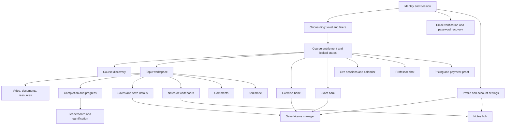
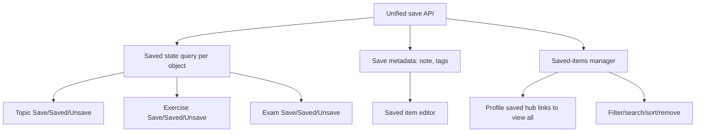

# Student UX Deep Audit

Date: 2026-06-18
Scope: student-facing Kresco app only.
Primary question: "If a real student used every feature one by one, what would they expect from a flagship learning app, what currently works, what is partial, and what has to be implemented so nothing is missed?"

## Method

This audit combines:

- Source inventory of student routes, controls, mutations, empty states, loading states, and locked states.
- Earlier manual browser passes through student, basic, and pro accounts.
- A current source re-check after shared code changes.

Current limitation: the browser automation surface started rejecting the current page under its URL policy during the second student-only pass, so the latest pass after that point is source-verified instead of re-clicked live. Items that were manually observed earlier are marked as observed. Items inferred from source are marked source-verified.

## Severity

- P0: student trust, payment, access, auth, or data-loss issue.
- P1: core learning workflow issue that blocks daily student use or makes a feature feel unfinished.
- P2: important quality issue, discoverability issue, missing edge state, or flagship-app expectation.
- P3: polish, copy, analytics, and long-tail improvement.

## Student Feature Dependency Map

Implementation order:

1. Auth/session/account lifecycle.
2. Entitlements, locked states, and payment proof.
3. Core learning loop: course -> topic -> media -> complete -> save -> note/comment.
4. Student memory systems: saves manager, notes hub, whiteboard persistence.
5. Practice systems: exercise bank, exam bank, corrections, self-grade.
6. Schedule systems: calendar, live, professor chat.
7. Gamification/profile/social polish.
8. Zed mode and study-tool polish.

## Executive Findings

1. P0: Password recovery and email verification are now Firebase-backed in source, but the flow still lacks strong student-facing guidance for expired links, spam folder recovery, resend cooldown, and a support fallback.
2. P0: Payment and entitlement recovery is too thin. A student who pays or uploads proof needs receipts, proof review status, rejection reasons, resubmission, and support escalation in one place.
3. P1: Saves are inconsistent. Topic saves can create/update details but have no unsave/remove path. Exam and exercise saves are toggles. Profile shows saved items as links but not as a manager.
4. P1: Notes are confused with whiteboard. A note CRUD hook exists, but the topic Notes tab currently renders the whiteboard, so the implemented note edit/delete capability is not reachable there.
5. P1: Several "empty because no data" states exist in key student features, especially Exercise Bank and parts of Exam Bank. They need clear explanations, recommended next actions, and seeded content validation.
6. P1: Live and calendar are usable structurally, but past/unavailable sessions make the system feel dead unless there are current sessions, replay states, countdowns, and join windows.
7. P1: Professor chat has strong interaction logic in source, but access gating, first-message constraints, image/file differences, failed send recovery, and delete/edit confirmations need sharper UX.
8. P2: Profile editing now supports file upload through Choose buttons, but still exposes raw media URL fields. That is not normal student-facing flagship UX.
9. P2: Notification delete-all has no confirmation in source. That is risky for a student who expects "clear all" to be reversible or confirmed.
10. P2: Terms and Privacy links in auth are `#`; this is a trust issue before signup.

## Student Route Coverage

| Route | Student purpose | Current status | Main missing pieces |
| --- | --- | --- | --- |
| `/` | Login/signup/forgot/onboarding | Partial | Terms/privacy, resend cooldown, better expired-link recovery |
| `/auth/verify-email` | Verify email action link | Partial | Clear retry/resend path after invalid/expired link |
| `/auth/reset-password` | Reset password action link | Partial | Better expired-link recovery, strength guidance |
| `/home` | Student dashboard | Partial | Empty-state actions, recovery cards, progress continuity |
| `/courses` | Discover/access courses | Partial | Better locked reason, content availability transparency |
| `/topics/[topicId]` | Main lesson workspace | Partial | Consistent saves, real notes, video fallback, resource management |
| `/exercise-bank` | Practice exercises | Partial | Seed/content visibility, no-data guidance, verified locked states |
| `/exam-bank` | Past exam problems | Partial | Search accuracy, part availability, save manager, progress explanations |
| `/calendar` | Weekly schedule | Partial | Better event discoverability, join countdown, event actions |
| `/live` | Live session list | Partial | Replays, upcoming/past filters, unavailable explanation |
| `/professor-chat` | Student-professor chat | Partial | File support clarity, confirmations, first-message/image logic |
| `/classement` | Leaderboard | Partial | Better search clear label, explain rank hidden under filters |
| `/profile` | Profile, stats, notes, saves | Partial | Account settings, saved/notes management, upload UX |
| `/pricing` | Upgrade/payment | Partial | Billing history, proof tracking, rejection/resubmit flow |
| `/zed` | Focus/study mode | Partial | Persistence clarity, PDF deletion confirmation, mobile fit |

## Auth And Account Lifecycle

Source references:

- `frontend/components/auth/AuthPageView.tsx`
- `frontend/lib/authPageController.ts`
- `frontend/app/auth/reset-password/page.tsx`
- `frontend/app/auth/verify-email/page.tsx`

### Entry Options

Current controls:

- Continue with Google.
- Facebook and Apple buttons disabled.
- Create account.
- Log in.
- Back button appears inside subflows.
- Terms and Privacy links.

Observed/source-verified states:

- Google button is enabled only if Firebase Google auth is configured.
- Facebook and Apple are disabled but still visible.
- Terms and Privacy point to `#`.

Flagship expectation:

- Disabled social buttons should say "coming soon" or be hidden until real.
- Terms and Privacy must navigate to real legal pages.
- Login/signup should preserve intended destination via `next`.
- Auth should explain why a login failed without leaking account existence.

Implementation checklist:

- P0: Replace Terms/Privacy placeholders with real pages.
- P1: Add visible "coming soon" or hide disabled social providers.
- P1: Add resend cooldown and "open email app" helper for verification.
- P2: Add support link from auth error states.
- P2: Add analytics events for auth mode, submit, error class, verification sent.

### Signup

Current controls:

- Full name input.
- Email input.
- Password input with show/hide toggle.
- Create account submit.
- Switch to login.
- Google signup.

Current validation:

- Full name required.
- Password minimum is 8 characters.
- Firebase creates account and sends verification.
- Successful signup moves to verify-pending state.

Missing states:

- No password strength meter.
- No confirm password on signup.
- No accepted terms checkbox.
- No resend cooldown after email sent.
- No "wrong email, edit address" path from verify-pending.

Implementation checklist:

- P1: Add "change email" from verify-pending.
- P1: Add resend cooldown and last-sent timestamp.
- P2: Add password strength and caps lock warning.
- P2: Add explicit terms acceptance.

### Login

Current controls:

- Email input.
- Password input with show/hide toggle.
- Forgot password button.
- Login submit.
- Switch to signup.
- Google login.

Current behavior:

- Firebase email/password obtains ID token.
- Backend session is created with `/auth/firebase-session`.
- Unverified email routes into verify-pending and shows resend.

Missing states:

- No "session expired" context when redirected to login.
- No account lockout/captcha escalation.
- No device/session management after login.

Implementation checklist:

- P1: Add session-expired banner when `next` is present after auth failure.
- P2: Add "recent device" or "manage sessions" later in account settings.

### Forgot Password

Current controls:

- Email input.
- Send link.
- Back to login.
- Sent-state back to login.

Current behavior:

- Sends Firebase password reset email with normalized email.
- Moves to "email sent" state.

Missing states:

- No spam/junk guidance.
- No resend cooldown.
- No "try another email" path after sent.
- No support fallback after repeated failure.

Implementation checklist:

- P0: Add rate-limit/cooldown handling and clear copy.
- P1: Add "Use another email" action in sent state.
- P1: Add support fallback after failed reset send.

### Reset Password Link

Current controls:

- Password input with show/hide.
- Confirm password input.
- Save new password.
- Back to login.

Current validation:

- Requires `oobCode` or `code` query param.
- Password must be at least 8 characters.
- Confirm must match.
- Invalid/no code shows invalid-link screen.

Missing states:

- Invalid/expired code has only back to login.
- No "send a new reset link" from invalid page.
- No strength guidance beyond min length.

Implementation checklist:

- P0: Invalid reset link screen should include "Send a new reset link".
- P1: Add password strength and common-password guidance.

### Email Verification Link

Current behavior:

- Reads `oobCode` or `code`.
- Applies Firebase email verification.
- Success redirects to `/` after 2.5 seconds.
- Error shows invalid/expired link and back to login.

Missing states:

- No resend path on invalid verification page.
- No continue button after success.
- Redirect target is always root, not original `next`.

Implementation checklist:

- P1: Add "resend verification" or "log in to resend".
- P2: Preserve intended destination after verification.

### Onboarding

Current controls:

- Level selection: 1bac, 2bac.
- Filiere selection list.
- Continue and Start.

Current behavior:

- Cannot continue without level.
- Cannot submit without level and filiere.
- Saves to `/profile/me`.

Missing states:

- No "I do not know my filiere" helper.
- No preview of what choice changes.
- No later-change path exposed clearly in profile/settings.

Implementation checklist:

- P1: Make level/filiere editable in a real Account or Learning Preferences page.
- P2: Add explanatory helper for filiere choice.

## Navigation Shell And Notifications

Source reference: `frontend/components/TopNav.tsx`

Current controls:

- Desktop nav links.
- Mobile navigation menu.
- Notes button.
- Notifications button.
- Account menu.
- Profile link.
- Log out.
- Notification read action.
- Mark all read.
- Individual notification delete.
- Delete all.
- Close notifications.

Current behavior:

- Notes button currently shows a toast rather than opening a notes hub.
- Notifications can be marked read and deleted.
- Delete all exists without confirmation.
- Mobile nav and account menu share the same open state.

Real student expectation:

- Notes opens actual notes hub.
- Notifications can be filtered by unread/all.
- Delete all asks for confirmation or offers undo.
- Notification click should take student to the exact object: comment, live session, course, payment state.
- Mobile menu and account menu should not fight each other.

Implementation checklist:

- P1: Replace Notes toast with `/notes` or a drawer backed by note data.
- P1: Add notification routing by notification type.
- P2: Add confirmation or undo for Delete all.
- P2: Separate mobile-nav open state from account-menu open state.
- P2: Add empty notifications copy with a useful action.

## Course Discovery And Entitlements

Student expectation:

- A student should know what is included, what is locked, why it is locked, and exactly how to unlock it.
- Locked content should preview enough value without feeling broken.

Current status:

- Locked panels exist in topics, exercises, and exams.
- Basic account earlier observed locked courses and no professor chat nav.
- Pricing is reachable from locked previews.

Missing states:

- No unified entitlement explainer.
- No "already paid but still locked?" recovery path in context.
- No clear distinction between tier lock, subject lock, unpublished content, and schedule lock.

Implementation checklist:

- P0: Add entitlement recovery link near every paid locked state.
- P1: Normalize lock reason copy across courses, topics, exercises, exams, professor chat.
- P2: Add preview rules: title, summary, syllabus, and unlock CTA for locked items.

## Topic Workspace

Source references:

- `frontend/app/(dashboard)/topics/[topicId]/page.tsx`
- `frontend/components/topic-workspace/TopicWorkspacePanels.tsx`
- `frontend/components/topic-workspace/TopicWorkspaceResourcePanel.tsx`
- `frontend/components/topic-workspace/TopicWorkspaceWhiteboard.tsx`
- `frontend/components/topic-workspace/TopicWorkspaceNotesTab.tsx`
- `frontend/hooks/useTopicNotes.ts`

### Main Lesson Item

Current controls:

- Section/item rail.
- Active item selection.
- Mark complete for non-quiz items.
- Save.
- Save details panel: note, tags, close, save details.
- Tabbed panels.
- Course/resource/document actions.

Current behavior:

- Mark complete posts completion.
- Save posts to `/interactions/saves`.
- Saving opens details.
- Details save can update note/tags.
- Quiz items do not show generic Mark complete.

Missing states:

- No unsave/remove saved item from topic.
- Save button does not appear to reflect already-saved state consistently.
- No "saved at" state.
- No duplicate save handling visible to student.
- No keyboard shortcut or next/previous lesson flow.
- No "continue where you left off" in the workspace itself.

Implementation checklist:

- P1: Add saved state detection and Unsave for topic items.
- P1: Add consistent save model shared by topic/exam/exercise.
- P1: Add "Next lesson" and "Previous lesson".
- P2: Add completion undo if accidental.
- P2: Add clear error state for failed completion/save.

### Media And Video

Observed earlier:

- Some YouTube embeds failed under the current CSP/browser context.
- Quiz item could show a missing-video shell.

Real student expectation:

- If video fails, show why and offer open-in-new-tab, refresh, or contact support.
- If no video exists, do not render a video-shaped dead area.
- Video progress should persist.

Implementation checklist:

- P0: Fix YouTube/video CSP and embed fallback.
- P1: Add video error boundary with "Open video", "Retry", and "Report issue".
- P1: Persist video watch progress and resume point.
- P2: Add transcript/captions if available.

### Resources

Current controls:

- Open resource.
- Preview resource.
- Download resource.
- Close preview.

Current behavior:

- Resource resolver tries backend and falls back to raw URL.
- Preview and download show toasts on failure.

Missing states:

- No resource type labels in a consistent student mental model.
- No unavailable/deleted resource recovery.
- No "download started" or "download failed" details.
- No per-resource saved state.

Implementation checklist:

- P1: Add resource unavailable state with report action.
- P2: Add resource type badges and file size when known.
- P2: Allow saving individual resources into the saved-items manager.

### Notes Versus Whiteboard

Current controls:

- Topic Notes tab renders `TopicWorkspaceWhiteboard`.
- Whiteboard controls: Save now, Expand, Close expanded, Reload on conflict.
- Whiteboard statuses: Loading, Saving, Changed elsewhere, Local draft, Not synced, Sync issue, Unsaved changes, Saved.

Source-verified mismatch:

- `useTopicNotes` supports load, save, edit, and delete note behavior.
- `TopicWorkspaceNotesTab` currently ignores note props and returns the whiteboard.
- Profile says "Notes you save in a topic will appear here", but the visible topic tab is a whiteboard.

Real student expectation:

- Notes are text notes searchable later.
- Whiteboard is drawing space.
- Both should exist, but they should not be the same feature.

Implementation checklist:

- P1: Split "Notes" and "Whiteboard" into separate tabs.
- P1: Wire `useTopicNotes` into the Notes tab.
- P1: Add note list, create, edit, delete, empty state, and conflict/error state.
- P1: Profile Recent notes must link to actual note context.
- P2: Whiteboard should explain image save limitation before student inserts images.

### Comments

Current controls:

- Comment list.
- Comment composer/post.

Current behavior:

- Earlier manual pass observed comment posting working.

Missing states:

- No edit/delete for own comments.
- No moderation/report.
- No empty conversation starter beyond basic empty state.
- No threaded replies or professor answer highlighting.

Implementation checklist:

- P1: Add edit/delete for own comments.
- P1: Add report/comment moderation hooks.
- P2: Highlight professor/admin comments.
- P2: Add sort by newest/top/helpful.

### Locked Topic Panels

Current behavior:

- Locked content panel links to pricing.

Missing states:

- No "already paid?" entitlement recovery.
- No clear content preview boundary.
- No support handoff from lock screen.

Implementation checklist:

- P0: Add "I already paid" recovery link.
- P1: Normalize lock reason and upgrade CTA.

## Saves System

This needs to become one coherent system.

Current implementations:

- Topic item save: create/update details, note, tags. No unsave/remove in visible topic flow.
- Exam problem save: toggle Save/Saved.
- Exercise save: toggle Save/Saved.
- Profile saved items: shows up to 4 links. No remove, filter, edit, or view-all manager.
- Pricing/payment proof references are not integrated into saves.

Real student expectation:

- Save any learning object.
- See all saves in one place.
- Filter by course, topic, resource, exam, exercise, tag.
- Remove a save.
- Edit note/tags.
- Search saved items.
- Continue from saved item.
- Confirm destructive actions or provide undo.

Implementation dependency tree:

Implementation checklist:

- P1: Build one saved-items manager route or drawer.
- P1: Add Unsave to topic saves.
- P1: Add edit note/tags from profile/saves manager.
- P1: Add saved-state hydration on topic items.
- P2: Add tag search and filter.
- P2: Add undo toast after remove.

## Notes System

Current implementations:

- `useTopicNotes` has real load/save/edit/delete code.
- Topic visible Notes tab is whiteboard only.
- Top nav Notes button only shows a toast.
- Profile Recent notes is read-only preview.

Real student expectation:

- Notes are first-class memory objects.
- Student can create from topic, view all notes, search, edit, delete, tag, and jump back to context.

Implementation checklist:

- P1: Wire topic Notes tab to note CRUD.
- P1: Create `/notes` or notes drawer.
- P1: Make TopNav Notes open the note hub.
- P1: Add Profile "View all notes".
- P2: Add delete confirmation/undo.
- P2: Add offline/local draft handling.

## Exercise Bank

Source references:

- `frontend/app/(dashboard)/exercise-bank/page.tsx`
- `frontend/lib/exerciseBankData.ts`

Current controls:

- Subject/topic/difficulty/self-grade/saved filters.
- Exercise cards.
- Open exercise.
- Save/Saved toggle.
- Private notes textarea.
- Save notes.
- Reveal correction.
- Self-grade: Again, Partial, Mastered.
- Video correction link when present.
- Locked exercise preview with View unlock options.

Observed earlier:

- Exercise Bank showed empty for Mathematiques and Physique despite visible topic count elsewhere.

Current good pieces:

- The detail state has a real practice loop: statement -> notes -> reveal correction -> self-grade.
- Save toggle exists.
- Private notes are exercise-specific.
- Locked preview exists.

Missing states:

- Empty results do not prove whether content is missing, filters are too narrow, or access blocks content.
- No "clear filters" global action.
- No attempt tracking before reveal.
- No answer input/submission.
- No "hide correction again".
- No note history/edit beyond single textarea.

Implementation checklist:

- P1: Fix/seed Exercise Bank content visibility.
- P1: Add clear filters and "try another subject" empty state.
- P1: Track attempts and time spent.
- P2: Add answer draft before reveal.
- P2: Add mastery history.
- P2: Add confirmation or warning before reveal if student has not attempted.

## Exam Bank

Source references:

- `frontend/app/(dashboard)/exam-bank/page.tsx`
- `frontend/lib/courseDiscoveryData.ts`

Current controls:

- Search exam bank.
- Progress filter: all, not started, opened, completed.
- Saved filter: all, saved, unsaved.
- Open problem.
- Open topic.
- Unlock options for locked items.
- Back to exam list.
- Save/Saved toggle.
- Mark completed.
- Part video "Open video".

Observed earlier:

- Search for "diffraction" returned no results despite a visible card.
- Opening a problem worked.
- Save and Mark completed worked.
- Some problems had no published parts.

Current good pieces:

- Opening a problem silently records "opened".
- Save toggle is implemented.
- Mark completed is implemented.
- Locked exam/part previews are implemented.

Missing states:

- Search mismatch undermines trust.
- No clear filter reset.
- No per-part completion.
- No worked attempt area.
- No downloadable PDF or official correction file flow.
- No "why no parts" content-admin visibility for students.

Implementation checklist:

- P1: Fix search indexing/matching for concepts visible in cards.
- P1: Add clear filters.
- P1: Add per-part progress if parts matter.
- P2: Add attempt workspace or link to Zed mode for exam problem.
- P2: Add "report missing correction/part".

## Calendar

Source reference: `frontend/app/(dashboard)/calendar/page.tsx`

Current controls:

- Previous week.
- Today.
- Next week.
- Event block selection.
- Mini-calendar previous month.
- Mini-calendar next month.
- Day selection.
- Event details: Close, Prepare link, Join session/Join unavailable.
- Empty week: Today, Next week.

Current behavior:

- Weekly events load by selected week and timezone.
- Event detail can load via query event id.
- Empty week state exists.

Observed earlier:

- Clicking an event did not show the detail card in the earlier browser pass, but current source says event block calls `setSelectedEvent`. Needs re-run when browser is available.

Missing states:

- No list view for mobile.
- No upcoming countdown.
- No add-to-calendar export.
- No replay/past-session behavior.
- No timezone explanation.

Implementation checklist:

- P1: Re-test event selection manually.
- P1: Add mobile list fallback.
- P1: Add join countdown and join window copy.
- P2: Add add-to-calendar.
- P2: Add replay/past-session card state.

## Live Sessions

Source reference: `frontend/app/(dashboard)/live/page.tsx`

Current controls:

- Join link if session can be joined.
- Disabled Unavailable button if not joinable.
- Retry on load error.

Observed earlier:

- Live sessions were unavailable because seeded dates were past.

Missing states:

- No filters for upcoming/live/past.
- No replay route from list.
- Unavailable does not say whether it is too early, ended, locked, or missing URL.
- No "notify me" or reminder.

Implementation checklist:

- P1: Add reason-specific unavailable copy.
- P1: Add upcoming/live/past tabs.
- P1: Add replay state when recording exists.
- P2: Add reminder/notification opt-in.

## Professor Chat

Source references:

- `frontend/app/(dashboard)/professor-chat/page.tsx`
- `frontend/lib/professor.ts`
- `frontend/lib/studentProfessorChatData.ts`

Current controls:

- Teacher thread list.
- Select teacher.
- Show older messages.
- Ask your first question.
- Message textarea.
- Send.
- Add image.
- Remove selected image.
- Disabled attach file.
- Message actions menu.
- Edit own message if still editable.
- Save edit.
- Cancel edit.
- Delete own message.
- Retry failed message.
- Remove failed message.
- Retry status load.
- Retry message load.

Current behavior:

- If ineligible, shows "VIP chat is locked".
- Image is allowed only after conversation exists.
- File attachment button is disabled and titled "not available yet".
- Optimistic message sends are supported.
- Failed messages can retry/remove.
- Own sent messages can be edited inside a time rule.

Missing states:

- No pricing/support CTA in locked chat screen.
- No confirmation for deleting sent messages.
- No explanation of edit window.
- First message cannot include an image; this is logical but not explained upfront.
- File attachment disabled state should not look like a broken feature.
- No professor availability/response-time expectation.

Implementation checklist:

- P1: Locked chat state needs upgrade CTA and "already paid" recovery.
- P1: Add delete confirmation or undo.
- P1: Explain image-after-first-message rule.
- P2: Show professor availability and expected response time.
- P2: Hide file attachment until supported or expose waitlist copy.

## Leaderboard

Source reference: `frontend/components/Leaderboard.tsx`

Current controls:

- Search player input.
- Clear search button labeled visually as `x`.
- Previous page.
- Next page.
- Widget "Voir tout".

Current behavior:

- Search is debounced.
- Pagination works off page size.
- Current user panel appears when current user is in visible result set.
- If current user is not in search results, a card says rank is not shown.

Observed earlier:

- Search worked.
- Clear button was unlabeled visually as "x".
- Own rank hidden under filters/search can confuse students.

Missing states:

- No explicit accessible label on clear search.
- No explanation of league reset cadence.
- No filter by classmates/filiere.
- No privacy controls.

Implementation checklist:

- P2: Add aria-label and icon for clear search.
- P2: Explain why current rank is hidden under search.
- P2: Add league season/reset details.
- P3: Add privacy/nickname option later.

## Profile

Source references:

- `frontend/app/(dashboard)/profile/page.tsx`
- `frontend/components/figma/profile.tsx`
- `frontend/lib/profileViewModel.ts`

Current controls:

- Edit profile.
- Close profile editor.
- Display name.
- Level.
- Track.
- Avatar image URL.
- Avatar Choose.
- Banner image URL.
- Banner Choose.
- Cancel.
- Save changes.
- Followers/Following tabs.
- Recent notes links.
- Saved items links.

Current behavior:

- Profile edit supports file selection via hidden upload in page source.
- UI still exposes raw URL fields.
- Profile hub shows notes/saves previews only.

Missing states:

- No account/security settings.
- No change password.
- No email display/verification status.
- No delete account.
- No notification preferences.
- No billing/subscription status.
- No manage saved items.
- No manage notes.
- No remove avatar/banner.
- No crop/preview tools beyond raw image preview.

Implementation checklist:

- P0: Add Account/Security area for email, password, sessions.
- P1: Replace raw URL media fields with upload/remove/crop-friendly UX.
- P1: Add "View all saved" and "View all notes".
- P1: Add subscription/billing status.
- P2: Add privacy and notification preferences.

## Pricing And Payment

Source reference:

- `frontend/app/(dashboard)/pricing/page.tsx`

Current controls and states:

- Buy Pro button.
- Manual transfer/payment request.
- Proof upload/submit fields.
- Support retry.
- Mailto support.
- Payment fail page states.
- Proof submitted state.

Observed earlier:

- Basic student could create a manual transfer reference.
- Empty proof submit triggered required validation.
- Proof inputs were not clearly labeled enough in the live UI.

Real student expectation:

- See current plan.
- Upgrade.
- Pay.
- Get receipt/reference.
- Upload proof.
- Track proof review.
- See rejection reason.
- Resubmit proof.
- Contact support with reference prefilled.
- Recover if payment succeeded but access did not unlock.

Implementation checklist:

- P0: Add "already paid but locked" recovery flow globally.
- P0: Add proof review status page/card.
- P0: Add rejected proof reason and resubmit.
- P1: Add billing/subscription status to profile/account.
- P1: Label all proof fields clearly.
- P1: Add receipt/reference copy button.
- P2: Add payment timeline/history.

## Zed Mode

Source references:

- `frontend/app/zed/page.tsx`
- `frontend/components/zed/ZedModeOverlay.tsx`
- `frontend/components/zed/PdfViewer.tsx`
- `frontend/components/zed/Scratchpad.tsx`
- `frontend/components/zed/ScientificCalculator.tsx`
- `frontend/components/zed/PomodoroTimer.tsx`
- `frontend/components/zed/RappelsCours.tsx`

Current controls:

- PDF fullscreen/right-panel toggle.
- Scientific calculator toggle.
- Rappels de cours toggle.
- Accueil.
- Quitter.
- Exit confirmation: Annuler, Confirmer.
- Resizable split separator.
- Right tabs: Brouillon, Rappels.
- PDF import.
- Local PDF select.
- Pin text.
- Page number for pin.
- Capture area.
- Cancel capture.
- Change PDF.
- Delete local PDF.
- Scratchpad clear history.
- Remove pinned snippet.
- Math expression textarea.
- Calculate.
- Calculator close and calculator buttons.
- Pomodoro preset, start, pause, resume, reset, mute.

Observed earlier:

- Calculator worked.
- Tab switching cleared or appeared to lose draft context in a previous manual pass.
- Exit confirmation worked.

Missing states:

- PDF delete has no confirmation.
- Local storage/persistence is not explained clearly.
- Draft persistence between Brouillon/Rappels needs re-verification.
- Mobile layout can become dense.
- No onboarding for pin text/capture workflow.
- No recovery if PDF parsing fails beyond status text.

Implementation checklist:

- P1: Confirm scratchpad persistence across tab switches and exit.
- P1: Add delete confirmation for local PDFs.
- P1: Add clearer failed-PDF state with retry/change file.
- P2: Add mobile-optimized Zed layout or unsupported warning.
- P2: Add "save study session" summary.

## Global Loading, Empty, Error, Offline States

Flagship rule: every student feature needs all of these states:

- Initial loading.
- Background refreshing.
- Empty with a next action.
- Empty because filtered.
- Empty because no content exists yet.
- Error with retry.
- Permission locked with unlock/recovery.
- Offline or local draft if student typed something.
- Mutation pending.
- Mutation success.
- Mutation failed with retry/undo.
- Destructive action confirmation or undo.

Current gaps:

- Saves removal is missing in topic/profile.
- Notes hub is missing.
- Payment recovery is missing.
- Delete all notifications lacks confirmation.
- PDF delete lacks confirmation.
- Exercise Bank no-data is too ambiguous.
- Live unavailable is too ambiguous.

## Feature-by-Feature Button Inventory

### Auth

- Back.
- Continue with Google.
- Facebook disabled.
- Apple disabled.
- Create account.
- Login.
- Show/hide password.
- Forgot password.
- Send verification again.
- Back to home/login.
- Level option buttons.
- Filiere option buttons.
- Continue.
- Start.

Must implement/verify:

- Legal links real.
- Send-again cooldown.
- Invalid reset/verify recovery.
- Change email from verify-pending.

### Navigation

- Desktop nav links.
- Mobile menu.
- Notes.
- Notifications.
- Mark all read.
- Delete all.
- Delete single notification.
- Read/open notification.
- Account/Profile.
- Logout.

Must implement/verify:

- Notes opens real notes.
- Delete all confirmation/undo.
- Notification deep links.

### Topic

- Item rail selections.
- Mark complete.
- Save.
- Save details.
- Close save details.
- Resource Open/Preview/Download/Close.
- Whiteboard Save now/Expand/Close/Reload.
- Comment submit.

Must implement/verify:

- Unsave.
- Saved-state hydration.
- Real Notes tab.
- Video error fallback.
- Comment edit/delete.

### Exercise Bank

- Filters.
- Open exercise.
- Save/Saved.
- Save notes.
- Reveal correction.
- Again/Partial/Mastered.
- Video correction.
- View unlock options.

Must implement/verify:

- Clear filters.
- Attempt tracking.
- Better no-data states.

### Exam Bank

- Search.
- Progress filter.
- Saved filter.
- Open problem.
- Open topic.
- Back to exam list.
- Save/Saved.
- Mark completed.
- Open video.
- Unlock options.

Must implement/verify:

- Search accuracy.
- Clear filters.
- Per-part progress.
- Missing part/report issue state.

### Calendar/Live

- Previous week.
- Today.
- Next week.
- Mini previous/next month.
- Select day.
- Select event.
- Close event details.
- Prepare.
- Join/Unavailable.
- Live Join.
- Live Retry.

Must implement/verify:

- Event click live re-test.
- Upcoming/live/past filters.
- Countdown and unavailable reason.

### Professor Chat

- Select teacher.
- Show older.
- Ask first question.
- Type message.
- Send.
- Add image.
- Remove image.
- Disabled attach file.
- Message actions.
- Edit.
- Save edit.
- Cancel edit.
- Delete.
- Retry failed.
- Remove failed.
- Retry load.

Must implement/verify:

- Locked CTA.
- Delete confirmation/undo.
- First-message image explanation.
- File attachment roadmap/hide.

### Profile

- Edit profile.
- Close editor.
- Choose avatar.
- Choose banner.
- Cancel.
- Save changes.
- Followers tab.
- Following tab.
- Recent note links.
- Saved item links.

Must implement:

- Account/security settings.
- Change password.
- Manage saves.
- Manage notes.
- Subscription status.
- Remove/crop media.

### Pricing

- Buy Pro.
- Manual transfer/payment reference.
- Proof submit.
- Support retry.
- Email support.

Must implement:

- Proof status tracking.
- Rejected proof resubmit.
- Receipt/reference copy.
- Billing history.
- Already-paid recovery.

### Zed

- Fullscreen PDF.
- Calculator.
- Rappels.
- Accueil.
- Quitter.
- Exit cancel/confirm.
- Resize separator.
- Brouillon/Rappels tabs.
- Import/change/delete PDF.
- Select local PDF.
- Pin text.
- Capture area/cancel.
- Scratchpad calculate.
- Clear history.
- Remove pinned snippet.
- Timer preset/start/pause/resume/reset/mute.
- Calculator close/buttons/history.

Must implement/verify:

- Delete confirmations.
- Persistence guarantees.
- Mobile layout.
- Failed-PDF recovery.

## Prioritized Student Backlog

### P0

1. Replace auth Terms/Privacy placeholders.
2. Add password reset invalid-link recovery.
3. Add payment entitlement recovery: "I paid but I am still locked".
4. Add proof review status, rejection reason, and resubmit flow.
5. Fix video embed/CSP failure and provide video fallback.
6. Add Account/Security area with email/password basics.

### P1

1. Build unified saves manager.
2. Add topic Unsave and saved-state hydration.
3. Split Notes and Whiteboard, wire `useTopicNotes` into a real Notes tab.
4. Make TopNav Notes open real notes.
5. Fix/seed Exercise Bank empty content.
6. Fix Exam Bank search mismatch.
7. Add clear filters to Exercise Bank and Exam Bank.
8. Improve professor chat locked state and delete recovery.
9. Add Live upcoming/live/past states and unavailable reasons.
10. Replace raw profile media UX with upload/remove/crop flow.

### P2

1. Notification delete-all confirmation or undo.
2. PDF delete confirmation in Zed.
3. Calendar mobile list view.
4. Add add-to-calendar and live reminders.
5. Explain leaderboard rank hidden by search.
6. Add comment edit/delete/report.
7. Add support/report issue from missing resources, missing corrections, and video failures.
8. Add password strength and signup confirm password.

### P3

1. Add keyboard shortcuts for topic next/previous and Zed.
2. Add richer profile privacy/nickname controls.
3. Add study-session summary from Zed.
4. Add more granular analytics events across student workflows.

## "Do Not Miss" Regression Checklist

Before shipping student UX work, manually test:

- New signup with weak password, valid password, existing email, and verification pending.
- Send verification again with empty password, wrong password, right password.
- Login with unverified email.
- Forgot password with valid email and invalid/unknown email.
- Reset password with no code, fake/expired code, short password, mismatch, valid code.
- Onboarding with no level, level only, level plus filiere.
- Topic mark complete success/failure.
- Topic save, edit save note/tags, unsave after implemented.
- Topic notes create/edit/delete after implemented.
- Topic whiteboard save, conflict, offline/local draft.
- Topic resource open/preview/download failure.
- Comment post, edit/delete after implemented.
- Exercise filters empty, content, locked, reveal correction, self-grade, save/unsave, private notes.
- Exam search, filters, open, save/unsave, mark completed, locked problem, no parts.
- Calendar week navigation, empty week, event click, detail close, prepare, join unavailable.
- Live upcoming, live now, past/replay, unavailable reasons.
- Professor chat locked, no teachers, no messages, first message, image message, failed send retry/remove, edit/delete.
- Notifications empty, mark read, delete one, delete all with confirmation/undo.
- Profile edit valid, blank name, avatar upload, banner upload, save failure.
- Saved-items manager remove/edit/filter after implemented.
- Pricing CMI fail/success, manual transfer reference, proof validation, review/reject/resubmit.
- Zed import valid PDF, invalid PDF, pin text, snip image, delete PDF, calculate, clear history, exit confirm, persistence.

## Final Product Shape

A flagship student app should make these systems feel connected:

- Learn: courses and topics.
- Practice: exercises and exams.
- Remember: saves, notes, whiteboards.
- Schedule: calendar and live.
- Ask: professor chat and comments.
- Track: profile, progress, leaderboard.
- Pay: pricing, proof, entitlement recovery.
- Focus: Zed mode.

Right now, the app has many of the pieces, but several are isolated or half-wired. The highest-leverage work is not adding more new surfaces. It is making the core student loop consistent:

course -> topic -> watch/read -> complete -> save -> note -> practice -> ask -> review later.

# Shatter Pass 7 - Daily Student Loop Friction

This pass re-checks source and tests around onboarding, profile, calendar, Exercise Bank, and Exam Bank. Earlier passes already named several broad issues in these areas. This pass adds the missing implementation details that a real user would feel during repeated daily use.

## Pass 7 Findings

### Onboarding Is A Reused Auth Shell, Not A Real First-Run Setup

Evidence:

- `frontend/app/onboarding/page.tsx` renders `AuthPageView` inside `AuthGuard`.
- `AuthPageView` contains login, signup, forgot password, verify-pending, level, and filiere states in one component.
- The onboarding path depends on `resolveAuthSuccess` and existing `niveau`/`filiere` values to land on level or filiere steps.
- `frontend/tests/authGuardComponent.test.ts` and `frontend/tests/authPageController.test.ts` verify redirects and level/filiere submission, not a complete first-run student setup.

Current user impact:

- A protected `/onboarding` route visually and structurally shares the same shell as login/signup.
- There is no dedicated first-run checklist explaining what setup is needed and why.
- The app only asks level and filiere, then drops the student into the product.
- There is no confirmation of chosen Bac track, subjects, exam year, notification preference, study goal, or preferred language.
- There is no obvious later path from onboarding to fix a wrong level/filiere choice except profile editing if the student finds it.

Flagship expectation:

- Onboarding should feel like account setup after login, not like a recycled auth page.
- The student should see a compact setup checklist: level, filiere, target subjects, exam goal, schedule/reminder preference, and confirmation.
- Every selected value should be reviewable before entering the dashboard.
- The profile/account area should clearly expose "change academic track" with consequences.

Implementation requirement:

- P1: Split onboarding into a dedicated student setup component instead of rendering the full auth shell.
- P1: Add review/confirm step before saving `niveau` and `filiere`.
- P1: Add a visible path in profile/account to change level/filiere later.
- P2: Add optional setup for target subjects, exam goal, notification reminders, and preferred language.
- P2: Add tests for complete onboarding, partial onboarding resume, wrong-track correction, and completed-user redirect.

### Exercise Bank Notes Can Be Lost Without A Dirty Navigation Guard

Evidence:

- `frontend/app/(dashboard)/exercise-bank/page.tsx` tracks `notesDraft`, `notesDirty`, and `notesExerciseId`.
- `closeExercise()` immediately closes the detail view and syncs the route.
- `openExercise()` immediately switches detail ID and syncs the route.
- There is no confirmation when `notesDirty` is true.
- `frontend/tests/exerciseBankPage.test.tsx` verifies notes save and draft sync, but not unsaved-note loss on close, filter change, subject change, or exercise change.

Current user impact:

- A student can type private revision notes, press Back to list, change subject, open another exercise, or navigate away and silently lose the note.
- This is especially bad because the section is called "Private notes", which implies persistence and personal value.

Flagship expectation:

- Unsaved notes should be protected like any other user-created content.
- Leaving a dirty exercise detail should offer save, discard, or cancel.
- The app should autosave drafts locally if backend save is not immediate.

Implementation requirement:

- P0: Add a dirty-note guard for close, exercise switch, subject switch, filter reset, and route exit.
- P1: Add local draft preservation per exercise ID.
- P1: Show saved/unsaved state inline next to the notes title.
- P2: Add keyboard shortcut support for saving notes.
- P2: Add tests for close/switch/filter/navigation while notes are dirty.

### Exercise Bank Has No Search And Weak Empty-State Recovery

Evidence:

- `frontend/app/(dashboard)/exercise-bank/page.tsx` exposes subject, difficulty, self-grade, saved-only, and reset controls.
- It fetches `/exercises/subjects/{id}?limit=50` with optional filters.
- Empty state says `No exercises match these filters.`
- There is no text search input, no topic filter, no concept filter, and no visible explanation of whether the empty result is caused by content absence, access lock, or active filters.

Current user impact:

- A student looking for a known topic cannot search by concept or statement.
- A filtered empty state gives no direct "clear filters", "try another subject", or "show locked exercises" path inside the empty panel.
- The page can say a subject has topics available, while the exercise list is empty, without explaining the mismatch.

Flagship expectation:

- Practice banks should support search, topic/concept filters, and active filter chips.
- Empty states should diagnose the cause: no content published, filters too narrow, subject locked, or network failure.
- The user should be one click away from clearing filters or switching subject.

Implementation requirement:

- P1: Add exercise search by title, summary, statement, topic, and concept.
- P1: Add topic/concept filters when metadata exists.
- P1: Replace the generic empty state with cause-specific empty panels.
- P1: Include a clear-filters action inside empty panels.
- P2: Add tests for no content, filter-empty, saved-empty, and locked-only states.

### Exercise Bank Hard-Caps The List At 50 Without Pagination

Evidence:

- The list fetch uses `/exercises/subjects/{id}?limit=50`.
- The UI displays `list.total` but only renders `list.items`.
- There is no pagination, load more, sort, or "showing 50 of N" state.

Current user impact:

- If a subject has more than 50 exercises, the student can see a total count but cannot reach every exercise from this page.
- The missing items look like a backend/content issue instead of a paging limitation.

Flagship expectation:

- Large practice banks need pagination, infinite loading, or "load more".
- The visible count should always tell the truth: showing X of Y.
- Sorting should support newest, difficulty, not started, needs review, and mastered.

Implementation requirement:

- P1: Add pagination or load-more support to Exercise Bank.
- P1: Show `Showing X of Y exercises`.
- P2: Add sort controls for recommended, newest, difficulty, and review state.
- P2: Add tests for second-page loading and count copy.

### Exam Bank Hides Content Instead Of Offering Pagination Or Expansion

Evidence:

- `frontend/app/(dashboard)/exam-bank/page.tsx` defines `MAX_EXAMS_RENDERED = 30`.
- It defines `MAX_PROBLEMS_PER_EXAM = 12`.
- If caps apply, the UI says to use search to narrow the list.
- If an exam group has more problems, the footer says more problems are hidden and tells the user to search.
- There is no "show all in group", pagination, sort, or jump-to-hidden problem action.

Current user impact:

- The app knowingly hides exam groups/problems and asks the student to guess search terms.
- A student browsing national exams expects completeness by year/session, not silent truncation.
- Hidden problem count without expansion undermines trust in the bank.

Flagship expectation:

- The bank should page or virtualize all groups instead of hiding them.
- Exam groups should expand/collapse, and hidden problems should be directly revealable.
- Search should be a convenience, not the only way to access overflow content.

Implementation requirement:

- P1: Replace hard render caps with pagination, virtualization, or load-more.
- P1: Add "show all problems in this exam" for capped groups.
- P1: Show exact count copy: `Showing 12 of 18 problems`.
- P2: Add sort/group controls by subject, year, session, difficulty, saved, and progress.
- P2: Add tests proving overflow content remains reachable.

### Exam And Exercise Detail Deep Links End In Generic Not-Found States

Evidence:

- Exam detail renders `Exam problem not found.` when `selectedProblemId` has no detail.
- Exercise detail renders `Exercise not found.` when `selectedExerciseId` has no detail.
- Both pages preserve IDs in the URL.
- Tests cover opening valid details and hiding stale detail while loading, but not invalid/stale/deleted deep links.

Current user impact:

- A student clicking an old saved item, notification, or shared link can land on a dead detail with no recovery.
- There is no "remove stale saved item", "search this bank", "back to subject", or "contact support" action.
- The user does not know whether the problem was deleted, locked, moved, unpublished, or unavailable offline.

Flagship expectation:

- Invalid deep links should explain the likely cause and offer recovery.
- If the item was saved, the app should offer to remove or update the stale saved item.
- If the item moved, the backend should provide redirect metadata.

Implementation requirement:

- P1: Replace generic not-found copy with a recovery panel.
- P1: Add actions: back to bank, clear detail parameter, search by title/ID, and contact support.
- P1: If opened from saved/profile context, offer remove stale saved item.
- P2: Add backend support for moved/deprecated content redirects.
- P2: Add invalid deep-link tests for both banks.

### Calendar Event Deep Links Lack A Persistent Failure State

Evidence:

- `frontend/app/(dashboard)/calendar/page.tsx` parses `event` from the URL.
- It fetches `/calendar/events/{id}` for requested event details.
- On failure, it clears `selectedEvent` and shows a toast: `Unable to load event details. Please try again.`
- The page then continues to show the week view without a visible inline explanation tied to the failed event ID.
- `frontend/tests/calendarViewModel.test.ts` covers parsing and generic fallback copy, not failed event deep-link recovery.

Current user impact:

- A student opening a notification or reminder can miss the toast and not know the event link failed.
- The URL can still imply a specific event while the visible UI shows a generic week.
- There is no "event expired", "session moved", "view upcoming live sessions", or "contact support" recovery path.

Flagship expectation:

- Failed event links should render an inline alert near the calendar header or side rail.
- The alert should preserve the event ID/reference and explain likely causes.
- The user should be able to clear the bad event parameter, jump to live sessions, or retry.

Implementation requirement:

- P1: Add persistent failed-event inline state for calendar deep links.
- P1: Add clear-event-param and retry actions.
- P2: Add moved/cancelled/expired event status handling from the backend.
- P2: Add tests for valid event, missing event, failed fetch, and stale notification link.

### Calendar Join Actions Are Too Static For Live Timing

Evidence:

- Calendar event details expose preparation and join actions.
- Week data is fetched by date range and refreshed through realtime subscription messages.
- The calendar code does not show a join window countdown, "starts in", "live now", "ended", replay, or add-to-calendar/export state in the inspected route.

Current user impact:

- A student cannot tell whether a live event is joinable now, too early, expired, or replayable from the calendar alone.
- Calendar becomes a static schedule instead of an action surface.

Flagship expectation:

- Live events should show timing status: starts soon, join opens at, live now, ended, replay available.
- Join buttons should be disabled/explained outside join windows.
- Preparation should link to the relevant topic or checklist.

Implementation requirement:

- P1: Add calendar event timing states and join-window copy.
- P1: Add replay/recording state after live sessions when available.
- P2: Add add-to-calendar export.
- P2: Add tests for upcoming, joinable, ended, cancelled, and replay states.

## Pass 7 Implementation Order

1. Protect student-authored data first: add dirty-note guards and local drafts in Exercise Bank.
2. Stop hiding bank content: add pagination/load-more for Exercise Bank and Exam Bank.
3. Replace generic empty/not-found states with recovery panels for banks and calendar deep links.
4. Split onboarding into a dedicated first-run student setup flow.
5. Add exercise search/topic filters and stronger active-filter chips.
6. Add calendar timing states, join windows, and stale-event recovery.
7. Expand tests to cover dirty notes, overflow access, invalid deep links, first-run onboarding, and event failure states.

## Shatter Pass 2: Additional UX Defects

This pass expands beyond the first student audit and targets routes/components that were not fully broken down before: Courses, Home, Exam Mode, Live Room, global recovery screens, course cards, quiz primitives, and payment return states.

### New P0/P1 Findings

1. P0: Timed Exam Mode lets a student submit the final exam without a final review/confirmation screen, even with unanswered questions.
2. P0: Payment return states do not give the student a support/reference path at the exact moment payment confirmation is pending, failed, or impossible to verify.
3. P1: Course discovery has a hardcoded breadcrumb/label `Sciences Math A`, regardless of selected filters or actual student track.
4. P1: Course cards use a generic placeholder image when no topic image exists, which makes the catalog feel fake and makes different topics harder to distinguish.
5. P1: Locked/upcoming course cards can visually say `Soon` or `Locked` but do not always expose enough reason/context until the student triggers a preview.
6. P1: Live Room has chat and Q&A but no edit/delete/report, no professor-answer presentation beyond status, and no clear room state timeline.
7. P1: Quiz primitive renderers appear to be immediate-feedback demos, not robust graded quiz UX. If they are used in real student paths, short-answer scoring and feedback are especially dangerous.
8. P1: Global recovery screens are generic and do not help a student preserve task context, contact support, or continue the exact workflow they were in.
9. P2: Several controls lack explicit accessible labels, especially course search and course filter segmented buttons.
10. P2: Pricing French copy is inconsistent and unaccented in several high-trust payment strings.

## Courses Page Deep Defects

Source references:

- `frontend/app/(dashboard)/courses/page.tsx`
- `frontend/components/figma/course-search-controls.tsx`
- `frontend/components/figma/subject-course-card.tsx`

### Course Header

Current issue:

- The page renders a fixed label: `Sciences Math A`.

Why this is bad:

- If a student is in another filiere, another subject filter, or browsing all subjects, the page lies about context.
- A flagship app should never hardcode the student's academic track in a general catalog header.

Implementation requirement:

- P1: Replace the hardcoded label with the user's actual level/filiere or a neutral `Course catalog`.
- P2: If filters are active, show filter summary: subject, status, query.

### Course Search

Current controls:

- Search input with placeholder `Search courses`.
- Subject dropdown.
- Status segmented controls: All, Unlocked, Locked, In Progress, Completed.
- Reset filters only appears in the no-results state.

Current issues:

- Search input has no explicit `aria-label`.
- Subject dropdown button has no `aria-label`; the listbox has no accessible name.
- Status buttons do not expose `aria-pressed`.
- There is no always-visible "clear filters" when filters are active.
- The default subject reset option is also labeled `Subject`, which is ambiguous.

Implementation requirement:

- P1: Add clear active-filter chips with one-click removal.
- P2: Add `aria-label="Search courses"`.
- P2: Add `aria-label="Filter by subject"` and named listbox.
- P2: Add `aria-pressed` for status filter buttons.
- P2: Rename reset option to `All subjects`.

### Course Cards

Current behavior:

- Missing course image falls back to `/figma-assets/course-card-placeholder.png`.
- Card badge is just the display index.
- Locked cards open a preview modal.
- Upcoming cards render a non-link card with `Soon`.

Current issues:

- Placeholder image makes the app look like a mock if many topics lack real thumbnails.
- The index badge is not useful to a real student unless the order has pedagogical meaning.
- Upcoming card has no "notify me", "expected date", or "why soon" state.
- Completed card hides the progress bar entirely, losing review/revisit affordance.
- Locked card opacity reduces readability and makes the disabled state feel broken.

Implementation requirement:

- P1: Use subject/topic-specific generated or real thumbnails before flagship release.
- P1: Add meaningful lock/upcoming reason on card, not only modal.
- P1: Add expected availability or "notify me" for upcoming.
- P2: Replace numeric badge with module/order label if order matters.
- P2: Keep completed cards revisitable with "Review" rather than only "Done".

### Locked Course Preview Modal

Current controls:

- Backdrop click closes.
- X closes.
- View unlock options.
- Keep browsing.

Current issues:

- No focus trap.
- No Escape handling visible in source.
- No support/recovery action for "I already paid".
- No comparison of what is included after unlock.
- No safe way to preview one free lesson from a locked topic if `is_free_preview` says available.

Implementation requirement:

- P0: Add "Already paid?" support/recovery link.
- P1: Add focus trap and Escape close.
- P1: If preview is available, expose a `Preview lesson` action.
- P2: Add unlock benefits tailored to that topic.

## Home Dashboard Deep Defects

Source references:

- `frontend/app/(dashboard)/home/page.tsx`
- `frontend/components/figma/home.tsx`

### Greeting And Resume

Current behavior:

- Greeting says: `Hello {firstName}!`
- Subtitle says: `Wanna complete where we left off last time?`
- Shows up to 2 continue cards.

Current issues:

- Copy tone is too casual/inconsistent for a Moroccan Bac study platform.
- Only two continue cards can hide the student's actual priority.
- Continue card fallback progress uses arbitrary index-based values if progress is absent.
- Continue card progress has minimum visual width, so a 0% or tiny progress item can look more advanced than it is.

Implementation requirement:

- P1: Never fake progress. If progress is missing, show `Not started` or omit the bar.
- P1: Resume should include exact next action: continue video, finish quiz, review notes.
- P2: Replace casual copy with clear student-facing study copy.
- P2: Add "View all in progress".

### Subject Shortcuts

Current behavior:

- Subject cards link to `/home/[subjectId]`.
- Empty state links to courses.

Current issues:

- Subject cards do not show lock state, item availability, exam/exercise availability, or schedule status.
- Subject card progress is not shown even though the type accepts `progress_pct`.
- If `/home/[subjectId]` is thin, this creates an extra navigation step without enough value.

Implementation requirement:

- P1: Subject cards should show access state and next recommended action.
- P2: Show progress or mastery per subject.
- P2: Consider linking directly to filtered courses/exercises if subject detail is not rich.

## Dedicated Exam Mode Deep Defects

Source references:

- `frontend/app/(dashboard)/exam/[subjectId]/page.tsx`
- `frontend/lib/examDraft.ts`
- `frontend/lib/examData.ts`

### Pre-Exam Screen

Current controls:

- Cancel.
- Commencer.
- Retry if cached quiz data failed to refresh.

Current good:

- Warns about 45-minute timer.
- Warns about auto-submit.
- Stores local draft.

Current issues:

- No checklist for stable internet, calculator/material rules, or allowed resources.
- No "practice instead" fallback.
- No preview of question count before start except buried after start.
- No explicit restoration notice when an unfinished draft is restored.

Implementation requirement:

- P1: Show question count, duration, pass score, and rules before start.
- P1: If a draft is restored, show a clear restored-attempt banner.
- P2: Add "Practice before exam" link.

### During Exam

Current controls:

- Question number buttons.
- Option buttons.
- Previous.
- Next.
- Submit on last question.
- Timer auto-submits.

Current issues:

- Submit does not confirm if questions are unanswered.
- There is no review screen listing unanswered/flagged questions.
- No flag/bookmark question.
- No pause policy explanation.
- Browser back/close has no visible warning from this component.
- ErrorBoundary inside the exam has a Home link, which can abandon the exam context.
- Answer selection is single-choice only; if the backend later serves other question types, this route cannot handle them.

Implementation requirement:

- P0: Add final confirmation with unanswered count before manual submit.
- P0: Add `beforeunload`/route-exit warning while an exam is active.
- P1: Add review panel with answered/unanswered/flagged states.
- P1: Add flag question.
- P1: Make supported question types explicit; reject unsupported quiz types gracefully.
- P2: Change the in-exam error boundary home action to "Return to exam list" or "Retry question" without implying the attempt is safe.

### Results

Current controls:

- Retour a l'accueil.
- Reessayer.

Current issues:

- No per-question review.
- No correction/explanation.
- No "study weak topics".
- No save/share certificate, despite pricing copy promising certificates.
- Retry wipes draft without a confirmation.

Implementation requirement:

- P1: Add answer review with correct answer/explanation.
- P1: Add weak-topic recommendations after result.
- P2: Confirm retry if it clears attempt history.
- P2: Align "certificates" pricing promise with actual certificate flow.

## Live Room Deep Defects

Source reference: `frontend/app/(dashboard)/live/[sessionId]/page.tsx`

### Player

Current states:

- Opening live player.
- Iframe if embed exists.
- Player unavailable with Retry.
- Live session unavailable with Retry.

Current issues:

- Player unavailable copy is generic: "not joinable yet, or credentials not ready."
- No countdown to start.
- No "stream ended" distinct state.
- No "recording available" transition.
- No support/report action if credentials are broken.
- Iframe sandbox allows scripts/forms/popups/presentation but not same-origin; this may be intentional, but if the player fails students only get generic copy.

Implementation requirement:

- P1: Split player states: too early, live now, ended, recording, access denied, provider error.
- P1: Add countdown and expected availability.
- P1: Add report issue/support with session id.
- P2: Add reconnect indicator when realtime drops.

### Live Chat And Q&A

Current controls:

- Chat/Q&A tabs.
- Message textarea.
- Send message/question.
- Empty states.

Current issues:

- No edit/delete for own live messages.
- No report/moderation.
- No "professor answered" answer body shown in Q&A card in this component.
- No pinned professor message.
- No rate-limit/slow-mode copy.
- No "sent pending/failed/retry" optimistic state; failure is only toast.
- No anonymous/private question option.

Implementation requirement:

- P1: Show professor answers inline in Q&A.
- P1: Add pending/failed/retry send states.
- P1: Add report/moderation path.
- P2: Add pinned announcements.
- P2: Add "ask privately" if the product supports it, or explicitly say questions are public.

## Quiz Primitive UX Defects

Source references:

- `frontend/components/quiz/QuizPrimitiveRenderers.tsx`
- `frontend/components/quiz/QuizPrimitiveShowcase.tsx`

Important caveat:

- These may be showcase/demo primitives. If they are used in production topic quizzes, the issues below are severe. If they are only demos, they still must not be confused with production assessment components.

Current issues:

- Multiple-choice reveals correct/wrong immediately on click with no submit step.
- Multi-select has no validation feedback shown in the inspected portion; selection alone does not communicate completion.
- Numeric input reveals accepted tolerance before any attempt.
- Short answer treats any non-empty multiline answer as correct-looking feedback because `correct || (multiline && attempted)` is passed to the feedback component.
- Text/numeric inputs lack explicit visible "submit" action, so students may think typing is enough to save an attempt.
- There is no persistence, attempt count, XP integration, or backend submission in these primitives.

Implementation requirement:

- P0: Do not use these primitives as graded production quiz components until scoring semantics are fixed.
- P1: Add explicit submit/check actions for all answer types.
- P1: Separate practice feedback from graded answer persistence.
- P1: Fix short-answer feedback so attempted does not imply correct.
- P2: Add backend attempt persistence or clearly label as local practice.

## Global Error And Not Found States

Source references:

- `frontend/app/not-found.tsx`
- `frontend/app/global-error.tsx`
- `frontend/components/RouteErrorState.tsx`
- `frontend/components/ErrorBoundary.tsx`

Current controls:

- 404: back to home.
- Global error: retry and home.
- Route/widget errors: retry and optional home.

Current issues:

- 404 has no search, course catalog, or support action.
- Error states do not include "copy error details".
- Error states do not tell the student whether work was saved.
- Global error copy says auth cookie is kept, which is implementation-centric and not student-friendly.
- Widget-level error home links can pull students out of active workflows like Exam Mode.

Implementation requirement:

- P1: Add context-aware recovery: continue course, open courses, contact support.
- P1: Add copy error reference action when digest exists.
- P1: For active tasks, error recovery must preserve or clearly explain draft/attempt state.
- P2: Replace cookie implementation copy with student-safe session copy.

## Pricing And Payment Copy Defects

Source references:

- `frontend/app/pricing/page.tsx`
- `frontend/components/payments/CmiReturnStatus.tsx`
- `frontend/lib/localization.ts`
- `frontend/lib/payments.ts`

Current issues:

- Pricing copy is unaccented/inconsistent: `Ameliorez`, `Acces`, `deja paye`, `recu`, `Reessayer`.
- `proofSubmittedStatus` says `Access active apres verification finance`, mixing English `Access` into French copy.
- CMI pending return does not show payment reference or support contact.
- CMI fail only routes back to pricing, not support or alternate payment with preserved context.
- CMI verification error only returns home, not pricing/support.
- Manual payment proof accepts either reference or proof URL, but it does not explain which one is enough for each method.
- Proof submission disables after success but does not show expected review SLA.
- No copy-to-clipboard for payment reference.
- No "cancel this payment request and start over" for manual pending request.
- `AshPlus` appears as a payment option; if real, it needs recognizable instructions and branding. If not real, it should not be visible.

Implementation requirement:

- P0: Add payment reference/support path on every CMI return state.
- P1: Add copy-reference button.
- P1: Add review SLA and review status.
- P1: Add cancel/start-over for manual pending request.
- P1: Rewrite pricing copy with correct French and student trust tone.
- P1: Verify AshPlus is a real payment method and provide method-specific instructions.

## Accessibility Defect Cluster

Additional source-verified issues:

- Course search input lacks explicit label.
- Course filter segment buttons lack pressed state.
- Some icon-only controls rely on title/visual state rather than robust labels.
- Several modals/drawers do not show focus trapping in source.
- Many destructive actions lack confirmation or undo: notification delete all, PDF delete, chat delete, exam retry/reset, save removal when implemented.

Implementation requirement:

- P1: Add accessibility acceptance checks per route: keyboard, focus trap, escape close, aria state, labels.
- P1: Require confirmation/undo for every destructive action.
- P2: Add automated axe coverage for auth, courses, topic, pricing, exam, live room, profile, and Zed.

## More P0/P1 Backlog Items From Pass 2

### P0 Additions

1. Exam Mode must confirm manual submission when unanswered questions remain.
2. Exam Mode must warn before route/browser exit during an active timed attempt.
3. Production quizzes must not use immediate-feedback primitive components as graded assessment without fixed scoring/persistence.
4. Payment return pages must include reference/support recovery.

### P1 Additions

1. Replace hardcoded `Sciences Math A` course header.
2. Add real thumbnails or subject-specific fallback art for course cards.
3. Add accessible labels and pressed states to course filters.
4. Add focus trap/Escape support to locked topic preview.
5. Add Live Room state model: too early, live, ended, recording, provider error.
6. Add live Q&A professor answer rendering.
7. Add context-aware global error recovery.
8. Rewrite pricing/payment copy in polished French.
9. Add copy-reference/cancel-payment actions for pending manual payment.
10. Add exam review screen, flagged questions, and result correction review.

## Shatter Pass 3: Session, Guard, And Access Recovery Defects

Source references:

- `frontend/components/AuthGuard.tsx`
- `frontend/components/GuestGuard.tsx`
- `frontend/lib/store.ts`
- `frontend/lib/authPolicy.ts`
- `frontend/lib/authSession.ts`
- `frontend/components/TopNav.tsx`

### AuthGuard Loading And Redirect UX

Current states:

- `Loading Kresco...`
- `Checking access...`
- `Redirecting to login...`
- `Completing setup...`
- Access denied.
- Verification error.

Current issues:

- Full-screen dark loading interrupts the whole app even for routine profile verification.
- Loading copy is generic and does not tell the student whether their work is safe.
- `Completing setup...` redirects to onboarding with no explanation of missing level/filiere.
- Unauthorized redirect clears session and moves to login, but there is no session-expired message passed into the auth page.
- Access denied always routes "Back to app"; it does not explain the exact missing entitlement or role.

Implementation requirement:

- P1: Add context-aware auth guard messages: session expired, setup incomplete, permission missing, account inactive.
- P1: Pass a reason query/state into login so the auth page can show "Your session expired. Please sign in again."
- P1: For onboarding redirects, show "Finish setup to continue to X" with the original destination.
- P2: Use app-shell skeletons for routine verification instead of a hard full-screen dark blocker.

### Access Denied

Current behavior:

- If the student is signed in but lacks role/staff permission, the screen says they do not have permission and shows Back to app.

Current issues:

- For paid/student gated routes, "access denied" is too generic.
- The destination helper ignores the actual requirement/path and always returns student home.
- No support action.
- No "request access" or "upgrade" action.
- No "switch account" action.

Implementation requirement:

- P0: Paid/entitlement denial must include "upgrade", "already paid", and support recovery.
- P1: Role-denied pages should include switch account/logout.
- P1: Preserve the denied path in support context.
- P2: Replace generic `Back to app` with route-aware destinations.

### Verification Error

Current behavior:

- If backend profile verification fails, screen says the session was kept intact and offers Retry verification.

Current issues:

- No logout/switch-account action if retry keeps failing.
- No support/report action.
- No visible diagnostic/reference.
- Copy says "backend", which is implementation language.
- If the user was trying to pay, take exam, or join live, the screen does not mention whether that action is still safe.

Implementation requirement:

- P1: Add secondary actions: sign out, contact support, return home.
- P1: Replace "backend" with student-facing copy.
- P2: Include workflow-specific preservation copy when possible.

### GuestGuard Blank States

Current behavior:

- While auth state hydrates, GuestGuard returns `null`.
- If an authenticated user is being redirected away from a guest route, GuestGuard also returns `null`.

Current issues:

- Students can see a blank screen during auth hydration/redirect.
- This is especially bad on slow mobile or cold launch.
- If redirect fails, there is no recovery UI.

Implementation requirement:

- P1: Render a small branded loading state instead of `null`.
- P2: Add timeout fallback if redirect does not happen.

### Logout Failure

Current behavior:

- `useAuthStore.logout()` can return `false` and set `logoutError`.
- Student `TopNav` calls `logout()` and only navigates if it returns true.
- No inspected student UI renders `logoutError`.

Current issue:

- If server logout revocation fails, the student can click Log out and nothing obvious happens.
- The store has a strong error message, but the top nav never surfaces it.
- There is no "clear local session anyway" escape hatch.

Implementation requirement:

- P0: Surface logout failure visibly.
- P1: Add "Try again" and "Clear this browser session" actions.
- P1: Disable logout button and show progress while `isLoggingOut`.
- P2: Log a telemetry event for logout revocation failure.

### Stored Auth Snapshot

Current behavior:

- Local storage stores only a sanitized auth snapshot with role/staff metadata.
- Full profile is fetched through `getMyProfile()`.

Current UX risk:

- This is architecturally reasonable, but it means many screens depend on profile verification before rendering.
- If profile fetch fails, even cached student-facing identity/plan information is not available.

Implementation requirement:

- P1: Decide which safe fields can be cached for better loading UX: first name, avatar, tier, onboarding status.
- P2: Show stale-but-safe identity with "refreshing session" rather than full blank/dark blocker when appropriate.

## Additional High-Trust Backlog

### P0 Additions

1. Show logout failure and offer a local-session escape hatch.
2. Paid/access-denied routes must include upgrade, already-paid recovery, and support.

### P1 Additions

1. Replace blank GuestGuard hydration with branded loading.
2. Add session-expired reason on login redirects.
3. Add switch-account/logout on access denied.
4. Add support/report action on session verification failure.
5. Make auth guard loading route-aware and less disruptive.

## Shatter Pass 4: Subject Detail, Sidebar Defaults, Layout, And Entry Flow

Source references:

- `frontend/app/(dashboard)/home/[subjectId]/page.tsx`
- `frontend/components/DashboardLayoutShell.tsx`
- `frontend/components/figma/permanent-sidebar.tsx`
- `frontend/lib/permanentSidebarViewModel.ts`
- `frontend/lib/homeDashboardData.ts`
- `frontend/lib/homeDashboardViewModel.ts`
- `frontend/app/onboarding/page.tsx`
- `frontend/app/page.tsx`

### Subject Detail Page

Current controls:

- Home breadcrumb.
- Start course / Continue.
- Mock exam.
- Topic cards.
- Final mock exam CTA.

Current issues:

- Locked topics are passed to `FigmaSubjectCourseCard` with an `href`, but that shared card returns a non-link when `state` is locked/upcoming. Result: locked topic cards on subject detail can become dead cards with no preview, no unlock CTA, and no explanation.
- There is no locked-topic preview on subject detail, unlike the `/courses` page.
- There are two exam CTAs: one in the header (`Mock exam`) and one at the bottom (`Passer l'examen blanc final`). They appear even if the exam quiz may not exist.
- If no accessible topic exists, the page hides the header course CTA, but still may show the final exam CTA.
- `subject.thumbnail_url` is loaded in the type but not used in the UI.
- Topic completion uses raw item totals; if `item_count` is zero, progress and exam CTAs can look nonsensical.
- Empty topics state is just text; no support, browse courses, or "content coming" action.

Implementation requirement:

- P0: Locked topic cards on subject detail must open the same locked preview/unlock/recovery flow as `/courses`.
- P1: Hide or disable exam CTAs unless an exam quiz exists; show "No mock exam available yet" with a useful next action.
- P1: Deduplicate exam CTAs or clarify their difference.
- P1: Use subject thumbnail/art or remove the unused field.
- P2: Add empty subject state with browse/support action.

### Home Dashboard Data Selection

Current behavior:

- Home fetches `/courses/topics` and `/courses/subjects`.
- Continue topics pick in-progress unlocked topics first, then any unlocked topics, then locked in-progress, then locked.
- Subject shortcuts filter to allowed subject keys and link to `/courses?subject=...`.

Current issues:

- Continue topic selection can include locked topics in later fallbacks, but the continue card links directly to `/topics/{id}` without a locked preview.
- Subject shortcuts hide subjects outside the allowed key set. That may be intended, but it can silently hide a student's enrolled subject if taxonomy naming drifts.
- If all course data errors but stale/empty data exists, dashboard may show empty cards rather than a stronger "could not load catalog" state.
- Continue logic does not prioritize due live sessions, upcoming exam, or teacher-assigned work.

Implementation requirement:

- P1: Never show a locked topic as a direct continue card without lock context.
- P1: Log or surface when enrolled subjects are filtered out by shortcut key.
- P2: Add "assigned next" priority from professor/content when available.
- P2: Distinguish empty catalog from failed catalog.

### Permanent Sidebar Fake Defaults

Current fallback data:

- Countdown defaults: 8 Month, 3 Week, 14 Day, 16 Hour, 45 Minute.
- Quest defaults: generic math/exercise/study quests.
- Strike defaults: Monday/Tuesday done.
- Leaderboard defaults: repeated names like Ahmed Malik and Fatima Ansari.
- Default avatars when no avatar exists.

Why this is severe:

- This sidebar can make the app show fake-looking personal progress, fake leaderboard rows, and fake countdowns when real data is absent.
- For a student, fake progress is worse than empty progress. It destroys trust.
- A flagship app should use skeletons, empty states, or "could not load" states, not silent dummy data, outside design/demo routes.

Implementation requirement:

- P0: Remove production fallback leaderboard/quest/countdown data from student app runtime.
- P1: Replace with explicit empty/error/skeleton states.
- P1: Add a clear `demoMode` prop if defaults are needed for design showcase only.
- P1: If sidebar summary fails, show retry and keep stale cached real data only if it is marked stale.

### Daily Quests Claim UX

Current behavior:

- Clicking a completed-but-unclaimed quest attempts to claim reward.
- Non-claimable quest clicks do nothing.
- Claim success/error is toast-only.

Current issues:

- Quest rows do not visually distinguish claimable from informational.
- Non-claimable rows behaving like buttons is confusing.
- Claiming does not show inline loading state per row beyond internal state use; if visible, it should be explicit.
- No explanation of quest reset time.
- No route to details or how to complete the quest.

Implementation requirement:

- P1: Make claimable quests visually distinct with a `Claim` action.
- P1: Disable or convert non-actionable quest rows into links/details.
- P2: Add reset time and quest detail guidance.

### Sidebar Calendar And Live Events

Current behavior:

- Sidebar calendar day buttons can change local active day.
- Live events list links to event href or `/live`.
- Empty events says `No upcoming live sessions`.

Current issues:

- Selecting a day in the sidebar does not navigate or filter the main calendar unless a host passes `onCalendarDaySelect`.
- On most dashboard pages, the day buttons are local-only interactions, which look meaningful but do not affect the app.
- Empty live state does not offer "open live schedule" even though the sidebar has a `liveHref`.
- Event rows do not show joinability, countdown, or status color.

Implementation requirement:

- P1: Sidebar day selection should navigate to `/calendar?date=...` or be non-interactive.
- P1: Empty live state should link to `/live`.
- P2: Show live status: upcoming, live, ended, replay.

### Dashboard Layout Animation

Current behavior:

- `DashboardLayoutShell` keys animated content by the first pathname segment.

Current issue:

- Navigating from `/home/1` to `/home/2` uses the same route key (`home`), so page transition state may not reset as expected.
- Navigating among topic IDs or subject IDs outside configured sidebar routes may produce inconsistent animation behavior.
- Motion blur/route wait can make route changes feel slower, especially on low-end mobile.

Implementation requirement:

- P2: Key animated route transitions by a stable route pattern plus entity id where entity changes matter.
- P2: Audit route transitions on mobile and low-power devices.

### Onboarding Entry Flow

Current behavior:

- `/onboarding` renders the same `AuthPageView` under `AuthGuard`.
- The auth controller can still expose auth modes/steps depending on state.

Current issues:

- Reusing full auth view for onboarding risks confusing "auth step" UI inside a guarded onboarding route.
- The progress bar starts at auth step styling even though the student is already signed in.
- If a student lands on onboarding because profile is incomplete, the page does not clearly say "Your account is created; choose level/filiere to continue."
- No skip/later option if level/filiere is temporarily unknown.

Implementation requirement:

- P1: Create a dedicated signed-in onboarding component with clear setup copy.
- P1: Preserve destination and show "after this, you will continue to X".
- P2: Add "I do not know yet" guidance or support.

### Guest Entry Blank State

Current behavior:

- `/` uses `GuestGuard`.
- GuestGuard renders `null` while hydrating or redirecting an authenticated user.

Additional issue:

- The first screen of the product can be blank on cold load, which looks like a broken app before auth even appears.

Implementation requirement:

- P1: Brand the initial auth hydration screen.
- P2: Add a redirect timeout fallback with "Continue to app" if automatic redirect stalls.

## More P0/P1 Backlog Items From Pass 4

### P0 Additions

1. Remove fake personal progress/leaderboard/sidebar fallback data from production student runtime.
2. Locked topic cards on subject detail must not be dead; they need preview/unlock/recovery.

### P1 Additions

1. Hide/disable mock exam CTAs when no exam quiz exists.
2. Add explicit empty/error states for sidebar data.
3. Make sidebar calendar day buttons navigate/filter or make them non-interactive.
4. Make daily quests clearly claimable or informational.
5. Replace reused auth view on `/onboarding` with dedicated signed-in onboarding UX.

## Shatter Pass 5 - Backend Contracts The Student UX Fails To Use

This pass looks at implemented backend primitives and asks what a real student would expect from a mature learning app. The pattern is severe: the backend often supports the hard part, but the student surface either hides it, exposes only the first half, or makes the action feel disposable.

### Backend Contract Dependency Map

```mermaid
flowchart TD
  Student["Student learns inside topic, exercise, exam, live, pricing"]
  Student --> Saves["Saved items"]
  Student --> Notes["Notes"]
  Student --> Comments["Comments"]
  Student --> Reports["Report unsafe or bad content"]
  Student --> Mistakes["Mistake notebook"]
  Student --> Payments["Payment lifecycle"]
  Student --> Notifications["Notification center"]

  Saves --> SaveCreate["POST /interactions/saves"]
  Saves --> SaveList["GET /interactions/saves"]
  Saves --> SaveDelete["DELETE /interactions/saves/{save_id}"]

  Notes --> NoteCRUD["GET/POST/PATCH/DELETE /interactions/notes"]
  Comments --> TopicComments["GET/POST/DELETE /interactions/comments"]
  Comments --> ExerciseComments["GET/POST exercise comments"]
  Reports --> ReportCreate["POST /reports"]
  Reports --> Moderation["Admin hide/delete/restore comment/live message"]
  Mistakes --> MistakeRoute["GET /progress/mistakes"]
  Payments --> PaymentCurrent["GET /payments/payment-requests/current"]
  Payments --> ManualProof["POST /payments/manual-payment-requests/{id}/proof"]
  Payments --> Refunds["Finance refund requests exist"]
  Notifications --> ReadDelete["Read/delete/read-all/delete-all"]
```

Implementation order:

1. Content trust loop: comments, reporting, moderation visibility.
2. Personal learning memory: saves, notes, mistake notebook.
3. Money trust loop: current payment, manual proof, failure/rejection/refund status.
4. Notification center reliability and mobile access.
5. Profile/dashboard surfacing of all user-owned records.

### Saved Items Are One-Way In The Learning Surface

Current behavior:

- The backend supports `SavedItemCreateIn` with `target_type`, `target_id`, `label`, `note`, and up to 8 tags.
- The backend can list saves and delete a save by `save_id`.
- Profile has a saved-items hub, and course/exercise data has some `saved` flags.

Current issues:

- A student can save something but the main study surface does not reliably show "already saved" from the canonical save record.
- Deleting requires `save_id`, but topic/course UI usually knows the target object, not the saved-item id.
- Save metadata is wasted: labels, notes, and tags exist server-side, but the app behaves closer to a bookmark toggle.
- There is no obvious "saved here" state inside topic workspace tabs, comments, PDFs, resources, or exam corrections.
- A student who saves the wrong item has to discover cleanup later in profile instead of fixing it where the mistake happened.

Implementation requirement:

- P1: Add target-aware save lookup or return existing save id on save/list calls used by study screens.
- P1: Every save button needs three states: unsaved, saving/saved, saved with remove/edit actions.
- P1: Expose save note/tags at the moment of saving for high-value targets: resource, question, exam problem, exercise.
- P2: Saved hub should deep-link to exact tab/resource/problem, not just broad course areas.

### Notes Exist As CRUD But The Product Treats Them Like A Side Effect

Current behavior:

- Backend supports full note CRUD filtered by subject, topic, topic item, and tab content.
- Topic workspace renders a notes tab when a matching tab exists.
- Top nav notes icon only shows "Notes are available inside each topic."
- Profile shows recent notes.

Current issues:

- Notes are not a first-class global object even though they are persisted and queryable.
- The top nav notes button is informational, not a route to the student's notes.
- There is no cross-topic note search, pinning, filtering, or "continue from note" workflow.
- If a course author forgets to add a notes tab, the student loses the obvious place to write even though notes API can attach to context.
- No visible autosave/retry conflict language is apparent for notes, unlike whiteboard canvas which has version conflict handling.

Implementation requirement:

- P1: Add a real notes center reachable from top nav and profile.
- P1: Notes should be available as a student tool for every topic item, even if author content does not include a notes tab.
- P1: Add create/edit/delete states with optimistic save, last saved timestamp, retry, and unsaved-change protection.
- P2: Add search, subject/topic filters, and backlink to exact learning context.

### Comments Are Underpowered For A Real Community Surface

Current behavior:

- Backend supports listing and posting topic item comments.
- Backend supports parent comments and reply counts.
- Backend supports delete for owned topic comments.
- Backend supports exercise comments separately.
- Frontend topic comments render only a flat post box and flat list.

Current issues:

- Replies exist in the contract (`parent_id`, `reply_count`) but the UI does not expose reply threads.
- Students cannot delete their own topic comments from the visible UI even though the backend can.
- There is no edit flow, so a typo or accidental private detail becomes permanent unless deleted through a missing action.
- Exercise comments are supported by backend but are not surfaced in the exercise bank experience.
- Comment timestamps use local date only, hiding time/order detail that matters in active discussions.
- Empty copy says comments are enabled but nobody posted; it does not suggest asking the professor, checking live session, or following the thread.

Implementation requirement:

- P1: Add reply, expand replies, delete-own-comment, and report actions to every visible comment.
- P1: Surface exercise comments on exercise detail/correction flows or remove the backend promise until designed.
- P2: Add edit-with-history or at least delete-and-repost recovery.
- P2: Show relative time plus exact timestamp tooltip.

### Reporting And Moderation Are Built But Invisible To Students

Current behavior:

- `POST /reports` accepts public reports for `comment`, `exercise`, and `live_message`.
- Admin moderation can hide/delete/restore comments and live messages from reports.
- Report reasons, statuses, priorities, idempotency, and moderation audit exist.

Current issues:

- Student UI has no visible report button on comments.
- Live Q&A/message UI has no report button even though live messages can be moderated.
- Exercise reporting exists in backend, but exercise bank does not expose "report issue with this exercise/correction."
- Students get no feedback loop after reporting: received, in review, resolved, dismissed.
- Without visible report controls, community safety depends on staff/admin discovering issues elsewhere.

Implementation requirement:

- P0: Add report actions to comments and live messages before relying on any student-generated community surface.
- P1: Add "report issue" on exercise statements, solutions, and video corrections.
- P1: After submit, show non-spammy confirmation and prevent duplicate reports with idempotency.
- P2: Add profile/support page section for user's submitted reports and statuses.

### Mistake Notebook Is A Hidden Flagship Feature

Current behavior:

- Backend has `MistakeNotebookEntry` model and migration.
- Quiz submission updates mistake notebook entries.
- `GET /progress/mistakes` lists mistake notebook entries filtered by status, subject, and topic.
- XP quests include "correct mistake" logic.

Current issues:

- Frontend search only finds a tab type named `mistakes`; there is no student mistake notebook page or panel using `/progress/mistakes`.
- The app awards/quests around correcting mistakes, but students cannot see the backlog of mistakes they are supposed to fix.
- Exam/quiz result screens do not appear to funnel wrong answers into a review queue that can be resumed.
- Dashboard and sidebar can show daily quests, but not the actual mistake items behind the quest.
- This is exactly the kind of retention feature flagship learning apps use, and it is currently buried.

Implementation requirement:

- P0: Build a mistake notebook view before shipping "correct mistake" quests as real student goals.
- P1: Link wrong quiz answers and weak concepts directly to notebook entries.
- P1: Add status filters: open, corrected, subject, topic, due for review.
- P1: Add "practice these mistakes" flow that creates a focused quiz/review session.
- P2: Surface mistake count in dashboard and profile with no fake fallback.

### Manual Payments Lack A Trustworthy Student Lifecycle

Current behavior:

- Pricing page can create CMI or manual payment requests.
- It fetches `/payments/payment-requests/current`.
- Manual payments show reference, amount, instructions, and proof fields.
- Backend supports pending manual review, proof submission, staff approval/rejection, reconciliation mismatch, expired, failed, paid, refunded, cancelled.

Current issues:

- After proof submission the UI only sets `proofSubmitted`; it does not refresh transaction status or show a review timeline.
- A rejected manual payment has no student recovery path beyond generic status copy.
- Payment support state hides the current transaction context for several non-paid statuses instead of showing "what happened, what to do next."
- Manual proof uses a URL field instead of an upload flow, which is fragile for real receipts.
- There is no receipt/download/invoice view after paid.
- There is no student-facing refund request/status flow even though refund request models and finance endpoints exist.
- Changing payment method clears local state aggressively, which can make students lose the visible reference/proof form while trying to compare methods.

Implementation requirement:

- P0: Payment screens must show the active transaction lifecycle: created, proof submitted, under review, approved, rejected, mismatch, expired, paid.
- P1: Add proof upload or guided "where is your receipt?" flow; a raw URL field is not acceptable for normal users.
- P1: On proof submit, refetch current request and show submitted proof metadata/status.
- P1: Add rejection and mismatch recovery: resubmit proof, contact support with transaction id, choose another method.
- P2: Add paid receipt/invoice access and refund request/status if refund policy exists.

### Notification Center Deletes Too Easily And Disappears On Mobile

Current behavior:

- Backend supports read, read-all, delete-one, and delete-all with server confirmation token.
- Frontend notification dropdown has read-all, delete-all, delete-one, optimistic UI, and realtime/poll refresh.
- The notification bell is hidden behind `sm:block`.

Current issues:

- Mobile users cannot access the notification center from the top nav because the bell container is hidden on small screens.
- Delete-all is a single icon click in a small dropdown; server token protects accidental API calls, not accidental human clicks.
- Deleted notifications vanish optimistically with no undo.
- Notification rows are not deep links; clicking a notification marks it read but does not take the student to the live session, comment, payment, calendar event, or assignment.
- Notification body is line-clamped to two lines with no detail view.

Implementation requirement:

- P0: Make notifications available on mobile.
- P1: Add destination/deep-link support per notification type.
- P1: Add undo or confirm for delete-all in UI, even though the backend has confirmation tokens.
- P2: Add notification detail view or expandable body for important payment/live/course notifications.

### Whiteboard Canvas Has Conflict Semantics But Weak User Recovery

Current behavior:

- Canvas documents use `scene_version` and can return conflict when changed elsewhere.
- Empty canvas is returned as an Excalidraw scene.

Current issues:

- A real student can have multiple tabs/devices open; a 409 conflict needs merge/reload/save-copy UX.
- If the app only shows a generic save error, the student will think their notes/drawing vanished.
- Canvas is target-scoped, but the UI needs to make clear whether the drawing belongs to a topic item, exercise, or exam problem.

Implementation requirement:

- P1: On canvas conflict, offer reload remote version, keep local copy, or duplicate into a new note/canvas.
- P1: Show last saved state, target label, and offline retry.
- P2: Add export/download snapshot for high-stakes exam corrections.

## More P0/P1 Backlog Items From Pass 5

### P0 Additions

1. Add visible report actions to comments and live messages before shipping community/live Q&A at scale.
2. Build the mistake notebook UI because backend, XP, and quizzes already depend on it conceptually.
3. Make payment lifecycle status explicit for manual payments, including rejected/mismatch/expired recovery.
4. Make notifications accessible on mobile.

### P1 Additions

1. Make saves reversible and editable from the exact screen where they are created.
2. Promote notes to a global searchable student tool, not just a topic tab.
3. Add comment replies, owned delete, and exercise comments.
4. Add report issue actions on exercises/corrections.
5. Add payment proof upload/status refresh and receipt/refund surfaces.
6. Add notification deep links and delete-all undo/confirmation.

## Shatter Pass 6 - Hidden Runtime Constraints And Missing Live Learning Loops

This pass focuses on features where the backend has meaningful rules or live-state primitives, but the student surface does not prepare the user, route them correctly, or expose the loop.

### Profile Media Uploads Hide The Rules Until Failure

Current behavior:

- Profile media upload accepts avatar/banner through dedicated media endpoints.
- Backend validates JPG, PNG, WEBP, GIF, non-empty content, max 5 MB, MIME/content match, and total profile media quota.
- Backend blocks self-service track changes once `niveau` or `filiere` already exists.
- Frontend opens a native file picker and shows generic success/error toasts.

Current issues:

- The edit UI does not tell students the accepted formats or 5 MB limit before they choose a file.
- The profile quota is not visible anywhere, so "Profile media quota exceeded" feels arbitrary.
- The frontend mutates the profile optimistically after upload, but uploaded media is already persisted server-side before the student presses profile save. That creates a confusing two-step mental model: "uploaded" and "saved" are different actions.
- Track/filiere edit fields can appear editable even though backend will reject changes with "Track changes require staff support."
- If media upload succeeds but later profile save fails, the user may not understand what actually persisted.

Implementation requirement:

- P1: Display upload constraints next to avatar/banner controls before file selection.
- P1: Show track/filiere as locked with "contact support to change" once set.
- P1: Separate "image uploaded" from "profile saved" in UI copy, or make upload part of the final save transaction.
- P2: Show media quota usage or remove quota-dependent failure from normal users.

### Calendar Join Routes Can Bypass The Designed Live Room

Current behavior:

- Calendar backend returns event `join_url` and `preparation_href`.
- Calendar event detail renders `Join session` as an external anchor when `join_url` exists.
- Live schedule routes students to internal `/live/{session.id}` when `session.can_join`.
- Student live room handles embed, chat, Q&A, realtime refresh, and joinability copy.

Current issues:

- A live calendar event can send the student to an arbitrary `join_url` instead of the internal live room, bypassing chat/Q&A/checkpoints/reporting state.
- Calendar detail does not distinguish "opens internal Kresco live room" from "external provider link."
- Join button does not check time window, `can_join`, or stream readiness in the same way the live room does.
- Calendar event statuses are raw labels (`scheduled`, `live`, etc.) without user-facing guidance: "starts in 12 min", "replay unavailable", "cancelled", "ended."
- Event detail does not provide reminder, add-to-calendar, share, or preparation checklist actions.

Implementation requirement:

- P0: For Kresco live sessions, calendar join should route to `/live/{sessionId}` or an equivalent internal live room, not bypass it with a raw URL.
- P1: Add joinability states: not open yet, opening soon, live now, ended, cancelled, replay if available.
- P1: Add "prepare" and "remind me" actions for upcoming live sessions.
- P2: Add calendar event deep-link consistency from notifications and sidebar.

### Student Live Checkpoints Are Implemented But Absent

Current behavior:

- Backend supports live checkpoints with types `prompt` and `quiz`.
- Professor can create/update checkpoints and realtime events are emitted.
- Frontend library exposes `listStudentLiveCheckpoints(id)`.
- Student live room only uses sessions, embed, and interactions.

Current issues:

- Students never see professor prompts/checkpoint quizzes in the live room.
- A professor can run a live checkpoint, but the flagship student experience only shows chat/Q&A.
- The live room has no "current prompt", "answer now", "checkpoint closed", or "results" region.
- Realtime subscription currently handles `live.session.*` and `live.interaction.*`, but student checkpoint updates are not integrated into room state.
- This makes live classes feel like a video with comments rather than an interactive learning session.

Implementation requirement:

- P0: Render active live checkpoints in the student room before shipping live quizzes/prompts.
- P1: Add checkpoint SWR state and realtime handling for `live.checkpoint.*`.
- P1: Add prompt/quiz answer UI, closed state, and result/solution state.
- P2: Record checkpoint participation into progress/XP if it is part of learning outcomes.

### Live Q&A Hides Answers In The Student Card

Current behavior:

- Backend live interactions include status and professor answer handling.
- Student list includes messages plus own questions plus answered questions.
- Student live room question card displays student name, status, and body.

Current issues:

- The Q&A card does not visibly render the professor's answer in the snippet inspected.
- An answered question can show status `answered` while still looking like an unanswered student prompt.
- There is no separate "Answered by professor" treatment, timestamp, or highlighted answer.
- There is no "my questions" filter, no "answered only" filter, and no pinning of active/high-value answers.
- Students cannot report live messages/questions despite report backend support.

Implementation requirement:

- P0: Render professor answers directly under the question, with professor name/time if available.
- P1: Add Q&A filters: all, mine, answered, unanswered.
- P1: Add report action on live messages/questions.
- P2: Add professor-pinned answers or "important" markers.

### Live Message Send Has No Optimistic Draft Recovery

Current behavior:

- Student live room sends message/question after submit and clears the body on success.
- While sending, the composer button says `Sending...`.
- Failures show a toast and keep the body only because state is not cleared before success.

Current issues:

- There is no optimistic pending message in live chat/Q&A, unlike professor chat.
- There is no retry affordance attached to the failed message.
- Rate-limit failures (`Slow down before sending another live message`) are only a toast, not inline cooldown guidance.
- If realtime is delayed, a student may press send repeatedly or think the message disappeared.
- Enter-to-send can accidentally submit multiline content; this is normal for chat but risky for longer questions.

Implementation requirement:

- P1: Add pending, failed, retry, and cooldown states for live interactions.
- P1: Show rate-limit copy inline near the composer with countdown when possible.
- P2: Add explicit Shift+Enter affordance or send button emphasis for long Q&A.

### Professor Chat Has Rich Editing But Weak Read-State Closure

Current behavior:

- Student professor chat supports optimistic send, image messages, failed-message retry, edit/delete inside a 15-minute window, older-message pagination, and realtime refresh.
- Backend exposes `POST /student-chat/conversations/{conversation_id}/read`.
- Frontend search did not show a student-side call that marks a conversation read.

Current issues:

- Thread unread badges can remain stale if the student opens a thread but the frontend does not mark it read.
- There is no explicit delivered/read state for individual messages.
- Image upload constraints are enforced client-side and server-side, but conversation quota is only known after server rejection.
- There is no attachment replace/edit flow; editing only changes body.
- Locked VIP chat state says VIP required but does not show the student's current tier, upgrade path, or eligible subjects.

Implementation requirement:

- P1: Call student mark-read endpoint when a thread is opened and messages are visible.
- P1: Add delivered/sent/failed/read-ish state where the backend can support it, or avoid implying realtime certainty.
- P1: Surface image limits and conversation quota before upload.
- P2: Improve locked chat screen with current tier and upgrade route.

### Gamification Has Audit Data But No Student Explanation Layer

Current behavior:

- Backend exposes XP summary, XP history, leaderboard, season leaderboard, daily quests, concept mastery, mistake notebook, sidebar summary, and daily quest claim.
- XP service tracks caps, reasons, idempotency, daily cap categories, and quest progress.
- Sidebar and profile expose some XP/leaderboard/quest visuals.

Current issues:

- Students can see numbers change without understanding why, whether a cap applied, or what action produced XP.
- XP history exists but is not a central visible ledger in the student UI.
- Daily quest claim has no detailed explanation of what counted, what remains, and when it resets.
- Concept mastery endpoints can filter weak/due concepts, but dashboard/profile do not turn those into a review queue.
- Season leaderboard exists, but global UI does not clearly separate all-time rank, season rank, friend/follower rank, and fake fallback rows.

Implementation requirement:

- P1: Add a student XP ledger with reason, amount, cap-applied marker, and source deep link.
- P1: Daily quests should open a detail popover/page explaining progress and reset time.
- P1: Concept mastery weak/due items should feed a "review now" queue.
- P2: Make leaderboard scope explicit: season, all-time, subject, friends/class.

## More P0/P1 Backlog Items From Pass 6

### P0 Additions

1. Route calendar live joins into the internal Kresco live room.
2. Render active student live checkpoints.
3. Render professor answers inside student Q&A cards.

### P1 Additions

1. Show profile upload limits, quota behavior, and locked track/filiere state before failure.
2. Add live interaction pending/failed/retry/cooldown states.
3. Mark professor-chat conversations read when opened.
4. Add an XP ledger and explain daily quest progress/reset.
5. Turn weak/due concept mastery into a visible review queue.
